# 1 前置知识

> 前置的知识这里只做提点，不详细展开，主要是为了告诉读者你需要哪些数学基础。读者最好能有一点离散数学的基础，如果发现下面的数学基础很多都不知道的话，可能需要补一些离散数学课，然后再来看这个教程。

## 1.1 数学基础

### 1.1.1 集合

#### 集合的表示与概念 (set representation)

集合是一堆确定的元素的全体，比如 $A = \{1, 2, 3\}$，$B = \{train, bus, bicycle, airplane\}$。集合的元素可以是任何类型，不一定非得是数字。

一个元素要么属于一个集合，比如 $1 \in A$；要么不属于一个集合，比如 $ship \notin B$。

集合的可以通过花括号里面罗列有限 (finite) 元素的方式来表示：

$$
C = \{a, b, c, d, e, f, g, h, i, j, k\}
$$

在不产生歧义的情况下，我们可以使用省略号：

$$
C = \{a, b, ..., k\}
$$

集合也可以是无限 (infinite) 的：

$$
S = {2, 4, 6, ...}
$$

也可以通过描述法来表示集合：

$$
S = \{j: j > 0 \wedge j = 2k, k > 0\}
$$

或者

$$
S = \{j: j\ is\ nonnegative\ and\ even\}
$$

其中，集合的表示需要注意的一个原则是表意明确，没有二义性。

我们常用全集 (universal set) $U$ 来表示所有可能的元素，比如说 $A = \{1, 2, 3, 4, 5\}$，$U = \{1, 2, ..., 10\}$。

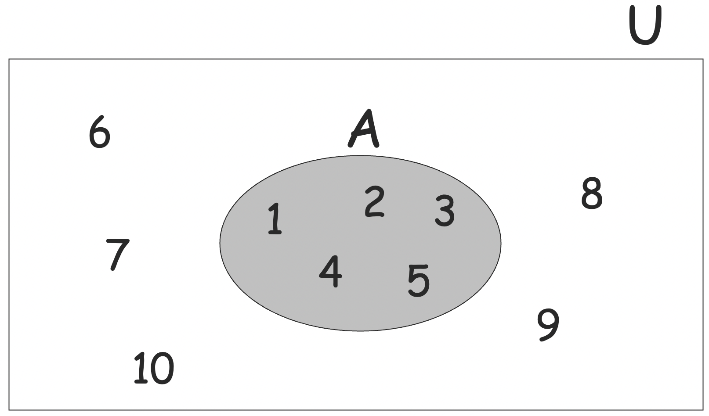

#### 集合的基本操作 (set operation)

例如 $A = \{1, 2, 3\}$，$B = \{2, 3, 4, 5\}$

- 并集 (union)

  - $A \cup B = \{1, 2, 3, 4, 5\}$
    
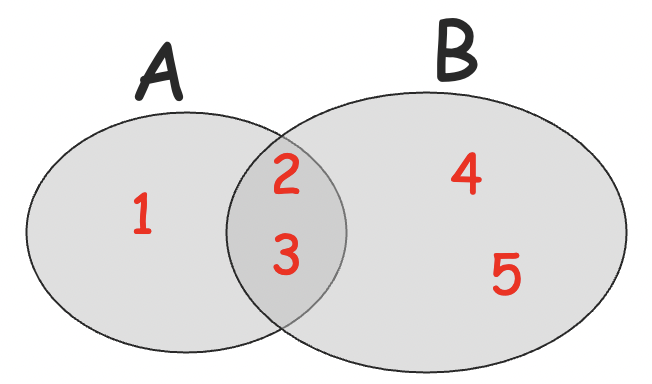

- 交集 (intersection)

  - $A \cap B = \{2, 3\}$
    
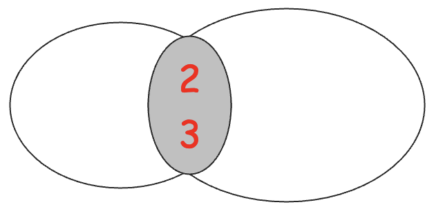

- 差集 (difference)

  - $A - B = \{1\}$
    
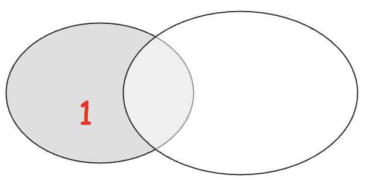

  - $B - A = \{4, 5\}$

- 补集 (complement)

  - 定义全集 $U = \{1, .., 7\}$
  - $A = \{1, 2, 3\} \Rightarrow \overline{A} = U - A = \{4, 5, 6, 7\}$
    
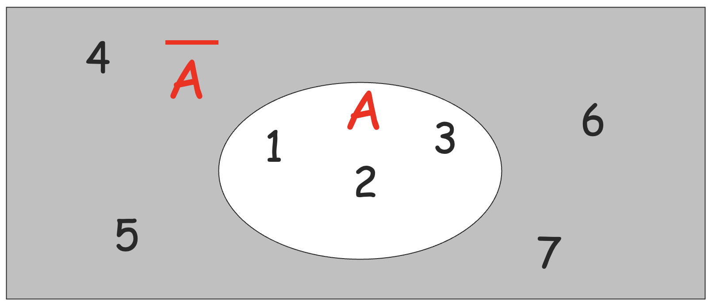

  - $\overline{\overline{A}} = A$
  - $\overline{\text{even integers}} = \text{odd integers}$
    
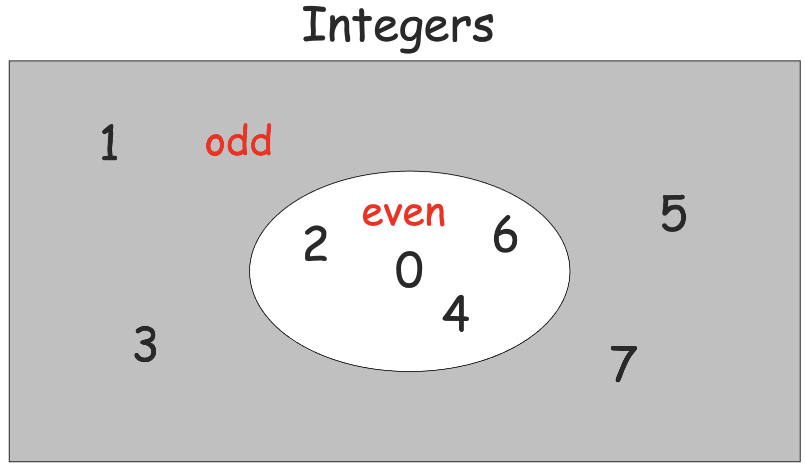

#### 徳摩根律 (DeMorgan's Laws)

$$
\overline{A\cup B} = \overline{A} \cap \overline{B}
$$

$$
\overline{A\cap B} = \overline{A} \cup \overline{B}
$$

#### 空集 (empty/null set)

空集是没有任何元素的集合，写作 $\emptyset = \{\}$。

- $S \cup \emptyset = S$
- $S \cap \emptyset = \emptyset$
- $S - \emptyset = S$
- $\emptyset - S = \emptyset$
- $\overline{\emptyset} = U$，其中 $U$ 是全集。

#### 子集 (subset)

例如 $A = \{1, 2, 3\}$，$B = \{1, 2, 3, 4, 5\}$，则：

- $A \subseteq B$，$A$ 是 $B$ 的子集 (subset)；
- $A \subset B$，$A$ 是 $B$ 的真子集 (proper subset)；

#### 不相交的集合 (disjoint sets)

例如 $A = \{1, 2, 3\}$，$B = \{5, 6\}$，有 $A \cap B = \emptyset$，称 $A$ 与 $B$ 是不相交的集合 (disjoint sets)。

#### 集合的势 (set cardinality)

对于有限集 $A = \{5, 6, 7\}$，有 $|A| = 3$，集合的势说的是集合的大小。

#### 幂集 (powersets)

幂集是集合的集合，一个集合 $S$ 的幂集是 $S$ 的所有子集组成的集合，记为 $P(S)$ 或 $2^S$。

比如 $S = \{a, b, c\}$，有

$$
2^S = \{\emptyset, \{a\}, \{b\}, \{c\}, \{a, b\}, \{a, c\}, \{b, c\}, \{a, b, c\}\}
$$

并且，我们可以观察到：$|2^{S}| = 2^{|S|}$，这本质上就是子集的个数公式。

#### 笛卡尔积 (Cartesian Product)

例如 $A = \{2, 4\}$，$B = \{2, 3, 5\}$，则

$$
A\times B = \{(2, 2), (2, 3), (2, 5), (4, 2), (4, 3), (4, 5)\}
$$

不难发现 $|A\times B| = |A|\times |B|$。

笛卡尔积是两个集合中元素组成的有序对的集合，我们可以更一般地定义 $A_1 \times A_2 \times ... \times A_n$。

### 1.1.2 函数

给定两个集合 $A$ 和 $B$，一个从 $A$ 到 $B$ 的函数讲 $A$ 中的每一个元素 $a$ 关联到 $B$ 中的最多一个元素 $b$，记作 $f: A\to B$，其中，称有对应关系的 $A$ 中元素的集合为定义域 (domain)，$B$ 中元素的集合为值域 (range)。

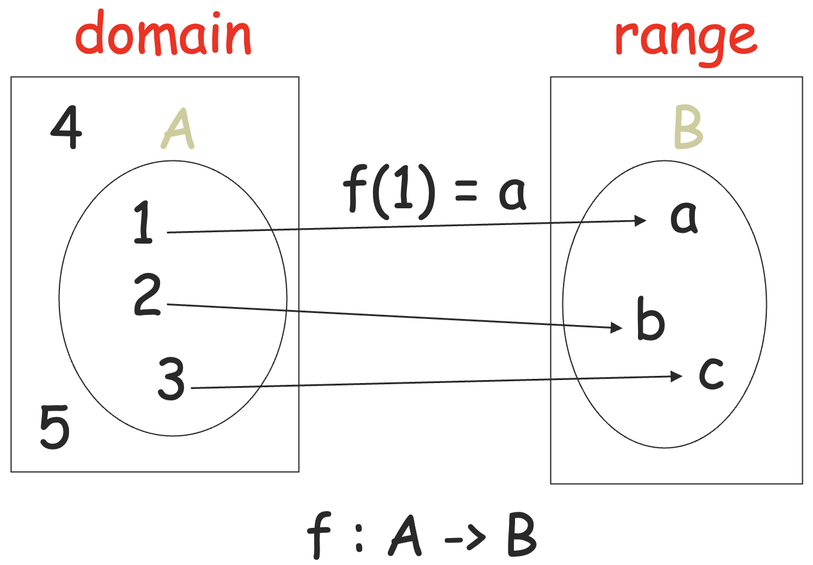

如果 $A = domain$，称 $f$ 是一个全函数 (total function)，否则称 $f$ 是一个偏函数 (partial function)。

称 $f: A \to B$ 是一个双射 (bijection)，如果：

- $f$ 是全函数；
- $a_1 \ne a_2 \in A \Rightarrow f(a_1) \ne f(a_2)$
- $\forall b \in B, \exists a \in A, f(a) = b$

双射也称为一一对应。

### 1.1.3 渐进复杂度 (asymptotics)

给定两个全函数 $f, g: \mathbb{N} \to \mathbb{N}$，

- 若存在正整数 $c$ 与 $d$，使得 $\forall n\ge d, f(n) \le c\cdot g(n)$，记
  $$f(n) = O(g(n))$$
  - 称 $g(n)$ 是 $f(n)$ 的一个上界 (upper bound)。
- 若存在正整数 $c$ 与 $d$，使得 $\forall n\ge d, c \dot f(n) \ge g(n)$，记
  $$f(n) = \Omega(g(n))$$
  - 称 $g(n)$ 是 $f(n)$ 的一个下界 (lower bound)。
- 如果 $f(n) = O(g(n))$ 且 $f(n) = \Omega(g(n))$，记 $f(n) = \Theta(g(n))$。
  - 称 $f(n)$ 与 $g(n)$ 具有相同的增长率 (growth rate)，不过它们的取值可能大不相同，因为渐进复杂度表示法比较的是函数的增长率。
- $f(n) = \Omega(g(n)) \Leftrightarrow g(n) = O(f(n))$

### 1.1.4 关系 (relations)

一个关于集合 $A_1, A_2, ..., A_n$ 的 $n$ 元关系 $R$ 是 $A_1\times A_2 \times ... \times A_n$ 的子集。

给定两个集合 $A$ 和 $B$，一个关系 $R$ 是 $A\times B$ 的一个子集，即 $R \subseteq A\times B$。

$$
R = \{(x_1, y_1), (x_2, y_2), (x_3, y_3), ...\}
$$

$(x_i, y_i) \in R$ 可以写作 $x_i R y_i$，比如说如果 $R = '>'$，可以写 $2 > 1, 3 > 2, 3 > 1$。

#### 等价关系

- 自反性 (reflexive)：$x R x$
- 对称性 (symmetric)：$xRy \Rightarrow yRx$
- 传递性 (transitive)：$xRy \wedge yRz \Rightarrow xRz$

比如说 `=` 关系是一个等价关系。

#### 等价类

对于一个等价关系 $R$，定义 $x$ 的等价类为

$$
[x]_R = \{y: xRy\}
$$

比如说，

$$
R = \{(1, 1), (2, 2), (1, 2), (2, 1), (3, 3), (4, 4), (3, 4), (4, 3)\}
$$

则有 $[1]_R = \{1, 2\}, [3]_R = \{3, 4\}$。

再比如整数集可以按照模 5 的关系分成 5 个等价类：

$$
\{\{0,5,10,...\}, \{1,6,11,...\}, \{2,7,12,...\}, \{3,8,13,...\}, \{4,9,14,...\}\}
$$

字符串长度可以被用来划分所有的比特串：

$$
\{\{\},\{0,1\},\{00,01,10,11\},\{000,...,111\},... \}
$$

令 $R$ 是 $A$ 上的一个等价关系，则对于 $\forall a, b\in A, [a]_R = [b]_R \vee [a]_R \cap [b]_R = \emptyset$。

称集合 $A$ 上满足自反性，传递性与反对称性 (antisymmetric) 的二元关系 $R$ 为偏序关系 (partial order)。

称集合 $A$ 上满足 $\forall a, b \in A, aRb \vee bRa$ 的偏序关系为全序关系 (total order)。

全序也称之为线性序 (linear order)，因为具有全序关系 $R$ 的集合 $A$ 中的元素可以排成一行，满足 $a$ 在 $b$ 的左边当且仅当 $aRb$。

### 1.1.5 图

一个有向图 (directed graph) $G = (V, E)$：

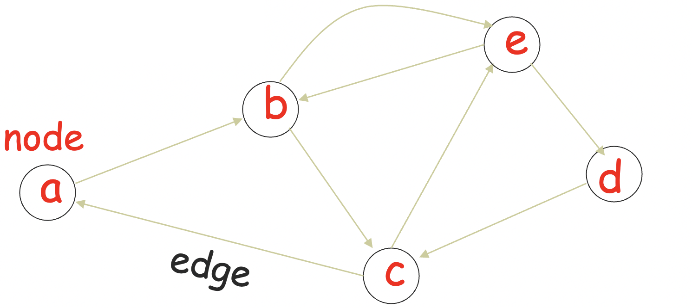

- 结点 (nodes / vertices) 集 $V$
  $$V = \{a, b, c, d, e\}$$

- 边 (edges) 集 $E$
  $$E = \{(a,b), (b,c), (b,e),(c,a), (c,e), (d,c), (e,b), (e,d)\}$$

#### 标记图 (labeled graph)

为所有边打上标签的图称为标记图。

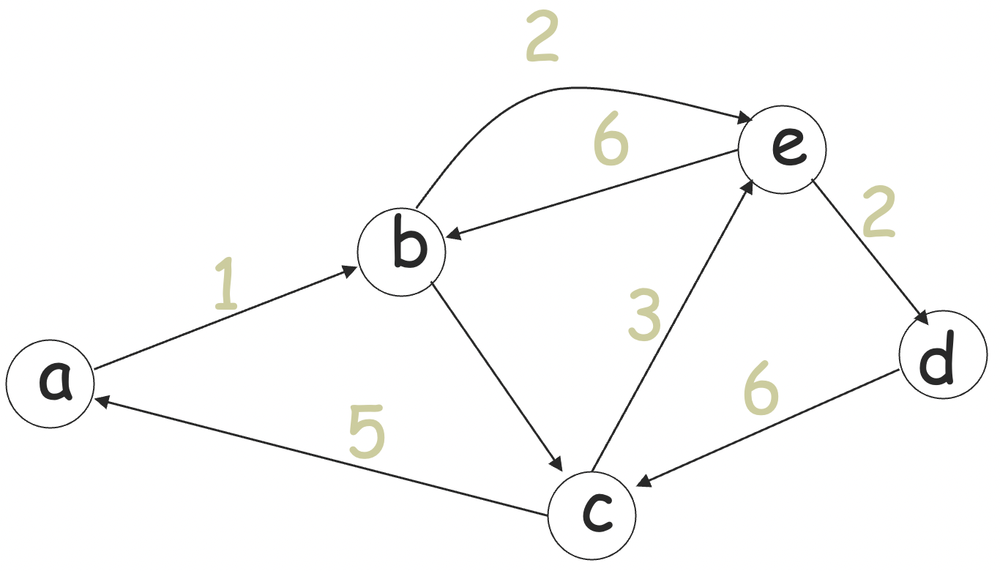

#### 游走 (walk)

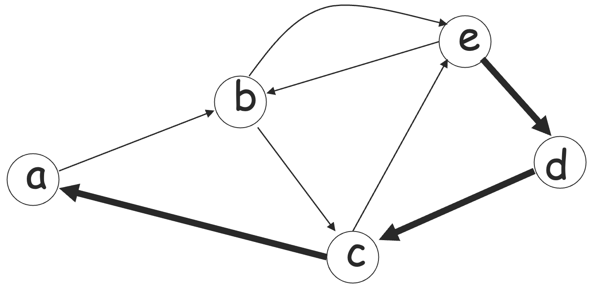

游走是一系列相邻的边：

$$
(e, d),(d, c),(c, a)
$$

#### 路径 (path)

路径是没有重复边的游走，简单路径 (simple path) 是没有重复结点的路径。

#### 环 (cycle)

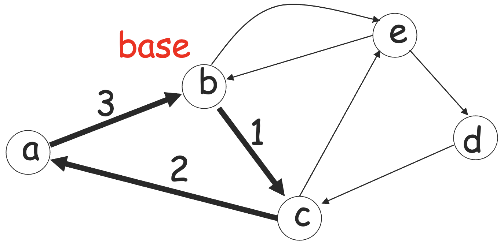

环是从一个结点（称为基础结点 base node）到它本身的游走，简单环是只有基础结点重复的环。

#### 可达性 (reachable)

给定有向图 $G = (V, E)$ 以及结点 $u, v$，称 $v$ 从 $u$ 可达，或者 $u$ -可达，如果存在从 $u$ 到 $v$ 的路径。

### 1.1.6 树

树是一个没有环（无向环）的有向图。

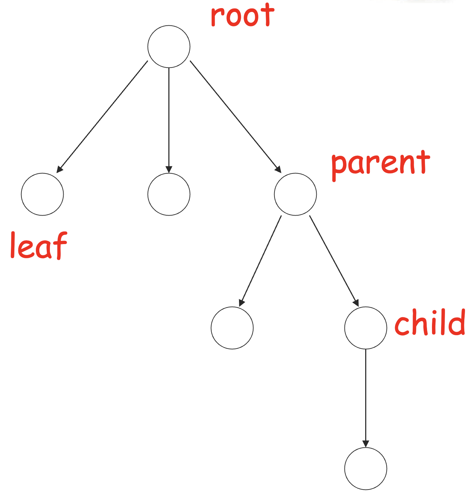

入度为 0 的结点是根结点 (root)，出度为 0 的结点是树叶 (root)，边总是从父母 (parent) 结点指向孩子 (child) 结点。

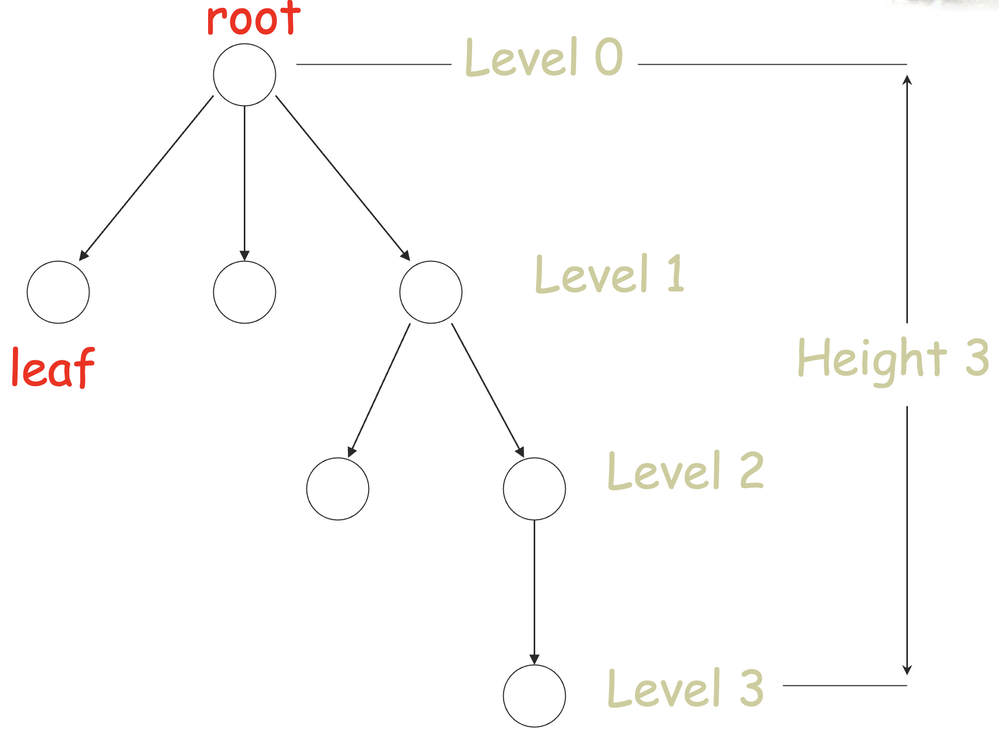

定义树上最长的路径的长度为树的高度 (height)，从根结点到某结点的路径的长度为该结点的层 (level)。

### 1.1.7 证明方法

#### 归纳法

有命题 $P_1, P_2, P_3, ...$，如果我们知道：

- 对于某个 $b$，$P_1, P_2, ..., P_b$ 是真的；
- $\forall k\ge b, P_1\wedge P_2\wedge ... \wedge P_k \Rightarrow P_{k+1}$；
  则有 $\forall i, P_i$。

#### 反证法

想要证明命题 $P$ 为真：

- 假设 $P$ 为假；
- 然后发现矛盾；
- 从而 $P$ 只能为真。

#### 鸽笼原理 (Pigeon Hole Principle)

如果 $n + 1$ 个物品被放倒了 $n$ 个盒子里面，至少有一个盒子包含了至少 $2$ 个物品。

可用反证法证明。

## 1.2 语言

### 1.2.1 定义

- 语言 (language) 是字符串 (string) 的集合。
- 字符串是一个字母 (letter) 或者符号 (symbol) 的序列 (sequence)。
  - 例如：`cat`，`dog`，`house`，...
  - 符号是由一个字母表 (alphabet) 定义的：
    $$\Sigma = \{a, b, c, ..., z\}$$

如果 $\Sigma = \{a, b\}$，那么基于这个字母表可以有的字符串有：`a`，`ab`，`abba` 等等。

一般我们会用 `u`、`v`、`w` 之类的字母表示字符串，比如说 $u = ab$，$v = bbbaaa$，$w = abba$。

### 1.2.2 字符串操作

记 $w = a_1a_2...a_n, v = b_1b_2...b_m$，定义如下一些字符串操作：

- 拼接 (concatenation)
  - $wv = a_1a_2...a_nb_1b_2...b_m$
- 翻转 (reverse)
  - $w^R = a_n...a_2a_1$
- 长度 (length)
  - $|w| = n$
  - $|uv| = |u| + |v|$
- 空串 (empty string)
  - 用 $\lambda$ 或者 $\varepsilon$ 表示
  - $|\lambda| = 0$
  - $\lambda w = w\lambda = w$
- 子串 (substring)
  - $s$ 是 $x$ 的子串，如果存在字符串 $y, z$ 使得 $x = ysz$。
  - 子串是原字符串的子序列。
- 前缀与后缀
  - 当 $x = sz$ 即 $y = \varepsilon$ 时，称 $s$ 是 $x$ 的一个前缀 (prefix)；
  - 当 $x = ys$ 即 $z = \varepsilon$ 时，称 $s$ 是 $x$ 的一个后缀 (suffix)。
- 重复 (repetition)
  - $w^n = ww...w$ （ $n$ 个相同的字符串拼接 ）
  - 定义 $w^0 = \lambda$

::: tip 练习
解方程：$011x = x011$。提示：对 $x$ 的长度分类。
:::

### 1.2.3 字母表的操作

- `*` 操作
  - $\Sigma^{*}$：从字母表 $\Sigma$ 产生的所有可能的字符串的集合。
    - 比如说 $\Sigma = \{a, b\}$，有
      $$\Sigma^{*} = \{\lambda, a, b, aa, ab, ba, bb, aaa, aab, ...\}$$
    - 语言是字符串的集合，即 $\Sigma^*$ 的子集。
- `+` 操作
  $$\Sigma^{+} = \Sigma^{*} - \{\lambda\}$$

辨析一些记号的含义：

- 集合：$\emptyset = \{\} \ne \{\lambda\}$
- 集合的势：
  - $|\{\}| = |\emptyset| = 0$
  - $|\{\lambda\}| = 1$
- 字符串长度：
  - $|\lambda| = 0$

有了上面的定义与记号之后，我们后续定义语言就方便多了。比如说 $L = \{a^nb^n: n\ge 0\}$，则 $\lambda \in L, ab\in L, aabb \in L, aaaaabbbbb\in L$，但 $abb \notin L$。

### 1.2.4 语言操作

- 通常的集合操作：
  - $\{a, ab, aaaa\} \cup \{bb, ab\} = \{a, ab, bb, aaaa\}$
  - $\{a, ab, aaaa\} \cap \{bb, ab\} = \{ab\}$
  - $\{a, ab, aaaa\} - \{bb, ab\} = \{a, aaaa\}$
- 补集 (complement)：$\overline{L} = \Sigma^* - L$
  - 例如：$\overline{\{a, ba\}} = \{\lambda, b, aa, ab, bb, aaa, ...\}$
- 翻转 (reverse)：$L^{R} = \{w^{R}:w \in L\}$
  - 例如：$L = \{a^nb^n: n\ge 0\}, L^{R} = \{b^na^n: n\ge 0\}$
- 拼接 (concatenation)：$L_1L_2 = \{xy: x\in L_1, y\in L_2\}$
  - 例如：$\{a, ab, ba\}\{b, aa\} = \{ab, aaa, abb, abaa, bab, baaa\}$
  - 语言的拼接和字符串的拼接不一样，它的组合方式同笛卡尔积。
- 多重拼接：$L^{n} = LL...L$，等号右边共有 $n$ 个语言的拼接。
  - 例如：$\{a, b\}^3 = \{a, b\}\{a, b\}\{a, b\} = \{aaa, aab, aba, abb, baa, bab, bba, bbb\}$
  - 特殊情况：$L^0 = \{\lambda\}$
- 星闭包 (star-closure, kleene)：$L^{*} = L^0 \cup L^1 \cup L^2 \cup ...$
  - 例如：$\{a, bb\}^{*} = \{\lambda, a, bb, aa, abb, bba, bbbb, aaa, aabb, abba, abbbb, ...\}$
- 正闭包 (positive-closure)：$L^{+} = L^{*} - \{\lambda\}$
