# 2 有穷自动机

## 2.1 概述

### 2.1.1 什么是有穷自动机？

**有穷自动机 (finite automa)** 是一个形式系统，它只记忆有限量的信息，这些信息通过它的 **状态 (states)** 表示。当有 **输入 (input)** 给到有穷自动机的时候，它会相应地改变自己的状态。告诉有穷自动机该如何根据输入改变自身状态的规则称为 **转移 (transition)**。

### 2.1.2 为什么要学习有穷自动机？

- 有穷自动机在电路与通信协议的设计和验证方面被广泛使用；
- 适用于许多的文本处理应用场景；
- 是编译器的一个重要组成部分；
- 描述了事件的简单模式；
- ……

### 2.1.3 一个关于网球的例子

网球的比赛胜利规则是这样的：

- 至少要得 4 分；
- 还需要比对手多两分；

用 `s` 表示 `server wins point`，用 `o` 表示 `opponent wins point`，我们可以用如下的状态转换图来描述整个比赛输赢状况的变化过程。

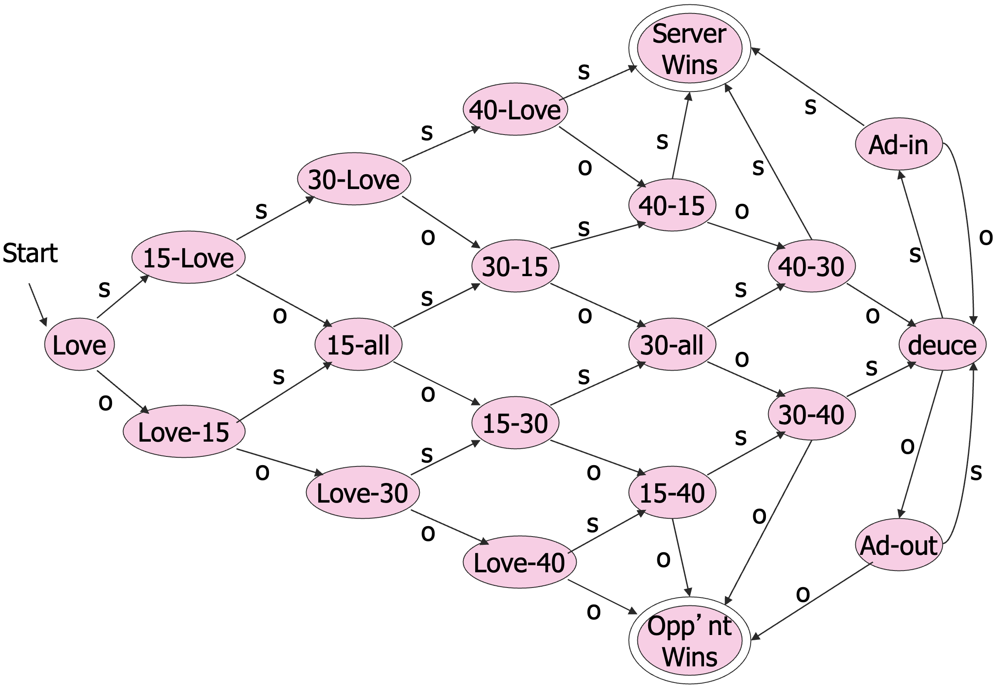

这个状态转换图也称为 **自动机 (automaton)**，其中，双环表示 **终止状态 (final state)**，也就是比赛结束的时候。

给定一系列的输入，称为 **输入字符串 (input string)**，从初始状态开始，根据每个输入符号转移到下一状态。如果读入一个特定的字符串能够让状态从初始状态变为终止状态，我们称这个输入被 **接受 (accepted)** 了。

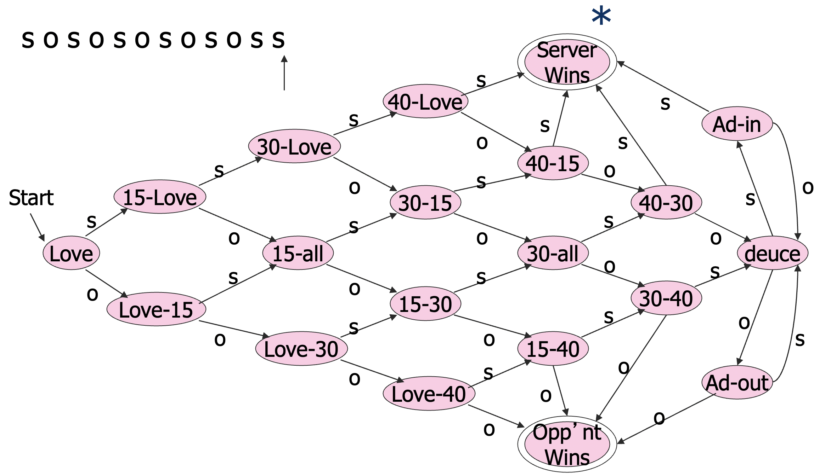

### 2.1.4 一个自动机的语言

称能够被一个自动机 $A$ 接受的字符串的集合为 $A$ 的 **语言 (language)**，记为 $L(A)$。比如说 $L(Tennis) =$ 能够决出胜出者的字符串的集合。

对于同样的一组状态和转移来说，指定不同的终止状态，就会有不同的自动机，也就能够表示不同的语言了。

直观来讲，有穷自动机的基本要素有：

- 有限个状态；
- 状态间的转移；
- 一个初始状态和一个或者多个终止状态。

## 2.2 确定性有穷自动机

### 2.2.1 回忆基本概念

- **字母表 (alphabet)** 是任意有限的符号的集合。
  - 比如说 `ASCII`、`Unicode`、`{0, 1}`（ **二元字母表 (binary alphabet)** ）、`{a, b, c}`、`{s, o}`、一个协议的信号集合。
- 一个字母表 $\Sigma$ 上的 **字符串 (string)** 是一个序列，其中每个元素都是 $\Sigma$ 的成员。
  - 在这个系列中，我们约定书写字符串的时候不需要空格、逗号和引号，直接书写即可。比如说 `abc` 或者 `01101`。
- $\Sigma^* =$ 所有字母表 $\Sigma$ 上的字符串的集合。
  - 比如说 $\{0, 1\}^* = \{\varepsilon, 0, 1, 00, 01, 10, 11, 000, 001, ...\}$
  - 有些微妙的是，`0` 作为一个字符串还是作为单个符号的写法看起来是一样的，具体什么类型是由上下文语境所决定的，其他的符号也是如此。到底是单个符号，还是长度为 1 的字符串，类型由上下文决定。
- 一个字符串的 **长度 (length)** 是字符串上存放符号的位置的个数。
- $\varepsilon$ 表示 **空串 (empty string)**，即长度为 0 的字符串。
- 某个字母表 $\Sigma$ 上的一个 **语言 (language)** 是 $\Sigma^*$ 的子集。

### 2.2.2 定义

有了上面的这些基本概念，我们就可以定义确定性有穷自动机了。

::: definition 定义 2.1
**确定性有穷自动机 (Deterministic Finite Automa, DFA)** 是一种定义语言的形式化系统，记为五元组 $(Q, \Sigma, \delta, q_0, F)$，其中：

- $Q$ 是一个有限的 **状态 (state)** 集合；
- $\Sigma$ 是一个 **输入字母表 (input alphabet)**；
- $\delta$ 是一个 **转移函数 (transfer function)**；
  - 转移函数接受两个参数：一个状态和一个输入符号。
  - $\delta(q, a) =$ 在状态 $q$ 处接受符号 $a$ 后 DFA 将走向的下一个状态。
- $q_0$ 是 **初始状态 (start state)**，$q_0 \in Q$；
- $F$ 是 **终止状态 (final state)** 的集合，$F \subseteq Q$。
  - 终止状态也称为 **接受状态 (accepting states)**。

:::

其中需要注意的是 $\delta$ 是一个全函数，也就是说总是存在下一个状态。如果没有转移的话，我们增加一个 **死状态 (dead state)** 表示没有转移的情况。

例如：

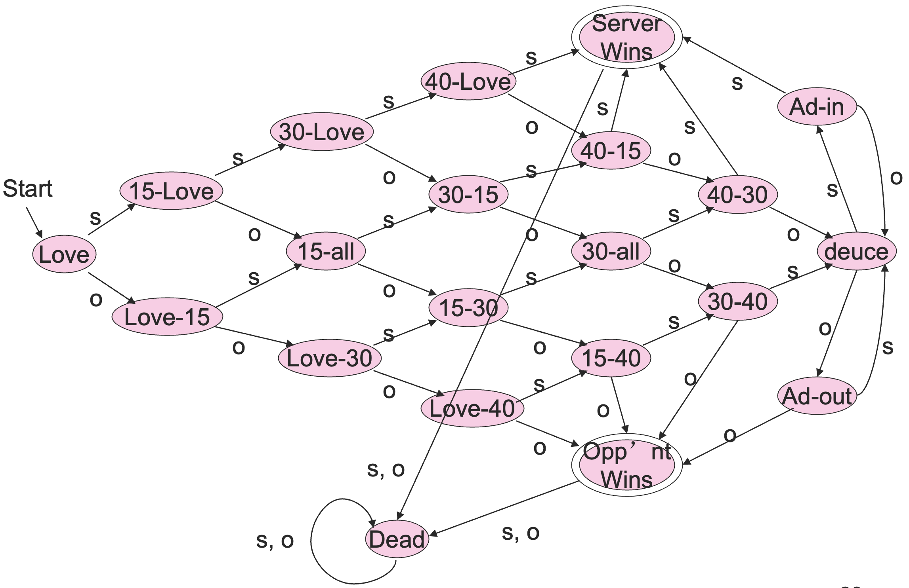

不过为了表达简单，我们一般不把死状态画出来。

### 2.2.3 DFA 的表示

#### 常用方法：图表示

通常我们会用一张 **状态转换图** 来表示 DFA，就像我们最开始的网球的例子一样，其中：

- 用 **结点 (node)** 表示状态；
- 用 **弧 (arc)** 表示转移函数；
  - 从状态 $p$ 到状态 $q$ 的弧上面标有所有的能够让 $p$ 转移到 $q$ 的输入符号。
- 用标有 `Start` 的箭头指向起始状态；
- 用 **双圆 (double circle)** 表示终止状态。

比如说下面是一个可以识别英语中 `ing` 的 DFA。

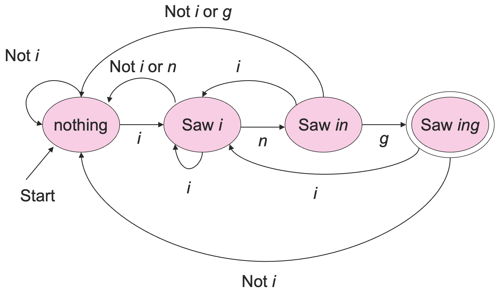

#### 另一种方法：转移表

另一种可选的表示 DFA 的方式是 **转移表 (transition table)**，其中：

- 行头表示状态，列头表示输入符号；
- 用箭头指向初始状态，用星号标注终止状态；
- 每一个表象都是转移函数的结果，比如说在 $p$ 行，$a$ 列的表项 $q$ 表示 $\delta(p, a) = q$。

比如说下面是一个 DFA 的转移表以及等价的状态转换图的例子：

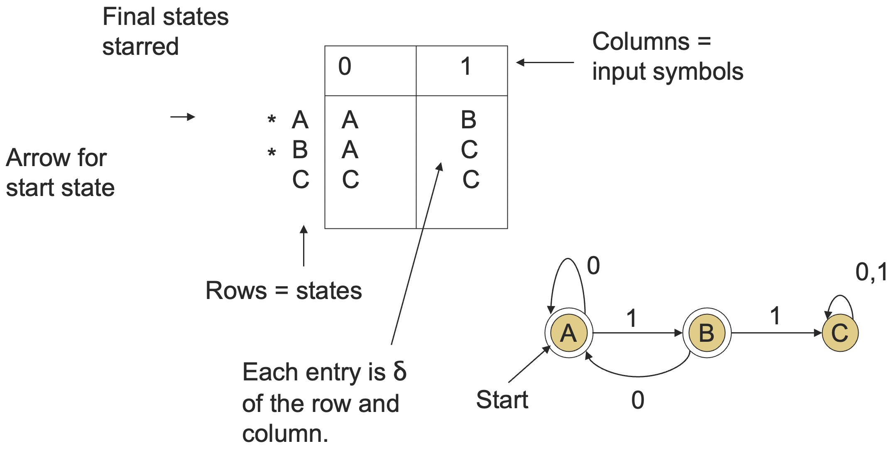

在习惯上，我们会用 $..., w, x, y, z$ 这样的字母来表示字符串，用 $a, b, c, ...$ 这样的字母来表示单个输入符号。

### 2.2.4 扩展的转移函数

我们通过将 $\delta$ 扩展到一个状态和一个字符串的方式（原本是一个状态和一个字符），来描述一组输入对于 DFA 的影响。

一个直观的感觉是，对于某个状态 $p$，扩展的 $\delta$ 会从这个状态开始，根据一组输入 $a_1, a_2, ..., a_n$，沿着状态转换图上面的某条路径，从 $p$ 走到 $q$，其中该路径上的每条弧分别对应着标记 $a_1, a_2, ..., a_n$。

::: definition 定义 2.2
递归定义 **扩展的转移函数 (extended $\delta$ )** 为：

$$
\hat\delta(q, x) = \begin{cases}
q, & x = \varepsilon\\
\delta(\hat\delta(q, w), a), & x = wa
\end{cases}
$$

其中，$w$ 是一个字符串，$a$ 是一个输入符号，$wa$ 表示这两者的拼接（在拼接过程中将 $a$ 视作是长度为 1 的字符串）。
:::

虽然在上面的定义中，我们使用了 $\hat\delta$ 这个符号，但是习惯上，我们并不区分 $\delta$ 与 $\hat\delta$，通常都用 $\delta$ 表示，至于其到底是转移函数还是扩展的转移函数，由具体语境下的输入类型决定。这样的话后续很多的表达会方便很多。

比如说对于下面这个例子：

|     |  0  |  1  |
| :-: | :-: | :-: |
|  A  |  A  |  B  |
|  B  |  A  |  C  |
|  C  |  C  |  C  |

我们有：

$$
\delta(B, 011) = \delta(\delta(B, 01), 1) = \delta(\delta(\delta(B, 0), 1), 1) = \delta(\delta(A, 1), 1) = \delta(B, 1) = C
$$

### 2.2.5 DFA 的语言

各种各样的自动机可以用来定义语言，如果 $A$ 是一个自动机，我们用 $L(A)$ 代表它的语言。对于一个 DFA $A$ 来说，$L(A)$ 是从初始状态走到终止状态的所有路径的标签字符串的集合。

形式化定义如下：

:::definition 定义 2.3
对于一个 DFA $A = (Q, \Sigma, \delta, q_0, F)$，定义 $A$ 能够 **接受 (accept)** 的语言集合为：

$$
L(A) = \{w \mid \delta(q_0, w) \in F \}
$$

:::

下面我们举一个例子：

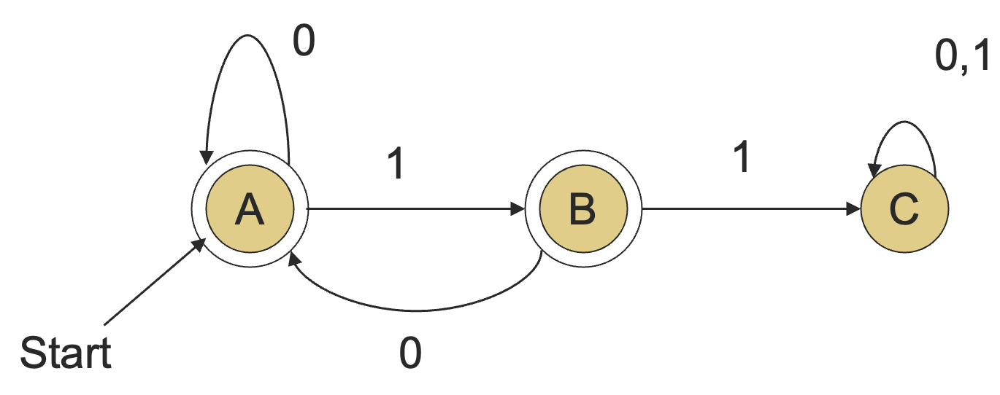

我们可以发现，`101` 是一个能够被这个 DFA 所接受的字符串。其实，这个 DFA 描述的是由 0 和 1 组成的所有的不含连续 1 的字符串组成的语言，形式化的表述就是：

$$
L(A) = \{w \mid w\ is\ in\ \{0, 1\}^*\ and\ w\ does\ not\ have\ two\ consecutive\ 1's\}
$$

下面，我们来证明一下上面的结论是正确的，也就是证明两个集合的等价性。

考虑 $S$ 是我们给出的 DFA 对应的语言，$T$ 是由 01 组成的不含连续 1 的语言。下面我们只需要证明两个集合相等，通常，我们会通过下面的方式来证明集合相等：

$$
S \subseteq Q \wedge Q \subseteq S \Leftrightarrow S = Q
$$

也就是要证明

$$
(\forall w \in S, w \in T) \wedge (\forall w \in T, w\in S)
$$

先证 $S \subseteq T$，也就是要证明如果 $w$ 被给定的 DFA 接受，那么 $w$ 中没有连续的 1。我们可以通过对 $w$ 的长度进行归纳来证明。

这里有一个很重要的技巧：扩展我们的归纳假设，使其比我们想要证明的结论更加详细。

归纳假设：

1. 如果 $\delta(A, w) = A$，那么 $w$ 没有连续的两个 $1$ 并且不以 $1$ 结尾；
2. 如果 $\delta(A, w) = B$，那么 $w$ 没有连续的两个 $1$ 并且以单个 $1$ 结尾。

基础情况：$|w| = 0$，即 $w = \varepsilon$ 时。

- 1 成立，因为 $\varepsilon$ 里面没有 $1$。
- 2 显然成立，因为 $\delta(A, \varepsilon) = A \ne B$。

这里有一个重要的概念，对于命题 $p \to q$，$p$ 为假时 $p \to q$ 永远为真。

归纳步骤：

假设 1 和 2 对于长度比 $|w| \ge 1$ 短的字符串成立，记 $w = xa$，其中 $a$ 是 $w$ 的最后一个符号，$x$ 是最后一个符号之前的字符串，则归纳假设对于 $x$ 成立。

下面我们只需要证明 1 和 2 两个结论对于 $w = xa$ 也成立即可。

1. 如果 $\delta(A, w) = A$，则 $\delta(A, x)$ 一定是 $A$ 或者 $B$ 且 $a$ 一定是 $0$ （看 DFA），由归纳假设，$x$ 中没有连续的两个 $1$，从而 $w = x0$ 也没有两个连续的 1，并且不以 $1$ 结尾；
2. 如果 $\delta(A, w) = B$，则 $\delta(A, x) = A$ 且 $a = 1$ （看 DFA），根据归纳假设 $x$ 中没有连续的两个 1 并且不以 $1$ 结尾，从而 $w = x1$ 中也没有两个连续的 1，并且以单个 $1$ 结尾。

于是，只要一个字符串被给定的 DFA 接受，那么它一定没有连续的两个$1$，即 $S\subseteq T$。

下面证明 $T \subseteq S$，也就是证明，如果 $w$ 没有连续的两个 $1$，那么它会被之前给出的 DFA 接受。

反证法。假设 $w$ 没有被 DFA 所接受。

由于在每一个状态的每一个输入符号，都有一个独特的转移，因此每个进入 $DFA$ 的字符串 $w$ 都会进到一个唯一的状态。$w$ 不被 DFA 所接受的唯一可能就是走到状态 $C$。

即 $\delta(A, w) = C$，那么 $w = x1y$，其中 $\delta(A, x) = B$，因为到达 C 只有经过 B 这一条路。

而 $\delta(A, x) = B$ 又能够推出 $x = z1$，因为到达 $B$ 只有从 $A$ 读取 $1$ 这一条路。

于是 $w = x1y = z11y$，这与 $w$ 不含连续的两个 $1$ 矛盾。

### 2.2.6 正则语言

::: definition 定义 2.4
如果一个语言 $L$ 可以被某个 DFA $A$ 恰好接受（即 $L = L(A)$ ），称这个语言是 **正则 (regular)** 的。

注意，$A$ 必须恰好接受 $L$，即接受且只接受 $L$ 中的字符串。
:::

有一些语言不是正则的。直观上感觉，正则语言不太能够有任意多的状态，因为 DFA 的状态是有限的。

举一个不是正则的语言的例子，$L_1 = \{0^n1^n \mid n\ge 1\}$。

$L_1$ 其实就是连续的 $n$ 个 $0$ 和 $n$ 个 $1$ 组成的字符串的集合（ $n \ge 1$ ）。下面我们来证明一下这个语言确实不是正则的。

反证法，假设存在一个有 $m$ 个状态的 DFA 接受这个语言，考虑输入字符串 $0^m1^m$ 的状态变化：

$$
S_00^m1^m \to S_10^{m-1}1^m \to ... \to S_{2m-1}1 \to S_{2m}
$$

考虑前 $m$ 次移动，产生了 $m + 1$ 种状态，而整个 DFA 只有 $m$ 种状态，根据鸽笼原理，至少有一个状态出现了两次，假设这个状态是 $q$，且 $S_i = S_j = q$。

于是有：

$$
S_00^m1^m \to ... \to q0^{m-i}1^m \to q0^{m - j}1^m ... \to \to ... \to S_{2m-1}1 \to S_{2m}
$$

于是，我们发现 $S_00^{m - j + i}1^m = S_{2m}$，即 $0^{m - j + i}1^m$ 也可以被该 DFA 接受，但 $0^{m - j + i}1^m \notin L_1$，矛盾。

再看一个不是正则语言的例子：$L_2 = \{w \mid w \in \{(, )\}^* \wedge w\ is\ balanced\}$，也就是所有匹配的括号串组成的语言，这也不是正则语言。

不过也有很多语言是正则的，它们会在许多语境中出现并且有很多有用的性质。比如说，表示浮点数的字符串就是一个正则语言。

再比如说：$L_3 = \{w \mid w \in \{0,1\}^* \wedge 23 \mid w\}$，其中，计算 $23\mid w$ 时将 $w$ 视作二进制数。

这个 DFA 还是比较好构建的，因为任意一个数模 23 只会有 23 种有限的情况，我们可以用 23 个状态来表示，记为 $0, 1, 2, ..., 22$，唯一的初始状态和终止状态就是 0。

如果字符串 $w$ 二进制含义下表示整数 $i$，假设 $\delta(0, w) = i \bmod 23$，那么：

- $w0$ 表示 $2i$，则 $\delta(i \bmod 23, 0) = (2i) \bmod 23$；
- $w1$ 表示 $2i + 1$，则 $\delta(i \bmod 23, 1) = (2i+1) \bmod 23$。

这样的话，我们就能构建出整个 DFA 了。比如说 $\delta(15, 0) = 30 \bmod 23 = 7$ , $\delta (11, 1) = 23 \bmod 23 = 0$。

另一个例子：$L_4 = \{w \mid w \in \{0, 1\}^* \wedge 23 \mid w^R\}$，其中 $w^R$ 是 $w$ 的逆，即顺序相反的字符串。

这个语言依旧是正则的，不过它的 DFA 就不太容易构建了，不过之后我们会学到一个定理，这个定理告诉我们一个正则语言的逆依旧是正则语言。

## 2.3 非确定性有穷自动机

### 2.3.1 非确定性

**非确定性有穷自动机 (Nondeterministic Finite Automaton, NFA)** 可以同一时刻处在多个状态中。当有一个输入符号的时候，可以从一个状态转移到任意状态的集合。

NFA 从一个初始状态开始，如果任意一个选择序列能够到达一个终止状态，我们就认为 NFA 可以接受这个字符串。

直观来讲，虽然转移函数给出了多个目标状态，NFA 总能够猜到正确的路。

比如说棋盘上的移动，将棋盘上的格子视为状态，输入是 $\{r, b\}$ 组成的字符串，其中 $r$ 表示移动到相邻的红格子中，$b$ 表示移动到相邻的黑格子中。初始状态是左上角的格子，终止状态是右下角的格子。

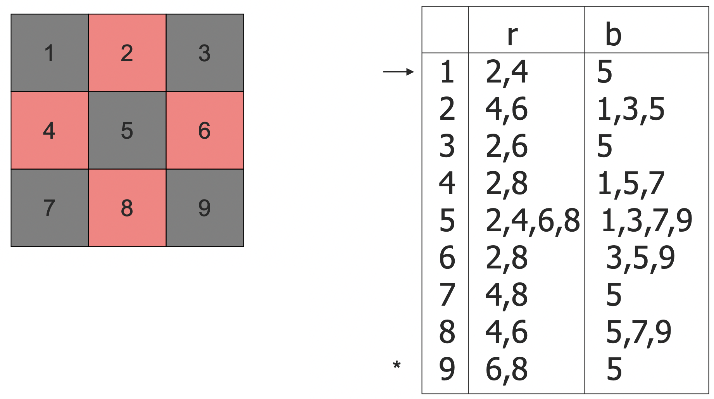

根据定义，我们可以给出这个自动机的转移表，`rbb` 就是一个这个自动机能够接受的字符串，因为：

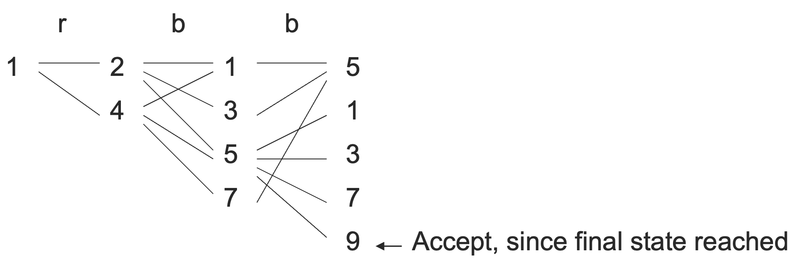

### 2.3.2 定义

::: definition 定义 2.5

**非确定性有穷自动机 (Nondeterministic Finite Automa, NFA)** 定义为五元组 $(Q, \Sigma, \delta, q_0, F)$，除了 $\delta$ 以外同 DFA 的定义 2.1。

- 转移函数 $\delta(q, a)$ 返回一个状态的集合，即 $\delta(q, a) \subseteq Q$，其中 $a$ 是一个符号。

:::

::: definition 定义 2.6

递归定义 NFA 的 **扩展的转移函数** 为：

$$
\hat\delta(q, x) = \begin{cases}
\{q\}, if\ x = \varepsilon\\
\bigcup_{p \in \hat\delta(q, w)} \delta(p, a), if\ x = wa
\end{cases}
$$

$\hat\delta$ 简记为 $\delta$。

:::

::: definition 定义 2.7
称一个字符串 $w$ 被一个 NFA $A = (Q, \Sigma, \delta, q_0, F)$ **接受**，如果

$$
\delta(q_0, w) \cap F \ne \emptyset
$$

一个 NFA 的语言就是这个 NFA 所能接受的所有字符串的集合，记为 $L(A)$。

:::

### 2.3.3 DFA 与 NFA 的等价性

NFA 虽然看似给了更多的自由度，但其实它的表达能力和 DFA 是等价的。

::: theorem 定理 2.1

DFA 和 NFA 在语言的表达能力上是等价的。

- 能够用 NFA 表达的语言，一定存在某个 DFA，能够表达出相同的语言；
- 能够用 DFA 表达的语言，一定存在某个 NFA，能够表达出相同的语言。

:::

首先，一个 DFA 能够被转化成一个接受相同语言的 NFA，这个结论是显然的，因为我们可以将 DFA 看成是一种特殊的 NFA，NFA 是更具一般性的 DFA。

给定某个 DFA，构造一个具有相同状态集合、初始状态、终止状态集合以及字母表的 NFA。用 $\delta_D$ 表示 DFA 的转移函数，$\delta_N$ 表示 NFA 的转移函数。如果 $\delta_D(q,a) = p$，则令 $\delta_N(q,a) = \{p\}$。

这样的话 NFA 的转移函数总是会返回一个单元集，其元素就是 DFA 在相同输入下的下一个状态，也就是说 NFA 退化成了一个 DFA。

因此，给定一个 DFA，一定能够通过上述方式构造出一个接受相同语言的 NFA。

上面的结论是很容易理解的，稍微让人吃惊一些的是，对于任意的 NFA，也存在一个 DFA 接受相同的语言。

证明的方法称为 **子集构造 (subset construction)**。

考虑一个 NFA，具有状态集 $Q$，字母表 $\Sigma$，转移函数 $\delta_N$，初始状态 $q_0$，终止状态集 $F_N$。

下面构建一个等价的 DFA，具有状态集 $2^Q$，字母表 $\Sigma$，初始状态 $\{q_0\}$，终止状态集

$$
F_D = \{F \in 2^Q \mid F \cap F_N \ne \emptyset\}
$$

这里需要注意的关键点是，DFA 的状态集中的元素是 NFA 中状态的集合。也就是说，作为一个 DFA 的状态，$\{p, q\}$ 应当视为一个 DFA 状态集中的一个元素，只不过这个元素恰好是 $Q$ 的子集罢了。

定义转移函数 $\delta_D$ 为：

$$
\delta_D(\{q_1, q_2, ..., q_k\}, a) = \bigcup_{i = 1}^k \delta_N(q_i, a)
$$

这里 $\delta_D$ 的返回值对于 NFA 来说是一些状态的集合，不过对于 DFA 来说只不过是一个状态而已。

下面，我们通过之前的棋盘的例子来理解一下子集构造的过程。

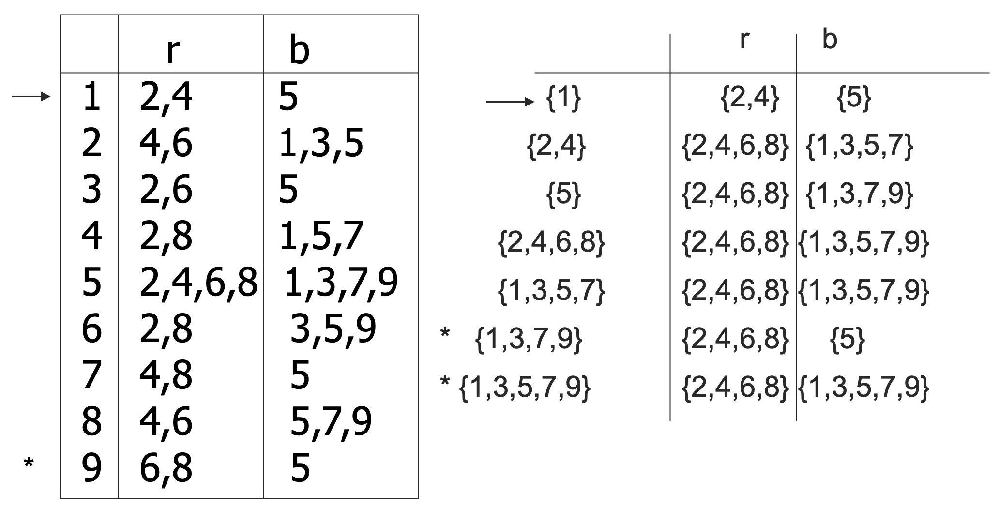

上图中左侧是一个 NFA，右侧是通过子集构造生成的对应的 DFA。

下面我们只需要证明子集构造生成的 DFA 和原本的 NFA 接受相同的语言即可。

其实如果你自己在纸上走了一遍上面的例子，就会发现等价性的证明其实很容易了。

我们通过对 $|w|$ 归纳来证明 $\delta_N(q_0, w) = \delta_D(\{q_0\}, w)$ 恒成立即可。

基础情况：$w = \varepsilon$，$\delta_N(q_0, \varepsilon) = \delta_D(\{q_0\}, \varepsilon) = \{q_0\}$。

归纳：假设结论对于比 $w(|w| \ge 1)$ 更短的字符串成立。令 $w = xa$，根据 $\delta_N$ 与 $\delta_D$ 的定义有

$$
\delta_N(q_0, w) = \bigcup_{p \in \delta_N(q_0, x)} \delta_N(p, a)
$$

$$
\delta_D(\{q_0\}, w) = \delta_D(\delta_D(\{q_0\}, x), a) = \bigcup_{p \in \delta_D(\{q_0\}, x)} \delta_N(p, a)
$$

根据归纳假设，对于 $x$ 有 $\delta_N(q_0, x) = \delta_D(\{q_0\},x)$，从而 $\delta_N(q_0, w) = \delta_D(\{q_0\}, w)$

于是，我们构造出来的 DFA 与原来的 NFA 是等价的，因为它们接受相同的语言。

## 2.4 带空转移的 NFA

### 2.4.1 定义

我们可以在 NFA 的基础上再允许某个状态在没有输入字符的时候就转移到另一个状态，也就是说转移函数可以接受 $\varepsilon$ 输入。

这些 **空转移 ( $\varepsilon$-Transitions )** 是自动完成的，不需要看输入字符串，这样的 NFA 称为 **带空转移的 NFA**，记为 $\varepsilon$-NFA。

这在某些时候会提供表达上的方便，不过并没有带来表达能力的提升，$\varepsilon$-NFA 依旧只能接受正则语言。

一个简单的例子如下：

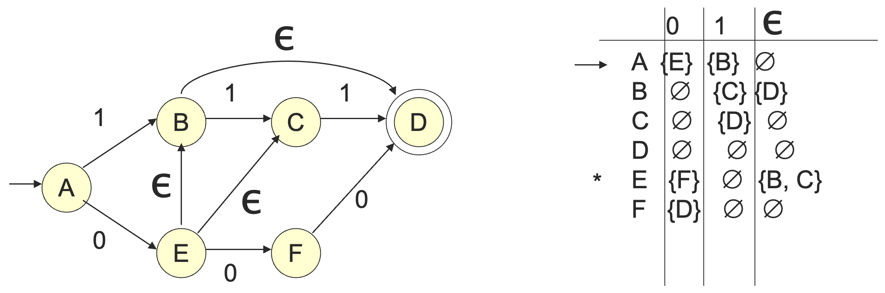

:::definition 定义 2.8

定义状态 $q$ 的 **状态闭包 (Closure of States)** 为从状态 $q$ 开始通过接受一个或者若干个 $\varepsilon$ 能够到达的状态集合，记为 $CL(q)$。

定义状态集合 $Q$ 的闭包为

$$
CL(Q) = \bigcup_{q \in Q} CL(q)
$$

:::

例如，在下面的 $\varepsilon$-NFA 中：

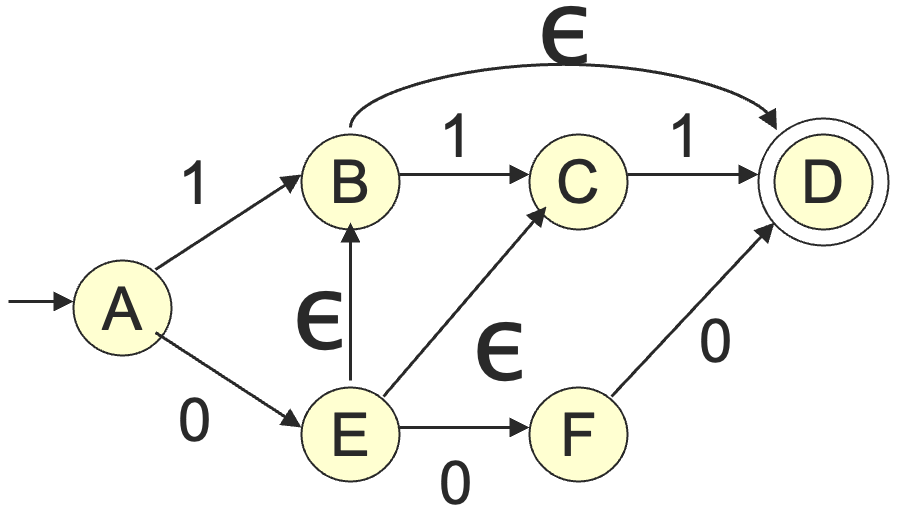

有 $CL(A) = \{A\}$，$CL(E) = \{B, C, D, E\}$。

下面我们来定义一下扩展的 $\delta$，直观上，$\hat\delta(q,w)$ 应当是从状态 $q$ 通过标记为 $w$ 的路径的所能到达的状态的集合。

::: definition 定义 2.9
定义 $\varepsilon$-NFA 的扩展转移函数为：

$$
\hat\delta(q, w) = \begin{cases}
CL(q), if\ w = \varepsilon\\
\bigcup_{p \in\hat\delta(q, x)} CL(\delta(p, a)), if\ w = xa
\end{cases}
$$

:::

沿用前一个例子，我们有：

- $\hat\delta(A, \varepsilon) = CL(A) = \{A\}$
- $\hat\delta(A, 0) = CL(\{E\}) = \{B, C, D, E\}$
- $\hat\delta(A, 01) = CL(\{C,D\}) = \{C,D\}$

一个 $\varepsilon$-NFA 的语言就是所有使得 $\hat\delta(q_0, w)$ 包含至少一个终止状态的字符串 $w$ 的集合。

### 2.4.2 NFA 与带空转移的 NFA 的等价性

::: theorem 定理 2.2

NFA 和 $\varepsilon$-NFA 在语言的表达能力上是等价的。

- 能够用 NFA 表达的语言，一定存在某个 $\varepsilon$-NFA，能够表达出相同的语言；
- 能够用 $\varepsilon$-NFA 表达的语言，一定存在某个 NFA，能够表达出相同的语言。

:::

首先，每一个 NFA 就是一个 $\varepsilon$-NFA，只不过没有空转移罢了。

下面，只需要证明给定一个 $\varepsilon$-NFA，我们都能够构造一个 NFA，与 $\varepsilon$-NFA 接收相同的语言。

我们通过将空转移与下一次输入的真正转移组合在一起来实现这种构造，从而将空转移消除，如下图所示：

考虑 $\varepsilon$-NFA $(Q, \Sigma, \delta_E, q_0, F)$，构造其原本的 NFA $(Q, \Sigma, \delta_N, q_0, F')$，其中：

$$
\delta_N(q, a) = \bigcup_{p \in CL(q)} \delta_E(p, a)
$$

$$
F' = \{q \in Q \mid CL(q) \cap F \ne \emptyset\}
$$

我们可以通过对 $|w|$ 归纳证明 $CL(\delta_N(q_0, w)) = \delta_E(q_0, w)$，从而说明能被 $\varepsilon$-NFA 接受当且仅当能被原本的 NFA 接受。

这里由于我们构造的时候是先取闭包，后转移，最后还剩一次取闭包的操作，因此在 $\delta_N$ 之前还需要取一次闭包。

下面是一个 $\varepsilon$-NFA 及其等价的 NFA 的例子：

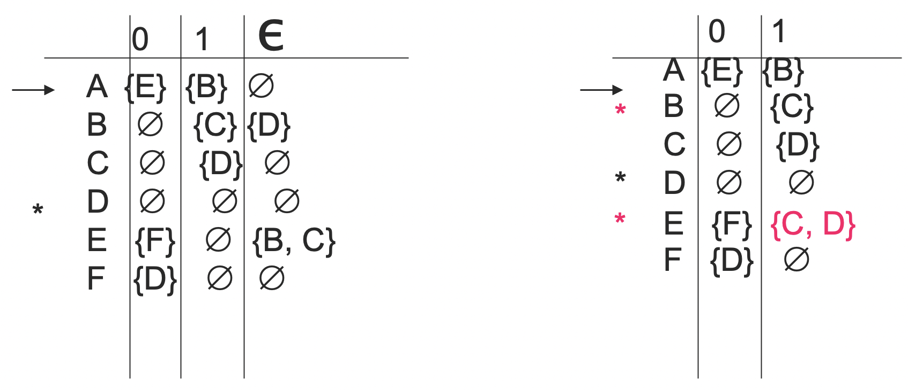

## 2.5 总结

- DFA、NFA 与 $\varepsilon$-NFA 能够接受的语言的集合是相同的：正则语言。
- NFA 设计起来更加容易，可能会比 DFA 的状态数成指数级地少得多。
- 只有 DFA 可以被真正实现，因为计算机世界是一个确定的世界。
