# 3 正则表达式

## 3.1 正则表达式

### 3.1.1 定义

**正则表达式 (regular expression, RE)** 通过代数式的方式来描述语言。它们恰好能够描述正则语言。如果 $E$ 是一个正则表达式，记它定义的语言为 $L(E)$。我们将会递归地描述正则表达式以及它们的语言。

在给出定义之前，我们先回顾一下语言的操作。正则表达式会用到 3 中语言的操作：并 (union)、拼接 (concatenation)、星闭包 (kleene star)，这些在第一讲都提过了，这里再重复一下：

- 语言的 **并 (union)** 就是集合的并操作；
  - 比如：$\{01,111,10\} \cup \{00, 01\} = \{01,111,10,00\}$。
- 语言 $L$ 与 $M$ 的 **拼接 (concatenation)** 记为 $LM$。
  $$LM = \{wx \mid w \in L, x \in M\}$$
  - 比如：$\{01, 111, 10\}\{00, 01\} = \{0100. 0101, 11100, 11101, 1000, 1001\}$
- 语言 $L$ 的 **星闭包 (Kleene Star)** 指的是以任意顺序拼接 $L$ 中的 0 个或者多个字符串形成的集合。
  $$L^* = \{\varepsilon\} \cup L \cup LL \cup LLL \cup ...$$
  - 比如：$\{0, 10\}^* = \{\varepsilon, 0, 10, 00, 010, 100, 1010, ...\}$

:::definition 定义 3.1
递归地定义 **正则表达式 (regular expression)** 如下：

基础情况：

1. 如果 $a$ 是一个符号，那么 $a$ 是一个正则表达式，且 $L(a) = \{a\}$。
2. $\varepsilon$ 是一个正则表达式，且 $L(\varepsilon) = \{\varepsilon\}$。
3. $\emptyset$ 是一个正则表达式，且 $L(\emptyset) = \emptyset$。

递归情况：

1. 如果 $E_1$ 与 $E_2$ 是正则表达式，那么 $E_1 + E_2$ 也是一个正则表达式，且 $L(E_1 + E_2) = L(E_1) \cup L(E_2)$。
2. 如果 $E_1$ 与 $E_2$ 是正则表达式，那么 $E_1E_2$ 也是一个正则表达式，且 $L(E_1E_2) = L(E_1)L(E_2)$。
3. 如果 $E$ 是一个正则表达式，那么 $E^*$ 也是一个正则表达式，且 $L(E^*) = (L(E))^*$。

:::

### 3.1.2 操作符优先级

- 可以使用括号来指定优先级；
- 默认情况下，星闭包优先级最高，其次是拼接，优先级最低的是并。

比如说：

- $L(01) = \{01\}$
- $L(01+0) = \{01, 0\}$
- $L(0(1+0)) = \{01, 00\}$
- $L(0^*) = \{\varepsilon, 0, 00, 000, ...\}$
- $L((0+10)^*(\varepsilon + 1)) =$ 所有由 0 和 1 组成的但是不含两个连续 1 的字符串。

### 3.1.3 正则表达式与有穷自动机的等价性

正则表达式只能描述，并且能够完整描述正则语言。下面，我们会证明：

- 对于每一个正则表达式，存在一个有穷自动机，能够接受相同的语言；
  - 这里我们会选取最方便的自动机类型：$\varepsilon$-NFA
- 对于每一个有穷自动机，存在一个正则表达式，能够定义相同的语言；
  - 这里我们会选取要求最严格的自动机类型：DFA

上一讲我们已经证明了 3 种有穷自动机的表达能力是等价的，因此选取哪一种有穷自动机不妨碍我们证明正则表达式所定义的恰好就是正则语言。

#### 将正则表达式转化成带空转移的 NFA

证明方法是对 RE 中的操作符的数量进行归纳。

我们总是构造一种特殊的自动机来表示一个正则表达式：

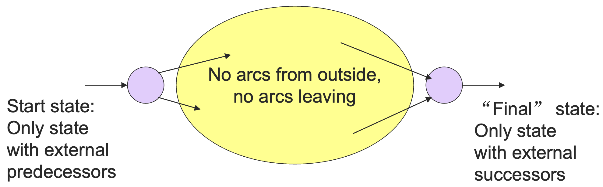

首先是 0 个操作符的 RE 基础情况转化成 $\varepsilon$-NFA：

1. 符号 $a$：
   
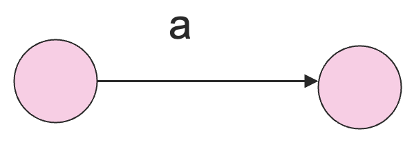

2. 空串 $\varepsilon$：
   
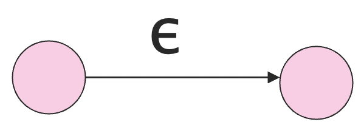

3. 空集 $\emptyset$：
   
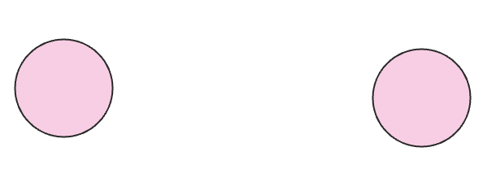

下面假设操作符个数更少的情况成立，考虑三种归纳情形：

1. 并集 $E_1 + E_2$：
   
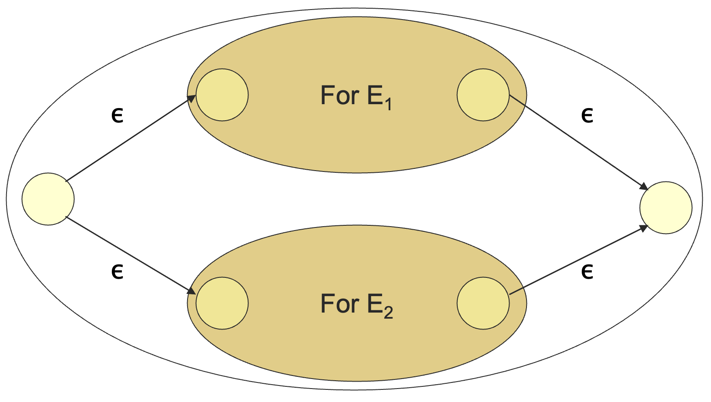

2. 拼接 $E_1E_2$：
   
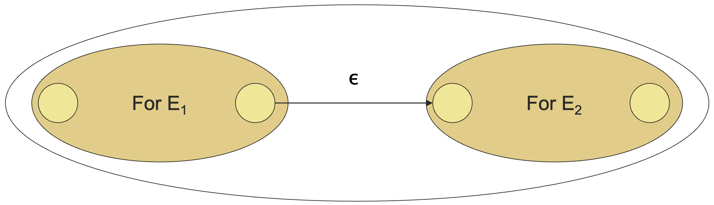

3. 星闭包 $E^*$：
   
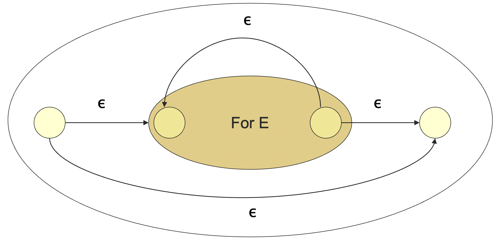

至此，我们证明了任意一种正则表达式都可以转化成等价的 $\varepsilon$-NFA。

#### 将 DFA 转化成正则表达式

这是一种有点奇怪的归纳法，我们记 $DFA$ 的状态为 $1, 2, ..., n$，归纳是对于我们允许遍历的路径上面的最大状态数字 $k$ 进行的。

于是，我们要定义一下什么是 k-路径了。k-路径指的是 DFA 状态转换图上的某一条路径，其中，这条路径经过的所有状态的标号不超过 $k$。

路径的起点和终点不做任何限制，可以是任意的状态，只要这条路径上的所有状态（不包括起点和终点）的标号不超过 $k$ 即可。

所以我们可以明显地看到，所有的路径都是 $n$-路径，因为最大的标号就是 $n$ 了。

而一个 DFA 对应的正则表达式就是所有的从起始状态到终止状态的 $n$-路径的正则表达式的并。因为所有的 $n$-路径就组成了整个 DFA。

举一个简单的例子：

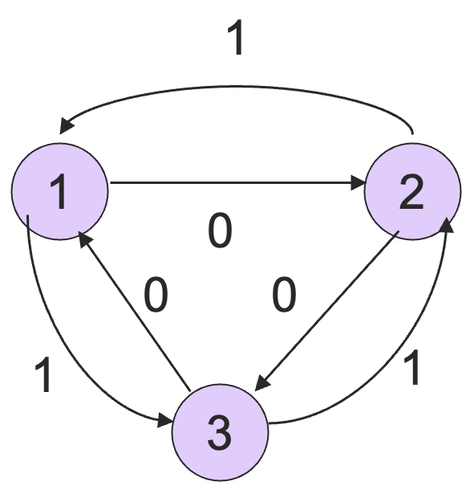

从 2 到 3 的 0-路径对应的 RE 是 $0$，因为路径上没办法有任何别的结点，只能是直达。

从 2 到 3 的 1-路径对应的 RE 是 $0 + 11$，因为可以经过 1 结点了。

从 2 到 3 的 2-路径对应的 RE 是 $(10)^*0 + 1(01)^*1$，因为有环可以不断的绕，所以有星闭包的操作。

下面我们来证明一下 DFA 可以转化成 RE，也就是所有的 $n$-路径都能转化成 RE。这里我们不规定路径起点终点了，这样我们会证明一个更强的结论。

其实核心思路就是证明 DFA 上的路径都可以转化成正则表达式，而 DFA 表示语言就是通过路径的标号序列来表示的，从而所有的 DFA 都可以转化成 RE 了。

$k = 0$ 时，只能通过弧 $a$ 或者就留在自身。下面我们只需要证明，能够通过 $k - 1$-路径对应的正则表达式构造出 $k$-路径对应的正则表达式即可。

令 $R_{ij}^k$ 表示从状态 $i$ 走到状态 $j$ 的所有 k-路径组成的语言的正则表达式。

基础情况：$k = 0$ 时，$R_{ij}^0$ 是所有的从 $i$ 到 $j$ 的弧上的标号的和。

- 如果没有弧的话，则 $R_{ij}^0 = \emptyset$；
- 如果 $i = j$ 的话，则在自环的基础上添加 $\varepsilon$。

例如在上面的例子中，$R_{12}^0 = 0$，$R_{11}^0 = \emptyset + \varepsilon = \varepsilon$。

归纳步骤：假设所有的$k - 1$ -路径都可以转化成正则表达式。

一条从 $i$ 到 $j$ 的 k-路径要么从来没经过状态 k，要么经过了状态 k 至少一次。

于是，我们有：

$$
R_{ij}^k = R_{ij}^{k - 1} + R_{ik}^{k-1}(R_{kk}^{k-1})^{*}R_{kj}^{k-1}
$$

这个递归式中每一项的含义如下：

- $R_{ij}^{k-1}$ 指的是不经过 $k$；
- $R_{ik}^{k-1}$ 指的是第一次从 $i$ 走到 $k$；
- $R_{kk}^{k-1}$ 指的是从 $k$ 走到 $k$ 0 次或者更多次；
- $R_{kj}^{k-1}$ 指的是从 $k$ 走到 $j$。

图示如下：

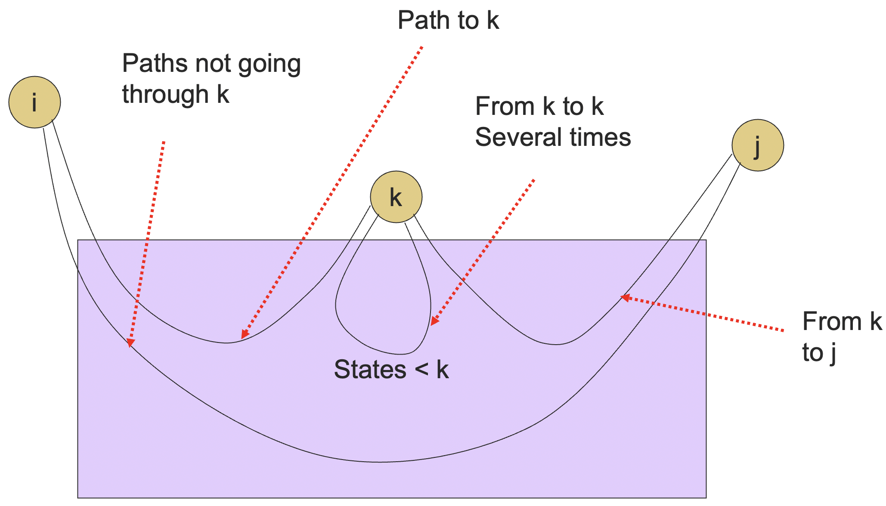

又了上面的 k-路径与 RE 的转化之后，一个 DFA 的 RE 就是所有 $R_{ij}^n$ 的总和（并）了，其中：

- $n$ 是 DFA 的状态数，这样的话路径就没有任何限制了；
- $i$ 是初始状态；
- $j$ 是终止状态中的任意一个。

举一个例子：

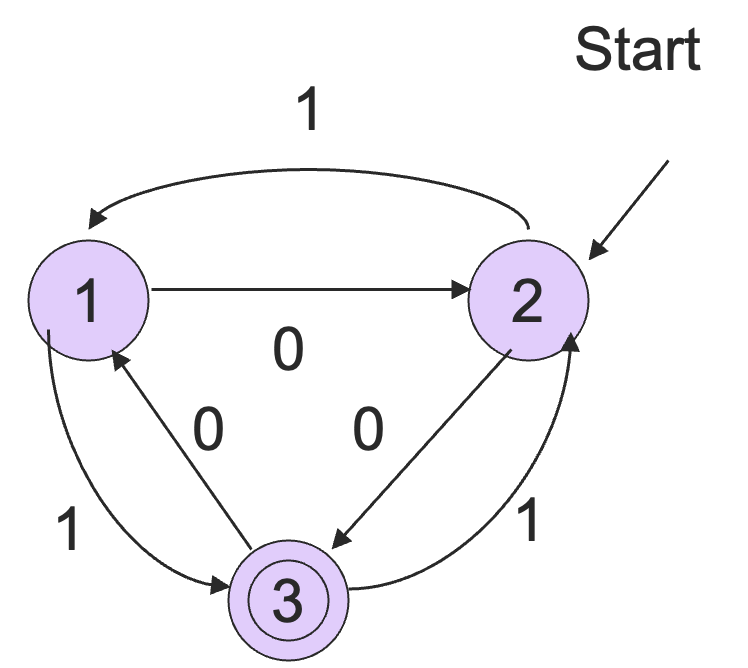

$$
R_{23}^3 = R_{23}^2 + R_{23}^2(R_{33}^2)^*R_{33}^2 = R_{23}^2(R_{33}^2)^*
$$

$$
R_{23}^2 = (10)^*0 + 1(01)^*1
$$

$$
R_{33}^2 = \varepsilon + 0(01)^*(1+00) + 1(10)^*(0+11)
$$

于是

$$
R_{23}^{3} = [(10)^*0 + 1(01)^*1][\varepsilon + 0(01)^*(1+00) + 1(10)^*(0+11)]
$$

::: theorem 定理 3.1
正则表达式的表达能力与 3 种有穷自动机 (DFA, NFA, $\varepsilon$-NFA) 等价，都恰好能表达正则语言。
:::

### 3.1.4 正则表达式的代数运算法则

- 并与拼接有点像加法和乘法
  - $+$ 满足交换律和结合律，拼接满足结合律；
  - 拼接在 $+$ 上可分配，满足分配律；
  - 例外：拼接不满足交换律。
- $\emptyset$ 对于相当于 0
  - $R + \emptyset = R$
  - $\emptyset R = R\emptyset = \emptyset$
- $\varepsilon$ 相当于 1
  - $\varepsilon R = R\varepsilon = R$

## 3.2 正则语言的判定性质

### 3.2.1 语言类的性质

称 **语言类 (language class)** 是一个语言的集合，比如说正则语言就是一个语言类。

语言类有两种重要类型的性质：

- 判定性质 (decision properties)；
- 闭包性质 (closure properties)。

#### 闭包性质

一类语言的 **闭包性质 (closure property)** 说的是给定这个语言类的一些语言，对于这些语言进行某个操作得到的另一个语言依旧在同一个语言类中。

比如说正则语言对于并、拼接和星闭包操作下是显然封闭的，这用正则表达式能够显然地表达出来。

语言的表示可以是形式化 (formal) 的（比如说 regular expressions，finite automata 等等），也可以是非形式化 (informal) 的（比如说自然语言描述，集合描述等等）。

#### 判定性质

一类语言的 **判定性质 (decision property)** 对应于一个算法，这个算法以某个语言的形式化描述（比如说一个 DFA) 为输入，然后告诉我们这个语言是否满足某些性质（比如说这个语言是否为空之类的）。

那么我们为什么需要有这些判定性质呢？考虑用 DFA 表示的协议，我们问这个协议是否能够终止就是在问这个语言是否有穷，问这个协议是否会失败就是在指定终止状态为错误的情况下问这个语言是否是非空的。

我们可能还会想要一个语言的最小表示，比如说状态最少的 DFA 或者最短的 RE。但如果我们无法判定两个语言是否等价，我们又怎么在不改变语言等价性的基础上尽量缩小语言的表示呢？

综上，一类语言的判定性质是很重要的，下面我们会以正则语言为例，讨论常见的判定性质。

### 3.2.2 成员资格问题

**成员资格问题 (Membership Promlem)** 问的是字符串 $w$ 是否属于正则语言 $L$ ？

假设 $L$ 是用一个 DFA $A$ 表示的，我们只需要模拟 $A$ 在 $w$ 输入下的行为即可，看 $w$ 是否能让这个自动机停在某个终止状态上。

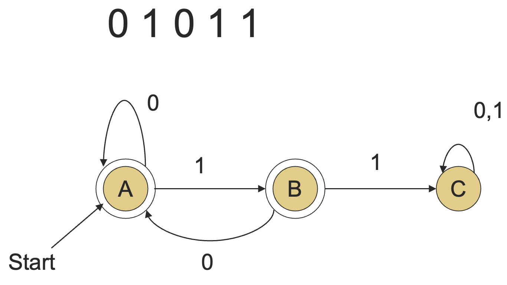

比如说上面这个例子，输入 `01011` 会让 DFA 从初始状态 A 走到状态 C，而 C 并不是终止状态，因此 `01011` 并不属于这个 DFA 所表示的正则语言。

那如果我们的正则语言并不是 DFA 表示的怎么办呢？其实我们之前已经证明了正则语言的四种表示方法是等价的，并且也给出了相互转化的方法，所以只需要将其他形式的表示转化成 DFA 即可。

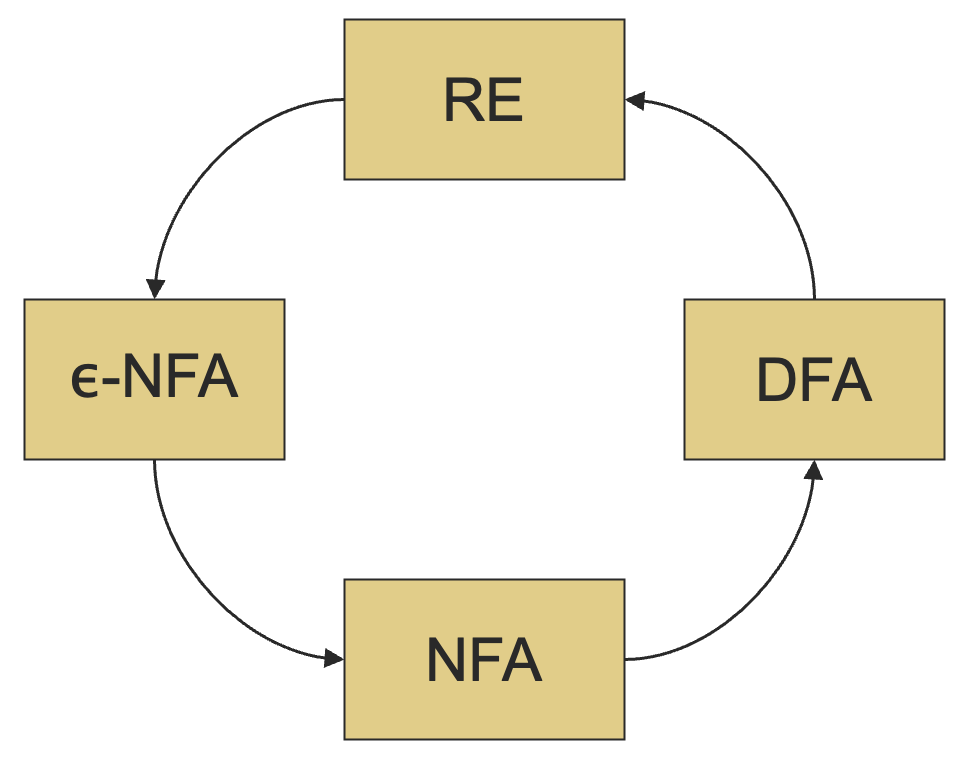

### 3.2.3 空问题

**空问题 (emptiness problem)** 问的是给定一个正则语言，这个语言包含任何字符串吗？

假设语言的表示为 DFA，从初始状态开始，计算所有的可达状态的集合，如果至少有一个终止状态可达，那么这个语言就非空，否则为空。

### 3.2.4 无限性问题

**无限性问题 (infiniteness problem)** 问的是一个给定的正则语言是否无限。

假设语言的表示为 DFA。一个关键的想法是，如果这个 DFA 有 $n$ 个状态，并且这个语言包含任何一个长度为 $n$ 或者更长的字符串，那么这个语言就是无限的。

否则，语言就是有限的，因为有限字符集上面长度小于 $n$ 的字符串集合肯定是有限的，正则语言只是这个集合的子集罢了，全集有限，子集自然有限。

下面我们来证明一下那个关键的想法。

如果一个 $n$ 状态的 DFA 接受了一个长度至少为 $n$ 的字符串，那么在标记为 $w$ 的从初始状态到终止状态的路径上至少有一个状态出现了两次，因为在这个长度为 $n$ 的路径上面至少有 $n + 1$ 个状态，这是鸽笼原理。

记 $w = xyz$，其中在读完 $x$ 和 读完 $y$ 的时候，DFA 停在了同一个状态 $q$，也就是 $y$ 对应的路径是一条环，那么 $xy^{i}z$ 一定也在这个语言中，且 $i$ 可以去一切自然数，而 $y \ne \varepsilon$，因为这是 DFA。

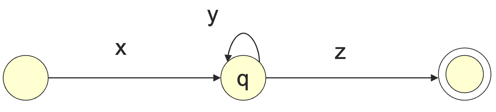

从而我们找到了无限个字符串形如 $xy^{i}z, i\ge 0, y\ne \varepsilon$ 都在这个正则语言中，从而这是一个无限的语言。

虽然我们现在又了一个关键的想法，但我们还没有算法。只有有算法的性质才是可判定的性质。长度 $\ge n$ 的字符串有无限多个，我们没有办法一个一个的检查这无限多个字符串，因为算法总是需要终止的。

于是，又了第二个关键的想法：如果某个正则语言 $L$ 中存在长度 $\ge n$ 的字符串，其中 $n$ 是 DFA 的状态数，那么一定存在一个字符串，长度在 $n$ 到 $2n-1$ 之间。

有了这个想法之后，我们只需要穷举检查给定字母表上的每一个长度从 $n$ 到 $2n-1$ 的字符串是否在正则语言中就可以了，这是一个可终止的算法。

下面我们来证明一下第二个关键想法。

借用上面那幅图，依旧设 $w = xyz, |w| \ge n$，其中 $y$ 是第一个环，由于是第一个环，所以 $|xy| \le n$，特别地，$1 \le |y| \le n$。

于是，如果 $|w| \ge 2n$，每个长度为 $n$ 的字串里面都可以消除一个 $|y|$，这样我们就可以缩减长度，直至长度位于 $n$ 到 $2n-1$ 之内。

不过穷举虽然已经是一个可以终止的算法了，但还是很糟糕。

一个更好的想法是在 DFA 中查找从初始状态到终止状态是否存在环，这样就变成了一个图问题了，且复杂度也不是很高。

一个可选的方案是：

1. 删除所有从初始状态不可达的状态；
2. 删除所有不可到达终止状态的状态；
3. 检查剩下的状态转换图中是否有环。

不过一个更简单，但不那么搞笑的方法是从每个结点 $N$ 开始搜索，如果自己本身可达，那么就存在环。对于每个结点重复这个过程就可以了。

### 3.2.5 泵引理

在上面无限性问题的讨论中，我们已经快要证明一个很有用的命题了，这对于判断某个语言不是正则语言很有用，称为 **正则语言的泵引理 (pumping lemma for regular languages)**。

:::theorem 定理 3.1

正则语言的泵引理，对于每一个正则语言 $L$ 来说，存在一个整数 $n$，使得对于 $L$ 中的每一个长度 $\ge n$ 的字符串 $w$，我们可以写作 $w = xyz$，满足：

1. $|xy| \le n$；
2. $|y| > 0$；
3. $\forall i \ge 0, xy^{i}z \in L$。

整数 $n$ 也称为泵引理常数。

:::

其实这里的 $n$ 就是 DFA 的状态数，$y$ 就是第一个环。

下面我们来看一个泵引理的简单应用示例。之前我们已经证过，$\{0^k1^k \mid k\ge 1\}$ 不是一个正则语言。

假设它是一个正则语言，那么根据泵引理，存在一个泵引理常数 $n$，考虑字符串 $w = 0^n1^n$，我们可以写作 $w = xyz$，其中 $|xy| \le n$，于是 $x, y$ 都是全 0，于是 $xyyz$ 中的 $0$ 比 $1$ 多，$xyyz$ 不在 $L$ 中，这与泵引理是矛盾的。

因此这个语言不是正则语言。

### 3.2.6 等价性

给定正则语言 $L$ 和 $M$，$L = M$ 吗？

算法包括为 $L$ 和 $M$ 构造 **乘积 DFA(product DFA)**。

令两个 DFA 的状态集为 $Q$ 和 $R$，则乘积 DFA 的状态集为 $Q \times R$。初始状态为 $[q_0, r_0]$ （是 $L$ 与 $M$ 对应的 DFA 的初始状态）。

定义转移函数 $\delta([q, r], a) = [\delta_{L}(q, a), \delta_{M}(r, a)]$：

- $\delta_{L}, \delta_{M}$ 是 $L$ 和 $M$ 的 DFA 的转移函数；
- 也就是说，我们通过乘积 DFA 中的双重状态变化来模拟两个 DFA 中的状态变化。

比如说下面是一个乘积 DFA 的例子：

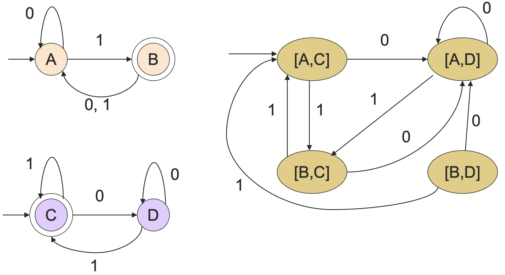

不过我们现在还没有定义乘积 DFA 的终止状态，下面我们会通过定义终止状态的方式来将等价性问题转化成空问题，而空问题我们之前已经解决了。

我们让乘积 DFA 中形如 $[q, r]$ 的状态成为终止状态，其中 $q$ 和 $r$ 有且仅有一个是原来 DFA 的终止状态。

这样的话，乘积 DFA 接受 $w$ 当且仅当 $w$ 在且只在 $L$ 和 $M$ 中的某一个语言中。于是 $L = M$ 当且仅当乘积自动机的语言是空集，也就是不接受任何语言。这样的话，也就是说不存在字符串，在 $L$ 却不在 $M$ 中或者在 $M$ 却不在 $L$ 中。

从而 $L = M$。

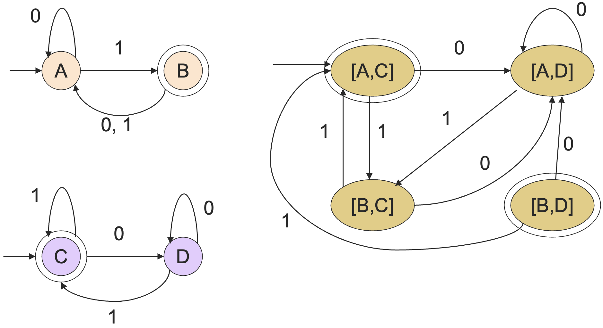

### 3.2.7 包含关系

给定正则语言 $L$ 和 $M$，是否 $L\subseteq M$ ？

这个算法依旧使用了乘积自动机。和上面的类似，我们定义乘积自动机的终止状态 $[q, r]$ 满足 $q$ 在原来的 DFA 中是终止状态，但 $r$ 不是，这样的话 $L\subseteq M$ 就等价于乘积 DFA 为空了。因为不存在任何一个字符串，在 $L$ 中却不在 $M$ 中，从而 $L \subseteq M$。

比如说在之前的例子，检查包含关系的乘积 DFA 如下：

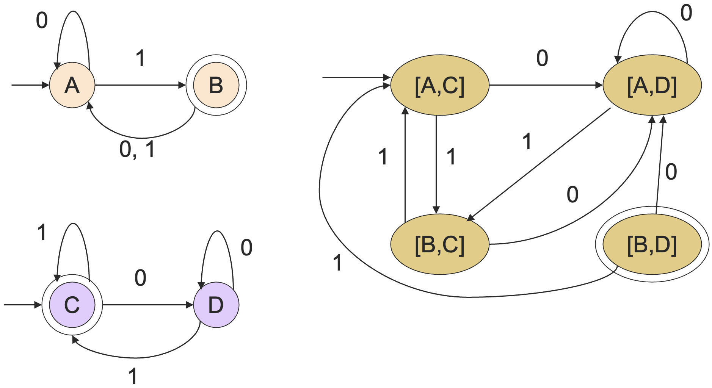

由于乘积 DFA 的终止状态不可达，则其接受语言为空，从而图中左侧上面那个 DFA 所对应的语言就包含于下面那个 DFA 所包含的语言。

### 3.2.8 一个正则语言的最小状态 DFA

原则上，由于我们可以检查 DFA 之间的等价性，于是给定一个 DFA $A$，我们可能会希望能够找到一个最小的能够接受 $L(A)$ 的 DFA，这样的话，我们在不损失表达范围的情况下后续操作会更加简单。

最朴素的方法就是检查所有的比 $A$ 小的 DFA 与 $A$ 的等价性，从中选出最小的，但这是一个很糟糕的算法。

下面我们介绍一种高效的 **状态最小化 (efficient state minimization)** 操作。

建立一张包含所有状态对的表。如果我们能够找到一个字符串 **区分 (distinguishes)** 两个状态（也就是说这个字符串能够将两个状态的其中一个带往终止状态，而另一个不能），则标记这个对。

算法是一个基于最短的区分字符串长度的递归。

基础情况：标记所有的只有一个终止状态的对，即区分字符串长度为 0。

递归：如果对于某个输入符号 $a$，$[\delta(q, a), \delta(r, a)]$ 被标记了，那么将 $[q, r]$ 也进行标记。在没有更多的对可以被标记的时候，剩下的没有标记的对就是等价的了，并且可以合并成一个状态。

不可区分是具有传递性的。如果状态 $p$ 和状态 $q$ 不可区分，状态 $q$ 和状态 $r$ 不可区分，那么状态 $p$ 和状态 $r$ 也是不可区分的。

证明：$p$ 和 $q$ 在所有的输入 $w$ 下的结果是相同的，而 $q$ 和 $r$ 在所有的输入 $w$ 下结果也是相同的，所以 $p$ 和 $r$ 在所有的输入 $w$ 下结果都相同，从而 $p$ 和 $r$ 不可区分。

下面我们来构建一下最小状态数的 $DFA$。

- 假设 $q_1, ..., q_k$ 是不可区分的状态；
- 用一个代表 (represemtative) 状态 $q$ 来代替这些状态；
- 而 $\delta(q_1, a), ..., \delta(q_k, a)$ 都是不可区分的状态；
  - 否则，我们应该至少再多标记一个状态对；
- 令 $\delta(q, a) =$ 上述各个不可区分的状态的代表状态。

下面是一个状态最小化的例子：

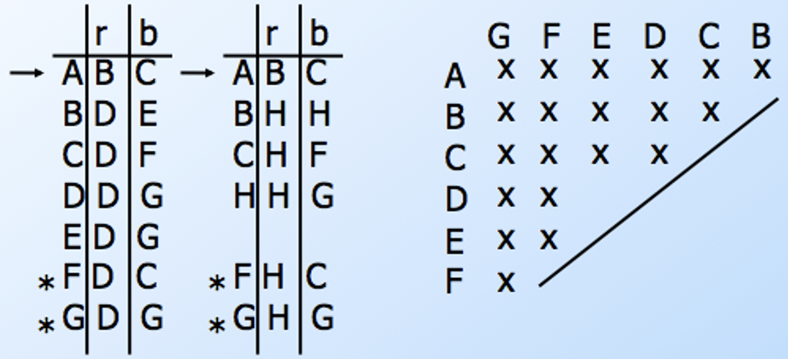

合并不可区分的状态可能会在最小化状态的 DFA 中留下不可达的状态，因此，在最小化之前或者之后，我们应该将不可达的状态从 DFA 中去除。

我们已经将给定 DFA 中能合并的状态都合并了，得到了所谓的最小状态数的 DFA。那这个 DFA 真的是最小状态数吗？存在比它更小的了吗？

不存在了，我们下面来证明一下最小化操作之后的 DFA 就是状态数最小的了。

证明：令 $A$ 是一个最小化的 DFA，假设存在一个更小的 $B$ 与 $A$ 等价。

考虑一个由 A 和 B 的状态组成的自动机。根据定义，如果状态 $p$ 和状态 $q$ 是不可区分的，那么 $\delta(p,a)$ 与 $\delta(q, a)$ 也是不可分割的。

由于 $L(A)$ = $L(B)$，在这个新的自动机中，$q_0$ 和 $p_0$ （ $A$ 和 $B$ 的初始状态） 是不可区分的，从而它们的后继状态也不可区分。

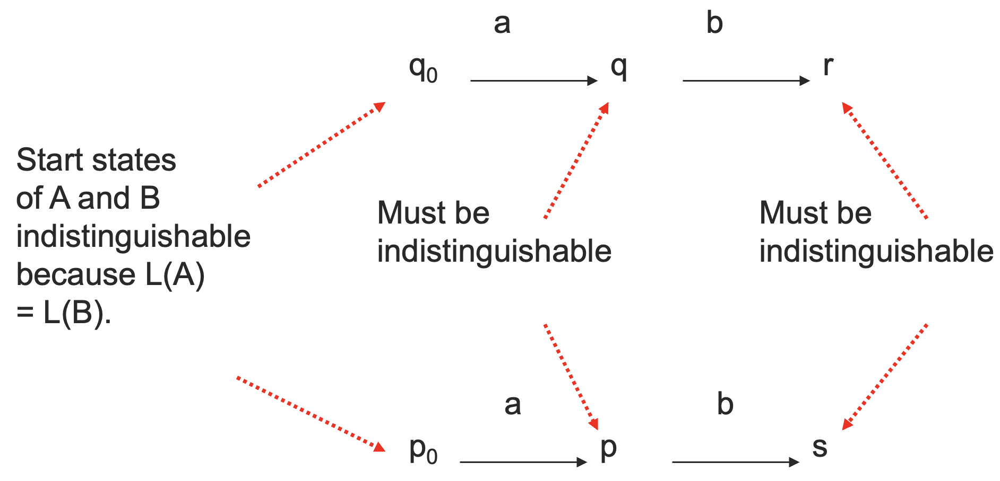

下面我们证明 $A$ 中的任意状态 $q$，在 $B$ 中都存在某个状态和它不可区分。

对最短的将 $A$ 带到 $q$ 状态的字符串的长度进行归纳。

基础情况：$A$ 和 $B$ 的初始状态是不可区分的，因为 $L(A) = L(B)$。

归纳：假设 $w = xa$ 是最短的将 $A$ 带到 $q$ 状态的字符串。

根据归纳假设，$x$ 可以将 $A$ 带到某个状态 $r$，$r$ 与 $B$ 中的某个状态 $p$ 是不可区分的。于是，$\delta_A(r,a) = q$ 和 $\delta_B(p, a)$ 不可区分。

由于 $B$ 的状态数比 $A$ 少，根据鸽笼原理，$A$ 中一定存在两个状态，和 $B$ 中的同一个状态不可分，从而使得 $A$ 中的这两个状态不可分，这与 $A$ 的最小化性质是矛盾的（不可分的状态应该已经被合并了）。

## 3.3 正则语言的闭包性质

### 3.3.1 并操作、拼接操作以及星闭包操作下的闭包

如果 $L$ 和 $M$ 是正则语言，$L \cup M$ 也是正则语言。

证明：令 $L$ 和 $M$ 分别是由正则表达式 $R$ 和 $S$ 表达的语言，则 $R + S$ 也是一个正则表达式，其语言就是 $L \cup M$，于是 $L \cup M$ 是正则语言。

同样的想法，$LM$、$L^*$ 也是正则语言，证明方式同样是采用正则表达式的表示方法。

### 3.3.2 交集、差集、补集下的闭包

#### 交集

如果 $L$ 和 $M$ 是正则语言，那么 $L \cap M$ 也是正则语言。

证明：令 $A$ 和 $B$ 分别是正则语言 $L$ 和 $M$ 的 DFA。构造 $A$ 和 $B$ 的乘积自动机 $C$，令 $C$ 的终止状态是同时包含 $A$ 和 $B$ 的终止状态的状态对。$C$ 就是 $L \cap M$ 的 DFA，因此 $L \cap M$ 也是正则语言。

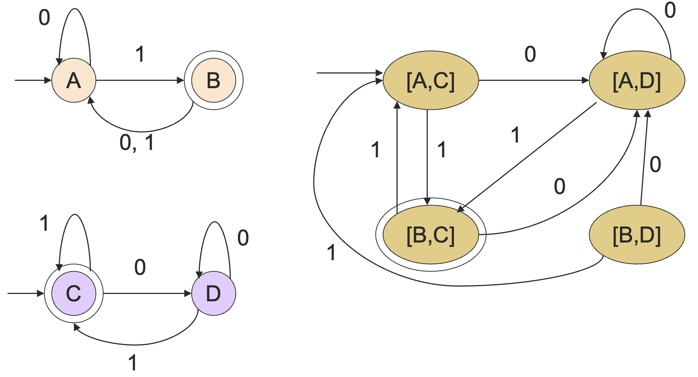

我们之前已经分别用反证法和泵引理证明了 $L_1 = \{0^n1^n\mid n\ge 0\}$ 并不是正则语言。记 $L_2 =$ 所有的由相等个数的 0 和 1 组成的字符串的集合，如果 $L_2$ 是正则语言，由于正则语言在交集操作下封闭，于是 $L_2 \cap L(0^*1^*) = L_1$ 也应该是正则语言，但并不是，从而 $L_2$ 也不是正则语言。

#### 差集

如果 $L$ 和 $M$ 是正则语言，那么 $L - M$ 也是正则语言。

证明：令 $A$ 和 $B$ 分别是正则语言 $L$ 和 $M$ 的 DFA。构造 $A$ 和 $B$ 的乘积自动机 $C$，令 $C$ 的终止状态是包含 $A$ 的但不包含 $B$ 的终止状态的状态对。则 $C$ 是 $L - M$ 的 DFA，$L - M$ 是正则语言。

#### 补集

一个语言 $L$ 关于字母表 $\Sigma$ 的 **补 (complement)** 是 $\Sigma^* - L$，而 $\Sigma^*$ 显然是正则的，于是 $L$ 的补也是正则的（根据正则语言对于差集的闭包性质）。

### 3.3.3 逆运算下的闭包

在之前讨论被 23 整除的二进制数的时候我们提到过，一个正则语言的逆依然是正则语言，虽然构造那样的 DFA 会有些麻烦。

下面我们来了解一下麻烦的逆的 DFA 的构造方式，从而证明正则语言对于逆操作封闭。我们通过正则表达式来实现构造，又有了正则表达式之后，DFA 相应的也就有了。

给定语言 $L$，$L^R$ 是 $L$ 中所有字符串的逆的集合。

证明：令 $L$ 的正则表达式为 $E$，我们下面将说明如何给正则表达式取逆，构造一个 $L^R$ 的正则表达式 $L^R$。

基础情况：如果 $E$ 是一个符号 $a$ 或者 $\varepsilon$ 或者 $\emptyset$，那么 $E^R = E$。

归纳：如果 $E$ 是：

- $F + G$，那么 $E^R = F^R + G^R$；
- $FG$，那么 $E^R = G^RF^R$；
- $F^*$，那么 $E^R = (F^R)^*$。

比如说正则表达式 $E = 01^* + 10^*$，则 $E^* = 1^*0 + 0^*1$，只需要递归地应用上面的规则即可。

### 3.3.4 同态运算下的闭包

对于一个字母表的 **同态 (homomorphism)** 指的是一个函数，这个函数对于字母表中的每一个字符给出了一个字符串。

比如说 $h(0) = ab, h(1) = \varepsilon$，扩展到字符串则是 $h(a_1a_2...a_n) = h(a_1)h(a_2)...h(a_n)$，于是有 $h(01010) = ababab$。

如果 $L$ 是一个正则语言，且 $h$ 是它字母表上的一个同态，则 $h(L) = \{h(w) \mid w \in L\}$ 也是一个正则语言。

证明：令 $E$ 是 $L$ 的一个正则表达式，将 $h$ 应用在 $E$ 中的每一个符号上，得到的新的正则表达式所对应的语言就是 $h(L)$。

例如 $h(0) = ab, h(1) = \varepsilon$，令 $L$ 是正则表达式 $01^* + 10^*$ 所对应的正则语言，则 $h(L)$ 就是正则表达式 $ab\varepsilon^* + \varepsilon(ab)^*$ 所对应的语言。

这里将单个字符替换成字符串的时候，为了保持运算顺序不变，可能需要添加括号。

这里，$ab\varepsilon^* + \varepsilon(ab)^*$ 这个正则表达式是可以化简的，由 $\varepsilon^* = \varepsilon$ , $E\varepsilon = \varepsilon E = E$，原式可化为 $ab + (ab)^*$。

而 $L(ab) \subseteq L((ab)^*)$，则 $ab + (ab)^* = (ab)^*$。即 $h(L) = L((ab)^*)$。

### 3.3.5 逆同态运算下的闭包

令 $h$ 是一个同态，$L$ 是一个语言，这个语言的字母表是 $h$ 的输出语言。我们可以定义：

$$
h^{-1}(L) = \{w \mid h(w) \in L\}
$$

举一个简单的例子，$h(0) = ab, h(1) = \varepsilon$，令 $L = \{abab, baba\}$，则 $h^{-1}(L) = L(1^*01^*01^*)$。

下面我们来证明 **逆同态 (inverse homomorphism)** 运算的闭包性质，从语言 $L$ 的 DFA $A$ 开始，我们将会为 $h^{-1}(L)$ 构建一个 DFA $B$，有：

- 相同的状态集合；
- 相同的初始状态；
- 相同的终止状态集；
- 输入字母表 $=$ 同态函数 $h$ 能够应用的字符（或者说 $h$ 的定义域）。

$B$ 的转移函数通过将 $h$ 应用到 $a$ 上，看 $A$ 在 $h(A)$ 的激励下会去到哪一个状态，然后将这个作为 $B$ 的下一个状态。

形式化表述为 $\delta_B(q, a) = \delta_A(q, h(a))$。

下面给一个逆同态的例子：

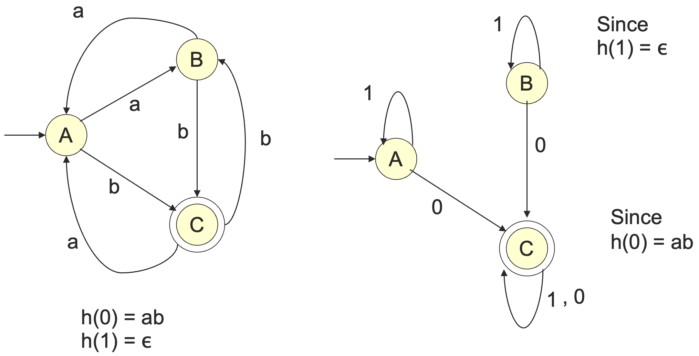

下面证明一下等价性。可以通过对 $|w|$ 归纳来证明 $\delta_B(q_0, w) = \delta_A(q_0, h(w))$，从而 $B$ 接受 $w$ 当且仅当 $A$ 接受 $h(w)$。
