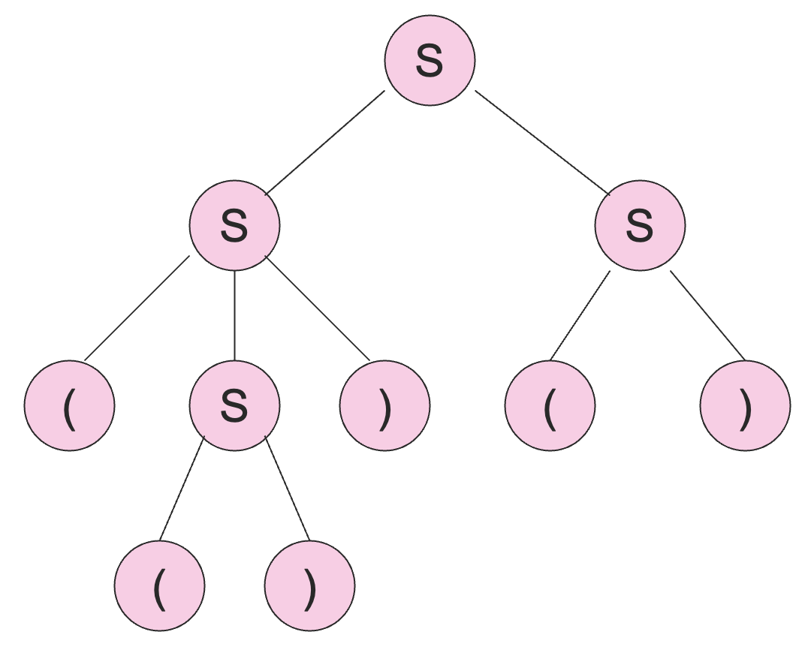
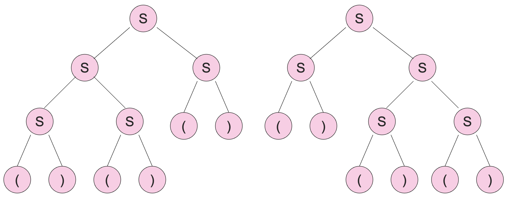

# 4 上下文无关文法

## 4.1 上下文无关文法

我们之前用两讲的内容学习了正则语言，不过我们也认识到了正则语言表达能力的局限性。我们一遍又一遍地用各种方式说明了 $0^n1^n$ 并不是一个正则语言。还有另一种常见的不是正则语言的例子是回文串，即满足 $w^R = w$ 的字符串，考虑 $0^n10^n$ 及泵引理就不难发现其非正则性了。

### 4.1.1 非正式的描述

**上下文无关文法 (context-free grammar)** 是一种描述语言的记号，它比有穷自动机或者正则语言更加强大，但是依旧不能描述所有的语言。不过它对于描述嵌套结构是很有用的，比如括号匹配和编程语言。

上下文无关文法的一个基本想法是使用变量来表示字符串的集合，也就是语言。这些变量是递归定义的，直接或者间接。递归的规则（产生式）中只使用了拼接这一种字符串操作。一个变量的多条候选规则之间是并集关系。

比如说，对于语言 $\{0^n1^n \mid n \ge 1\}$ 来说，它的上下文无关文法的产生式为：

- $S \to 01$
- $S \to 0S1$

这两个规则的含义是：

- 基础情况：$01$ 在这个语言当中；
- 归纳情况：如果 $w$ 在这个语言当中，那么 $0w1$ 也在这个语言当中。

### 4.1.2 形式化定义

::: definition 定义 4.1
定义 **上下文无关文法 (Context-Free Grammar, CFG)** 为一个四元组 $G = (V, T, P, S)$，其中：

- $T$ 是 CFG 所要定义的语言的字母表，称为 **终结符 (Terminals)**；
- $V$ 是一个有限的其他符号的集合，每个符号代表了一个语言，称为 **变量 (Variables)** 或者 **非终结符 (Nonterminals)**；
- $S$ 是代表 CFG 所要定义的语言变量，称为 **起始符号 (Start Symbol)**；
- $P$ 是 **产生式 (productions)** 的集合，表示语言的递归定义，每个产生式形如 $head \to body$，其中：
  - **头 (header)** 是一个变量；
  - **体 (body)** 是变量和终结符组成的字符串，可以是空串。

:::

习惯上，我们一般会有如下一些字母表示上的约定（只是一种习惯，本教程采用，后续不再具体说明字母含义）：

- 用 $A, B, C, ...$ 和 $S$ 来表示变量；
- 用 $a, b, c, ...$ 来表示终结符；
- 用 $..., X, Y, Z$ 来表示非终结符或者变量；
- 用 $..., w, x, y, z$ 来表示仅仅只含有终结符的字符串；
- 用 $\alpha, \beta, \gamma, ...$ 来表示含有终结符或者变量或者既含有终结符又含有变量的字符串。

于是，$\{0^n1^n \mid n\ge 1\}$ 的形式化的上下文无关文法为：

$$
G = (\{S\}, \{0, 1\}, \{S\to 01, S\to 0S1\}, S)
$$

为了推导出一个 CFG 所描述的语言中的字符串，我们从起始符号开始，不断地将变量 $A$ 用它的某一个产生式的体来替代，从而得到所有的字符串。这里，$A$ 的产生式指的是以 $A$ 为头的产生式。

::: definition 定义 4.2
我们称 $\alpha A\beta$ 可以 **推导 (derive)** 出 $\alpha \gamma \beta$，记作 $\alpha A\beta \Rightarrow \alpha \gamma \beta$，如果 $A\to \gamma$ 是一个产生式。

称零步或者多步推导为 **迭代推导 (iterated derivation)**，记作 $\Rightarrow^*$，满足：

- 基础情况：$\forall \alpha \Rightarrow^* \alpha$；
- 归纳情况：若 $\alpha \Rightarrow^* \beta$ 且 $\beta \Rightarrow \gamma$，则 $\alpha \Rightarrow^* \gamma$。

:::

比如说，对于上面的那个例子，我们可以有：

$$
S \Rightarrow 0S1 \Rightarrow 00S11 \Rightarrow 000111
$$

$$
S \Rightarrow^* S, S \Rightarrow^* 0S1, S \Rightarrow^* 00S11, S \Rightarrow^* 000111
$$

::: definition 定义 4.3
从起始符号推导出来的任何一个字符串（既可以包含终结符，也可以包含变量）称为一个 **句型 (sentential form)**，即 $\alpha$ 是一个句型当且仅当 $S \Rightarrow^* \alpha$。
:::

:::definition 定义 4.4
令 $G$ 是一个上下文无关文法，则记 $G$ 的语言为 $L(G) = \{w \mid S \Rightarrow^* w\}$，称上下文无关文法定义的语言为 **上下文无关语言 (Context-Free Language, CFL)**。
:::

比如说 $G$ 的产生式为 $S \to \varepsilon$ 和 $S \to 0S1$，则 $L(G) = \{0^n1^n \mid n\ge 0\}$。

通过之前的例子，我们能够看到，存在上下文无关语言不是正则语言。但是，并不是所有的语言都是上下文无关语言。

一种直觉是，上下文无关语言可以数两个东西，但是不能数三个东西。例如 $\{0^n1^n \mid n \ge 0\}$ 是上下文无关语言，但是 $\{0^n1^n2^n \mid n\ge 0\}$ 不是上下文无关语言。更详细的判定方法在之后讨论上下文无关语言的性质的时候还会再详细说明。

### 4.1.3 BNF 表示法

程序设计语言的语法经常用 BNF(Backus-Naur Form) 来书写，其本质上其实描述的就是上下文无关文法。

- 变量是 `<...>` 中的单词，比如说 `<statement>`。
- 终结符通常是多字符的字符串，用粗体字或者下划线标注，比如说 **`while`** 或者 <u>`WHILE`</u>。
- `::=` 符号通常表示 $\to$。
- `|` 符号表示 `or`。
  - 这是一种对于多个头部相同的产生式的简写方式；
  - 例如，$S \to 0S1 \mid 01$ 是 $S \to 0S1$ 和 $S \to 01$ 的简写。
- `...` 符号用来表示一个或者多个。
  - 比如说 `<digit> ::= 0 | 1 | 2 | 3 | 4 | 5 | 6 | 7 | 8 | 9`，`<unsigned_integer> ::= <digit>...`；
  - $\alpha...$ 翻译成上下文无关文法的产生式就是 $A \to A\alpha \mid \alpha$，表示一个或者多个 $\alpha$；
  - 于是对于上面的无符号整数的语法可以表示为：
    $$U \to UD \mid D, D \to 0 \mid 1 \mid 2 \mid 3 \mid 4 \mid 5 \mid 6 \mid 7 \mid 8 \mid 9$$
- 用方括号 `[...]` 将一个或者多个符号括起来表示这个可选的，不是必须的。
  - 比如说 `<statement> :: if <condition> then <statement> [ else <statement>]`
  - $[\alpha]$ 翻译成上下文无关文法就是 $A\to \alpha \mid \varepsilon$，因为可选的含义就是 0 个或者 1 个。
  - 于是，上面的 `if-then-else` 的语法可以表示为：
    $$S \to iCtSA, A \to eS \mid \varepsilon$$
- 用 `{...}` 来包含一系列符号，表示它们应该被当成一个整体。
  - 通常，在这个符号之后还会有一个 `...` 表示一个或者多个。
  - 例如 `<statement_list> ::= <statement> [{;<statement>}...]`
  - 在上下文无关文法中，我们可以用一个变量来代表一个整体，即 $A \to \alpha$，然后将 BNF 表示法中的 $\{\alpha\}$ 都换成 $A$。
  - 比如说上面那个 BNF 记号的上下文无关文法为：
    $$L \to SB, B \to C \mid \varepsilon, C\to AC \mid A, A\to ;S$$
  - 这里，$C$ 表示 `A...`。

### 4.1.4 最左推导和最右推导

推导允许我们去替换字符串中的任何变量，因此，对于同一个字符串可能有许多不同的推导。通过强制要求每次都替换最左边的变量（或者每次都替换最右边的量），我们可以避免这种不确定性。

::: definition 定义 4.5
定义 **最左推导 (leftmost derivations)**：我们称 $wA\alpha \Rightarrow_{lm} w\beta\alpha$，如果 $w$ 是由终结符构成的字符串，且 $A \to \beta$ 是一个产生式。

称 $\alpha \Rightarrow^*_{lm} \beta$，如果 $\alpha$ 可以通过 0 步或者若干步最左推导 $\Rightarrow_{lm}$ 变成 $\beta$。
:::

比如说对于括号匹配的文法：$S \to SS \mid (S) \mid ()$，有

$$
S \Rightarrow_{lm} SS \Rightarrow_{lm} (S)S \Rightarrow_{lm} (())S \Rightarrow_{lm} (())()
$$

于是，$S \Rightarrow^*_{lm} (())()$。

其实，$S \Rightarrow SS \Rightarrow S() \Rightarrow (S)() \Rightarrow (())()$ 也是一个推导，但并不是最左推导。

::: definition 定义 4.6
定义 **最右推导 (rightmost derivations)**：我们称 $\alpha Aw \Rightarrow_{rm} \alpha\beta w$，如果 $w$ 是由终结符构成的字符串，且 $A \to \beta$ 是一个产生式。

称 $\alpha \Rightarrow^*_{rm} \beta$，如果 $\alpha$ 可以通过 0 步或者若干步最右推导 $\Rightarrow_{rm}$ 变成 $\beta$。
:::

还是以上面那个括号匹配的文法为例，下面是一个最右推导的例子：

$$
S \Rightarrow_{rm} SS \Rightarrow_{rm} S() \Rightarrow_{rm} (S)() \Rightarrow_{rm} (())()
$$

于是，$S\Rightarrow^*_{rm} (())()$。

但 $S\Rightarrow SS\Rightarrow SSS\Rightarrow S()S\Rightarrow()()S\Rightarrow()()()$ 既不是最左推导，也不是最右推导。

## 4.2 解析树

### 4.2.1 基本概念

::: definition 定义 4.7
**解析树 (Parse Tree)** 是一棵用某个特定的上下文无关文法中的符号对每个结点做标记的树，其中：

- 叶子结点：用终结符或者 $\varepsilon$ 标记；
- 中间结点：用变量标记；
  - 子结点用父结点的产生式体中的符号标记；
- 根结点：用起始符号标记。

:::

比如说，$S \to SS \mid (S) \mid ()$ 的一棵解析树如下：

按照前序遍历的顺序将叶子结点上的记号拼接起来得到的字符串称为解析树的 **产出 (yield)**，上面的解析树的产出为 $(())()$。

下面我们将解析树的概念泛化一下，因为我们有的时候会讨论那种根结点 $A$ 并不是起始符号的解析树。称为跟结点为 $A$ 的解析树，通常是作为我们讨论整个解析树的子问题来考虑的。

### 4.2.2 解析树，最左推导和最右推导

::: theorem 定理 4.1
解析树、最左推导和最右推导是可以相互转化的，它们的表达能力是等价的。
:::

我们下面会证明：

1. 如果存在一个根结点为 $A$ 且产出 $w$ 的解析树，则 $A \Rightarrow^*_{lm} w$；
2. 如果 $A \Rightarrow^*_{lm} w$，那么一定存在一棵解析树，根结点为 $A$ 且产出 $w$。

证明：先证第一条，对树的 **高度 (height)** 进行归纳。

基础情况：高度为 1 的时候，树形如：

则 $A \to a_1a_2...a_n$ 一定是一个产生式，从而 $A \Rightarrow^*_{lm} a_1a_2...a_n$。

归纳：假设结论对于高度小于 $h$ 的树成立，下面证明对于高度等于 $h$ 的树也成立。

根据归纳假设，$X_i \Rightarrow^*_{lm} w_i$，如果 $X_i$ 本身是终结符的话，那么 $X_i = w_i$。

从而，我们有：

$$
A \Rightarrow_{lm} X_1...X_n \Rightarrow^*_{lm} w_1X_2...X_n \Rightarrow^*_{lm} w_1w_2X_3...X_n \Rightarrow^*_{lm} ... \Rightarrow^*_{lm} w_1...w_n
$$

即 $A \Rightarrow^*_{lm} w_1w_2...w_n$。

下面证明第二条，对推导的长度进行归纳。

基础情况：如果 $A \Rightarrow^*_{lm} a_1...a_n$ 只经过一步推导，则一定存在如下的解析树。

归纳：令 $A \Rightarrow^*_{lm} w$ 是一个 $k(k > 1)$ 步的推导式，假设结论对于小于 $k$ 步的推导式成立。

记第一步推导为 $A \Rightarrow_{lm} X_1...X_n$。

关键点：$w$ 可以被拆分成很多部分，使得第一部分是从 $X_1$ 推导而来的，下一部分是从 $X_2$ 推导而来的，以此类推。如果 $X_i$ 是一个终结符，那么 $w_i = X_i$。

于是，对于所有的变量 $X_i$，有 $X_i \Rightarrow^*_{lm} w_i$，并且这个推导的步数少于 $k$ 次。

根据归纳假设，对于 $X_i \Rightarrow^*_{lm} w_i$，存在一个解析树，跟结点为 $X_i$ 且产出 $w_i$。

于是，对于 $A \Rightarrow^*_{lm} w$，存在如下的解析树。

至此，我们已经证明了最左推导和解析树是可以相互转化的，类似地，我们也可以证明最右推导和解析树也是可以相互转化的，从而，这三者的表达能力是等价的。

### 4.2.3 文法歧义

细心一点的读者可能会发现，我们将最左推导转化成解析树的这个证明过程其实并没有用到“最左”这个条件，换句话说，把最左这个条件去掉，我们的证明依然成立。

::: definition 定义 4.8
一个上下文无关文法是 **有歧义的 (ambiguous)**，如果在这个文法定义的语言中，存在一个字符串，它可以由两个或者更多的解析树产出。
:::

例如 $S \to SS \mid (S) \mid ()$ 这个文法，下面是可以产出 $()()()$ 的两个解析树：

如果存在两个不同的解析树，根据我们之前的证明，就一定存在两种不同的最左推导方式。反之亦然，两种不同的最左推导也会产生两个不同的解析树。对于最右推导，结论也是类似的。

从而，对于有歧义的文法的另外两个等价的定义是：

1. 在这个文法定义的语言中，存在一个字符串，它有两种不同的最左推导。
2. 在这个文法定义的语言中，存在一个字符串，它有两种不同的最右推导。

这里需要注意的是，歧义是文法的性质，并不是语言的性质。比如说 $S \to SS \mid (S) \mid ()$ 这个文法是有歧义的，但是这个文法定义的语言——平衡括号语言 (balanced-parentheses language)，是没有歧义的。

并且，对于平衡括号语言，是存在一个没有歧义的上下文无关文法的：

$$
\begin{aligned}
B &\to (RB \mid \varepsilon\\
R &\to ) \mid (RR
\end{aligned}
$$

其中，$B$ 是起始符号，用于推导平衡的字符串；$R$ 是为了产生右括号比左括号多一个的字符串的变量。

对于给定的一个平衡的字符串，我们可以从左向右扫描这个字符串，然后构造一个唯一的最左推导。

- 如果我们需要展开 $B$：
  - 使用 $B \to (RB$ 如果下一个符号是 $($；
  - 使用 $B \to \varepsilon$ 如果已经到了字符串末尾；
- 如果我们需要展开 $R$：
  - 使用 $R \to )$ 如果下一个符号是 $)$；
  - 使用 $R \to (RR$ 如果下一个字符是 $($。

根据上面的算法，构造生成 $(())()$ 的最左推导：

$$
B \Rightarrow_{lm} (RB \Rightarrow_{lm} ((RRB \Rightarrow_{lm} (()RB \Rightarrow_{lm} (())B \Rightarrow_{lm} (())(RB \Rightarrow_{lm} (())()B
\Rightarrow_{lm} (())()
$$

其实，在每一步展开的时候，我们可以发现，算法中的选择就是唯一的选择，选择另一个产生式展开就会推导出和目标不同的字符串。

此外，对于类似于 $B \to (RB \mid \varepsilon, R \to ) \mid (RR$ 这样的文法，具有这样的特征：你总能够通过从左往右扫描目标字符串，且只看下一个符号的方式，找到唯一一个你在最左推导中要使用的生成式，这样的文法称为 $LL(1)$ 文法 (Leftmost derivation, Left-to-right scan, One symbol of lookhead Grammar)。

大多数的程序设计语言都有 $LL(1)$ 文法，$LL(1)$ 文法是不会出现歧义的（这是由其定义决定的）。

### 4.2.4 固有歧义

如果所有的有歧义的文法都可以通过某种方式修复成没有歧义的文法，就像我们对于括号平衡文法所做的那样。但不幸的是，有一些上下文无关语言本身是具有 **固有的歧义性 (inherently ambiguous)** 的，意思是这个语言的所有的文法都是有歧义的。

比如说 $\{0^i1^j2^k \mid i = j \vee j = k\}$ 是具有固有的歧义的。

直觉上来讲，形如 $0^n1^n2^n$ 这样的字符串可以通过两个解析树来产生，一种只检查 $0$ 和 $1$ 的个数是否相等，另一种只检查 $1$ 和 $2$ 的个数是否相等，无论怎样的文法都避不开这个问题，因为这是基于语言本身的定义中的“或”的。

但这是一个上下文无关语言，下面给出一个能够生成这种语言的上下文无关文法：

$$
\begin{aligned}
S &\to AB \mid CD\\
A &\to 0A1 \mid 01\\
B &\to 2B \mid 2\\
C &\to 0C \mid 0\\
D &\to 1D2 \mid 12
\end{aligned}
$$

其中 $A$ 用来产生相等数量的 $0$ 和 $1$，$B$ 用来产生任意数量的 $2$，$C$ 用来产生任意数量的 $0$，$D$ 用来产生相等数量的 $1$ 和 $2$。

## 4.3 上下文无关文法的范式

### 4.3.1 去除无用变量

#### 无法推导的变量

有一些变量是无法推导出任何字符串的。考虑 $S \to AB, A \to aA \mid a, B \to AB$，尽管 $A$ 可以推导出所有的 $a$ 组成的字符串，但是 $B$ 不能推导出任何的由终止符组成的字符串。

这是因为唯一的一个 $B$ 的产生式，但却只产生了 B 的句型，而没有终止符。

由于 $B$ 不能推导任何字符串，$S$ 也无法推导任何字符串，从而这个文法对应的语言为空。

#### 无法推导的变量的发现算法

有一系列的归纳算法，它们从发现一些简单显然的现实开始（归纳基础），然后基于已经发现的现实去寻找更多的现实（归纳），最终，直到没有任何更多的可以发现的东西为止。

我们可以通过下面的算法来检测一个变量是否能够产生一些终结符组成的字符串。

归纳基础：如果存在一个产生式 $A \to w$，其中 $w$ 中不含任何变量，那么 $A$ 导出了一个终结字符串。

归纳：如果存在一个产生式 $A \to \alpha$，其中 $\alpha$ 仅由终结符和已知的能够导出终结字符串的变量组成，那么 $A$ 可以导出一个终结字符串。

最终，我们不能再找到更多的变量了。一个对于变量被发现的顺序的简单归纳就能够证明我们找到的每个变量确实能够导出一个终结字符串，这一点比较显然，不作赘述。

反之，任何能够导出终结字符串的变量都能够通过这个算法发现。这一点我们作一个证明。

对与变量 $A$ 导出一个终结字符串的高度最小的解析树的高度递归。

基础情况：高度为 1 时，解析树形如：

那么，算法的归纳基础告诉我们 $A$ 将会被发现。

假设对于所有高度小于 $h$ 的情况，算法能够找到这些变量，下面证明对于最小终结字符串解析树高度为 $h$ 的 $A$ 也会被算法发现。

根据归纳假设，所有的 $X_i$ 都被发现了，从而 $A$ 也会被发现，因为 $A \to X_1X_2...X_n$ 的右侧都是由已经发现的变量或者终结符组成的。

#### 无法推导的变量的去除算法

1. 发现所有的可以产生终结字符串的变量；
2. 对于所有其他的变量，删除所有的包含（无论是在头中还是在体中）这些变量的产生式。

比如说，对于 $S \to AB \mid C, A\to aA \mid a, B\to bB, C\to c$，

基础情况：$A$ 和 $C$ 被发现，因为 $A \to a$ 和 $C\to c$。

归纳：$S$ 由于 $S \to C$ 而被发现，没有任何新的变量可以被发现了。

结果：$S \to C, A \to aA \mid a, C\to c$，去除了所有和 $B$ 相关的产生式。

#### 不可达的符号

如果一个变量或者终结符不会出现在任何从起始符号开始的推导中，那么它也应该被删除。

基础情况：我们可以达到 $S$ （起始符号）。

归纳：如果我们可以达到 $A$ 且存在推导式 $A \to \alpha$，那么我们可以到达 $\alpha$ 中的所有符号。

两个方向的简单归纳（分别证明充分性和必要性）说明，当我们无法再发现更多的符号的时候，我们就不多不少地找到了所有的能够出现在 $S$ 的推导中的符号。

算法：从文法中删除所有的没被发现从 $S$ 可达的符号，以及所有包含这些符号的产生式。

#### 删除无用的符号

一个符号是 **有用的 (useful)**，如果它出现在了某个从起始符号到某个终结字符串的推导中，否则，它就是 **无用的 (useless)**。

删除所有的无用符号，通过：

1. 删除所有不能导出终结字符串的符号；
2. 删除所有从起始符号不可达的字符串。

并且，这个顺序不能颠倒。比如说对于 $S\to AB, A\to C, C\to c, B\to bB$，如果我们先去除不可达符号，我们会发现，所有符号都是可达的，这样的话，$A, C$ 和 $c$ 永远也不会被删除。

更一般来讲，删除不能导出终结字符串的符号可能会产生新的从起始符号不可达的字符串，但是删除从起始符号不可达的字符串并不会产生新的不能导出终结符的字符串（这两点需要读者仔细琢磨一下），因此，先后顺序不能颠倒。

在算法第一步之后，所有省下来的符号都能导出终结字符串；在算法第二步之后，只有从 $S$ 可达的符号被保留了下来。

并且，化简后的文法和之前的表达能力是等价的，因为我们上下文无关文法 $G$ 对应的语言定义为：$G=\{w \mid S \Rightarrow^* w\}$。

### 4.3.2 去除空串

#### 空产生式

称形如 $A \to \varepsilon$ 的产生式为 $\varepsilon$-产生式 ( $\varepsilon-productions$ )。

我们几乎可以避免这样的产生式，不过问题是，$\varepsilon$ 不可能出现在不含任何 $\varepsilon$-产生式的文法里面，因此，我们只考虑不含 $\varepsilon$ 的语言。

::: theorem 定理 4.2
如果 $L$ 是上下文无关语言，则 $L - \{\varepsilon\}$ 有一个不含任何 $\varepsilon$-产生式的上下文无关文法。
:::

#### 发现空产生式

为了去除 $\varepsilon$-产生式，我们需要先发现 **可空的符号 (nullable symbols)**，即所有使得 $A \Rightarrow^* \varepsilon$ 的符号 $A$。

归纳基础：如果存在产生式 $A \to \varepsilon$，那么 $A$ 是可空的。

归纳：如果存在产生式 $A \to \alpha$ 且 $\alpha$ 中的所有符号都是可空的，那么 $A$ 也是可空的。

例如 $S \to AB, A \to aA \mid \varepsilon, B \to bB \mid A$，

基础：$A$ 是可空的，因为 $A \to \varepsilon$；

归纳：$B$ 是可空的，因为 $B \to A$；

然后，$S$ 也是可空的，因为 $S\to AB$。

#### 去除空产生式

去除 $\varepsilon$-产生式的关键想法是：将每一个产生式 $A \to X_1X_2...X_n$ 转化成一系列非空的产生式。

对于每一个由可空的 $X$ 组成的子集，存在一个产生式，是将右边产生式的某个为空部分去掉得到的。

例如 $S \to ABC, A \to aA \mid \varepsilon, B\to bB \mid \varepsilon, C\to \varepsilon$，其中 $A, B, C, S$ 都是可空的，根据上述方法，先列出如下的产生式：

$$
\begin{aligned}
S &\to ABC \mid AB \mid AC \mid BC \mid A \mid B \mid C\\
A &\to aA \mid a \mid \varepsilon\\
B &\to bB \mid b \mid \varepsilon\\
C &\to \varepsilon
\end{aligned}
$$

先去除所有的 $\varepsilon$-产生式，$C$ 被整个去除了，将和 $C$ 有关的产生式也去掉，最终得到：

$$
\begin{aligned}
S &\to AB \mid A \mid B\\
A &\to aA \mid a\\
B &\to bB \mid b
\end{aligned}
$$

下面我们来证明一下去除空产生式之后的文法与之前的文法能够推导出相同的非空终结字符串集合，这样我们就能放心地去除空产生式了。

我们先证对于所有的变量 $A$：

1. 如果 $w \ne \varepsilon$ 且 $A \Rightarrow^*_{old} w$，那么 $A \Rightarrow^*_{new} w$。
2. 如果 $A \Rightarrow^*_{new} w$ 那么 $w \ne \varepsilon$ 且 $A \Rightarrow^*_{old} w$。

这样的话，令 $A$ 是起始符号，我们就证明了 $L(new) = L(old) - \{\varepsilon\}$。

第一条的证明是对于 $A$ 在旧文法中推导出 $w$ 的步骤数进行归纳。

归纳基础：如果旧文法中的推导只有一步，那么 $A \to w$ 一定是一个产生式，又因为 $w \ne \varepsilon$，这个产生式也会出现在新文法中，从而 $A \Rightarrow_{new} w$。

归纳：令 $A \Rightarrow^*_{old} w$ 是一个 $k$ 步的推导，且假设小于 $k$ 步的旧推导都存在一个与之等价的新推导。

令第一步为 $A \Rightarrow_{old} X_1X_2...X_n$，则 $w$ 可以被拆成 $w = w_1w_2...w_n$，其中 $X_i \Rightarrow^*_{old} w_i$ 可以在小于 $k$ 步之内完成。

根据归纳假设，如果 $w_i \ne \varepsilon$，有 $X_i \Rightarrow^*_{new} w_i$。

并且，新文法中存在一个产生式，左侧为 $A$，右侧只有为使得 $w_i \ne \varepsilon$ 的 $X_i$。注意，不可能所有的 $w_i$ 都为空，因为 $w = w_1w_2...w_n$ 不为空，即

$$
A \to \sum_{w_i \ne \varepsilon} X_i
$$

而 $X_i \Rightarrow^*_{new} w_i$，则

$$
A \Rightarrow^*_{new} \sum_{w_i \ne \varepsilon} w_i = w
$$

第二条是不证自明的，因为新文法就是一种特殊的旧文法，新文法需要没有空产生式，但旧文法并没有限制。从而，没有空产生式的上下文无关文法和普通的上下文无关文法在表达不含空串的上下文无关语言这件事情上面能力是等价的。

到此，定理 4.2 的正确性也就显而易见了。

### 4.3.3 去除单元产生式

#### 单元产生式

**单元产生式 (unit production)** 指的是体只有一个变量的产生式。这些产生式也是可以去除的。

关键想法是，如果 $A \Rightarrow^* B$ 是一系列的单元产生式，且 $B \to \alpha$ 是一个非单元产生式，那么我们就可以等价的用 $A \to \alpha$ 来代替这一系列的单元产生式，从而，我们可以丢弃所有的单元产生式。

#### 发现单元产生式

寻找所有的有序对 $(A, B)$ 使得 $A\Rightarrow^* B$ 只通过一系列的单元产生式。

基础情况：$(A, A)$ 一定是满足要求的有序对。

归纳：如果我们已经发现了 $(A, B)$ 且 $B \to C$ 是一个单元产生式，那么 $(A, C)$ 也是满足要求的有序对。

下面来证明一下，我们恰好发现了所有正确的有序对。

对有序对 $(A, B)$ 的发现顺序进行归纳，我们可以证明 $A \Rightarrow^* B$ 是通过一系列单元产生式达成的。

相反地，通过对于单元推导式 $A \Rightarrow^* B$ 中的步骤数进行归纳，我们可以证明有序对 $(A, B)$ 一定会被发现，从而算法正确性得证。

#### 去除单元产生式

基本思想：在新文法中存在一个最左推导 $A \Rightarrow^*_{lm} w$ 当且仅当在旧文法中也存在这样的一个推导。

一系列的单元产生式加上一个非单元产生式形成的推导在新文法中可以塌缩折叠成一个产生式。

### 4.3.4 乔姆斯基范式

#### 清理文法

::: theorem 定理 4.3
如果 $L$ 是一个上下文无关语言，则对于 $L - \{\varepsilon\}$ 存在一个上下文无关文法，它：

1. 没有无用符号；
2. 没有 $\varepsilon$-产生式；
3. 没有单元产生式。

:::

其实也就是说所有的产生式体要么就是一个终结符，要么长度 $\ge 2$。

证明：从 $L$ 的一个上下文无关文法开始，按照顺序执行以下步骤：

1. 去除 $\varepsilon$-产生式；
2. 去除单元产生式；
3. 去除无法推导出终结字符串的变量；
4. 去除从起始符号不可达的变量。

为什么一定要按顺序呢？因为当我们去除 $\varepsilon$-产生式的时候可能会产生新的单元产生式和无用变量，因此这 1 一定放在最前面；3 放在 4 前面之前已经讨论过了；至于 2，只要在 1 的后面就够了。

上面的每一步的等价性以及效果在之前都证明完了，因此定理 4.3 是正确的。

#### 乔姆斯基范式

::: definition 定义 4.9
称一个上下文无关文法符合 **乔姆斯基范式 (Chomsky Normal Form, CNF)**，如果每个产生式都满足下面两种形式的其中一种：

1. $A \to BC$ （产生式体是两个变量）；
2. $A \to a$ （产生式体是一个终结符）。

:::

::: theorem 定理 4.4
如果 $L$ 是一个上下文无关语言，那么 $L - \{\varepsilon\}$ 有一个符合乔姆斯基范式的上下文无关文法。
:::

证明：第一步，清理文法，这样所有的产生式体要么是单个终结符，要么长度至少为 2。

第二步：对于所有不是单个终结符的体，让右侧变成全部是变量的形式。

- 对于每个终结符 $a$，创建一个变量 $A_a$，创建产生式 $A_a \to a$。
- 将长度至少为 2 的产生式体中的 $a$ 全部替换成 $A_a$。

对于第二步，我们举一个例子来帮助理解。考虑产生式 $A \to BcDe$，我们需要引入变量 $A_c$ 和 $A_e$，添加产生式 $A_c \to c$ 和 $A_e \to e$。

- 注意，你应该为每个终结符最多只创建一个变量，并在所有需要替换该终结符为变量的地方使用这个变量。

将 $A \to BcDe$ 替换成 $A \to BA_cDA_e$。

第三步：将体长度超过 2 的产生式分解成若干个体长度等于 2 的产生式，就好像把一个 $n$ 元操作分解成 $n - 1$ 个二元操作一样，这需要引入一些中间变量。

比如说：$A \to BCDE$ 可以拆成 $A \to BF, F \to CG, G\to DE$，其中 $F, G$ 是引入的新的中间变量，不可以在别的地方使用。

这样的话，这些中间变量只能被用一次，保持了文法表达效力上的等价性。

乔姆斯基范式在我们之后讨论上下文无关语言的性质的时候会非常好用，因为它的形式十分整齐，更详细的内容参见后续章节。
