# 5 下推自动机

**下推自动机 (Pushdown Automata, PDA)** 是一种在语言的定义能力上和 $CFG$ 等价的自动机。不过只有非确定性下推自动机才能定义所有的上下文无关语言。但是确定性下推自动机可以为解析器建模，并且大多数的程序设计语言都有确定性的下推自动机，因为确定的才是可实现的。

## 5.1 下推自动机

### 5.1.1 直观感受

想象一个 $\varepsilon$-NFA，它具有额外的能够操作一个栈的能力，这就是 PDA 了。PDA 上的移动由下面三个因素定义：

1. 它的 NFA 的当前状态；
2. 当前输入符号（或者 $\varepsilon$ ）；
3. 当前的栈顶元素。

大体是长成这样的：

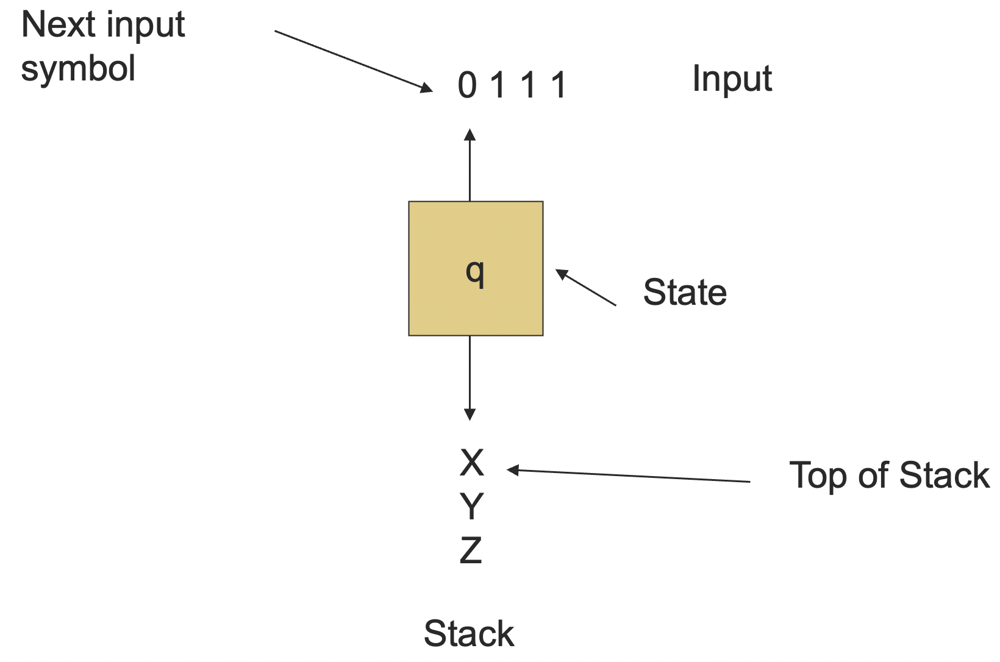

PDA 是非确定性的，也就是说它的下一个移动可以有不止一个选择，在每一个选择中，PDA 可以：

1. 改变状态；
2. 将栈顶元素替换成 0 个或者多个符号。
   - 替换成 0 个符号就相当于是出栈 (pop) 操作；
   - 替换成多个符号就相当于一个出栈 (pop) 加上一系列入栈 (push) 操作。

### 5.1.2 形式化定义

::: definition 定义 5.1
定义一个 **下推自动机 (Pushdown Automata)** 为一个七元组 $P = (Q, \Sigma, \Gamma, \delta, q_0, Z_0, F)$，其中：

- $Q$ 是一个有限的 **状态 (state)** 的集合；
- $\Sigma$ 是一个 **输入字母表 (input alphabet)**；
- $\Gamma$ 一个 **栈字母表 (stack alphabet)**；
- $\delta$ 是一个 **转移函数 (transition function)**；
  - 转移函数接收 3 个参数：
    - 一个状态 $q \in Q$；
    - 一个输入 $a \in \Sigma$ 或者 $a = \varepsilon$；
    - 一个栈符号 $Z \in \Gamma$；
  - $\delta(q, a, Z) = \{(p, \alpha) \mid p \in Q, \alpha \in \Gamma^*\}$，可能是空集；
  - 如果 $(p, \alpha) \in \delta(q, a, Z)$，那么 PDA 可以在状态 $q$，接收输入 $a$，并且观察到栈顶元素为 $Z$ 的时候：
    - 状态变为 $p$；
    - 从输入的首部接收一个字符 $a$，$a$ 可能是 $\varepsilon$；
    - 将栈顶的元素 $Z$ 替换成序列 $\alpha$。
- $q_0$ 是一个 **起始状态 (start state)**，$q_0 \in Q$；
- $Z_0$ 是一个 **起始符号 (start symbol)**，$Z_0 \in \Gamma$；
- $F$ 是一个 **终止状态 (final states)** 的集合，$F \subseteq Q$。

:::

和上一讲类似，为了表示和说明方便，我们引入一下字母使用上的约定，这不是必须的，但本教程会遵守这些约定以尽量表意简明。

- $a, b, c, ...$ 是输入符号；
  - 有时候我们会允许 $\varepsilon$ 作为输入符号；
- $..., X, Y, Z$ 是栈符号；
- $..., w, x, y, z$ 是输入符号形成的字符串；
- $\alpha, \beta, ...$ 是栈符号形成的字符串。

下面我们来设计一个 PDA 去接收语言 $\{0^n1^n \mid n\ge 1\}$。

- 状态：
  - $q$ 是起始状态，表示我们到目前为止只看到了 0；
  - $p$ 表示我们已经至少看到了一个 1，并且只有在后续输入为 1 的时候才会前进；
  - $f$ 是终止状态，表示接受。
- 栈符号：
  - $Z_0$ 是初始符号，也标识了栈的底部，这样我们就知道什么时候我们数到了相等数量的 1 和 0；
  - $X$ 是一个标记符，用于对输入中见到的 0 计数。
- 转移函数：
  - $\delta(q, 0, Z_0) = \{(q, XZ_0)\}$，
  - $\delta(q, 0, X) = \{(q, XX)\}$，
    - 上面两个规则保证了，每当从输入中读到一个 0 的时候，向栈中压入一个 $X$。
  - $\delta(q, 1, X) = \{(p, \varepsilon)\}$，
    - 当我们第一次读到一个 1 的时候，从栈中弹出一个 $X$，并进入状态 $q$。
  - $\delta(p, 1, X) = \{(p, \varepsilon)\}$，
    - 每读到一个新的 1，弹出一个 $X$。
  - $\delta(p, \varepsilon, Z_0) = \{(f, Z_0)\}$，
    - 在栈底接收，此时 1 和 0 的个数相等。

下面是用这个 PDA 接收 000111 的例子：

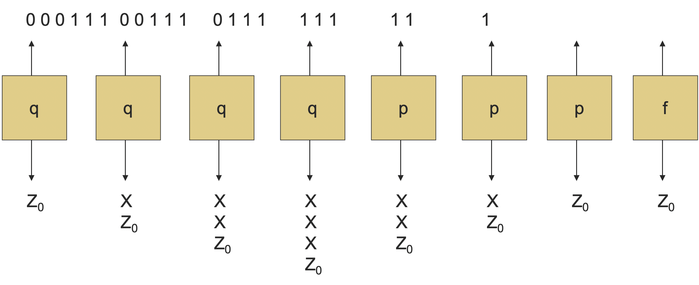

这个 PDA 用状态转换图表示为：

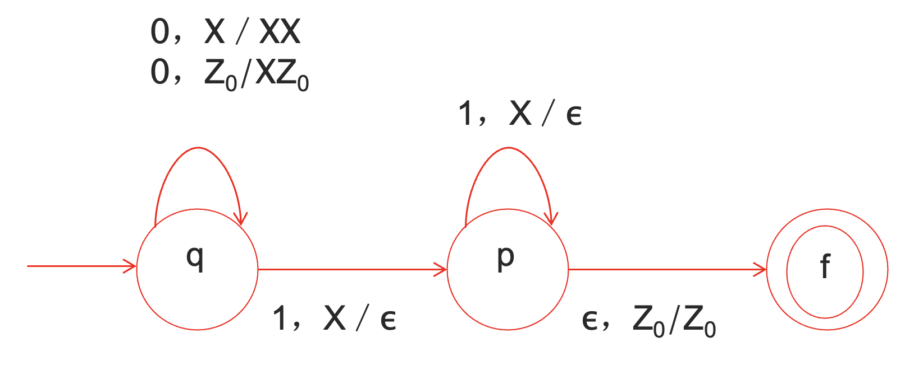

### 5.1.3 PDA 的运行

我们可以将刚刚见到的 PDA 的过程图用即时描述形式化一下。

::: definition 定义 5.2
一个 **即时描述 (Instantaneous Description, ID)** 是一个三元组 $(q, w, \alpha)$，其中：

1. $q$ 是当前状态；
2. $w$ 是剩余的输入；
3. $\alpha$ 是栈的内容，左侧为栈顶。

:::

如果 ID $I$ 可以通过 PDA 的一步移动变成 ID $J$，我们写作 $I \vdash J$。

::: definition 定义 5.3

定义 **走向 (Goes-To)** 关系：

$$
(\forall w, \alpha, (q, aw, X\alpha) \vdash (p, w, \beta\alpha)) \Leftrightarrow (p, \beta) \in \delta(q, a, X)
$$

将 $\vdash$ 扩展到 $\vdash^*$，表示 0 或多次，满足

- 基础情况：$I \vdash^* I$；
- 归纳情况：若 $I \vdash^* J$ 且 $J \vdash K$，则 $I \vdash^* K$。

:::

沿用上面 000111 的例子，我们可以将 PDA 的变化过程图方便地写成如下的 ID 走向序列：

$$
(q, 000111, Z_0) \vdash (q, 00111, XZ_0) \vdash (q, 0111, XXZ_0) \vdash (q, 111, XXXZ_0)\\
\vdash (p, 11, XXZ_0) \vdash (p, 1, XZ_0) \vdash (p, \varepsilon, Z_0) \vdash (f, \varepsilon, Z_0)
$$

那如果输入是 0001111 呢？

$$
(q, 000111, Z_0) \vdash (q, 00111, XZ_0) \vdash (q, 0111, XXZ_0) \vdash (q, 111, XXXZ_0)\\
\vdash (p, 11, XXZ_0) \vdash (p, 1, XZ_0) \vdash (p, 1, Z_0) \vdash (f, 1, Z_0)
$$

注意到 ID 没有办法再移动了，也就是说输入并没有被完全消耗完，因此 0001111 不被接受。

其实，和 DFA 一样，这里有一个隐藏的死状态（dead state），转移函数是一个全函数，我们定义其一部分，未定义的情况都默认走入死状态。

::: theorem 定理 5.1
给定 PDA $P$，如果 $(q, x, \alpha) \vdash^* (p, y, \beta)$，则 $\forall w \in \Sigma^*, \gamma \in \Gamma^*$，有 $(q, xw, \alpha\gamma)\vdash^*(p, yw, \beta\gamma)$。
:::

这个定理很容易理解，增加后缀字符串和增加部分栈底元素是不会影响中间的走向序列的。

不过这个定理反之亦然么？答案是不是的。我们可以增加相同的部分栈底元素，这没什么影响。

但不能删除相同的部分栈底元素，因为有可能这部分栈底元素是先被弹出又被压入的。虽然从结果上来看是没关系的，但是如果把这些栈底元素去掉了，在过程中，弹出这些栈底元素的步骤就会走入死状态，从而破坏了等价性。

不过字符串的相同后缀并没有这个问题就是了。

::: theorem 定理 5.2
给定 PDA $P$，若 $(q, xw, \alpha) \vdash^* (p, yw, \beta)$，则有 $(q, x, \alpha) \vdash^* (p, y, \beta)$。
:::

### 5.1.4 PDA 的语言

定义 PDA 的语言的一种通常的方式是根据 **终止状态 (final state)**。

::: definition 定义 5.4
若 $P$ 是一个 PDA，定义

$$
L(P) = \{w \mid \exists \alpha\in\Gamma^*, f\in F, (q_0, w, Z_0) \vdash^* (f, \varepsilon, \alpha)\}
$$

:::

另一种定义 PDA 的语言的方式是根据 **空栈 (empty stack)**。

::: definition 定义 5.5
若 $P$ 是一个 PDA，定义

$$
N(P) = \{w \mid \exists q \in Q, (q_0, w, Z_0) \vdash^* (q, \varepsilon, \varepsilon)\}
$$

:::

::: theorem 定理 5.3
$L(P)$ 与 $N(P)$ 在定义语言的能力上是等价的。
:::

这两种语言的定义在表达能力上是等价的：

1. 若 $L = L(P)$，则存在另一个 PDA $P'$ 使得 $L = N(P')$。
2. 若 $L = N(P)$，则存在另一个 PDA $P''$ 使得 $L = L(P'')$。

先证 $L(P)$ 能推出 $N(P')$。

直观的想法是 $P'$ 会模拟 $P$，如果 $P$ 接收，则 $P'$ 会清空它的栈。$P'$ 必须避免意外地清空自己的栈，所以它需要一个特殊的栈底标记来捕捉那种 $P$ 清空了自己的栈但是并没有接受的情况。

构造 $P'$ 用于和 $P$ 同样的状态、符号和转移，再加上：

1. 栈符号 $X_0$ （$P'$ 的起始符号），用来保卫栈底；
2. 新的起始状态 $s$ 和擦除 (erase) 状态 $e$；
3. $\delta(s, \varepsilon, X_0) = \{(q_0, Z_0X_0)\}$，用于启动 $P$；
4. 对于 $P$ 的任意终止状态 $f$，将 $(e, \varepsilon)$ 添加到 $\delta(f, \varepsilon, X)$ 中去，其中 $X$ 是任意的栈符号，包括 $X_0$。
5. 对于任意 $X$，$\delta(e, \varepsilon, X) = \{(e, \varepsilon)\}$。

这里新增加的 $X_0$ 就是用来保护原本 $P$ 可能在过程中空栈的情况，中间过程都不变，增加转移，让原本的终止状态能够走到新的空栈状态中去。

图示如下：

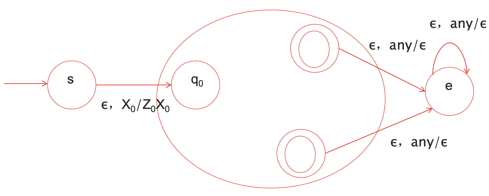

再证 $N(P)$ 可以推出 $L(P'')$。

直观的想法是 $P''$ 模拟 $P$，不过 $P''$ 有一种特殊的底部标记用来捕捉 $P$ 空栈的情况，然后把这种情况设置为接受状态。

构造 $P''$ 拥有和 $P$ 相同的状态、符号和转移，加上：

1. 栈符号 $X_0$ （起始符号），用于保护栈底；
2. 新的起始状态 $s$ 和终止状态 $f$；
3. $\delta(s, \varepsilon, X_0) = \{(q_0, Z_0X_0)\}$，用于启动 $P$；
4. 对于 $P$ 中的任意状态 $q$，$\delta(q, \varepsilon, X_0) = \{(f, \varepsilon)\}$。

再一次强调，这里新增 $X_0$ 的作用，和之前一样，都是为了保护栈底，辅助判断。

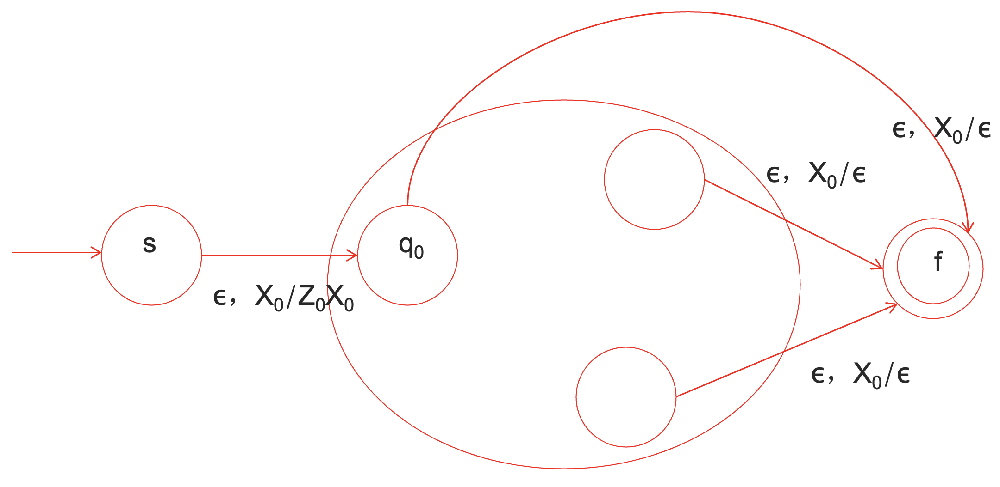

下面看一个例子，设计一个 PDA，能够处理 `if-else` 语句，当 `else` 的数量超过前缀 `if` 的数量时停止。

$N(P)$ 的版本：

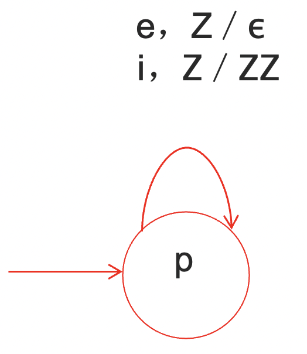

$L(P)$ 的版本：

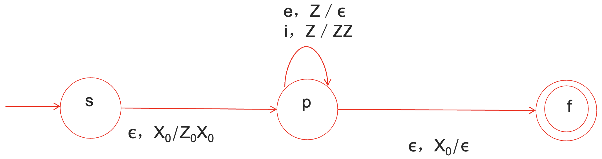

### 5.1.5 确定性下推自动机与非确定性下推自动机

我们上面所讨论的下推自动机都是 **非确定性下推自动机 (Nondeterminstic Pushdown Automata, NPDA)**，习惯上，当我们不加定语地说下推自动机的时候，指的都是非确定性下推自动机。

下面我们来看一看 **确定性下推自动机 (Determinstic Pushdown Automata, DPDA)**。为了变得确定，对于任意状态 $q$，输入符号 $a$ 以及栈符号 $X$，最多只有一种移动的选择。

此外，在使用 $\varepsilon$ 和实际选择之间，不应当存在选择关系。形式化表述，就是 $\delta(q, a, X)$ 和 $\delta(q, \varepsilon, X)$ 不可以同时非空。

与 NFA 和 DFA 等价不同的是，NPDA 要比 DPDA 在表达能力上更强一些。

考虑回文串 $WW^R$。假设存在这样的一个 DPDA，当输入走到 $0^m110^m$ 的时候，由于我们需要确保这个字符串在 11 之后有和之前相同个数的 0，DPDA 的栈必须是空的。

假设在此之后，我们又遇到了输入 $0^n110^n$，

- 如果 $n = m$，我们应该接受它；
- 如果 $n \ne m$，我们应该拒绝它。

但是，之前的栈已经清空了，也就是 $m$ 的信息已经被忘记了，我们怎么可能判断 $n$ 和 $m$ 是否相等呢？

不过 $wcw^R$ 是可以用 DPDA 表示的，我们只需要在没遇到 $c$ 的时候压栈，在遇到 $c$ 之后弹栈即可。

::: theorem 定理 5.4
如果 $L$ 是一个正则语言，存在一个 DPDA $P$，使得 $L = L(P)$。
:::

这个定理非常直观，因为 DPDA 本质上其实就是一个 DFA 加上一个栈，我们不使用这个栈，不就是一个 DFA 了嘛。

之前，DPDA 是通过终止状态定义的，如果用空栈呢？在 DFFA 中，$L(P)$ 和 $N(P)$ 并不是等价的。考虑 $\{0\}^*$ 这个语言，能够用 $L(P)$ 表示，因为是正则语言，但并不能用 $N(P)$ 表示。

因此，正则语言可以用 DPDA( $L(P)$ ) 表示，进而可以用 $NPDA$ 表示；但是正则语言不一定能用 $DPDA(N(P))$ 表示，不过 DPDA( $N(P)$ ) 可以用 DPDA( $L(P)$ ) 表示，证明过程和之前 PDA 的证法是一样的。

给定一个用终止状态定义的 DPDA $P$，$L = L(P)$，则 $L$ 有一个不歧义的文法。

不过，不歧义的文法不一定非得能够用一个 DPDA 来表示。

考虑 $ww^R$，$S \to 0S0 \mid 1S1 \mid \varepsilon$ 这个文法是无歧义的，但并不能用 DPDA 来表示（原因在之前已经讲过了）。

## 5.2 下推自动机与上下文无关文法的等价性

### 5.2.1 概述

我们已经讨论了正则语言的闭包性质，能够在正则表达式和有穷自动机的表达方式之间来回横跳是一件很有用的事情。类似的，上下文无关文法和下推自动机这两种表示方法对于我们后续讨论上下文无关语言的性质都很有用。

并且，由于 PDA 是具有算法性质的，通常通过构造 PDA 来论述一个语言是上下文无关语言会更容易。

比如说，看出一个 PDA 能够接受平衡括号是容易的，但是文法就不是那么容易看出来了，因为文法的推导自由度太大了。

::: theorem 定理 5.5
CFG 和 PDA 在定义语言的表达能力上是等价的。
:::

要论证 PDA 和 CFG 的表达能力等价，我们只需要论证既能够将一个 CFG 转化成 PDA，又能够将一个 PDA 转化成 CFG 就可以了。

### 5.2.2 CFG 转化成 PDA

对于 CFG $G$，令 $L = L(G)$，构造 PDA $P$ 使得 $N(P) = L$。

其中，$P$ 有：

- 一个状态 $q$；
- 输入符号是 $G$ 的终结符；
- 栈符号是 $G$ 中的所有符号；
- 起始符号是 $G$ 的起始符号。

直觉上，$P$ 的每一步应该代表某个 **左句型 (Left-Sentential Form, LSF)**，即最左推导中的一步。

如果 $P$ 的栈是 $\alpha$ 且 $P$ 到目前为止消耗了输入中的 $x$，那么此刻的 $P$ 应该代表左句型 $x\alpha$。

这样的话，到达空栈的时候，被消耗的输入就是 $L(G)$ 中的一个字符串了。

具体地，$P$ 的转移函数如下：

1. $\delta(q, a, a) = \{(q, \varepsilon)\}$
   - 这个步骤并没有改变 $P$ 表示的左句型，但是将提供 $a$ 的责任从栈转移到输入上了。
2. 如果 $A \to \alpha$ 是 $G$ 的一个产生式，则 $(q, \alpha) \in \delta(q, \varepsilon, A)$
   - 猜测即将使用的 $A$ 的一个产生式，并且表示推导中的下一个左句型。

下面证明 $N(P) = L(G)$。

我们先证明

$$
\forall x, (q, wx, S) \vdash^* (q, x, \alpha) \Leftrightarrow S \Rightarrow^*_{lm} w\alpha
$$

先证充分性。对 $P$ 使用的步骤数进行归纳。

基础情况：0 步，则 $\alpha = S, w = \varepsilon$，并且 $S \Rightarrow^*_{lm}S$ 永真。

归纳：考虑 $P$ 的 $n$ 次移动，$P: (q, wx, S) \vdash^* (q, x, \alpha)$，并且假设结论对于 $n - 1$ 次移动的情况都成立。

有两种情况需要考虑，取决于最后一次移动是用的第一条规则还是第二条规则。

- 如果使用第一条规则，则移动序列一定形如 $(q, yax, S) \vdash^* (q, ax, a\alpha) \vdash (q, x, \alpha)$，其中 $ya = w$。
  - 根据归纳假设，对于前 $n - 1$ 步，有 $S \Rightarrow^*_{lm} ya\alpha$，而 $ya = w$，则 $S \Rightarrow^*_{lm}w\alpha$。
- 如果使用第二条规则，则移动序列一定形如 $(q, wx, S) \vdash^* (q, x, A\beta) \vdash (q, x, \gamma\beta)$，其中 $A \to \gamma$ 是一个产生式，且 $\gamma\beta = \alpha$。
  - 根据归纳假设，对于前 $n - 1$ 步，有 $S \Rightarrow^*_{lm}wA\beta$，又 $A\to \gamma$，从而 $S \Rightarrow^*_{lm} w\gamma\beta = w\alpha$。

再证必要性，对最左推导中的步骤数进行归纳，想法是类似的，这里就不再重复了。

现在，我们已经有了对于任意的 $x$，$(q, wx, S) \vdash^* (q, x, \alpha)$ 当且仅当 $S \Rightarrow^*_{lm} w\alpha$。

特别地，令 $x = \alpha = \varepsilon$，那么 $(q, w, S) \vdash^* (q, \varepsilon, \varepsilon)$ 当且仅当 $S\Rightarrow^*_{lm} w$，也就是说 $w \in N(P)$ 当且仅当 $w\in L(G)$，即 $N(P) = L(G)$。

### 5.2.3 PDA 转化成 CFG

现在，假设 $L = N(P)$，我们下面将会构造一个上下文无关文法 $G$ 使得 $L = L(G)$。

直观来讲，$G$ 当中会存在变量 $[pXq]$ 用于产生一系列输入，这些输入能够使得 $P$ 从状态 $p$ 开始，弹出栈符号 $X$，然后转到状态 $q$。

- $P$ 在这个过程中栈顶不会走到 $X$ 下面。

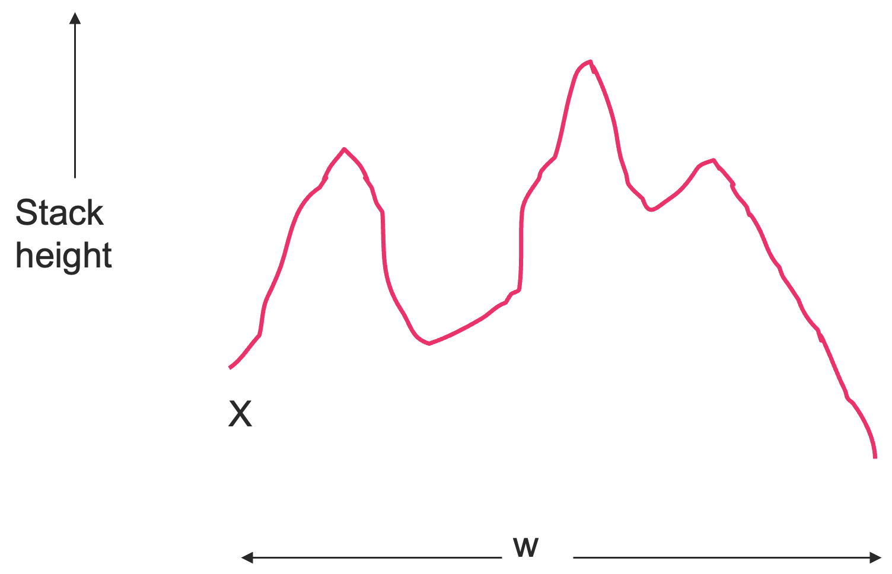

下面进行形式化的构造。

$G$ 中的变量都形如 $[pXq]$，这个变量产生且仅产生使得 $(p, w, X) \vdash^* (q,\varepsilon, \varepsilon)$ 的字符串。再次之外还有一个起始符号，我们将之后讨论。

对于 $[pXq]$ 的每一个产生式都来源于 $P$ 中在状态 $p$ 栈顶元素 $X$ 的情况下的移动情况。

最简单的情况：$(q, \varepsilon) \in \delta(p, a, X)$。

- 注意，$a$ 可以是一个输入符号，也可能是 $\varepsilon$。

这样的话，对应的产生式就是 $[pXq] \to a$。这里，$[pXq]$ 产生 $a$，因为读取 $a$ 是弹出 $X$ 并从 $p$ 走到 $q$ 的一种方式。

下一种最简单的情况：对于某个状态 $r$ 和符号 $Y$，$(r, Y) \in \delta(p, a, X)$。

在这种情况下，$G$ 有产生式 $[pXq] \to a[rYq]$。

- 我们可以我们可以擦除 $X$ 并从 $p$ 走到 $q$，通过先读一个 $a$，进入状态 $r$ 且用 $Y$ 代替 $X$，然后再读取某个字符串 $w$，让 $P$ 从 $r$ 走到 $q$，并移除 $Y$。

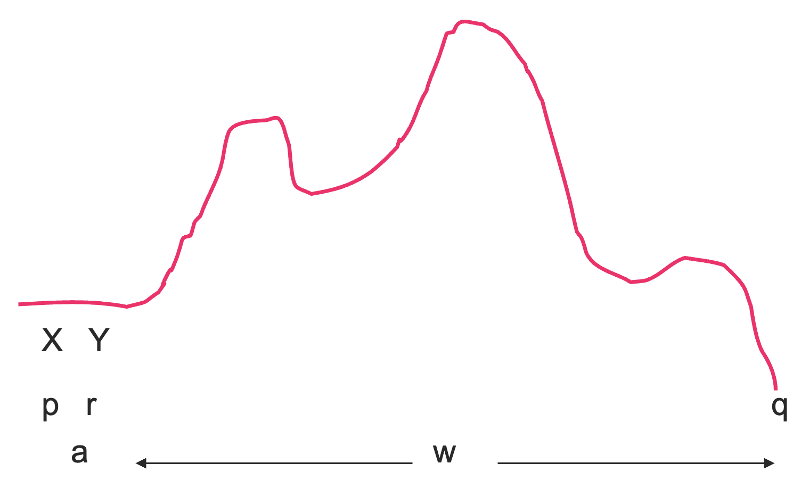

第三种最简单的情况是：对于某个状态 $r$ 和符号 $Y, Z$，有 $(r, YZ) \in \delta(p, a, X)$。

现在，$P$ 用 $YZ$ 代替了 $X$，为了删除 $X$，$P$ 需要先删除 $Y$，从状态 $r$ 走到某个状态 $s$，然后删除 $Z$，从状态 $s$ 走到状态 $q$。

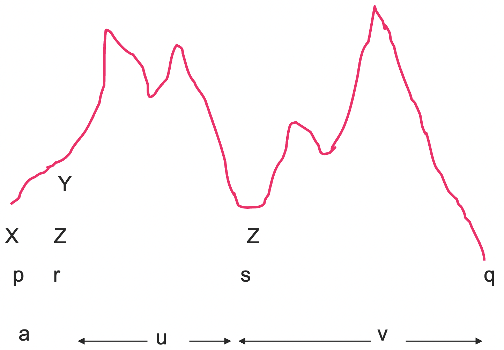

由于我们并不知道中间状态 $s$ 到底是什么（非确定性），我们必须对每一种可能的状态 $s$，生成一个产生式 $[pXq] \to a[rYs][sZq]$。

这样，$[pXq] \Rightarrow^* auv$ 其中 $[rYs] \Rightarrow^* u$ 且 $[sZq] \Rightarrow^* v$。

经过了三个简单情况的讨论，我们可以总结一下一般的情况了。

假设对于某个状态 $r$ 以及 $k\ge 3$，存在 $(r, Y_1Y_2...Y_k) \in \delta(p, a, X)$，生成

$$
[pXq] \to a[rY_1s_1][s_1Y_2s_2]...[s_{k-2}Y_{k-1}s_{k-1}][s_{k-1}Y_kq]
$$

最后我们来完成一下整个构造。我们可以证明 $(q_0, w, Z_0) \vdash^* (p, \varepsilon, \varepsilon)$ 当且仅当 $[q_0Z_0p]\Rightarrow^* w$。

- 证明方法是两个简单的归纳，这里就不再证了。

不过，状态 $p$ 可以是任何一个状态，因为我们求的是 $N(P)$。

最后，在 $G$ 中加入另一个变量 $S$，作为起始符号，并且对每一个状态 $p$，添加产生式 $S \to [q_0Z_0p]$。

最后，我们再回忆一下之前的那个例子，设计一个 PDA，能够处理 `if-else` 语句，在 `else` 超过 `if` 的时候停下来。

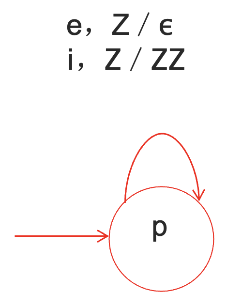

用上面的方法，我们可以设计产生式如下：

$$
S \to [pZp], [pZp] \to e, [pZp] \to i[pZp][pZp]
$$

化简后即是 $S \to e \mid iSS$。
