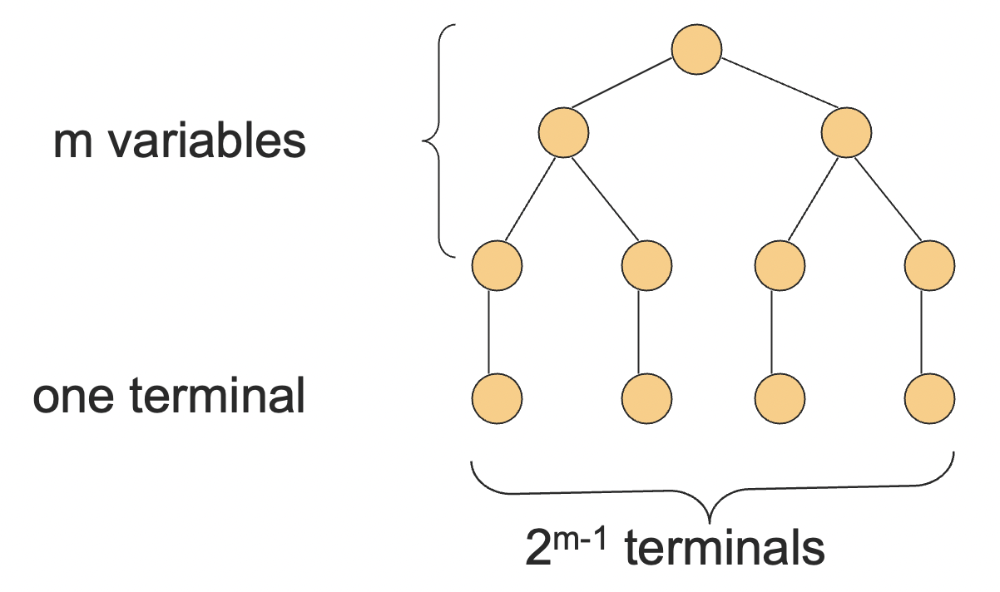
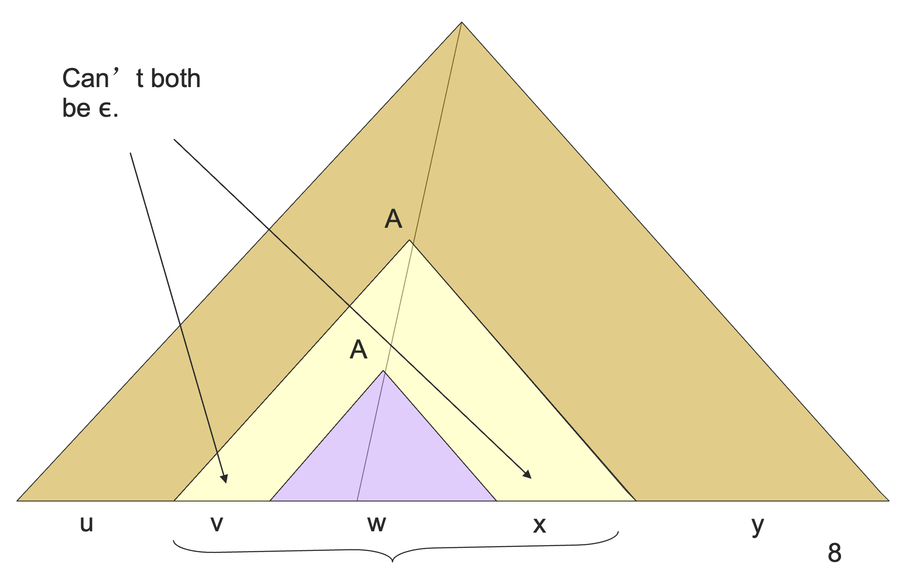
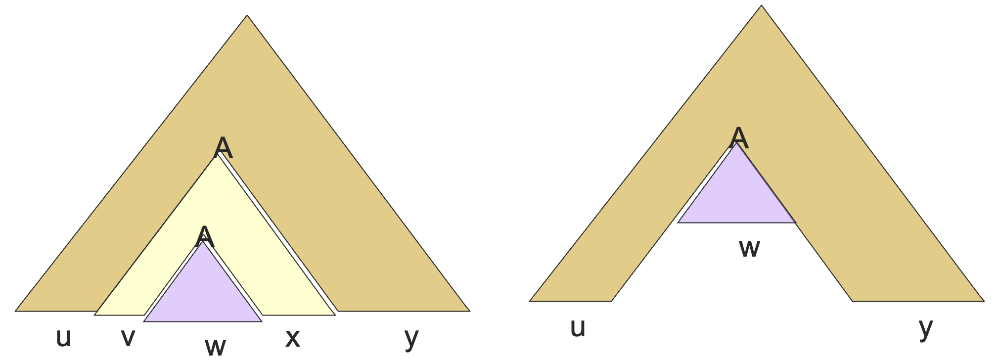
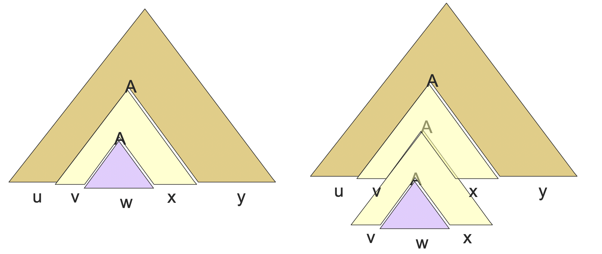
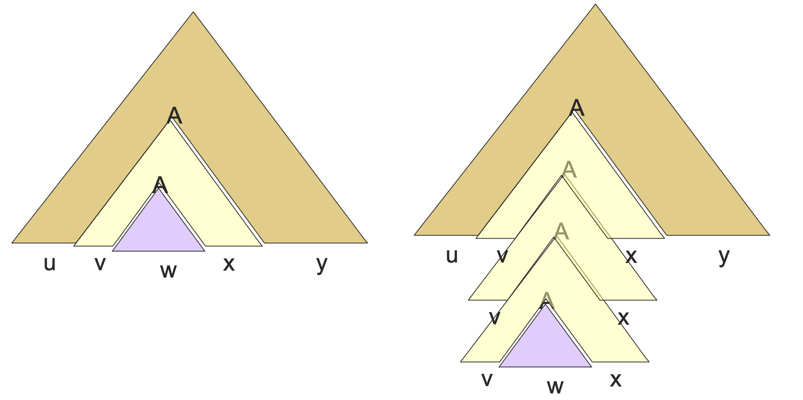
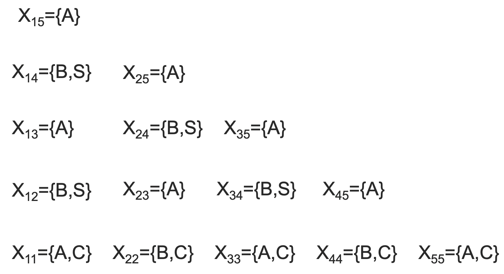
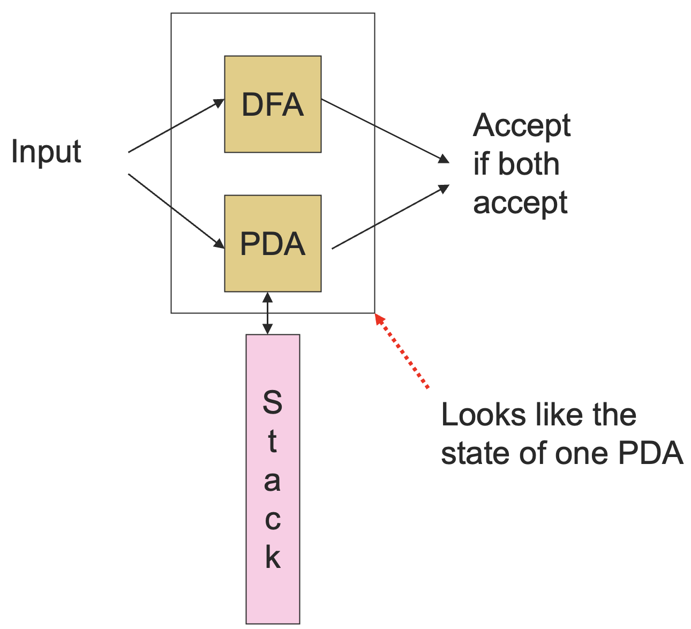
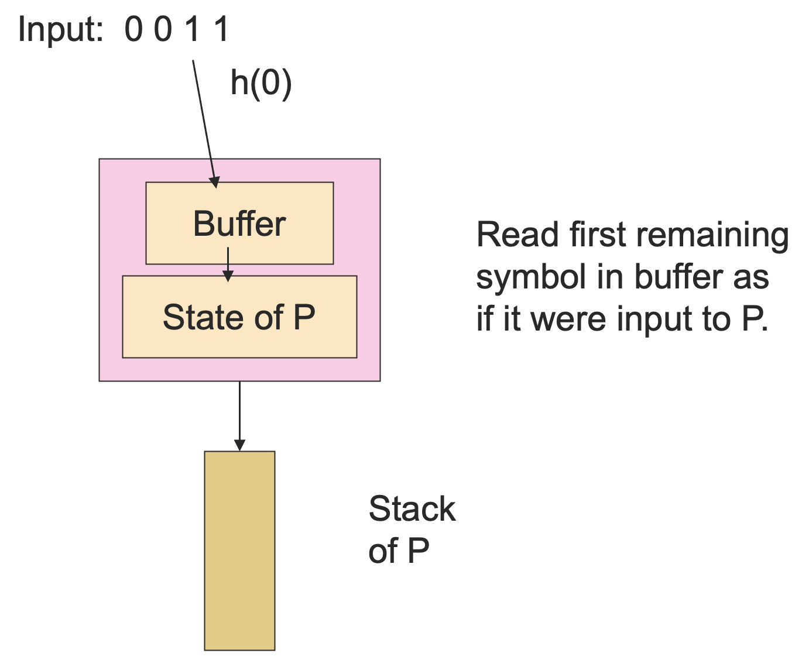

# 6 上下文无关语言

## 6.1 上下文无关语言的泵引理

### 6.1.1 直观感受

回忆一下正则语言的泵引理，他告诉我们，如果存在某个字符串，它足够长，长到在这个语言的 DFA 中导致了一个环，那么我们就可以将这个环泵进泵出，从而找到一个属于这个语言的无穷的字符串序列。

对于上下文无关语言来说，情况会稍微有些复杂。

我们总是能够找到一个足够长的字符串的 **两个** 部分，将它们泵进泵出。也就是说，如果我们将这个字符串中的这两个部分任意地重复相同的次数，就可以得到依旧在这个语言当中的另外的字符串。

### 6.1.2 形式化描述

下面，我们给出 **上下文无关语言的泵引理 (CFL Pumping Lemma)** 的形式化描述：

::: theorem 定理 6.1
对于每一个上下文无关语言 $L$，存在一个整数 $n$，使得 $\forall z \in L, |z| \ge n$，$\exists z = uvwxy$，满足：

- $|vwx| \le n$；
- $|vx| > 0$；
- $\forall i \ge 0, uv^iwx^iy \in L$。

:::

这个引理的证明就要用到上下文无关文法的乔姆斯基范式 (CNF) 了。

考虑 $L - \{\varepsilon\}$ 的 CNF 一个文法，令这个文法有 $m$ 个不同的变量，取 $n = 2^m$。

取 $z \in L \wedge |z| \ge n$，有 **引理 1**：产出 $z$ 的解析树一定存在一条长度至少为 $m + 2$ 的路径。

先证引理 1：反证法。如果一个 CNF 文法的解析树的所有路径长度都 $\le m + 1$ 的话，那么这个解析树能够产生的字符串的长度最长也不过 $2^{m - 1}$，就像：

因为 CNF 的解析树是一个二叉树，而高度不超过 $m - 1$ 的二叉树最多有 $2^{m - 1}$ 个叶子结点，每个叶子结点后续最多产生一个终结符，因此产生的字符串长度最多为 $2 ^ {m - 1}$，这与 $|z| = n = 2^{m}$ 是矛盾的。

引理 1 证完了，我们回到泵引理的证明。现在，我们知道了 $z$ 的解析树存在一条路径，上面有至少 $m + 1$ 个变量。（因为再加上一个终结符，长度至少为 $m + 2$ ）。

考虑某条最长的路径，由于只存在 $m$ 个不同的变量，所以在低 $m + 1$ 个非叶结点中，根据鸽笼原理，我们能够找到两个结点，它们标记的是同一个变量，不妨记为 $A$，则解析树形如：

其中，$|vw| \ne 0$，因为它们不能同时为空，这是由 CNF 文法中不含空产生式所决定的。

且 $|vwx| \le 2^m = n$，因为我们只选取了最长的路径的低 $m + 1$ 个非叶结点，即这颗子树的树高最多为 $m + 1$，从而产出的字符串最多为叶子结点的最大个数 $2 ^ m$。

有了这颗树之后，泵引理的结论就很明显了。泵 0 次的结果如下：

泵 2 次的结果如下：

泵 3 次的结果如下：

这些情况都在原语言中，因为我们能够找到一棵对应的合法的解析树。造成这些解析树不同的原因就是当遇到变量 $A$ 的时候，我们可以有两条候选的推导方式使用，一条是 $A \Rightarrow^* vAx$，一条是 $A \Rightarrow^* w$。

### 6.1.3 泵引理的使用

$\{0^i10^i \mid i\ge 1\}$ 是一个上下文无关语言，因为我们可以数两样东西（这是刚接触上下文无关文法的时候讲过的一个直觉，当然，你也可以直接通过给出文法来证明它是上下文无关语言）。

但是 $L = \{0^i10^i10^i \mid i\ge 1\}$ 不是上下文无关语言，因为我们不能同时做两对计数，也就是说不能同时数三件东西。不过这只是一个直觉，不能够用作证明。

我们可以通过泵引理来证明。假设 $L$ 是一个上下文无关语言，令 $n$ 是 $L$ 的泵引理常数。

考虑 $z = 0^n10^n10^n$，我们可以写作 $z = uvwxy$，其中 $|vwx| \le n$ 且 $|vx| \ge 1$。

第一种情况：$vx$ 中没有 $0$。

- 它们之中至少有一个是 $1$，从而 $uwy$ 中之多有一个 $1$，这是不可能的，因为这样 $vx$ 就无法泵进泵出了。

第二种情况：$vx$ 至少有一个 $0$。

- $vwx$ 的长度太短了（ $\le n$ ），从而无法覆盖 $0^n10^n10^n$ 中所有的三个 $0$ 字串。
- 于是，$uwy$ 中至少有一个 $0^n$ 子串 （没有被 $vwx$ 覆盖到），以及至少一个 $0$ 字串不足 $n$ 个 $0$ （因为 $vx$ 删去而被丢掉了）。
- 从而，$uwy \notin L$。

## 6.2 上下文无关语言的判定性质

### 6.2.1 判定性质概述

如常，当我们讨论一个上下文无关语言的时候，我们其实是在说这个语言的一种表示，比如说一个上下文无关文法，或者说一个根据终止状态或空栈接收语言的下推自动机。

存在一些算法来判定：

1. 字符串 $w$ 是否在上下文无关语言 $L$ 中；
2. 上下文无关语言 $L$ 是否为空；
3. 上下文无关语言 $L$ 是否无限。

不过，也有很多的问题，在正则语言中可以判定，但是上下文无关语言却不可以。

比如说：两个上下文无关语言是否相同？两个上下文无关语言是否不想交？

对于正则语言，我们可以用乘积自动机来判定，但是上下文无关语言并没有很好的手段。

不过，为了证明不存在这样的算法，需要一些图灵机和判定醒的理论，这里就不详细展开了。

### 6.2.2 判断是否为空

我们其实已经做过这件事情（test emptiness）了，之前学习上下文无关文法的时候，我们学过去除无用变量的算法。

如果起始符号是一个无用变量，那么这个上下文无关语言为空，否则不为空。

### 6.2.3 判断字符串是否属于语言

我们想要知道字符串 $w$ 是否在上下文无关文法 $G$ 描述的上下文无关语言 $L$ 中。

假设 $G$ 是 CNF 形式，否则将给定的文法转化成 CNF 形式，其中 $w = \varepsilon$ 是一个特殊情况，可以通过判断起始符号是否可空来解决（这一点其实之前将上下文无关文法的化简时候已经讲过了，这里不再赘述）。

**CYK 算法** 是一个很好的动态规划的例子，并且可以在 $O(n^3)$ 的时间内判断是否属于 (test membership)，其中 $n = |w|$。

CYK 算法：令 $w = a_1a_2...a_n$，我们将会构造一个 $n\times n$ 的三角形的变量阵列：

$$
X_{ij} = \{A \mid A \Rightarrow^{*} a_ia_{i+1}...a_j\}
$$

对 $j - i + 1$，即产生的字符串的长度进行归纳。

最终，判断 $S$ 是否在 $X_{1n}$ 中即可。

基础情况：$X_{ii} = \{A \mid A \to a_{i} \in P\}$

归纳：$X_{ij} = \{A \mid A \to BC \in P \wedge (\exists i \le k < j, B \in X_{ik} \wedge C \in X_{k+1, j})\}$。

比如说对于文法 $S \to AB, A\to BC \mid a, B\to AC \mid b, C\to a \mid b$，判断 $w = ababa$ 是否在这个文法描述的语言中。

算法过程如下：

最后我们发现，$S \notin X_{15}$，从而该字符串并不在这个文法所描述的语言中。

### 6.2.4 判断是否无穷

判断无穷性 (test infiniteness) 的想法和正则语言本质上是类似的，使用泵引理常数 $n$，如果该语言存在一个长度在 $n$ 到 $2n - 1$ 之间的字符串，那么这个语言就是无穷的，否则就是有穷的。

## 6.3 上下文无关语言的闭包性质

上下文无关语言在并集、拼接和星闭包下都是封闭的。并且在反转、同态和逆同态下也是封闭的。但在交集和差集操作下并不封闭。

### 6.3.1 并集下的闭包性质

令 $L$ 和 $M$ 分别是上下问无关文法 $G$ 和 $H$ 下的上下文无关语言。不妨设 $G$ 和 $H$ 没有共同的变量（变量的名字不改变语言，可以通过重命名的方式做到没有共同的变量这一点）。令 $S_1$ 和 $S_2$ 分别是 $G$ 和 $H$ 的起始符号。

基于 $G$ 和 $H$ 的产生式集合与符号集合来构建 $L \cup M$ 的文法，增加一个新的起始符号 $S$，增加一个新的产生式 $S \to S_1 \mid S_2$ 即可。

在新的文法中，所有的推导都是从 $S$ 开始的，因此第一步总是将 $S$ 用 $S_1$ 或者 $S_2$ 替代。在第一种情况中，结果一定是 $L(G) = L$ 中的一个字符串，第二种情况中，结果一定是 $L(H) = M$ 中的一个字符串，从而新文法产生的语言是原来语言的并集。

### 6.3.2 拼接下的闭包性质

还是令 $L$ 和 $M$ 分别是上下问无关文法 $G$ 和 $H$ 下的上下文无关语言。不妨设 $G$ 和 $H$ 没有共同的变量（变量的名字不改变语言，可以通过重命名的方式做到没有共同的变量这一点）。令 $S_1$ 和 $S_2$ 分别是 $G$ 和 $H$ 的起始符号。

基于 $G$ 和 $H$ 的产生式集合与符号集合来构建 $L \cup M$ 的文法，增加一个新的起始符号 $S$，增加一个新的产生式 $S \to S_1S_2$。

这样的话，每一个从 $S$ 开始的推导都会得出一个 $L$ 中的字符串接着一个 $M$ 中的字符串。

### 6.3.3 星闭包下的闭包性质

令上下文无关语言 $L$ 具有文法 $G$ 和起始符号 $S_1$，通过给 $G$ 引入新的起始变量 $S$ 以及产生式 $S \to S_1S \mid \varepsilon$ 的方式构建 $L^*$ 的文法。

一个从 $S$ 开始的最右推导会产生一个由 $0$ 个或者多个 $S_1$ 构成的句型，每个 $S_1$ 都可以产生 $L$ 中的某个字符串，从而能够导出 $L^*$。

### 6.3.4 翻转操作下的闭包性质

如果 $L$ 是一个具有文法 $G$ 的上下文无关语言，通过翻转每一个产生式体的方式来构造 $L^R$ 的文法。

比如说令 $G$ 有 $S \to 0S1 \mid 01$，则 $L(G)^R$ 有 $S \to 1S0 \mid 10$。

### 6.3.5 同态操作下的闭包性质

令 $L$ 是一个具有文法 $G$ 的上下文无关语言，令 $h$ 是一个在 $G$ 的终结符上的同态。通过将每个终结符 $a$ 替换成 $h(a)$ 的方式为 $h(L)$ 构造一个文法。

比如说 $G$ 有产生式 $S \to 0S1 \mid 01$，$h$ 定义为 $h(0) = ab, h(1) = \varepsilon$，则 $h(L(G))$ 的文法具有产生式 $S \to abS \mid ab$。

### 6.3.6 交集与差集

和正则语言不同的是，上下文无关语言类在交集操作下并不封闭。我们知道，$L_1 = \{0^n1^n2^n \mid n\ge 1\}$ 不是一个上下文无关语言（可以通过泵引理证明）。

然而 $L_2 = \{0^n1^n2^i \mid n\ge 1, i\ge 1\}$ 是（构造文法证明：$S \to AB, A\to 0A1 \mid 01, B \to 2B \mid 2$ ）。

同理，$L_3 = \{0^i1^n2^n \mid n\ge 1, i\ge 1\}$ 也是，但 $L_1 = L_2 \cap L_3$ 并不是。

我们其实可以证明一个更一般的结论：任何在差集下封闭的语言，在交集下也封闭。

证明：$L \cap M = L - (L - M)$。

于是，上下文无关文法在差集下也不封闭了。（否则和它在交集下不封闭就矛盾了）

不过，一个上下文无关语言和一个正则语言相交依旧是一个上下文无关语言。虽然这并不能称作一个闭包性质，但也很不错了。

这个性质的证明过程包含了将一个 DFA 和一个 PDA 同时运行，它们组合起来依旧是 PDA。这里 PDA 是根据终止状态接收的。

形式化构造：

令 DFA $A$ 的转移函数为 $\delta_A$，PDA $P$ 的转移方程为 $\delta_P$。组合起来的 PDA 的状态形如 $[q, p]$，其中 $q$ 是一个 $A$ 的状态，$p$ 是一个 $P$ 的状态。

$$
([\delta_A(q, a), r], \alpha) \in \delta([q, p], a, X) \Leftrightarrow (r, \alpha) \in \delta_P(p, a, X)
$$

其实和之前的乘积自动机类似，只不过增加了一个栈而已。需要注意的是这里 $a$ 可以是 $\varepsilon$，在这种情况下 $\delta_A(q, a) = q$。

组合起来的 PDA 的终止状态形如 $[q, p]$，满足 $q$ 是 $A$ 的一个终止状态，$p$ 是 $P$ 的一个接收状态。

初始状态是由两个初始状态组成的 $[q_0, p_0]$。

简单归纳便可得到：

$$
([q_0, p_0], w, Z_0) \vdash^* ([q, p], \varepsilon, \alpha) \Leftrightarrow \delta_A(q_0, w) = q \wedge (p_0, w, Z_0) \vdash^* (p, \varepsilon, \alpha)
$$

从而证明新的到的 PDA 所推导的语言是之前的 DFA 和 PDA 所推导语言的交集。

### 6.3.7 逆同态下的闭包性质

先回忆一下逆同态是什么，令 $h$ 是一个同态，$L$ 是一个字母表为 $h$ 的输出语言的语言，则 $h^{-1}(L) = \{w \mid h(w) \in L\}$。

比如说令 $h(0) = ab, h(1) = \varepsilon$，$L = \{abab, baba\}$，则 $h^{-1}(L) = L(1^*01^*01^*)$。

当时，我们是通过构造 DFA 的方式来证明正则语言的该性质的，因为逆同态有些特殊，是字符串映射成字符，不是字符映射成字符串，所以使用正则表达式不太方便。

这里也是类似的，我们不使用上下文无关文法，而是通过构造新的 PDA 的方式来证明这个性质。

令 $L = L(P)$ 是由某个 PDA $P$ 所定义的语言，下面构建 PDA $P'$ 接收 $h^{-1}(L)$。

$P'$ 整体上是模拟 $P$ 的，不过维护了一个用于存放 $h$ 的结果字符串的缓冲区作为它状态的一部分。

可以通过缓冲区将原本接收一个字符串模拟成接收一个字符。

$P'$ 的形式化构造：

- 状态形如 $[q, w]$，其中：
  1. $q$ 是 $P$ 的一个状态；
  2. $w$ 是对于某个 $h(a)$ 的后缀，$a$ 是 $h$ 定义域中的某个元素。
     - 这样的话，$w$ 只会有有限个可能的值。
- $P'$ 的栈符号还是原来 $P$ 的栈符号。
- $P'$ 的起始状态是 $[q_0, \varepsilon]$。
- $P'$ 的输入符号是 $h$ 可作用于的符号，
- $P'$ 的终止状态形如 $[q, \varepsilon]$，其中 $q$ 是 $P$ 的一个终止状态。

下面定义它的转移函数：

1. 对于 $P'$ 的任意输入符号 $a$ 和任意栈符号 $X$，$\delta'([q, \varepsilon], a, X) = \{([q, h(a)], X)\}$。
   - 当缓冲区为空的时候，$P'$ 可以重新加载。
2. $([p, w], \alpha) \in \delta'([q, bw], \varepsilon, X)$，如果 $(p, \alpha) \in \delta(q, b, X)$，其中 $b$ 是 $P$ 的一个输入符号或者 $\varepsilon$。
   - 通过缓冲区来模拟 $P$，结合第一个转移方程，就可以将 $P$ 接收一个字符串的行为模拟成 $P'$ 接收一个字符的行为，从而实现逆同态。

下面我们只需要证明 $L(P') = h^{-1}(L(P))$。

关键点是：$P'$ 发生转移 $([q_0, \varepsilon], w, Z_0) \vdash^* ([q, x], \varepsilon, \alpha)$ 当且仅当 $P$ 发生转移 $(q_0, y, Z_0) \vdash^* (q, \varepsilon, \alpha)$，其中 $h(w) = yx$。

两个方向的证明都是对于移动的次数进行归纳。

一旦我们又了这个结论，我们就可以将它限制到 $x$ 为空且 $q$ 是终止状态的情况。这就相当于是在说 $P'$ 接收 $w$ 当且仅当 $P$ 接收 $h(w)$。也就是说 $P'$ 定义的语言是 $P$ 定义的语言的逆同态。
