# 7 图灵机

图灵机理论的目的是为了证明某些特定的语言没有算法（能够停下来的程序才能算是算法，这里编程的手段是图灵机语言）。

我们会从一个关于图灵机本身的语言开始讲起，最后会通过归约 (reductions) 的方式来证明一些更普遍的问题是不可判定的。

## 7.1 图灵机基础

### 7.1.1 关于图灵机的直觉

一个图灵机大体上是长成这样的：

下面是一条无限长的 **纸带 (tape)**，纸带上面有一些方格，方格里面放着一些纸带符号，这些符号来自一个有穷的字母表。

图灵机的行为是，根据自己当前的状态，以及读写头所指向的纸带符号，改变自己的状态，重写读写头指向的符号，然后将读写头移动一个方格（可以向左也可以向右）。

为什么要选择图灵机呢？或者说，为什么我们不直接处理 C 程序或者像 C 程序这样的东西呢？答案是：可以，但证明一些关于图灵机的结论会更加简单，因为图灵机本身就十分简单。

然而，图灵机却和任何计算机一样强大。所以我们在图灵机上证明的结论在一般的计算机上都成立，你可以将图灵机看成是一个简化版的计算模型，但是却具有等价的表达能力。

更进一步，由于图灵机具有无限的“内存”（纸带无限长），它甚至会比物理上的计算机更强大。

### 7.1.2 图灵机的形式化定义

::: definition 定义 7.1
一个 **图灵机 (Turing Machine)** 是一个七元组 $M = (Q, \Sigma, \Gamma, \delta, q_0, B, F)$，其中：

- $Q$ 是一个有限的 **状态 (states)** 集合；
- $\Sigma$ 是一个 **输入字母表 (input alphabet)**；
- $\Gamma$ 是一个 **纸带字母表 (tape alphabet)**，$\Sigma \subseteq \Gamma$；
- $\delta$ 是一个 **转移函数 (transition function)**；
  - $\delta$ 有两个输入参数，一个状态 $q \in Q$，一个纸带符号 $Z \in \Gamma$；
  - $\delta(q, Z)$ 要么未定义，要么是一个形如 $(p, Y, D)$ 的三元组：
    - $p$ 是一个状态，$p \in Q$；
    - $Y$ 是一个纸带符号，$Y \in \Gamma$；
    - $D$ 是一个 **方向 (direction)**，要么是 $L$ 表示向左，要么是 $R$ 表示向右。
- $q_0$ 是一个 **起始状态 (start state)**，$q_0 \in Q$；
- $B$ 是一个 **空符号 (blank symbol)**，$B \in \Gamma - \Sigma$；
  - 除了输入以外其他的纸带部分初始都为空。
- $F$ 是一个 **终止状态 (final state)** 的集合，$F \subseteq Q$。

:::

和以前类似的，我们对于一些常用的字母作一个表示上的约定，这些约定不是强制性的，但有了这些约定，后续表达会更加方便简洁，并且我之后会遵守这些约定。

- $a, b, ...$ 是输入符号；
- $..., X, Y, Z$ 是纸带符号；
- $..., w, x, y, z$ 是输入符号组成的字符串；
- $\alpha, \beta, ...$ 是纸带符号组成的字符串。

下面我们看一个图灵机的例子，这个图灵机向右扫描它的输入，寻找一个 1：

- 如果它找到了一个 1，将这个 1 改成 0，进入终止状态 $f$，然后 **停机 (halt)**。
- 如果它到达了一个空符号，将空符号改成 1，然后向左移动一格，之后继续向右。

形式化的构造如下：

- $Q = \{q(start), f(final)\}$
- $\Sigma = \{0, 1\}$
- $\Gamma = \{0, 1, B\}$
- $\delta(q, 0) = (q, 0, R)$
- $\delta(q, 1) = (f, 0, R)$
- $\delta(q, B) = (q, 1, L)$

假设输入为 `00`，则这个图灵机的运行过程如下：

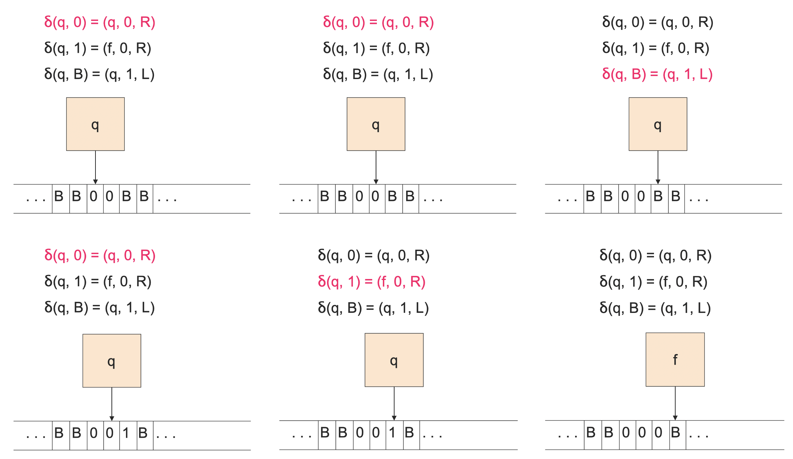

到最后，一步也不能动了（没有对应的规则），这个图灵机停机并接受输入。

### 7.1.3 图灵机的即时描述和移动

初始时刻，一个图灵机有一个有限的输入字符串，字符串两边包围着无限的空符号。图灵机处在初始状态，读写头指向最左边的输入符号（注意输入符号是纸带符号的一个子集而已，空符号不属于输入符号）。

::: definition 定义 7.2
图灵机的 **即时描述 (Instantaneous Description, ID)** 是一个字符串 $\alpha q \beta$，其中 $\alpha\beta$ 是纸带上从最左边的非空符号到最右边的非空符号之间的部分。

状态 $q$ 放置在正在扫描的符号的左侧。具体地，如果 $q$ 在最右边，说明它正在扫描 $B$，这个 $B$ 可以省略不写；如果图灵机正在扫描最左端的 $B$，则此时的 ID 形如 $qB\alpha\beta$，这个 $B$ 不可以省略不写。
:::

在讨论 PDA 的时候，我们使用了 $\vdash$ 和 $\vdash^*$ 来分别代表“经过一次移动可以变成”和“经过零次或多次移动可以变成”。在图灵机里面，我们依旧采用这种表示。

于是，上面那个例子中图灵机的移动过程为：

$$
q00 \vdash 0q0 \vdash 00q \vdash 0q01 \vdash 00q1 \vdash 000f
$$

下面我们来形式化地定义一下：

::: definition 定义 7.3
定义图灵机的一次 **移动 (move)** $\vdash$ 如下：

- 若 $\delta(q, Z) = (p, Y, R)$，则：
  - $\alpha q Z \beta \vdash \alpha Y p \beta$
  - 如果 $Z$ 是空白符 $B$，则又有 $\alpha q \vdash \alpha Y p$
- 若 $\delta(q, Z) = (p, Y, L)$，则：
  - $\forall X, \alpha XqZ\beta \vdash \alpha pXY\beta$
  - 此外，$qZ\beta\vdash pBY\beta$

若 $ID_1$ 可以经过 0 次或者多次移动变成 $ID_2$，则称 $ID_1 \vdash^* ID_2$。
:::

### 7.1.4 图灵机的语言

在弄明白了图灵机的运行方式之后，我们来看一下图灵机所对应的语言是什么？

和往常一样，一个图灵机可以根据终止状态来定义语言：

$$
L(M) = \{w \mid q_0w \vdash^* I, where\ I\ is\ an\ ID\ with\ a\ final\ state\}
$$

或者，一个图灵机可以通过停机来接收语言：

$$
H(M) = \{w \mid q_0w\vdash^* I, and\ there\ is\ no\ move\ possible\ from\ ID\ I\}
$$

和之前的下推自动机类似地，这两种接收语言的方式在表达能力上是等价的。即：

::: theorem 定理 7.1

对于图灵机 $M$：

- 如果 $L = L(M)$，则存在另一个图灵机 $M'$，使得 $L = H(M')$；
- 如果 $L = H(M)$，则存在另一个图灵机 $M''$，使得 $L = L(M'')$。

:::

证明方法和之前是类似的，我们只需要给出等价转化的构造手段就可以了。

先证明从终止状态到停机的这个方向，根据下面的步骤将 $M$ 修改为 $M'$：

1. 对于 $M$ 的每个终止状态，删除任意的移动，使得 $M'$ 在这个状态下必然停机；
2. 避免让 $M'$ 意外停机：
   - 引入一个新的状态 $s$，表示永远向右移动，也就是 $\forall X, \delta(s, X) = (s, X, R)$。
   - 如果 $q$ 不是一个终止状态，且 $\delta(q, X)$ 未定义，则令 $\delta(q, X) = (s, X, R)$。

再证明从停机到终止状态这个方向，根据下面的步骤将 $M$ 修改为 $M''$：

1. 引入一个新的状态 $f$，这是 $M''$ 唯一的终止状态；
2. $f$ 没有移动；
3. 对于任意状态 $q$ 和符号 $X$，如果 $\delta(q, X)$ 未定义，则添加 $\delta(q, X) = (f, X, R)$。

### 7.1.5 递归可枚举语言与递归语言

我们上面已经证明了根据停机接收语言和根据终止状态接收语言的图灵机在表达能力上的等价性，那么由图灵机定义的语言类是什么呢？

这种由图灵机定义的语言类被称为 **递归可枚举语言 (recursively enumerable language)**，至于为什么叫这个名词，这其实是有历史原因的。

> 在图灵机创造之前，在数学上就已经有递归可枚举这个概念了，它指的是另一种函数计算的记号，只不过图灵发现图灵机所定义的语言刚好满足这样的性质，所以就叫做递归可枚举语言了。

定义 **算法** 是一个图灵机，这个图灵机通过终止状态接收，并且无论接受与否，它都注定会停机。

如果 $L = L(M)$ 且图灵机 $M$ 是一个算法，我们称 $L$ 是一个 **递归语言 (recursive language)**。

> 为什么叫这个名字呢？还是由于一些历史原因。

每一个上下文无关语言都是一个递归语言，因为我们可以用 CYK 算法来判断任何一个字符串是否属于某个上下文无关语言。

其实，几乎你能想到的所有语言都是递归的。

### 7.1.6 图灵机编程

#### 例 1

构建一个图灵机来接收语言

$$
L = \{a^nb^n \mid n\ge 0\}
$$

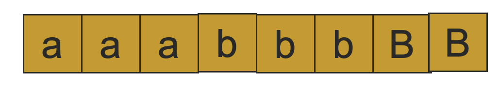

用图灵机编程的有一个关键的注意点就是保持两边都是无限的空格，不要在中间引入空格。这样，我们可以很容易的判断当前问题的边界在哪里。

这题的解决思路是先从最左边删除一个 `a`，再从最右边删除一个 `b`，再回到最左边删除一个 `a`，再回到最右边删除一个 `b`，如此重复，如果恰好能够删光，则可以接受，否则就不接受。

解决方案如下：

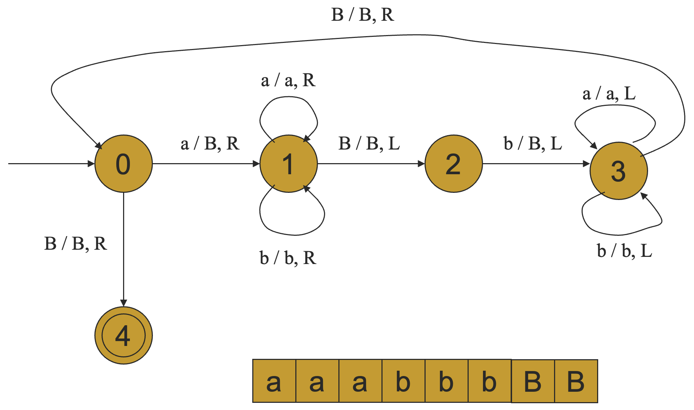

#### 例 2

构造一个图灵机，将其输入向右移动一位，最左边用空格代替。

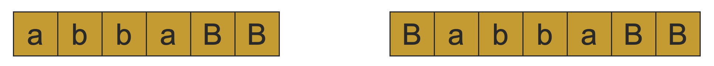

在这个问题中，我们会发现，这个图灵机可以接受任何的语言，因为随便给定一个字符串，我们只需右移一位即可，这并没有对字符串本身的形式提出要求。

不过，我们此时已经不关心这个图灵机接受什么样的语言了，而是关心这个图灵机产生了怎样的影响。

在使用图灵机的时候，我们更多的会用它来做事情，而不只是接受语言而已，有的时候，我们根本不关心它接受什么语言。

这道题的解决思路是：记录第一个元素，不妨记为 `a`，之后一路向右扫描，如果是 `a`，则继续扫描，如果是 `b`，则将 `b` 改成 `a`，然后下一次如果是 `b`，则继续扫描，如果是 `a`，则将 `a` 改成 `b`，以此循环往复，最终我们就可以将开头的 `a` 挪到结尾了。

解决方案如下：

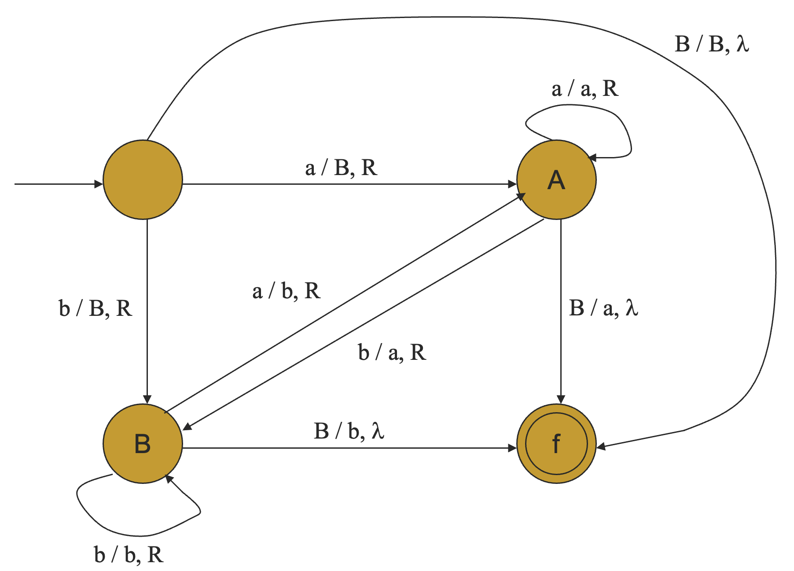

#### 例 3

构造一个图灵机，将输入字符串循环右移一位。

有了上一题的基础，这一提就好做多了，我们可以把上一题的图灵机当成是一个子过程 (sub-procedure)，先直接右移，然后将最右边的挪到最左边去就可以了。

于是便有了如下的解决方案，其中，左上角的子图灵机就是我们上一题的图灵机。是不是有函数调用的味道了？

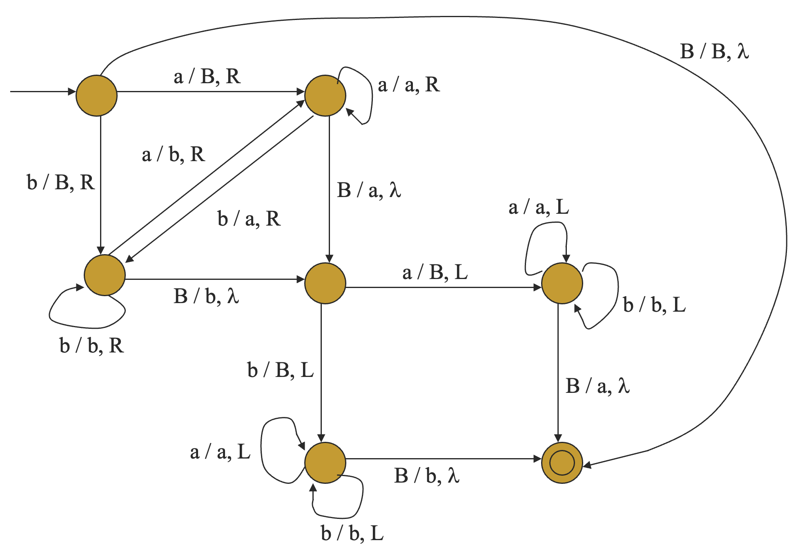

> 注：上图中 $\lambda$ 表示不移动读写头，这是一种记号，因为不移动读写头可以通过先左后右或者先右后左来等价实现，因此有的时候，为了书写方便，我们用 $\lambda$ 表示不移动读写头。

#### 例 4

令 $\Sigma = \{a, b\}$，$L = \{ba^ib \mid i \ge 0\}$，构造一个图灵机来判定 $L$。

这个算是自动机的老本行的，把 DFA 稍微改一下就行了：

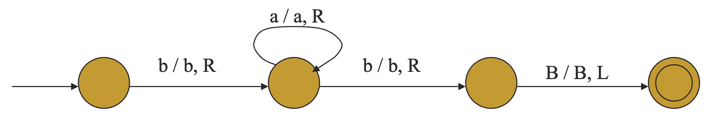

但是我们之前已经说过了，到了图灵机这个阶段，我们就不是那么重视识别语言这个基础功能了，我们更在乎图灵机能做什么。

稍微改一下需求，在纸带上输入一个字符串，如果这个字符串在 $L$ 中，则返回 $y$，否则返回 $n$。这个程序应该怎么写呢？

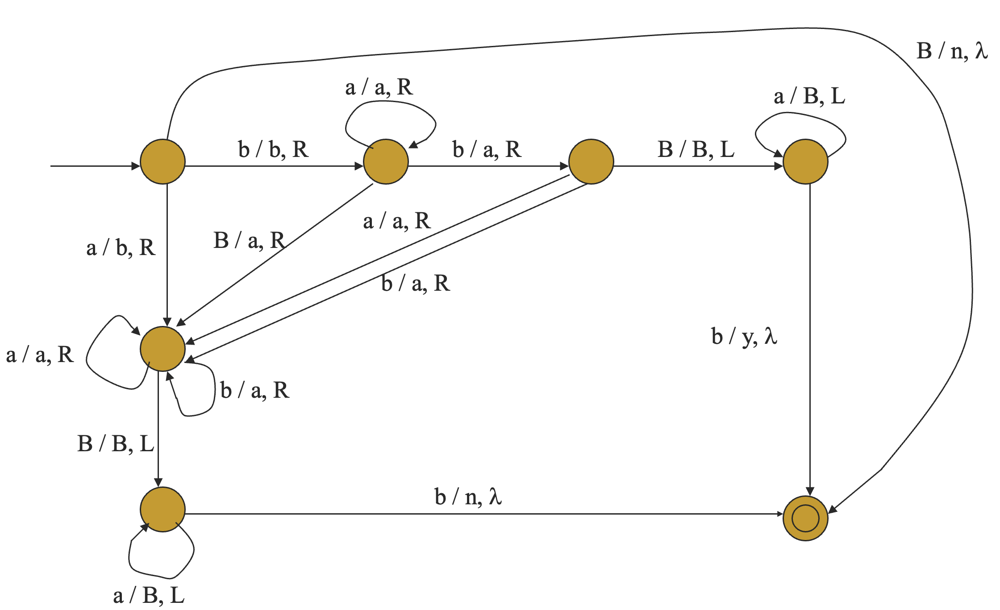

我们发现，此时的纸带不仅充当了输入媒介，同时也充当了输出媒介。

图灵机有计算功能，也有输入输出功能，纸带还有存储功能，你有没有看到一个计算机的影子？

## 7.2 图灵机进阶

### 7.2.1 图灵机编程技巧

#### 多道 (Multiple Tracks)

我们可以将纸带符号视为是一个有 $k$ 个分量的向量，每一个分量都来自于一个有穷的字母表。

这使得纸带看起来好像有 $k$ 个磁道，但实际上还是一个纸带，我们将这个向量整体视为一个符号。

假设除了某一个磁道以外的所有输入符号都是空，则这个多道程序就退化成了之前的单道程序。但其实多道和单道在表达能力上是等价的，你可以回忆一下之前子集构造的手法。

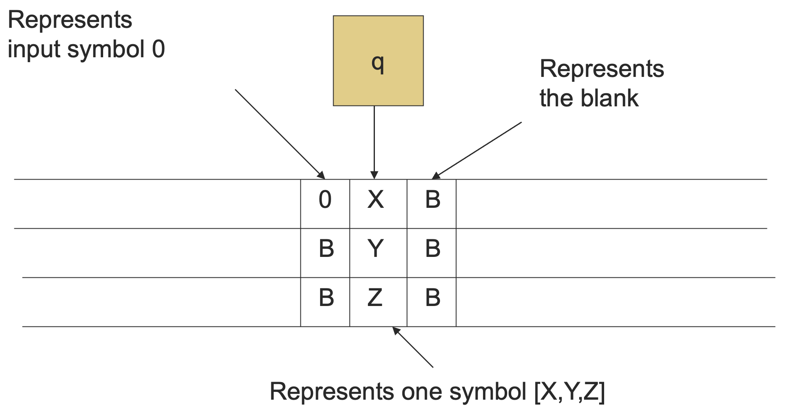

多道程序的转移函数如下：

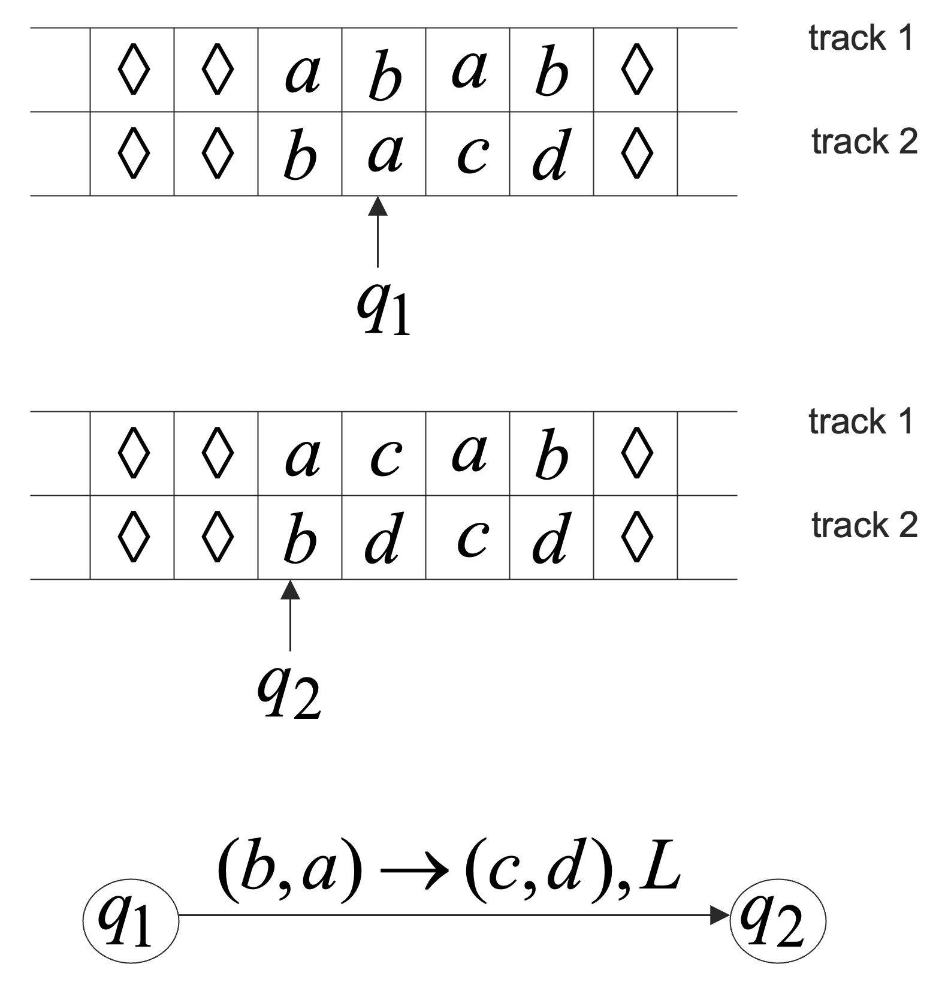

其中，$(b, a)$ 和 $(c, d)$ 应当视为是一个符号。

#### 标记 (Marking)

对于一个额外磁道的通常的作用是来 **标记 (mark)** 特定的位置。在这一磁道上，几乎所有的纸带符号都是空的，只有一些特定的位置上放置了一些特殊的符号（标记），这使得图灵机能够很方便地在纸带上寻找这些特定的位置。

#### 缓存 (caching)

其实，不仅符号可以是一个向量，状态也可以是一个向量。向量的首分量是“控制状态”，其余分量存放来自一个有穷字母表的数据。于是，我们得到了一个具有存储功能的图灵机。

#### 例：使用这些技巧

下面我们来看一个简单的使用上述技巧的例子。这个图灵机并没有做什么特别有用的事情，它只是无限地拷贝它的输入 $w$。

控制状态：

- $q$：标记你的位置，并且记住已经看到的输入符号；
- $p$：向右移动，寻找一个空的位置，将记住的符号放置在那个位置；
- $r$：向左移动，寻找标记。

状态形如 $[x, Y]$，其中 $x\in\{q, p, r\}$，$Y \in {0, 1, B}$，只有状态 $p$ 会使用到 $0$ 和 $1$。

纸带符号形如 $[U, V]$，其中：

- $U \in \{X, B\}$，作为标记；
- $V \in \{0, 1\}$，是输入符号。
- $[B, B]$ 表示空的纸带符号，$[B, 0]$ 和 $[B, 1]$ 是输入符号。

转移函数如下，其中 $\{a, b\} \subseteq \{0, 1\}$。

- $\delta([q, B], [B, a]) = ([p, a], [X, a], R)$
  - 在状态 $q$ 时，将读写头处的输入符号（这里是 $a$ ）读入缓存（状态的一部分）；
  - 用 $X$ 标记当前读的位置；
  - 进入状态 $p$ 并向右移动。
- $\delta([p, a], [B, b]) = ([p, a], [B, b], R)$
  - 在状态 $p$ 时，向右搜索，寻找一个空符号 $[B, B]$。
- $\delta([p, a], [B, B]) = ([r, B], [B, a], L)$
  - 找到了一个空符号的时候，将缓存中的 $a$ 写入这个位置；
  - 进入状态 $r$ 并向左移动。
- $\delta([r, B], [B, a]) = \delta([r, B], [B, a], L)$
  - 在状态 $r$ 时，向左移动，寻向所志。
- $\delta([r, B], [X, a]) = \delta([q, B], [B, a], R)$
  - 当发现之前作的标记的时候，进入状态 $q$ 并向右移动；
  - 可以将之前的标记给删除（不删除也没关系，不过删除之后最终输出会更干净）；
  - $q$ 将会放置一个新的标记，然后上面的过程就会循环往复了。

这个图灵机运行的一个例子如下：

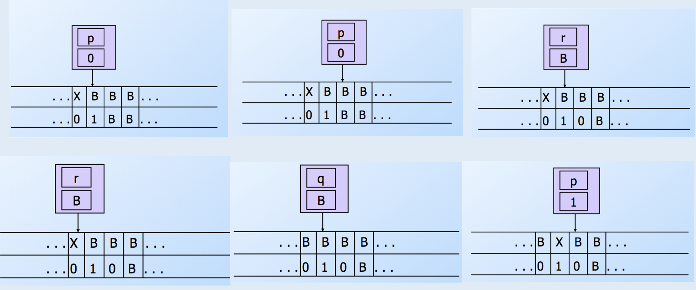

### 7.2.2 半无穷纸带

我们可以假设一个图灵机从来不会移动到初始读写头位置的左边。

令初始读写头的位置为 $0$，右侧位置为 $1, 2, ...$，左侧位置为 $-1, -2, ...$，构造一个具有两个磁道的新的图灵机：

- 顶部磁道代表位置 $0, 1, 2, ...$
- 底部磁道先存放一个标记，标记 $0$ 的位置，也就是不能向左越过的位置，标记右侧的部分代表位置 $-1, -2, ...$

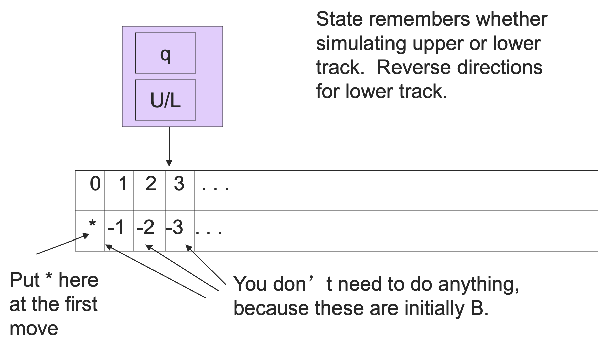

然后为图灵机增加一个状态分量表示正在扫描的是顶部磁道还是底部磁道。

根据上述的构造方法，我们可以将任意一个无穷纸带的图灵机转化成一个 **半无穷纸带 (semi-infinite tape)** 的图灵机了。

### 7.2.3 更多的限制

两个栈可以模拟一个纸带。

- 一个栈存放读写头左侧的位置，另一个栈存放读写头右侧的位置。

事实上，通过一个更聪明的构造，两个栈能够组成一个计数器：只用两个栈符号，一个用于保护栈底，另一个用于计数。

比如说要表示 $\{a^nb^nc^nd^n \mid n \ge 0\}$ 这种语言，在读到 $a$ 的时候在第一个栈里面放 $X$ （两个栈的栈底默认是 $Z_0$ ），直到读到 $b$ 为止。在读到 $b$ 的时候，从第一个栈里面取 $X$ 放到第二个栈里面，如果刚好取完，则说明 $a$ 的个数和 $b$ 的个数是相等的。并且个数就是第二个栈里面的 $X$ 的个数。

类似的，读到一个 $c$ 就从第二个栈里面取出 $X$ 放到第一个栈里面，如果刚好取完，则 $c$ 的个数就和 $a$ 以及 $b$ 的个数相等，个数就是第一个栈中 $X$ 的个数。

然后再读到一个 $d$ 就从第一个栈里面扔掉一个 $X$，如果刚刚好扔完，则 $d$ 的个数也就是第一个栈里面 $X$ 的个数。于是，我们就判断出了 $a, b, c, d$ 四个字母的个数相等。

类似的，不仅仅只是数 4 个符号，我们可以数任意个符号。相比于下推自动机只能输两个，多了一个栈，能力就发生了翻天覆地的变化，从下推自动机直接进化成了图灵机。

### 7.2.4 图灵机的扩展

扩展的图灵机看起来比标准的图灵机更加通用，更加一般，但这只是表示上更方便了，其实能力上也只能定义递归可枚举语言，就像 NFA 和 DFA 的关系一样。

我们下面会介绍三类扩展：

1. 多纸带图灵机 (Multitape Turing Machine)；
2. 非确定性图灵机；
3. 存储键值对。

#### 多纸带图灵机

多纸带图灵机允许一个图灵机拥有 $k$ 个纸带，其中 $k$ 是任意一个固定的常数。这个图灵机的移动取决于它的状态以及每个纸带上读写头下的符号。

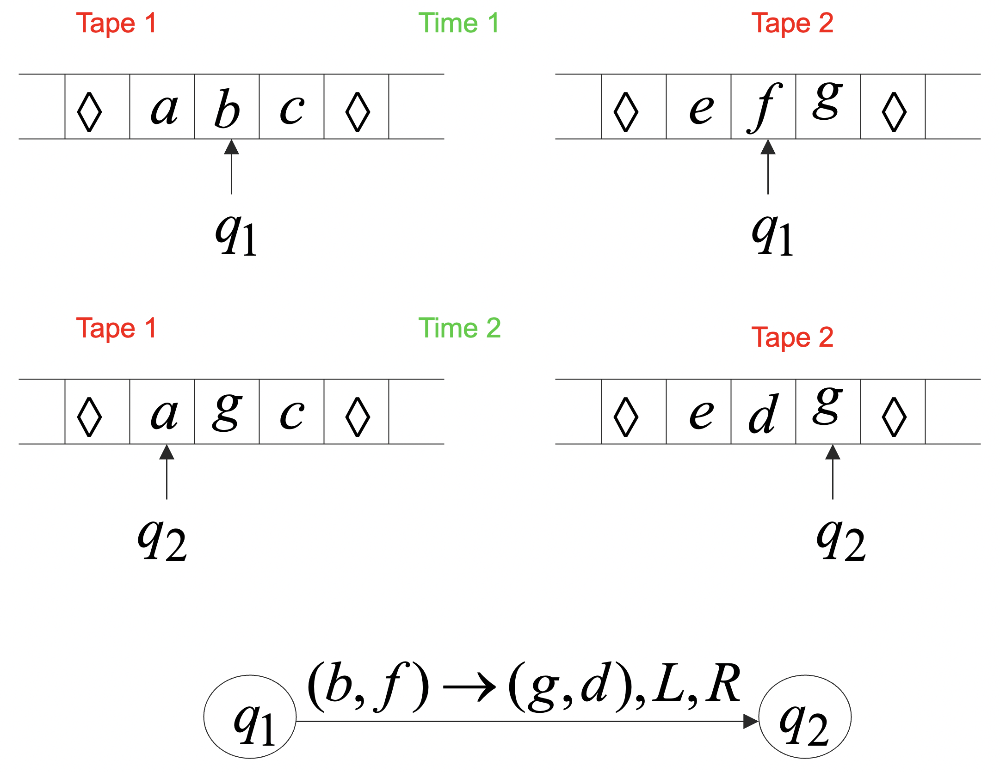

在一次移动中，这个图灵机改变自己的状态，并在每个读写头下写下符号，然后独立地移动每个读写头。

下面我们用一个单纸带的图灵机来模拟上面那个多纸带的图灵机，藉以说明它们在表达能力上的等价性。

我们可以使用 $2k$ 个磁道的单纸带图灵机来模拟上面 $k$ 个纸带的多纸带图灵机，每个纸带用一个磁道表示，每个读写头的位置用一个额外磁道上面的标记表示。

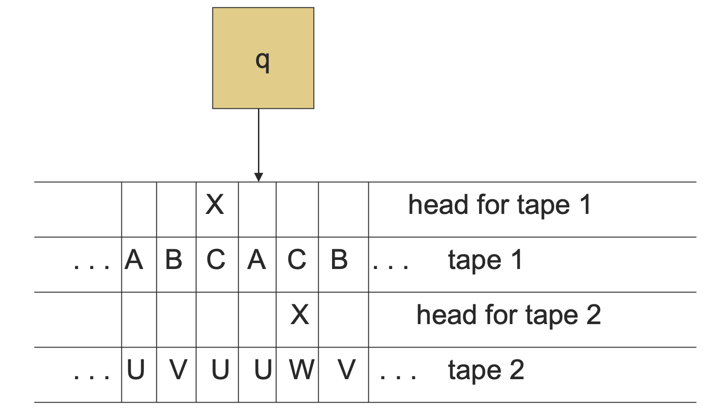

于是，我们可以将多纸带的一次读写转化成单纸带的 $k$ 次读写，其中读写的位置由标记磁道上标记的位置来决定。当然，这 $k$ 次读写中间还有移动读写头的操作，会麻烦一些。但是，在表达能力上，两者是等价的。

#### 非确定性图灵机

到目前为止，我们所说的图灵机都是 **确定性图灵机 (Determinstic Turing Machine, DTM)**，即图灵机在相同状态下读到相同输入的时候只会有一中移动情况。

**非确定性图灵机 (Non-determinstic Turing Machine, NTM)** 允许在一次移动的时候有不止一次可能的选择，每一个选择都是一个（状态，符号，方向）三元组，这和 DTM 中一样。

并且，和之前所有的非确定性自动机一样的是，在某个输入下，只要存在一种选择的序列，能够让 NTM 进入接受状态，NTM 就会选择接受这个输入。

也就是，我们假设 NTM 很聪明，会自动选择最正确的路线。

虽然 NTM 在要求上有所放松，但是其表达能力并没有超出 DTM 的范围，就像 NFA 并没有超出 DFA 的表达能力一样。下面，我们来证明这一点。

从 DTM 到 NTM 是很显然的，因为 DTM 可以视为一个特殊的 NTM。关键问题是从 NTM 到 DTM，即如何用 DTM 来模拟 NTM。

DTM 在它的纸带上面维护一个 NTM 的 ID 的队列。用另一个磁道来标记特定的位置。

- 一个标记放置在队列头部；
- 另一个标记用于帮助拷贝队列头部的 ID，并且进行一个一次移动的改变。

现在你可能还有些懵，我们下面会解释的。

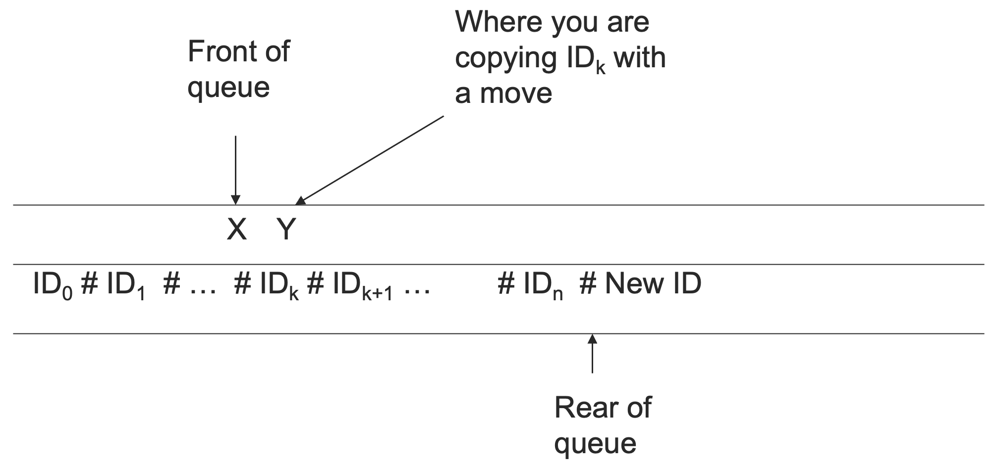

DTM 找到在当前队列头部的 ID，它查找这个 ID 中的状态，根据原本 NTM 的转移函数来决定从这个 ID 经过一次移动能够到达哪些 ID。

如果有 $m$ 种可能的移动方式，它创建 $m$ 个新的 ID，每一种可能的移动都创建一个，放置在队列的尾部。

这 $m$ 个 ID 是一个一个创建的，在全部创建完毕之后，记录队列首部的标记向队尾方向移动一个格子。

然而，如果某一个创建出来的 ID 对应着原本 NTM 的一个接受状态，那么 DTM 接受并停机。

这个时候你应该已经隐约有了一种感觉，这不是广度优先搜索么？

确实，其实就是用 DTM 广度优先搜索 NTM 的所有可能 ID，寻找一个能够接受的 ID。

那么，为什么可以找到呢？

NTM 对于各种移动的选项数量是有限的，从而存在一个上界，不妨记为 $k$，在 NTM 的任何状态下，接受一个输入，可选的移动数目都不超过 $k$。

于是，任何一个从初始 ID 通过 $n$ 次 NTM 移动可达的 ID 都可以通过 DTM 最多构造 $\sum_{i = 1}^{n} k^i = \frac{k^{n+1} - k}{k - 1}$ 次达到。

也就是说，这个广度优先的搜索树的节点数是有上限的。

如果 NTM 接受，则它是通过某种 $n$ 次移动达到的，从而含有一个接受状态的 ID 会在 DTM 的一定移动之内达到（上界前面已经给出）。

如果 NTM 不接受，则 DTM 也不会接受的，因为 DTM 是通过判断 ID 内是否有接受状态来接受的。

从而，这个新的 DTM 和原本的 NTM 接受的是同一种语言。

#### 利用图灵机的拓展

我们现在已经有了一个很好的情况。在我们讨论要构造一个图灵机，它以其它图灵机作为输入的时候，我们可以假设作为输入的图灵机足够简单，比如说单道、单带、无缓存、半无穷、确定性。

但是我们却可以假设模拟图灵机，也就是接受另一个图灵机作为输入的图灵机可以多道、多带、带缓存、无穷纸带、非确定性。

因为这些表示之间都可以相互转换，所以其实都是等价的，但是这样假设会给我们的证明和构造提供很多的方便。

#### 用图灵机模拟键值存储

图灵机可以用一个纸带来存储一个任意大的 **名值对 (name-value pairs)** 序列，形如 `name*value#...`。

使用第二个磁道来标记序列的左端点。

使用第二个纸带来存放一个名字，我们想要查找这个名字的值。

##### 查找

从存储的左端点开始查找，比较存储的名字和输入的名字，当我们找到一个匹配的时候，取下一个 `*` 和 `#` 之间的内容作为值。

##### 插入

假设，我们想要插入一个名值对 $(n, v)$，或者我们想要将名字 $n$ 对应的值修改为 $v$。

首先，对 $n$ 执行查找操作，如果没有找到，则讲 `n*v#` 插入在存储纸带的末尾。

如果我们找到了 `#n*v'#`，下面我们需要将 `v'` 用 `v` 来代替。

- 如果 `v` 比 `v'` 来得短，我们可以留一些占位符来完成替代。
- 但如果 `v` 比 `v'` 来得长呢？你就需要自己创造一些空间出来了。

使用第三个纸带，将 `v'` 之后的所有内拷贝到这第三个纸带上面。不过在此之前，你需要将 `v'` 之前的 `*` 的位置标记下来。

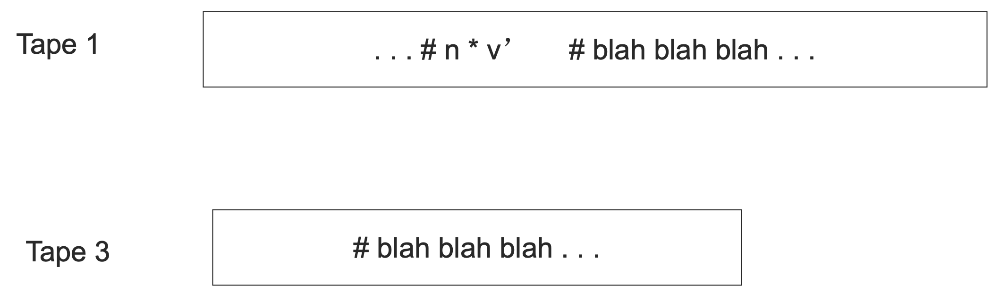

然后回到第一个磁带，直接将 `v` 写在之前标记的 `*` 的后面，标记 `v` 的结束位置。

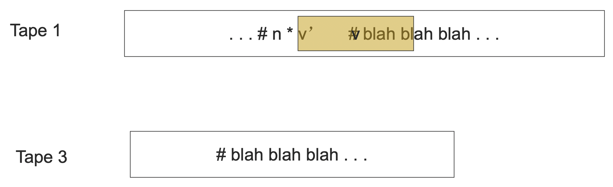

最后将第三个纸带上的内容拷贝到 `v` 的后面即可。

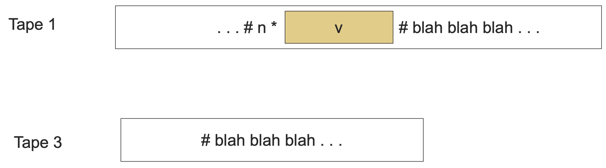

## 7.3 递归可枚举语言和递归语言的闭包性质

- 递归可枚举语言和递归语言在并集、拼接、星闭包、翻转、交集以及逆同态操作下都是封闭的。
- 递归语言在差集、补集操作下封闭。
- 递归可枚举语言在同态操作下是封闭的。

### 7.3.1 并集与交集操作

令 $L_1 = L(M_1), L_2 = L(M_2)$，假设 $M_1$ 和 $M_2$ 是单带半无穷图灵机。我们可以构造一个双带图灵机 $M$，将其输入拷贝到第二个纸带上面，“并行地”在两个纸带上模拟 $M_1$ 和 $M_2$。

#### 并集操作

- 递归语言：如果 $M_1$ 和 $M_2$ 都是算法，则 $M$ 在两个模拟上都能够停下来，并且给出结果，我们根据两个模拟的结果来判断是否接受这个输入。

    
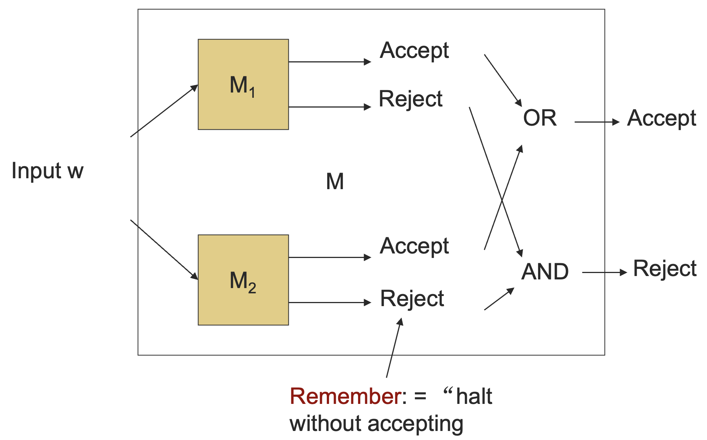

- 递归可枚举语言：当两个图灵机当中有任何一个接受的话就接受，不过你可能会发现两个图灵机都永远运行不停机（准确说是不知道会不会停机）或者都不接受。

    
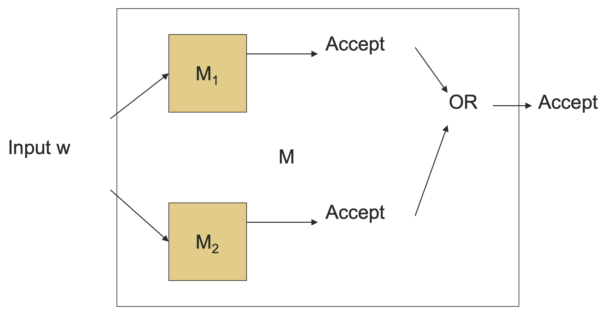

#### 交集操作

交集操作和并集的想法是一致的。

- 对于递归语言：

    
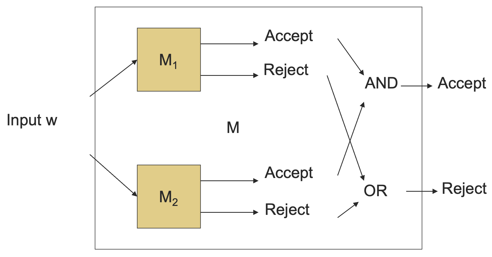

- 对于递归可枚举语言：

    
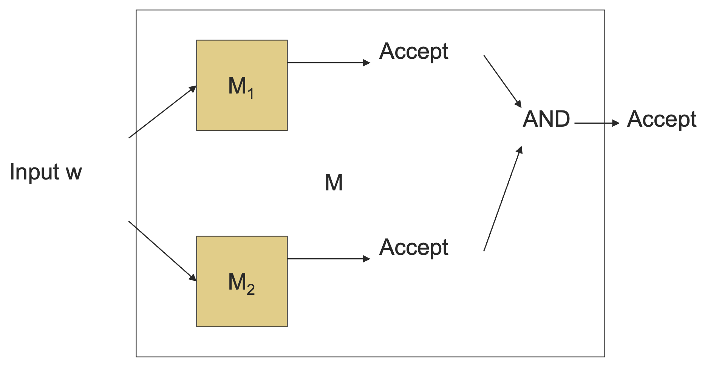

### 7.3.2 差集与补集操作

差集和补集的基本想法和上面的交集是一致的。

对于递归语言，两个图灵机最终都会停机。我们只在 $M_1$ 接收但是 $M_2$ 不接收的时候接收。从而就能够得到 $L_1 - L_2$，于是递归语言在差集操作下封闭，从而很顺利的就会在补集操作下封闭。

但是递归可枚举语言不可以。因为 $M_2$ 可能永远也不会停机，所以我们无法确定输入是否在差集中。

### 7.3.3 拼接操作

#### 递归可枚举语言

令 $L_1 = L(M_1), L_2 = L(M_2)$，假设 $M_1$ 和 $M_2$ 是单带半无穷图灵机。

构造一个 2 带的非确定性图灵机 $M$：

1. “猜测”输入的一种分割方式 $w = xy$；
2. 将 $y$ 移动到第二个纸带上；
3. 在 $x$ 上模拟 $M_1$，$y$ 上模拟 $M_2$；
4. $M$ 接受当且仅当 $M_1$ 和 $M_2$ 都接受。

这里，因为是非确定性图灵机，所以如果存在一个正确的分割方式，那么它一定会选择这个正确的分割方式来运行。

#### 递归语言

在递归语言上，我们就不能随意的用非确定性图灵机了，因为我们需要保证无论接受与否，图灵机都能正常停机并给出结果。

不过，我们可以有条理地尝试所有可能的分割方式 $w = xy$。由于 $M_1$ 和 $M_2$ 对于任意 $x$ 和 $y$ 总是能够停机的，不会存在无限等待的情况，因此，这种遍历是可以进行的。

递归可枚举语言就不一定了，如果直接遍历，可能无法停机。

如果我们能够找到一种分割方式 $w = xy$，$x$ 被 $M_1$ 接受 且 $y$ 被 $M_2$ 接受，则接受，否则不接受。

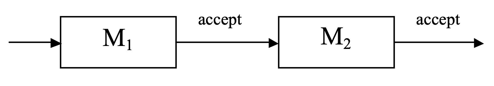

### 7.3.4 星闭包

星闭包的处理想法和拼接是类似的。

- 递归可枚举语言：猜测所有的分割方式，构造一个 NTM，让原本的图灵机判断是否每个子串都可以接受。
- 递归语言：有条理地尝试所有的分割方式（这是有限的）即可。

### 7.3.5 翻转

对于翻转，我们只需要先用一个辅助图灵机翻转输入，这一点是很容易做到的；然后用原来的图灵机接受这个翻转后的字符串就行了。

这种方法对于递归语言和递归可枚举语言都成立。

### 7.3.6 逆同态

逆同态说的是，我已经有了接受同态函数返回值的图灵机，现在给定的是同态函数输入组成的字符串，我们要判断能否还用同类型的图灵机接受。

首先，我们可以用一个图灵机模拟同态函数 $h$，将其应用于输入 $w$ 得到 $h(w)$，然后用原本的图灵机来接收 $h(w)$ 就可以了。

这种方式对于递归可枚举语言和递归语言都成立。

### 7.3.7 同态

令 $L = L(M_1)$，设计非确定性图灵机 $M$ 来接收输入 $w$ 并猜测一个 $x$ 使得 $h(x) = w$，$M$ 接受当且仅当 $M_1$ 接受 $x$。

这样的方法适用于递归可枚举语言，因为递归可枚举语言只需要接受的时候停机，其他时候不管。

但是不适用于递归语言，因为在猜测一个 $x$ 的过程中，$x$ 的可能取值是无穷的。比如说 $h(0) = ab, h(1) = \varepsilon$ 这个同态函数，由于有 $h(1) = \varepsilon$ 的存在，$abab$ 可能是 $00$，但其实有无数种可能：$1^*01^*01^*$。而递归语言不允许不停机，因此这个方法不适用于递归语言。
