# 8 判定性与复杂度

## 8.1 判定性（Decidability）

到现在为止，我们已经学习了正则语言、上下文无关语言、递归语言（图灵可判定语言）、递归可枚举语言（图灵可识别语言）。

在之前的学习中，我们已经知道了正则语言是上下问无关语言的子集，上下文无关语言是图灵可判定语言的子集。

但是不是所有的语言都是图灵可识别的呢？图灵可识别的语言又是否都图灵可判定呢？

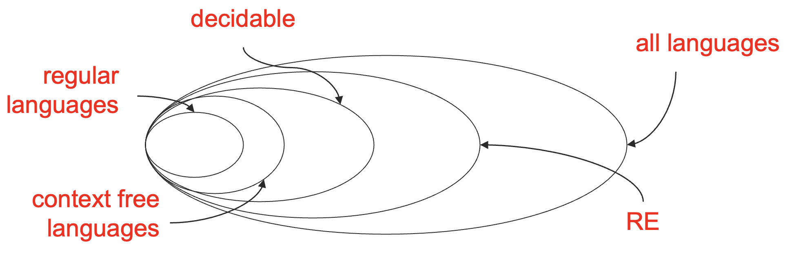

其实，我们学过的这些语言满足上图中的关系，我们这一小节的目标就是证明下面的这个真包涵关系。

$$
\text{decidable} \subsetneqq RE \subsetneqq \text{all languages}
$$

### 8.1.1 可数与可数集

复习一下离散数学的内容，我们称自然数集 $\mathbb{N} = \{1, 2, 3,  ...\}$ （这里自然数集暂时选定从 1 开始）是**可数的**（countable）。对于集合 $S$，如果 $S$ 是有限集，或者存在一个双射 $f : N \to S$，那么 $S$ 也是可数的。

比如说，正有理数集合 $\mathbb{Q} = \{\frac{m}{n} \mid m,n \in \mathbb{N}\}$ 是可数的，可以按照如下顺序排列，从而每个元素都可以对应一个唯一的自然数，因此 $\mathbb{Q}$ 是可数的。

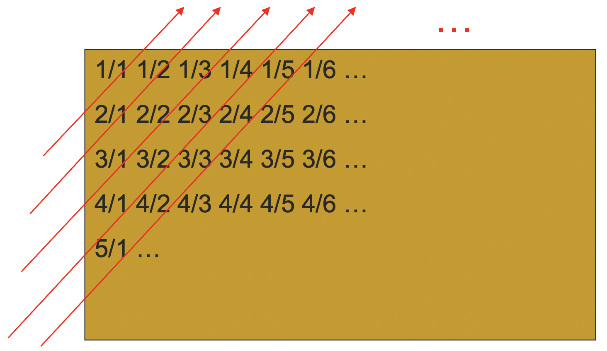

但实数集就不一样了。

::: theorem 定理 8.1
实数集 $\mathbb{R}$ 不可数。
:::

我们怎么证明一个集合不可数呢？基本思路是：

- 先假设可数，则存在一个从自然数集到这个集合的双射 $f$；
- 然后导出矛盾，比如说证明某些元素并没有被 $f$ 给映射到；
  - 证明某些元素并没有被 $f$ 给映射到的基本手段是**康托尔对角法**（Cantor's Diagonalization）。

证明：假设 $\mathbb{R}$ 是可数的，则存在从自然数集到实数集的双射 $f$，我们根据双射可以列出所有的实数：

| $n$ |                    $f(n)$                    |
| :-: | :------------------------------------------: |
| $1$ | $a_{10}.\overline{a_{11} a_{12} a_{13} ...}$ |
| $2$ | $a_{20}.\overline{a_{21} a_{22} a_{23} ...}$ |
| $3$ | $a_{30}.\overline{a_{31} a_{23} a_{33} ...}$ |
| $4$ | $a_{40}.\overline{a_{41} a_{42} a_{43} ...}$ |
| ... |                   ... ...                    |

其中，$a_{ij} \in \{0, 1, 2, ..., 9\}, \space i,j \in \mathbb{N}$，$a_{i0} \in \mathbb{N} \cup \{0\}$，将有限小数和整数视为以无限个 $0$ 结尾的无限小数。

令 $x = 0.\overline{b_1b_2b_3...}$，其中 $b_i \ne a_{ii}$，则 $x$ 一定不再上述用表格列出的双射中。否则，如有 $x = f(i)$，则有 $b_i = a_{ii}$，矛盾。

于是存在实数 $x$，不在 $f$ 之中，矛盾。因此 $\mathbb{R}$ 不可数。

这就是康托尔对角法，我们从 $n$ 为行，$f(n)$ 为列的矩阵中通过控制对角线位置不同的方式，构造出了不再这个矩阵中的一行，但是这一行却也是个实数，从而证明这样的矩阵不存在。

### 8.1.2 非递归可枚举语言

有了可数和不可数的概念之后，我们便可以很容易的证明**非递归可枚举语言**（Non-RE Languages）的存在了。

::: theorem 定理 8.2
存在非递归可枚举的语言。
:::

证明的基本思路为：

1. 所有图灵机的集合是可数的；
2. 所有语言的集合是不可数的；
3. 于是，从图灵机的集合到语言的集合的函数是不可逆的。
   - 也就是说，给定一个语言，并不一定有一个对应的图灵机，否则，语言的集合就变得可数了。

一个显然的事实是，给定一个图灵机，一定会有一个对应的语言；而上面的证明说明了给定一个语言，不一定会有一个能接收这个语言的图灵机，从而递归可枚举语言就是所有语言的真子集了。

下面我们只需要证明两个集合的可数性就可以了。

::: lemma 引理 8.1
所有图灵机的集合是可数的。
:::

证明：首先，对于一个有限的字母表 $\Sigma$，$\Sigma^*$ 是可数的。由于每种固定长度的字符串的数量都是有限的，我们可以通过依次写下所有长度为 0、长度为 1、长度为 2……的字符串的方式有序地将 $\Sigma^*$ 列出。（其实还可以用可数集的笛卡尔积依旧是可数集来理解）。

每一个图灵机 $M$ 都可以用一个长度有限的的字符串 $\langle M \rangle$ 来表示，毕竟都是写在纸上的字，我们只需要把状态集合、输入符号集合、纸带符号集合、初始状态、接受状态集合以及转移函数列出来就可以了。

我们可以以所有可见字符为字母表 $\Sigma$，产生可数的字符串集合 $\Sigma^*$，从中剔除掉不能表示图灵机的字符串，我们就得到了所有图灵机的字符串表示的集合，这与图灵机本身的集合是一一对应的，因为每一个图灵机都可以用有限的字符串写在纸上。

显然，所有图灵机的字符串表示的集合是所有字符串集合的一个子集，一个可数集合的自己依旧是可数的。又因为图灵机字符串表示 $\langle M \rangle$ 的集合元素和图灵机 $M$ 的集合元素是一一对应的，换句话说，这两个集合是等势的，所以所有图灵机的集合是可数的。

::: lemma 引理 8.2
所有语言的集合是不可数的。
:::

证明：按照某个特定的顺序枚举出所有的字符串 $s_1, s_2, s_3, \dots$，比如说按照字典序排列，这一点是很容易做到的。

而语言就是这些字符串的集合，对于某个语言 $L$，我们可以用它的**特征向量**（characterstic vector）$\chi_L$ 来描述它，其中 $\chi_L$ 的第 $i$ 个元素为 $1$ 或者 $0$，表示 $s_i$ 在或者不在语言 $L$ 中。

下面就是康托尔对角法的基本套路了。

假设所有语言的集合是可数的，则存在从自然数集到所有语言集合的双射 $f$，根据这个双射，我们可以列出所有语言的特征向量：

| $n$ |             $f(n)$              |
| :-: | :-----------------------------: |
| $1$ | $(a_{11}, a_{12}, a_{13}, ...)$ |
| $2$ | $(a_{21}, a_{22}, a_{32}, ...)$ |
| $3$ | $(a_{31}, a_{32}, a_{33}, ...)$ |
| ... |             ... ...             |

$a_{ij} \in\{0, 1\}, i,j\in\mathbb{N}$。

令 $x = (b_1, b_2, b_3, ...)$，其中 $b_i \ne a_{ii}$，则 $x$ 不可能在上面的列表中。否则，如果 $x$ 在第 $i$ 行，则 $b_i = a_{ii}$，这与 $x$ 的构造方法是矛盾的。

但 $x$ 确实代表了一种语言，则存在了某个语言 $x \notin \{L \mid L = f(n), n\in \mathbb{N}\}$，与 $f$ 是双射矛盾。

因此，所有语言的集合是不可数的。

到此为止，我们就证完了递归可枚举语言是所有语言的一个真子集。也就是说，出了递归可枚举语言之外，还有别的语言，不可以被任何图灵机识别的语言。

到此为止，我们从理论上将递归可枚举语言和所有语言区分了开来。

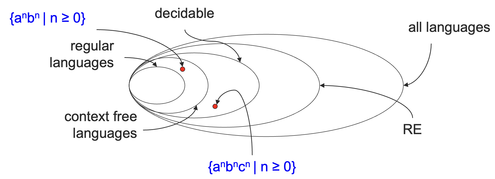

下面，我们会寻找一个不可判定的语言，将递归语言和递归可枚举语言彻底区分开来。

### 8.1.3 停机问题

::: definition 定义 8.1
定义**停机问题**（Halting Problem）如下：

$$
\mathrm{HALT} = \{ \langle M, x\rangle \mid \text{TM } M \text{ halts on input } x \}
$$

:::

HALT 其实是一个语言，只不过这个语言接收一个二元组的字符表示作为它的输入字符串而已。

::: theorem 定理 8.3
HALT 问题**不可判定**（undecidable）。
:::

证明：假设存在图灵机 $H$ 可以判定 HALT 问题，即：

- 如果 $M$ 对于输入 $x$ 可以停机，那么 $H$ 会接受 $\langle M, x\rangle$，
- 如果 $M$ 对于输入 $x$ 不会停机，那么 $H$ 会拒绝 $\langle M, x\rangle$。

定义一个新的图灵机 $H'$，其输入为 $\langle M \rangle$，即图灵机 $M$ 的字符串表示，

- 如果 $H$ 接受了 $\langle M, \langle M \rangle \rangle$，则死循环；
- 如果 $H$ 拒绝了 $\langle M, \langle M \rangle \rangle$，则停机。

考虑给图灵机 $H'$ 输入 $\langle H' \rangle$：

- 如果它停机了，那么 $H$ 拒绝了 $\langle H', \langle H' \rangle \rangle$，也就意味着 $H'$ 在输入 $\langle H' \rangle$ 的时候不能停机；
- 如果它死循环了，那么 $H$ 接受了 $\langle H', \langle H' \rangle \rangle$，也就意味着 $H'$ 在输入 $\langle H' \rangle$ 的时候必须停机。

但这是矛盾的，从而 $H$ 和 $H'$ 都不可能存在。

其实在上面的证明过程中也蕴含了康托尔对角法的思想。

如果 HALT 问题可判定，我们就会存在这样的一张表，表中的每个值是 $H$ 在输入 $\langle M_i, \langle M_j \rangle \rangle$ 下的结果：

|       | $\langle M_1 \rangle$ | $\langle M_2 \rangle$ | $\langle M_3 \rangle$ | $\langle M_4 \rangle$ | ... |
| :---: | :-------------------: | :-------------------: | :-------------------: | :-------------------: | :-: |
| $M_1$ |       $a_{11}$        |       $a_{12}$        |       $a_{13}$        |       $a_{14}$        | ... |
| $M_2$ |       $a_{21}$        |       $a_{22}$        |       $a_{23}$        |       $a_{24}$        | ... |
| $M_3$ |       $a_{31}$        |       $a_{32}$        |       $a_{33}$        |       $a_{34}$        | ... |
| $M_4$ |       $a_{41}$        |       $a_{42}$        |       $a_{43}$        |       $a_{44}$        | ... |
|  ...  |          ...          |          ...          |          ...          |          ...          | ... |

考虑某个图灵机 $H'$，其对于 $\langle M_i, \langle M_i \rangle \rangle$ 的输出和 $H$ 相反（即和对角线相反），那么其对于 $\langle H', \langle H' \rangle \rangle$ 的输出就是一个矛盾的存在了。

|       | $\langle M_1 \rangle$ | $\langle M_2 \rangle$ | $\langle M_3 \rangle$ | $\langle M_4 \rangle$ | ... | $\langle H' \rangle$ |
| :---: | :-------------------: | :-------------------: | :-------------------: | :-------------------: | :-: | :------------------: |
| $M_1$ |       $a_{11}$        |       $a_{12}$        |       $a_{13}$        |       $a_{14}$        | ... |       $a_{1k}$       |
| $M_2$ |       $a_{21}$        |       $a_{22}$        |       $a_{23}$        |       $a_{24}$        | ... |       $a_{2k}$       |
| $M_3$ |       $a_{31}$        |       $a_{32}$        |       $a_{33}$        |       $a_{34}$        | ... |       $a_{3k}$       |
| $M_4$ |       $a_{41}$        |       $a_{42}$        |       $a_{43}$        |       $a_{44}$        | ... |       $a_{4k}$       |
|  ...  |          ...          |          ...          |          ...          |          ...          | ... |         ...          |
| $H'$  |       $a_{k1}$        |       $a_{k2}$        |       $a_{k3}$        |       $a_{k4}$        | ... |      $a_{kk}$ ?      |

> $a_{kk}$ 自己要和自己不同，这让 $a_{kk}$ 情何以堪呢？

到目前为止，我们找到了一种语言，叫做停机问题，将递归语言和递归可枚举语言彻底区分了开来。

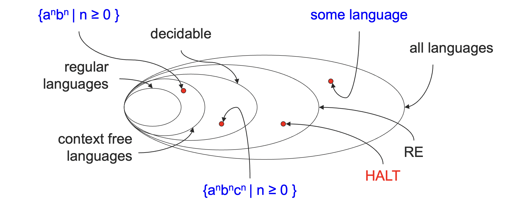

其实现在这个关系已经很明显了，但是在说明并不是所有的语言都是图灵可识别的语言的时候，我们是使用可数性来区分的，并没有给出具体的例子。

下面，我们来给出一个不是递归可枚举的语言的例子。

#### 8.1.4 图灵不可识别的语言

定义一个递归可枚举（RE）语言的补集 co-RE，则有如下关系：

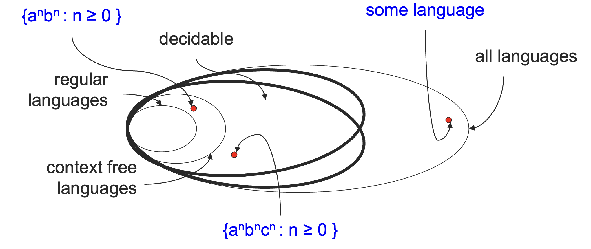

> 注：这里的补集指的是所有的具体语言关于 $\Sigma^*$ 的补集所形成的新的语言的集合。

不过为什么 RE 和 co-RE 的交集就是递归语言，或者说图灵可判定语言呢？

::: theorem 定理 8.4
一个语言 $L$ 可判定，当且仅当它是 RE，也是 co-RE。
:::

证明：先证充分性。

如果一个语言可判定，那么它一定是 RE，这是显然的，因为递归语言是递归可枚举语言的子集。

并且，如果一个语言 $L$ 可判定，那么这个语言的补集也是可判定的，我们只需要将原本判定 $L$ 的图灵机的接受和拒绝对掉一下就可以了，这是很容易做到的。

因此，$L$ 也在 co-RE 中。

再证必要性。

我们现在有图灵机 $M$ 来识别 $L$，有图灵机 $M'$ 来识别 $L$ 的补集。

我们可以利用这两个图灵机，构造新的图灵机，在接受输入 $x$ 的时候，并行地模拟 $M$ 和 $M'$。

如果 $M$ 接受，则接受；如果 $M'$ 接受，则拒绝。

从而，我们就构造出了可以判定 $L$ 的图灵机。因此，$L$ 是可判定的。

有了这些知识储备之后，我们就可以给出一个不递归可枚举的语言的例子了。

::: theorem 定理 8.5
HALT 的补集不是递归可枚举的。
:::

证明：我们已经知道了 HALT 是递归可枚举的。假设 HALT 的补集也是递归可枚举的，根据定理 8.4，HALT 就是可判定的了，这与定理 8.3 矛盾。因此，HALT 的补集不是递归可枚举的。

到此，我们就彻底搞清了从第一讲到现在所学习的各种语言之间的包含关系了。

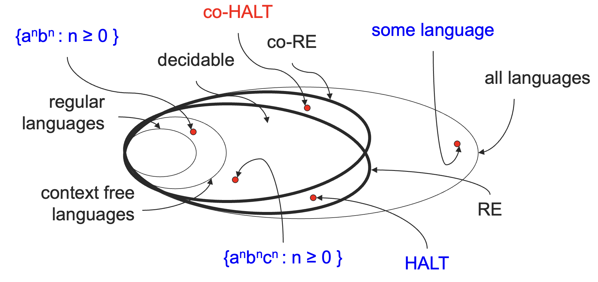

## 8.2 复杂度

### 8.2.1 基本概念

到目前为止，我们将问题根据它们是否有一个算法来进行了分类。

> 这里可以回忆一下算法是什么：算法是一个必定会停止的图灵机，也就是一个递归语言/图灵可判定语言的图灵机。

真实的世界中，我们用来运行一个算法的资源是有限的，常见的两种资源是：

- 时间；
- 空间；

对于可判定的问题，我们需要根据它们所需的资源进行进一步的分类。并且我们总是会以如下的方式来考察运行算法所需的资源（比如说运行时间）：

- 作为输入长度的函数；
- 函数值是对于给定长度的**所有**输入中所需的资源的**最大值**；
- 这称为**最坏情况分析**（Worst-case Analysis）。

这里所说的输入长度指的是输入字符串的长度。

### 8.2.2 时间复杂度

::: definition 定义 8.2

一个图灵机 $M$ 的运行时间，称为**时间复杂度**（time complexity），是一个函数

$$
f:\mathbb{N} \to \mathbb{N}
$$

其中 $f(n)$ 是 $M$ 对于任意长度为 $n$ 的输入停机所需要的最大步骤数（移动次数）。

:::

我们称 $M$ 运行在 $f(n)$ 时间内，或者 $M$ 是一个 $f(n)$ 时间的图灵机。

比如说，对于判定 $L = \{0^k1^k \mid k \ge 0\}$ 的图灵机 $M$。

对于输入 $x$ :

1. 从左向右扫描，如果发现有 $0$ 在 $1$ 后面则拒绝；
2. 只要纸带上还有 0 和 1 就重复下面的动作：
   - 来回扫描，划掉一个 $0$，一个 $1$。
3. 如果只有 $0$ 或者只有 $1$ 剩下，则拒绝；如果既没有 $0$ 也没有 $1$ 剩下，则接受。

如果输入长度为 $n$，它需要多少步呢？我们可以粗略估计一下，如果接收的话，则应该左右扫描，各划掉 $n / 2$ 个 $0$ 和 $1$，每次需要读写头从最左边移动到最右边，再从最右边移动到最左边，整体应该是一个 $n^2$ 量级的数字。

我们并不关心微小的差别。

- 比如说，$M$ 需要多少额外的步骤来检查读写头是否在纸带的最左边，这种微小的区别我们是不关心的。

我们关心在大规模输入下算法的行为。

- 通用算法（General-Purpose Algorithm）应该是**可扩缩的**（scalable），即在输入规模扩大或者缩小的时候，算法的运行时间依旧应当是可接受的。
- 于是，像初始化这样的操作可能在整体的时间复杂度中就无伤大雅了。

#### 渐进表示法

我们使用**渐进表示法**（asymptotic notation）来评测时间复杂度：

- 我们忽略运行时间中的低次项；
- 忽略最高次项前面的系数。

比如说，$f(n) = 6n^3 + 2n^2 + 100n + 102781$，$f(n)$ 的数量级是 $n^3$，我们写作 $f(n) = O(n^3)$。

::: definition 定义 8.3
给定函数 $f, g: \mathbb{N} \to \mathbb{R}^+$，我们称 $f(n) = O(g(n))$，如果存在正整数 $c, n_0$ 使得对于所有的 $n \ge n_0$：

$$
f(n) \le cg(n)
$$

:::

上面这个记号的含义是 $f(n)$ 在渐进意义下小于等于 $g(n)$。

回到之前判定 $0^k1^k$ 的算法：

1. 从左向右扫描，如果发现有 $0$ 在 $1$ 后面则拒绝；
2. 只要纸带上还有 0 和 1 就重复下面的动作：
   - 来回扫描，划掉一个 $0$，一个 $1$。
3. 如果只有 $0$ 或者只有 $1$ 剩下，则拒绝；如果既没有 $0$ 也没有 $1$ 剩下，则接受。

这个算法的第一步需要 $O(n)$ 时间，第二步重复次数不超过 $n / 2$，每次重复所需时间为 $O(n)$，第三步最多也需要 $O(n)$ 时间。

总时间为 $O(n) + (n / 2) O(n) + O(n) = O(n^2)$。

对于时间复杂度，我们有如下称呼的传统：

- 称 $O(\log n)$ 为**对数**（logarithmic）时间复杂度；
  - 由于我们可以通过换底公式将所有对数的底换成 2，因此我们可以直接省略底数。
- 称 $O(n^c), c\ge 0$ 为**多项式**（polynomial）时间复杂度；
- 称 $O(2^{n^\delta}), \delta > 0$ 为**指数**（exponential）时间复杂度。
  - 指数时间复杂度的底可以不是 $2$。

### 8.2.3 时间复杂度类

有了时间复杂度之后，我们可以以此为标准来定义语言类。

回忆一下：

- 一个语言是一个字符串的集合；
- 一个复杂度类是一个语言的集合，即一个语言类；
- 我们已经见过的语言类：
  - 正则语言、上下文无关语言、可判定语言、递归可枚举语言、递归可枚举补集语言、所有语言

::: definition 定义 8.4
定义**时间复杂度类**（Time Complexity Class）为

$$
\mathrm{TIME}(t(n)) = \{
L \mid \text{there exists a TM } M \text{ that decides } L \text{ in time } O(t(n))
\}
$$

:::

从之前的分析中，我们已经见到了 $L = \{0^k1^k \mid k\ge 0\}$ 在 $\mathrm{TIME}(n^2)$ 这个语言类中。

其实它也在 $\mathrm{TIME}(n\log n)$ 这个语言类中，我们只需要给出一个更聪明的算法就可以了。

可以证明在一个单带的图灵机上面判定这个语言能够在 $O(n\log n)$ 内做到。

那么，如果是一个多带的图灵机呢？

一个在 2 条纸带的图灵机上判定 $L = \{0^k1^k \mid k\ge 0\}$ 的图灵机如下：

在接受输入 $x$ 的时候：

1. 从左向右扫描，如果存在 $0$ 在 $1$ 的右边，则拒绝。这需要 $O(n)$ 的时间。
2. 扫描纸带 1 上面的 $0$，并将它们拷贝到纸带 2 上。这需要 $O(n)$ 时间。
3. 扫描纸带 1 上面的 $1$，在纸袋 2 上面划去 $0$。
   - 如果在扫描完 $1$ 之前，所有的 $0$ 就已经被划去了，则拒绝；
   - 如果在扫描完 $1$ 之后，还有 $0$ 剩下没被划去，则拒绝；
   - 否则接受。
   - 这需要 $O(n)$ 的时间。

于是，整体需要 $3 \times O(n) = O(n)$ 时间。

用多带图灵机来编程通常会比单带的图灵机更方便一些。

- 在我们讨论可判定性的时候，它们是等价的；
- 不过当我们讨论复杂度的时候，它们就不等价了。

不过，我们依旧有如下的关系：

::: theorem 定理 8.6
令 $t(n)$ 满足 $t(n) \ge n$。每一个 $O(t(n))$ 的多带图灵机都有一个 $O(t(n)^2)$ 的等价的单带图灵机。
:::

## 8.3 P 与 NP

### 8.3.1 P

我们认为多项式运行时间是高效的或者是容易处理的，认为指数运行时间时不高效的，或者不容易处理的。

::: definition 定义 8.5
定义 $P$ 或者**多项式时间**（polynomial-time）是一类语言，它们在一个单带、确定性图灵机上是多项式时间可判定的。

$$
P = \bigcup_{k\ge 1} \mathrm{TIME}(n^k)
$$

:::

为什么将 $P$ 单独择出来呢？因为 $P$ 对于特定的确定性计算模型的选择是不敏感的。

也就是说，任意合理的确定性计算模型都是多项式等价的，即在一个确定性计算模型上面多项式时间的算法在另一个确定性计算模型上依旧是多项式时间的。比如说定理 8.6。

根据经验：实现多项式运行时间的定性突破之后是从不实用（例如 $n^100$ ）到实用（例如 $n^3$ 或 $n^2$ ）的定量改进。

P 中语言的一些例子：

- $\mathrm{PATH} = \{\langle G, s, t \rangle \mid G \text{ is a directed graph that has a directed path from } s \text{ to } t \}$
- $\mathrm{RELPRIME} = \{\langle x, y \rangle \mid x \text{ and } y \text{ are relatively prime} \}$
- $A_\mathrm{CFG} = \{\langle G, w \rangle \mid G \text{ is a CFG that generates string } w\}$

到此为止，我们将 P 说明白了，下面再来谈谈 NP。NP 的 N 是非确定性（Non-Determinstic）的意思，NTM 就是赋予 DTM 在多种可能的下一状态中选择最合适的一个的能力。

### 8.3.2 NP

在 7.2.1 节中，我们已经详细解释了 NTM 和 DTM 之间是怎样相互转换的了，这里不作赘述。

NTM $M$ 的计算可以被可视化称一刻树（其实，我们用 DTM 来模拟 NTM 的时候，策略就是 BFS，最终形成的也就是一棵树）。

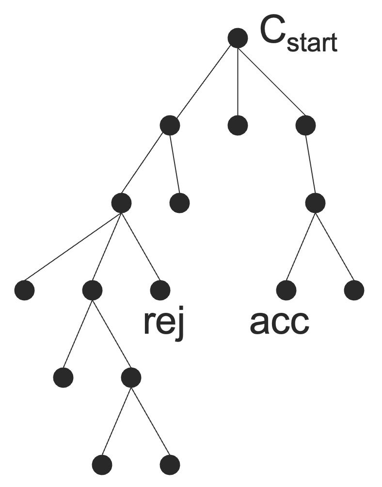

- 这棵树上的结点是 ID，叶子结点是接受/拒绝状态的 ID；
- $M$ 接受当且仅当存在至少一个接受叶子；
- 如果 $M$ 是一个判定机（decider），那么没有任何路径会永远进行下去；
- 运行时间就是最长路径的长度。

弄明白了 NTM 的运行时间，我们就可以定义 NP 问题了。

:::definition 定义 8.6
定义**非确定性时间复杂度类**（Non-Determinstic Time Complexity Class）为：

$$
\mathrm{NTIME}(t(n)) = \{L \mid \text{there exists a NTM $M$ that decides L in time $O(t(n))$}\}
$$

:::

::: definition 定义 8.7

定义 $NP$ 或者**非确定性多项式时间**（nondeterminstic polynomial time）是一类语言，它们在一个单带、非确定性图灵机上是多项式时间可判定的。

$$
NP = \bigcup_{k\ge 1}\mathrm{NTIME}(n^k)
$$

:::

其实 NP 有一个更容易使用的定义：

$$
NP = \{L \mid \text{$L$ is decided by some poly-time NTM}\}
$$

::: theorem 定理 8.7
语言 $L$ 属于 $NP$ 当且仅当它可以表达为：

$$
L = \{x \mid \exists y, |y| \le |x|^k, \langle x, y \rangle \in R\}
$$

其中，$R \in P$，判定 $R$ 的多项式时间图灵机 $M_R$ 称为**验证机**（verifier）。

:::

其中，$y$ 称为**证书**（certificate）或者**证据**（proof）。这个定理的意思是，如果一个问题是 NP 的，当且仅当，对于某个具体的解，存在多项式时间的判定方法。

举一个例子，

$$
\mathrm{HAMPATH} = \{
\langle G, s, t \rangle \mid \text{$G$ is a directed graph with a Hamiltonian path from $s$ to $t$}
\}
$$

可以表达为：

$$
\mathrm{HAMPATH} = \{
\langle G, s, t \rangle \mid \exists p, \langle \langle G, s, t \rangle , p \rangle \in R
\}
$$

$$
R = \{
\langle \langle G, s, t \rangle , p \rangle \mid \text{p is a Ham. path in $G$ from $s$ to $t$}
\}
$$

- $p$ 是一个验证 $\langle G, s, t \rangle$ 在 $\mathrm{HAMPATH}$ 中的证据；
- $R$ 是多项式时间可判定的。

HAMPATH 说的是给定一个有向图 $G$ 和起点 $s$，终点 $t$，判断图 $G$ 中是否存在从 $s$ 到 $t$ 的哈密尔顿通路。

而 $R$ 说的是，给定一个有向图 $G$、 起点 $s$、终点 $t$，以及一个具体的路径 $p$，这个 $p$ 是否是 $G$ 中从 $s$ 到 $t$ 的哈密尔顿通路。

定理 8.7 说的是，这个 $R$ 是多项式时间可判定的（暴力验证一下就可以了），从而 $\mathrm{HAMPATH}$ 是 NP 的。

下面我们来证明一下定理 8.7：

$$
L \in NP \Longleftrightarrow L = \{x \mid \exists y, |y| \le |x|^k, \langle x,y \rangle \in R, R \in P\}
$$

证明：先证必要性。下面给出一个多项式时间的 NTM 来判定 $L$。

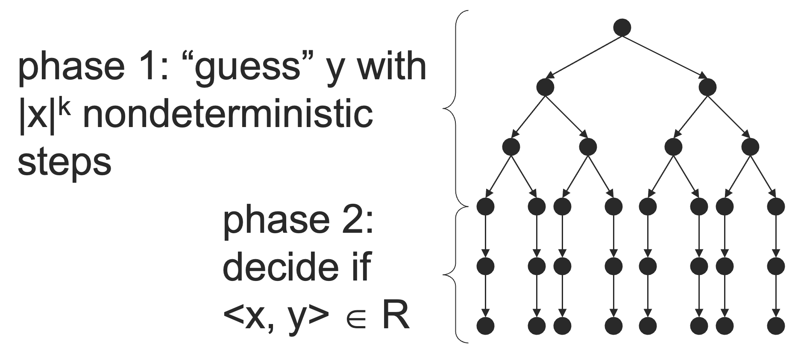

第一步：通过 $|x|^k$ 次非确定性步骤来猜测 $y$；

第二步：通过多项式时间的 DTM 来判断 $\langle x,y \rangle \in R$。

于是，我们得到了判定 $L$ 的 NTM，从而证明了 $L \in NP$。

再证充分性。给定 $L \in NP$，下面我们将 $L$ 描述为：

$$
L = \{
x \mid \exists y, |y| \le |x|^k, \langle x, y \rangle \in R
\}
$$

- 由于 $L\in NP$，假设 $L$ 可以在 $n^k$ 时间内被 NTM $M$ 判定；
- 定义语言：
  $$
  R = \{
  \langle x, y \rangle \mid \text{$y$ is an accepting computation history of $M$ on input $x$}
  \}
  $$

$R \in P$ 是显然的，我们只需要验证 $y$ 这个转化过程是否成立就可以了。

下面我们只需要检查两件事情，这个转化就能成立了：

- 接受计算历史（accepting computation history）的长度 $\le |x|^k$。
- $M$ 接受 $x$ 当且仅当 $\exists y, |y| \le |x|^k, \langle x, y \rangle \in R$。

这两件事情就留待读者思考了，想一想还是很容易理解的。

那么，我们为什么分出一类 NP 出来呢？NP 并不是一个可实现的计算模型，但是它能够捕捉到某些问题的一个很重要的计算特性：穷尽搜索可以解决。

并且，NP 类包含了极其大量的很自然的很切实际的问题。许多问题都具有形式：

$$
L = \{x \mid \exists y, \text{ s.t. } \langle x, y \rangle \in \mathbb{R}\}
$$

其中，$x$ 表现为一个问题的需求，即判定某个实体是否满足某种性质；$y$ 是我们寻找的目标，如果存在这样的一个 $y$，则 $x$ 的要求就被满足了。$R$ 描述了一种高效的（多项式时间的）测试，能够对于某个给定的具体的 $y$ 判断 $y$ 是否满足要求。

下面我们再来看一个 $NP$ 问题的例子。

称无向图中的一个**团**（clique）是一个字图，其中每两个结点都相连。

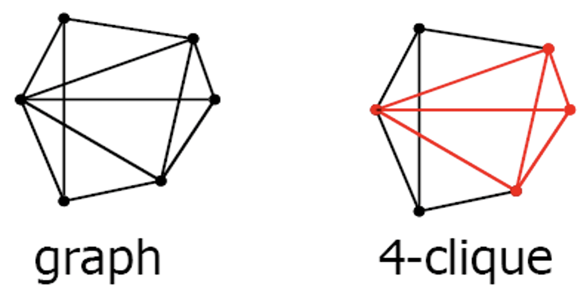

定义 $\mathrm{CLIQUE} = \{\langle G, k \rangle \mid \text{graph } G \text{ has a } k\text{-clique}\}$，则 $\mathrm{CLIQUE} \in NP$。

证明：构造一个 NTM $N$，可以在多项式时间内判定 $CLIQUE$。

$N$ 在输入 $\langle G, k \rangle$ 的时候：

1. 非确定性地选择 $G$ 的一个 $k$ 个结点的字图 $c$；
   - 由于是非确定性的，如果存在，一定会选到对的那一个。
2. 检查 $G$ 是否包含 $c$ 中任意两点形成的边。
   - 这件事情可以在多项式时间内完成。
3. 如果是，则接受；否则拒绝。

另一种证明方式： $CLIQUE$ 可以表达为 $CLIQUE = \{\langle G, k\rangle \mid \exists c, \langle \langle G, k\rangle, c\rangle \in R \}$。

其中

$$
R = \{\langle \langle G, k \rangle, c \rangle \mid \text{$c$ is a set of $k$ nodes in $G$, and all the $k$ nodes are connected in $G$}\}
$$

很容易证明 $R \in P$。

定义 $EXP = \bigcup_{k\ge 1}\mathrm{TIME}(2^{n^k})$，则有：

- $P \subseteq NP$
  - 因为一个多项式时间的 DTM 本身就是一个多项式时间的 NTM。
- $NP \subseteq EXP$
  - 因为一个深度为 $n^k$ 的判定机 NTM 的执行树会有最多 $b^{n^k}$ 个结点；
  - 我们可以在 $O(b^{n^k})$ 的时间内遍历整棵树。

不过，我们并不知道，这两个包涵关系哪个是真包含，即点在对于 $P$ 是否等于 $NP$ 以及 $NP$ 是否等于 $EXP$ 还没有定论。

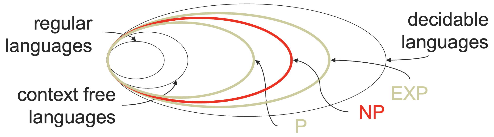

### 8.3.3 归约

给定一个新的问题 $\mathit{NEW}$，我们如果想要说明这个问题不可判定，我们通常会有两种思路：

- 从头证明这个问题是不可判定的；
- 说明如何将一个已知的不可判定的问题 $\mathit{OLD}$ 转化成 $\mathit{NEW}$，使得 $\mathit{NEW}$ 的解决方案也可以用来解决 $\mathit{OLD}$。
  - 如果 $\mathit{NEW}$ 可判定的话，那么用 $\mathit{NEW}$ 的解决方案来解决 $\mathit{OLD}$，则 $\mathit{OLD}$ 也就可判定了，和 $\mathit{OLD}$ 不可判定矛盾。

**归约**（reduction）是一种将一个问题转化成另一个问题的方式，使得第二个问题的解决方案也可以用来解决第一个问题。

在理论计算机科学中，归约是最重要的，也是最常使用的技法之一。特别是在证明一个问题“难”这件事情上。

- 通常从头证起是很困难的；
- 有时候根本不知道从头怎么做；
- 而归约使得我们能够通过给出一种问题转化的算法来证明。

归约通常有两种方式：

- 多对一的归约（many-one reduction）（通常做法）
- 映射归约（mapping reduction）（有时候会用）

下面是从语言 $A$ 到语言 $B$ 的归约的图示：

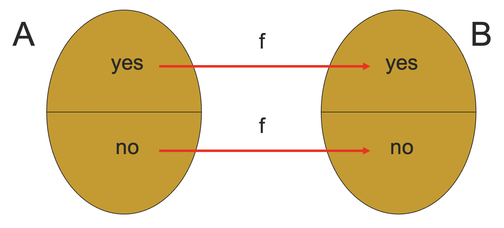

函数 $f$ 应该是**可计算**（computable）的。

:::definition 定义 8.8
$f:\Sigma^* \to \Sigma^*$ 是**可计算的**（computable），如果存在一个图灵机 $M_f$，使得对于每一个 $w \in \Sigma^*$，$M_f$ 输入 $w$ 后，将 $f(w)$ 写到它的纸带上，然后停机。
:::

:::definition 定义 8.9
$A$ 可以被映射归约（mapping reducible）为 $B$，写作 $A \le_{m} B$，如果存在一个可计算的函数 $f$，使得对于所有的 $w$：

$$
w \in A \Longleftrightarrow f(w) \in B
$$

$f$ 被称为从 $A$ 到 $B$ 的一个归约。

:::

这里的等价关系的含义是同真同假，即 $w \in A$ 映射到 $f(w) \in B$，$w \notin A$ 也要映射到 $f(w) \notin B$。

:::theorem 定理 8.8
如果 $A \le_{m} B$ 且 $B$ 是可判定的，那么 $A$ 也是可判定的。
:::

证明：构造 $A$ 的判定机：对于输入 $w$，计算 $f(w)$，对 $f(w)$ 调用 $B$ 的判定机，输出其结果。

这个定理的主要用法是：给定语言 $\mathit{NEW}$，寻找一个已知的不可判定的语言 $\mathit{OLD}$，然后证明 $\mathit{OLD} \le_{m} \mathit{NEW}$，从而说明 $\mathit{NEW}$ 是不可判定的。

> 即使用这个定理的逆否命题，这个地方很容易搞反归约的方向，需要特别注意。

:::theorem 定理 8.9
如果 $A \le_{m} B$ 且 $B$ 是 RE，那么 $A$ 也是 RE。
:::

证明：构造 $A$ 的识别机：对于输入 $w$，计算 $f(w)$，对 $f(w)$ 调用 $B$ 的识别机。

主要用法：给定一个语言 $\mathit{NEW}$，通过将一个已知的图灵不可识别的语言归约到 $\mathit{NEW}$ 的方式来证明 $\mathit{NEW}$ 不可识别。

下面我们来看一些例子，熟悉一下归约的操作。

#### ATM 问题不可判定

证明 $A_\mathrm{TM} = \{\langle M, w \rangle \mid M \text{ accepts input } w\}$ 是不可判定的。

我们已经知道 $\mathit{HALT}$ 问题是不可判定的了。证明 $A_\mathrm{TM}$ 不可判定的基本想法是：

- 假设 $A_\mathrm{TM}$ 是可判定的；
- 证明我们可以用 $A_\mathrm{TM}$ 来判定 $\mathit{HALT}$；
- 从而 $\mathit{HALT}$ 可判定，导出矛盾。

其中，第二步用 $A_\mathrm{TM}$ 来判定 $\mathit{HALT}$ 的过程其实就是将 $\mathit{HALT}$ 归约到 $A_\mathrm{TM}$ 的过程。

那么我们如何使用 $A_\mathrm{TM}$ 的判定机来判定 $\mathit{HALT}$ 呢？我们可以做的事情有：

- 检查是否 $\langle M, w \rangle \in A_\mathrm{TM}$；
- 构造另一个图灵机 $M'$ 并且检查是否 $\langle M', w \rangle \in A_\mathrm{TM}$。

归约（将 $\mathit{HALT}$ 归约成 $A_\mathrm{TM}$ ）过程如下：

- 对于输入 $\langle M, w \rangle$，
- 检查是否 $\langle M, w \rangle \in A_\mathrm{TM}$，
  - 如果是，则说明 $M$ 在输入 $w$ 上停机，则接受；
  - 如果否，则 $M$ 要么拒绝了 $w$，要么在 $w$ 上死循环了。
- 通过交换 $M$ 中的接受状态和拒绝状态来构造 $M'$；
- 检查是否 $\langle M', w \rangle \in A_\mathrm{TM}$，
  - 如果是，则说明 $M'$ 接受了 $w$，于是 $M$ 拒绝了 $w$，则接受；
  - 如果否，说明 $M$ 既没有接受 $w$，也没有拒绝 $w$，那么只能是死循环了，从而拒绝。

于是，我们完成了从 $\mathit{HALT}$ 到 $A_\mathrm{TM}$ 的归约，而 $\mathit{HALT}$ 问题是不可判定的，那么 $A_\mathrm{TM}$ 问题也就不可判定了。

另一种证明方式：

假设 $A_\mathrm{TM}$ 是可判定的，考虑其判定机 $H$，

- $H(\langle M, w \rangle )$ 接受，如果 $M$ 接受 $w$；
- $H(\langle M, w \rangle )$ 拒绝，如果 $M$ 拒绝 $w$。

构造一个新的图灵机 $D$，使用 $H$ 作为它的子过程，$D$ 调用 $H$ 来判断 $M$ 在输入 $M$ 自己的字符串表示的时候会发生什么。一旦 $H$ 有结果，$D$ 返回相反的结果。

- $D$ 在 $M$ 拒绝 $\langle M \rangle$ 的时候接受；
- $D$ 在 $M$ 接受 $\langle M \rangle$ 的时候拒绝。

那么如果我计算 $D(\langle D \rangle)$ 呢？ $D$ 需要在 $D$ 接受 $\langle D \rangle$ 的时候拒绝 $\langle D \rangle$，在 $D$ 拒绝 $\langle D \rangle$ 的时候接受 $\langle D \rangle$。这让 $D$ 情何以堪呢？于是出现了矛盾，假设错误，$A_\mathrm{TM}$ 不可判定。

#### ETM 问题不可判定

下面我们再看一个证明不可判定性的例子。

$$
E_\mathrm{TM} = \{\langle M \rangle \mid L(M) = \emptyset \}
$$

我们现在可以从哪些问题开始归约呢？

- $\mathit{HALT} = \{ \langle M, w \rangle \mid M \text{ halts on input } w \}$
- $A_\mathrm{TM} = \{\langle M, w \rangle \mid M \text{ accepts input } w\}$

一些我们可以做的事情：

- 检查是否 $\langle M \rangle \in E_\mathrm{TM}$；
- 构造另一个图灵机 $M'$ 并检查是否 $\langle M' \rangle \in E_\mathrm{TM}$。

给定输入 $\langle M, w \rangle$，我们想要使用一个可以判定 $E_\mathrm{TM}$ 的过程来判定是否 $\langle M, w \rangle \in A_\mathrm{TM}$。

想法：构造另一个图灵机 $M'$，这个图灵机出了可能的 $w$ 之外拒绝一切别的输入。这样，我们就可以利用 $M'$ 的语言是否为空来判断 $M$ 是否接受 $w$ 了。

$M'$ 的构造方法：

- 对于输入 $x$，如果 $x \ne w$，则直接拒绝；
- 对于输入 $x$ 上模拟 $M$，在 $M$ 接受的时候接受。

下面我们来构造可以判断 $A_\mathrm{TM}$ 的图灵机：

- 对于输入 $\langle M, w \rangle$：
  - 根据 $M$ 的描述来构造 $M'$；
  - 检查是否 $M' \in E_\mathrm{TM}$
    - 如果否，$M$ 一定接受了 $w$，则接受；
    - 如果是，$M$ 不可能接受 $w$，则拒绝。

于是，我们将 $A_\mathrm{TM}$ 问题归约到了 $E_\mathrm{TM}$ 问题，如果 $E_\mathrm{TM}$ 可判定，那么 $A_\mathrm{TM}$ 也就可判定了，这是矛盾的。因此 $E_\mathrm{TM}$ 不可判定。

### 8.3.4 Rice 定理

我们已经看到，图灵机的如下一些性质是不可判定的：

- 图灵机 $M$ 接受字符串 $w$；
- 图灵机 $M$ 在输入字符串 $w$ 的时候停机；
- 图灵机 $M$ 接受语言为空。

那么，我们可以为所有的性质归纳一种简单的，通用的归约方法来一劳永逸地证明么？

答案是可以的。图灵机所有的**非平凡的**（nontrivial）性质都是不可判定的。

::: definition 定义 8.10
一个图灵机的**性质**（property）指的是一个语言 $P$，满足对于任意两个图灵机 $M_1, M_2$，如果 $L(M_1) = L(M_2)$，则

$$
\langle M_1 \rangle \in P \Longleftrightarrow \langle M_2 \rangle \in P
$$

如果存在一个图灵机 $M_1$，使得 $\langle M_1 \rangle \in P$ 且存在一个图灵机 $M_2$，使得 $\langle M_2 \rangle \notin P$，则称 $P$ 是一个**非平凡**（nontrivial）的性质。

:::

::: theorem 定理 8.10
**Rice 定理**：图灵机的每一个非平凡的性质都是不可判定的。
:::

## 8.4 NPC

### 8.4.1 多项式时间归约

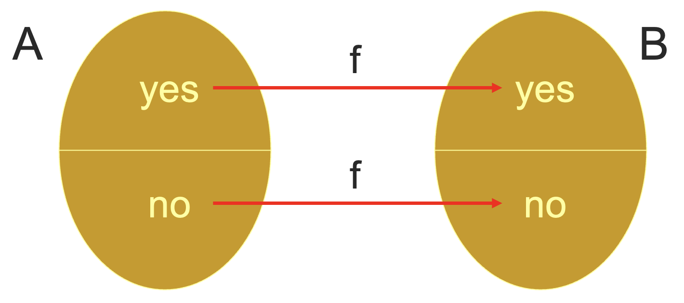

::: definition 定义 8.11
称函数 $f:\Sigma^* \to \Sigma^*$ 是**多项式时间可计算的**（poly-time computable），如果对于某个 $g(n) = n^{O(1)}$，存在一个 $g(n)$ 时间的图灵机 $M_f$，使得对于每一个 $w\in\Sigma^*$，$M_f$ 在它的纸带上输出 $f(w)$ 并停机。
:::

::: definition 定义 8.12
称 $A$ 可以**多项式时间归约到**（poly-time reduced to）$B$，记为 $A \le_P B$，如果存在一个多项式时间可计算的函数 $f$，使得

$$
\forall w, w\in A \Leftrightarrow f(w) \in B
$$

:::

和之前一样，这里的等价说的是同真同假，并且能够归约，意味着 $B$ 至少和 $A$ 一样难，或者说 $B$ 至少和 $A$ 具有一样的表达力。

::: theorem 定理 8.11
如果 $A \le_P B$ 且 $B \in P$，那么 $A \in P$。
:::

证明：下面给出一个判定 $A$ 的多项式时间的算法：

- 对于输入 $w$，在多项式时间内计算 $f(w)$；
- 运行多项式时间的算法来判断是否 $f(w) \in B$；
  - 如果 $f(w) \in B$，则 $w \in A$；
  - 如果 $f(w) \notin B$，则 $w \notin A$。

### 8.4.2 NP 完全理论

::: definition 定义 8.13
称一个语言 $B$ 是 **NP 完全的**（NP-Complete），如果它满足以下两个条件：

1. $B \in NP$；
2. $\forall A \in NP, A \le_P B$。

称 $B$ 是 **NP 难的**（NP-hard），如果我们忽略第一个条件。
:::

“难”和“完全”的这两个概念可以推广到其他的问题中：

- 语言 $L$ 是 **C-hard**，如果 $C$ 中的每一个问题都可以归约到 $L$。
- 语言 $L$ 是 **C-complete**，如果 $L$ 是 C-hard 且 $L \in C$。

::: theorem 定理 8.12
如果 $B$ 是 NP 完全的，且 $B \in P$，那么 $P = NP$。
:::

::: theorem 定理 8.13
如果 $B$ 是 NP 完全的，且对于 $C\in NP$，$B \le_P C$，那么 $C$ 也是 NP 完全的。
:::

::: theorem 定理 8.14
下面三个命题等价：

1. $P = NP$；
2. 每一个 NP 完全的语言都在 $P$ 中；
3. 某些 NP 完全的语言在 $P$ 中。

:::

### 8.4.3 SAT 问题

如果存在某种对于逻辑变量的赋值方式，使得某个布尔表达式为真，则称这个布尔表达式是**可满足的**（satisfiable）。

于是，我们定义 SAT 问题如下：

$$
SAT = \{\langle \varphi \rangle \mid \text{$\varphi$ is a satisfiable Boolean formula}\}
$$

比如说 $\Phi = (\neg x \wedge y) \vee (x \wedge \neg z)$。

::: thorem 定理 8.15
Cook-Levin 定理：SAT 问题是 NP 完全的。
:::

证明思路：

1. $SAT \in NP$：
   - 猜测一种可能的赋值方式，然后在多项式时间内验证这种赋值方式是否满足要求。
2. $\forall A\in NP, A\le_P \mathrm{SAT}$：
   - 证明想法：令 $M$ 是一个在 $n^k$ 时间内判定 $A$ 的 NTM。对于任意输入字符串 $w$，构造一个逻辑表达式 $\varphi_{M, w}$，当且仅当 $M$ 接受 $w$ 的时候 $\varphi_{M, w}$ 可满足。

更特殊地，3SAT 问题也是一个 NP 完全问题。

$$
\mathrm{3SAT} = \{\langle \varphi \rangle \mid \text{$\varphi$ is a satisfiable  3cnf-formula}\}
$$

也就是说，逻辑表达式是一个主析取范式，每个和取从句中最多有 3 个命题。

## 8.5 复杂度理论

复杂度理论研究的是，有限资源下，怎样的问题是计算层面可行的。这里有限的资源可能是运行时间、存储空间、随机比特数、并行程度，交互轮数等等。不过，一般我们主要关注的是运行时间。

### 8.5.1 空间复杂度

之前我们已经定义了时间复杂度为一个函数 $f:\mathbb{N} \to \mathbb{N}$，其中 $f(n)$ 是图灵机 $M$ 在接受长度为 $n$ 的输入时所需要的最大步骤数。

类似的，我们可以定义空间复杂度为一个函数 $f:\mathbb{N} \to\mathbb{N}$，其中 $f(n)$ 是图灵机 $M$ 在接受长度为 $n$ 的输入的时候会扫过的最大的纸带格子数量。

### 8.5.2 复杂度类

之前，我们定义过时间复杂度类：

$$
\mathrm{TIME}(t(n)) = \{
L \mid \text{there exists a TM $M$ that decides $L$ in time $O(t(n))$}
\}
$$

具体地：

$$
P \bigcup_{k \ge 1} \mathrm{TIME}(n^k) , \mathit{EXP} = \bigcup_{k \ge 1} \mathrm{TIME}(2^{n^k})
$$

类似的，我们可以定义空间复杂度类：

$$
\mathrm{SPACE}(t(n)) = \{
L \mid \text{there exists a TM $M$ that decides $L$ in space $O(t(n))$}
\}
$$

具体地：

$$
\mathit{PSPACE} = \bigcup_{k\ge 1} \mathrm{SPACE}(n^k)
$$

当然，非确定性只需要前面加一个 N 就可以了，这里不再赘述了。

我们会有如下关系：

$$
P \subseteq \mathit{NP} \subseteq \mathit{PSPACE} \subseteq \mathit{EXP}
$$

不过，我们并不知道上面哪些包含关系是真包含。

类似的，还有 $CoNP, NPSPACE, PSComplete$ 等等关系。虽然时间上是否 $P = NP?$ 还未有定论，但是 $PS = NPS$ 是已经证明了的。

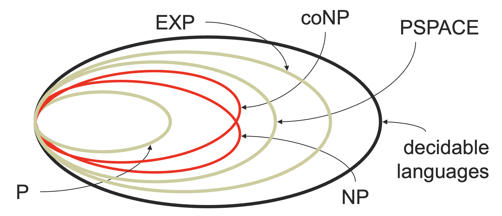

### 8.5.3 Church-Turing 理论

Church-Turing 理论说明了两件事情：

1. 图灵机足够强：
   - 任何我们能够在物理计算机上计算的东西都可以在图灵机上计算。
2. 图灵机足够快：
   - 任何我们可以在物理计算机上 $t(n)$ 时间计算的东西，都可以在图灵机上 $t(n)^{O(1)}$。
   - 也就是说，图灵机的速度是多项式时间下降的，不会影响算法的高效性。
