# 9 迁移系统

## 9.1 迁移系统基本概念

### 9.1.1 直观理解

**迁移系统**（transition system，TS）是一个反应式的系统，直觉上它由一个所有可能状态的集合以及一些迁移（transition）——或者说状态转换（state change）——的集合组成。

比如说，对于交通信号灯来说，当前信号灯的颜色就是这个系统的状态，信号灯颜色的改变就是这个系统的迁移。

再比如说，对于一个程序来说，这个程序中所有变量的值以及 PC 的值就是这个程序的状态，一个程序语句的执行会导致这个程序状态的改变。

当一个状态转换是由于一个外部的事件或者是由于系统的某个行为产生的，那么我们就使用那个事件或者行为来标记这个迁移。

迁移系统是一种描述系统行为的模型，我们可以用有向图来表示，图中的结点表示状态，边表示迁移行为（状态转换）。

下图是一个饮料自动售货机的迁移系统：

<p style="text-align:center">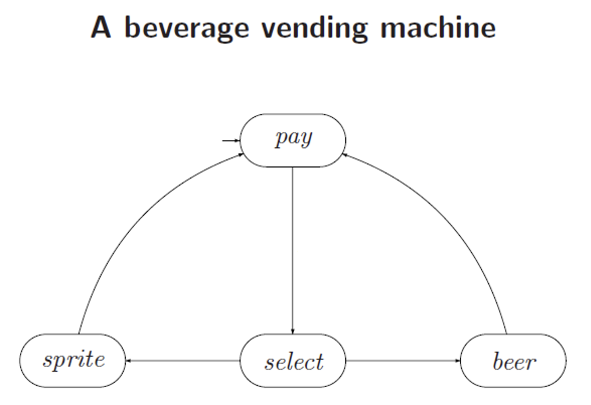</p>

#### 9.1.2 形式化定义

::: definition 定义 9.1
迁移系统是一个五元组 $\mathcal{A} = \langle S, S_0, T, \alpha, \beta\rangle$，其中

- $S$ 是一个有限的或者无限的状态（states）集合；
- $S_0 \subseteq S$ 是初始状态集；
- $T$ 是一个有限的或者无限的转移（transitions）集合；
- $\alpha$ 和 $\beta$ 是两个从 $T$ 到 $S$ 的映射，对于任意的迁移 $t \in T$，$\alpha(t)$ 表示迁移 $t$ 的**源**（source）状态，$\beta(t)$ 表示迁移 $t$ 的**目标**（target）状态。

源状态为 $s$，目标状态为 $s'$ 的迁移 $t$ 写作 $t: s\to s'$。多个迁移可以有相同的源状态或者目标状态。
:::

如果 $S$ 和 $T$ 都是有限的，那么这个迁移系统也是有限的。

::: definition 定义 9.2
一个迁移系统 $\mathcal{A} = \langle S, S_0, T, \alpha, \beta\rangle$ 中长度为 $n(n > 0)$ 的**路径**（path）是一个迁移的序列 $t_1, t_2, \cdots, t_n$，使得

$$
\forall i, 1\le i < n, \beta(t_i) =\alpha(t_{i+1}) \wedge \alpha(t_1) \in S_0
$$

类似的，一个无限的路径是一个无限的迁移序列 $t_1, t_2, t_3, \cdots$，使得

$$
\forall i \ge 1, \beta(t_i) = \alpha(t_{i+1}) \wedge \alpha(t_1) \in S_0
$$

:::

如果 $\exists t\in T, \alpha(t) = s \wedge \beta(t) = s'$，则称 $s \to s'$，基于此，我们定义一种更加泛化的关系 $\twoheadrightarrow \subseteq S \times S$ 使得

- 若 $s \to s'$，则 $s \twoheadrightarrow s'$；
- 若 $s \twoheadrightarrow s'$，$s' \twoheadrightarrow s''$，则 $s \twoheadrightarrow s''$。

令 $\mathcal{A} = \langle S, S_0, T, \alpha, \beta \rangle$ 是一个迁移系统，我们称一个状态 $s$ 是可达（reachable）的，如果 $s \in S, s_0 \in S_0, s_0 \twoheadrightarrow s$；称一个状态 $s$ 是终结状态（terminal state），如果不存在状态 $s'$ 使得 $s \to s'$。

如果一个状态 $s$ 是可达的，并且是一个终结状态，那么我们称 $s$ 是一个死锁状态（deadlock state）。

记 $T^+$ 是所有有限路径的集合，$T^{\omega}$ 是所有无限路径的集合。我们可以将原本定义在 $S \times S$ 上的 $\alpha$ 和 $\beta$ 拓展到 $T^+ \times S$ 上。

- $\alpha(t_1\cdots t_n) = \alpha(t_1), \beta(t_1\cdots t_n) = \beta(t_n)$
- 一个有限的路径 $c$ 代表了一个迁移系统从状态 $\alpha(c)$ 到状态 $\beta(c)$ 的一个有限的演化过程。

类似地，定义 $\alpha(t_1\cdots) = \alpha(t_1)$ 可以将 $\alpha$ 拓展到 $T^{\omega} \times S$ 上。

- 一个无限的路径 $c$ 代表了一个迁移系统从状态 $\alpha(c)$ 开始的一个无限的演化过程。

一种 $T^+$ 上的偏积可以如下定义：

- 若 $c = t_1t_2\cdots t_n$ 是一个长度为 $n$ 的路径，$c' = t_1't_2'\cdots t_m'$ 是一个长度为 $m$ 的路径，且 $\beta(c) = \alpha(c')$；
- 则 $c\cdot c' = t_1\cdots t_nt_1'\cdots t_m'$ 是一个有限的路径，长度为 $n + m$，且 $\alpha(c\cdot c') = \alpha(c), \beta(c\cdot c') = \beta(c')$。

类似的，我们也可以定义 $T^+ \times T^{\omega}$：如果 $c$ 是一个有限路径，$c'$ 是一个无限路径，使得 $\beta(c) = \alpha(c')$，则 $c\cdot c'$ 也是一个无穷路径，且 $\alpha(c\cdot c') = \alpha(c)$。

对于每个状态 $s \in S$，定义空路径 $\varepsilon_{s}$ 的长度为 $0$，且 $\alpha(\varepsilon_{s}) = \beta(\varepsilon_{s}) = s$。

若 $c$ 是一个有穷路径且 $s = \alpha(c), s' = \beta(c)$，则 $\varepsilon_{s} \cdot c = c = c \cdot \varepsilon_{s'}$；如果 $c$ 是一个无穷路径且 $s = \alpha(c)$，那么 $\varepsilon_{s} \cdot c = c$。

### 9.1.3 带标签的迁移系统

::: definition 定义 9.3
一个被字母表 $A$ 标记的，**带标签的迁移系统**（labeled transition system）是一个 6 元组 $\mathcal{A} = \langle S, S_0, T, \alpha, \beta, \lambda\rangle$，其中

- $\langle S, S_0, T, \alpha, \beta\rangle$ 是一个迁移系统；
- $\lambda$ 是一个从 $T$ 到 $A$ 的映射，将 $T$ 中的每一个迁移映射成 $A$ 中的标签 $\lambda(t)$。

:::

直觉上，一个迁移的标签意味着触发这个迁移的行为或者事件。

我们假设两个不同的迁移不可以具有相同的源状态、目标状态和标签，这是符合逻辑的。因为我们没有必要去区分两个由同样的行为 $\lambda(t) = \lambda(t')$ 触发的使得迁移系统从同样的源状态 $\alpha(t) = \alpha(t')$ 跳转到同样的目标状态 $\beta(t) = \beta(t')$ 的两个迁移 $t$ 和 $t'$。

这就意味着 $\langle\alpha,\lambda,\beta\rangle : T\to S\times A\times S$ 是一个单射（单射意味着每个不同的输入会有不同的输出）。

不过对于一个给定的状态，同样的行为或者事件可以引起两个不同的迁移，从而导向不同的状态，也就是说：$\alpha(t) = \alpha(t')$ 且 $\lambda(t) = \lambda(t')$ 并不一定能够导出 $t = t'$。

之前的自动售货机模型的带标签的迁移系统版本如下：

<p style="text-align:center">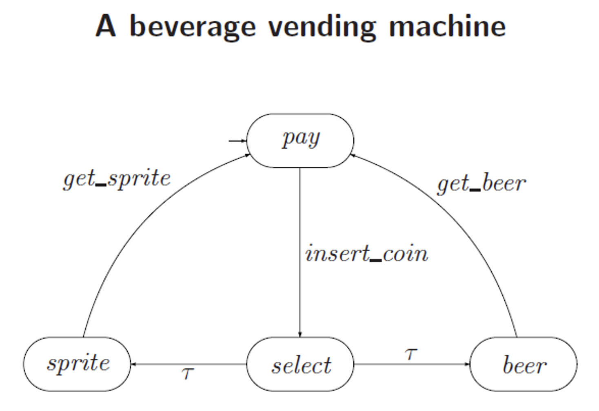</p>

其中 $\tau$ 表示不需要事件驱动的内部行为或者观察不到的行为。

::: definition 定义 9.3

如果 $c=t_1,t_2,\cdots$ 是一个带标签的迁移系统中的路径，那么触发这些迁移的行为的序列 $trace(c) = \lambda(t_1), \lambda(t_2),\cdots$ 称作这个路径的**踪迹**（trace）。

:::

## 9.2 迁移系统的等价性

首先回忆一下严格的等价关系的定义：

一个关系 $R \subseteq X \times X$ 是一个等价关系，当且仅当其满足：

- 自反性（reflexive）：$\forall x \in X, (x, x) \in R$；
- 对称性（symmetric）：$\forall x, y \in X, (x, y) \in R \to (y, x) \in R$；
- 传递性（transitive）：$\forall x,y,z\in X, (x, y) \in R \wedge (y, z) \in R \to (x, z) \in R$。

不过在迁移系统当中，存在多种对于等价性的表示方法，它们所表示的“等价”的程度是有所区别的，具体地，我们下面会考虑三种等价：

- 强同构等价（strong isomorphism equivalence）
- 弱同构等价（weak isomorphism equivalence）
- 双模拟等价（bisimulation equivalence）

<p style="text-align:center">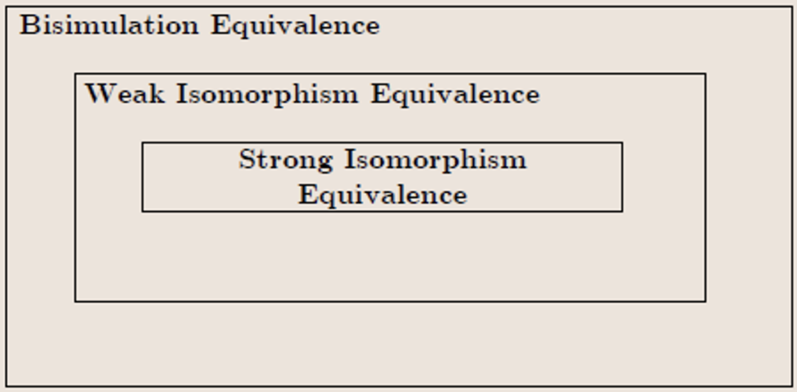</p>

### 9.2.1 强同构等价

在介绍强同构之前，我们先介绍一下迁移系统同态概念，因为同构是一种特殊的同态。

::: definition 定义 9.4
令 $\mathcal{A} = \langle S, S_0, T, \alpha, \beta \rangle$ 和 $\mathcal{A}' = \langle S', S_0', T', \alpha',\beta'\rangle$ 是两个迁移系统。从 $\mathcal{A}$ 到 $\mathcal{A}'$ 的一个**迁移系统同态**（transition system homomorphism）$h$ 是一个映射的二元组 $(h_{\sigma}, h_{\tau})$，其中

$$
h_{\sigma}:S \to S', h_{\tau}:T\to T'
$$

满足对于 $T$ 中的每一个转移 $t$，都有

$$
\alpha'(h_{\tau}(t)) = h_{\sigma}(\alpha(t)), \beta'(h_{\tau}(t)) = h_{\sigma}(\beta(t))
$$

:::

::: definition 定义 9.5
令 $\mathcal{A} = \langle S, S_0, T, \alpha, \beta, \lambda \rangle$ 和 $\mathcal{A}' = \langle S', S_0', T', \alpha',\beta',\lambda'\rangle$ 是两个带标签的迁移系统。从 $\mathcal{A}$ 到 $\mathcal{A}'$ 的一个**带标签的迁移系统同态**（labeled transition system homomorphism）$h$ 是一个迁移系统同态，并且还满足条件：

$$
\lambda'(h_{\tau}(t)) = \lambda(t)
$$

:::

我们称一个同态 $h$ 是满射的（surjective），如果两个映射 $h_{\sigma}$ 和 $h_{\tau}$ 都是满射。如果 $h$ 是一个从 $\mathcal{A}$ 到 $\mathcal{A}'$ 的满射同态，迁移系统 $\mathcal{A}'$ 就称为 $\mathcal{A}$ 在 $h$ 下的商。

::: definition 定义 9.6
一个**迁移系统强同构**（TS strong isomorphism）$h$ 是一个迁移系统同态，并且 $h_{\sigma}$ 和 $h_{\tau}$ 都是双射。强同构简称同构。

如果存在一个从迁移系统 $\mathcal{A}$ 到迁移系统 $\mathcal{A}'$ 的强同构，我们称这 $\mathcal{A}$ 与 $\mathcal{A}'$ 是**强同构的**（strong isomorphic）。
:::

一个同构 $h = (h_{\sigma}, h_{\tau})$ 的逆同态 $g = (g_{\sigma}, g_{\tau}), g_{\sigma} = h_{\sigma}^{-1}, g_{\tau} = h_{\tau}^{-1}$ 依旧是一个同构。

同构是一种等价关系，并且是一种很强的等价关系。如果两个迁移系统是同构的，那么它们唯一的区别就只能是状态和迁移的命名不同了。

考虑如下的两个迁移系统，它们同构吗？

<p style="text-align:center">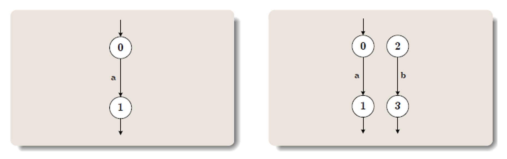</p>

它们其实是不同构的，但这两个迁移系统的行为其实是肉眼可见地等价的。因此，同构这个等价性的要求有些过于高了，必须除了名字以外一摸一样才行，这往往是不必要的。

### 9.2.2 弱同构等价

对于一个迁移系统的状态 $s$，如果 $s_0 \in S_0 \wedge s_0 \twoheadrightarrow s$，则称这个状态是可达的。

考虑两个迁移系统中可达的状态，以及定义在这些状态上的迁移，我们可以得到两个可达子迁移系统。如果这两个可达子迁移系统是同构的，我们称原来的两个迁移系统是**弱同构**（weak isomorphic）的。

因此，下面两个系统是弱同构的。

<p style="text-align:center"></p>

- 弱同构也是一种等价关系。
- 如果两个系统是同构的，那么它们一定也是弱同构的。

### 9.2.3 双模拟等价

在实际应用当中，我们更多的用的是这种等价。

::: definition 定义 9.7
令 $\mathcal{A} = \langle S, S_0, T, \alpha, \beta \rangle$ 和 $\mathcal{A}' = \langle S', S_0', T', \alpha',\beta'\rangle$ 是两个迁移系统，在 $\mathcal{A}$ 和 $\mathcal{A}'$ 之间的一个**双模拟**（bisimulation）
是一个二元关系 $B \subseteq S \times S'$，使得

- $B(S_0, S_0')$；
- 如果 $B(s_1, s_1')$ 且 $s_1 \to s_2$，则存在一个 $s_2'\in S'$，使得 $s_1' \to s_2'$ 且 $B(s_2, s_2')$；
- 如果 $B(s_1, s_1')$ 且 $s_1' \to s_2'$，则存在一个 $s_2 \in S$，使得 $s_1 \to s_2$ 且 $B(s_2, s_2')$。

称 $\mathcal{A}$ 和 $\mathcal{A}'$ 是**双模拟等价的**（bisimulation equivalent），当且仅当存在一个 $\mathcal{A}$ 和 $\mathcal{A}'$ 之间的双模拟。

:::

双模拟的含义就是两个迁移系统可以相互模拟对方的运行。下面是一个双模拟的例子。

<p style="text-align:center"></p>

两个同构或者弱同构的迁移系统一定是可以双模拟的，但是两个可以双模拟的迁移系统不一定具有同构或者弱同构的关系。

此外，一些看似行为等价的迁移系统也不一定会满足双模拟关系。比如说下面的这个例子。

<p style="text-align:center">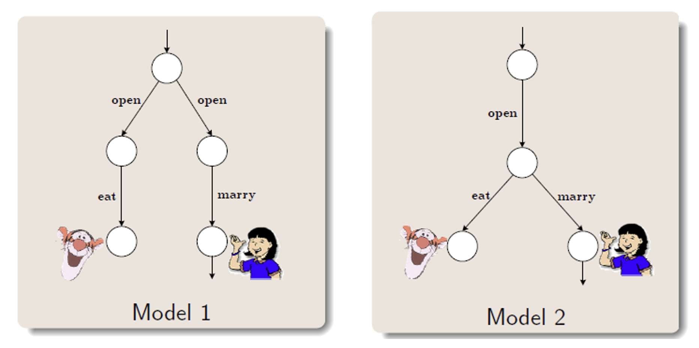</p>

#### 9.2.4 简单总结

- 强同构：两个迁移系统除了状态命名不同以外其他都是一样的。
- 弱同构：两个迁移系统的可达子系统是强同构的。
- 双模拟：迁移系统具有相同的行为，并在同一时刻做选择。

迁移系统等价性的一个应用是，比如说我想要证明两个建模语言是等价的，我们可以用迁移系统来刻画它们的行为，然后通过证明迁移系统的等价性来证明建模语言行为的等价性。

## 9.3 迁移系统的运算

### 9.3.1 迁移系统的自由积

::: definition 定义 9.8
考虑 $n$ 个迁移系统，记为 $\mathcal{A}_i = \langle S_i, {S_0}_i, T_i, \alpha_i, \beta_i \rangle$，这 $n$ 个系统的**自由积**（free product）是一个迁移系统 $\mathcal{A} = \langle S, S_0, T, \alpha, \beta \rangle$ 定义为

$$
S = S_1 \times S_2 \times \cdots \times S_n\\
T = T_1 \times T_2 \times \cdots \times T_n\\
\alpha(t_1, \cdots , t_n) = \langle\alpha_1(t_1),\cdots,\alpha_n(t_n)\rangle\\
\beta(t_1, \cdots , t_n) = \langle\beta_1(t_1), \cdots,\beta_n(t_n)\rangle
$$

此外，若每个 $\mathcal{A}_i$ 都被一个字母表 $A_i$ 标记了，则自由积被 $A_1 \times A_2 \times \cdots \times A_n$ 标记，标记方式为：

$$
\lambda(t_1, \cdots, t_n) = \langle\lambda_1(t_1), \cdots , \lambda_n(t_n)\rangle
$$

:::

下面是一个自由积的例子，左侧是两个迁移系统，右侧是他们的自由积。

<p style="text-align:center">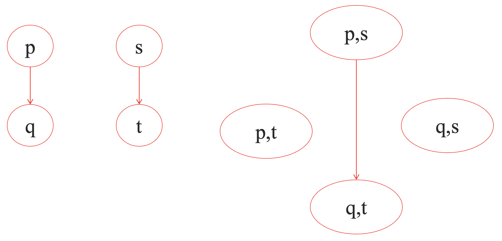</p>

从自由积的定义中，我们可以看出，自由积假设在一个全局系统当中，所有的子系统都是同时执行它们的转移的。我们可以将时间分成一系列的时刻，在每个时刻，每个子迁移系统都恰好执行一次迁移。换句话说，我们相当于是使用同一个“时钟”来驱动了多个迁移系统，从而形成了自由积这样的全局系统。

具体地，如果迁移系统 $\mathcal{A}$ 处于全局状态 $s = \langle s_1, \cdots ,s_n \rangle$，每个子迁移系统 $\mathcal{A}_i$ 处于状态 $s_i$。那么每个 $\mathcal{A}_i$ 都可以独立地选择 $t_i$，从而改变成状态 $s_i'$。在每个子迁移系统都同时完成一次迁移之后，自由积就相当于完成了一次全局迁移 $t = \langle t_1, \cdots ,t_n\rangle$，$\mathcal{A}$ 的全局状态变成了 $s' = \langle s_1' , \cdots , s_n'\rangle$。如果是带标签的迁移系统的话，向量 $\lambda(t)$ 就是触发全局迁移 $t$ 的全局行为。

### 9.3.2 迁移系统的同步积

当进程之间进行交互的时候，并不是所有可能的全局行为都是有用的，因为这些交互会受到进程通信和同步的限制。

因此，描述多进程系统的迁移系统一定是各个进程对应的各自迁移系统的自由积的一个子系统，我们可以用同步积来表达这种受到通信和同步约束的全局系统。

::: definition 定义 9.9

如果 $\mathcal{A}_i, i = 1, 2, \cdots, n$ 这 $n$ 个迁移系统分别带有字母表 $A_i, i = 1, 2, \cdots, n$ 所定义的标签，并且 $I \subseteq A_1 \times A_2 \times \cdots \times A_n$ 是一个**同步约束**（synchronous product），那么 $\mathcal{A}_i, i = 1, 2, \cdots , n$ 再 $I$ 约束下的**同步积**（synchronous product），写作 $\langle \mathcal{A}_1 ,\cdots ,\mathcal{A}_n, I\rangle$，是 $\mathcal{A}_i, i = 1, 2, \cdots, n$ 的自由积，但是只包含满足 $\langle \lambda_1(t_1), \cdots ,\lambda_n(t_n)\rangle \in I$ 的全局迁移 $\langle t_1, \cdots ,t_n\rangle$。

:::

换句话说，同步积只允许标签向量在同步约束中的全局迁移发生。

比如说，下图中，右侧迁移系统是左侧两个迁移系统的自由积。

<p style="text-align:center">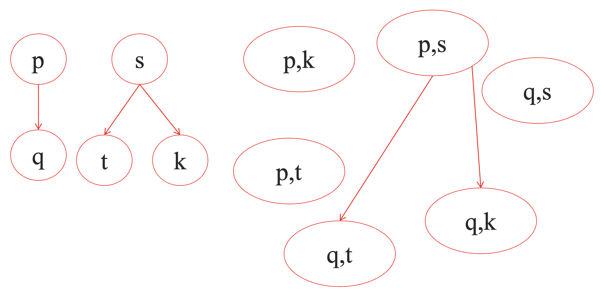</p>

如果加上标签，但是不加同步限制的话，带标签的自由积如下图所示。

<p style="text-align:center">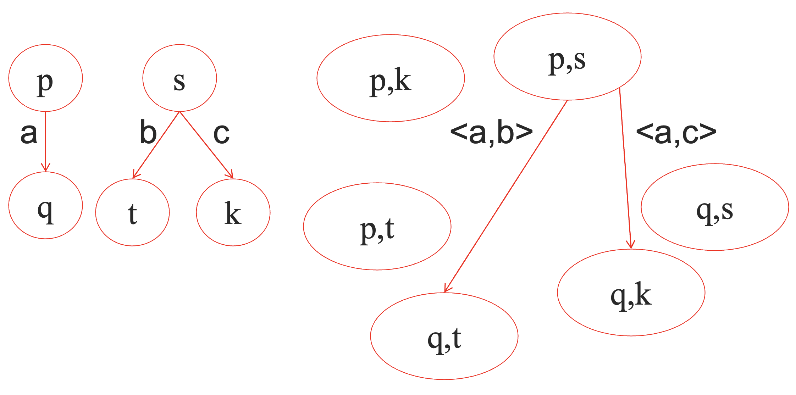</p>

但如果我们加上 $\{\langle a, b\rangle\}$ 作为同步限制，那么其同步积则如下图所示。

<p style="text-align:center">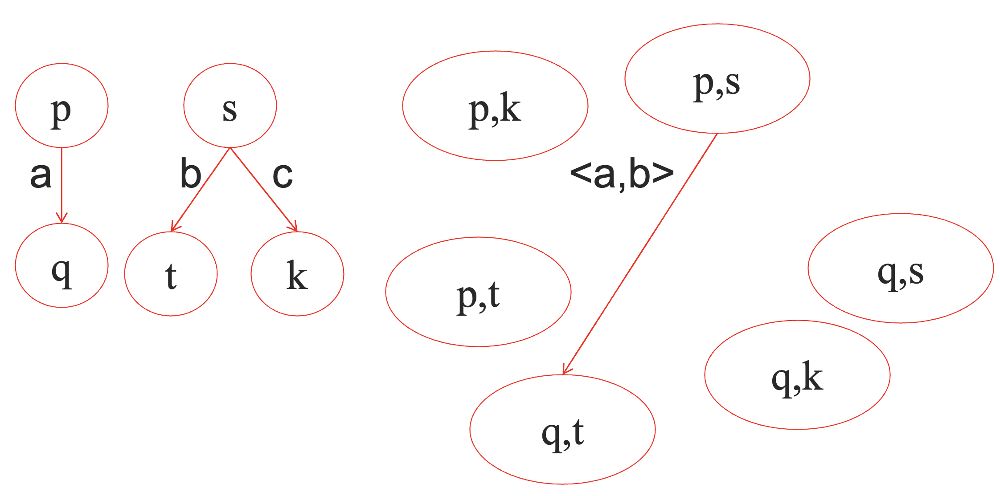</p>

其实，同步限制当中的每个元素，就是一个可以同时发生的迁移所组成的向量。

#### 9.3.3 $\tau$ 迁移和共享标签

自由积的定义本身有一个同步时钟的限制在里面，即所有的子迁移系统必须“共同进退”，我们可以引入 $\tau$ 迁移的方式来消解这种限制。具体来说，假设所有状态都具有一个自环转移，记为 $\tau$，这样的话，每个子系统就可以独立的选择是否要进行一个实质性的迁移，还是说作一个 $\tau$ 迁移以保持当前状态不变了。

下图的右侧就是左侧两个迁移系统引入 $\tau$ 迁移情况下的自由积。

<p style="text-align:center">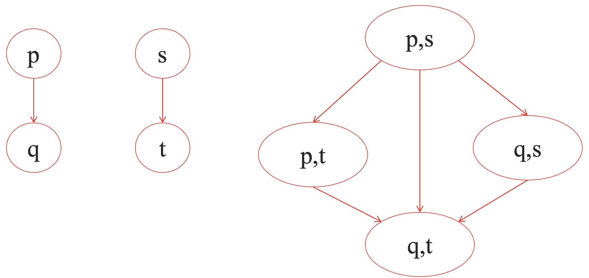</p>

除了显示的将所有可能同时发生的迁移列出来作为同步限制以外，我们也可以使用共享标签来表示两个迁移必须同时发生，这样在表达上面会更加简洁。不过这并没有拓展同步积的表达能力就是了，只是换了一种更简便的表达方式而已。

比如说下图的左侧是三个具有共享标签的迁移系统，右侧是它们的同步积。

<p style="text-align:center"></p>

## 9.4 利用迁移系统建模

### 9.4.1 建模时序电路

例如，对于具有输入变量 $x$，输出变量 $y$，寄存器 $r$，输出函数 $\neg (x \oplus r)$，寄存器评测函数 $x \vee r$ 的时序电路，可以用迁移系统进行如下建模（其中状态结点上放的集合中存放的是值为 1 的信号）：

<p style="text-align:center"></p>

### 9.4.2 一个互斥协议

```c
Process 1:
while (true) {
    out: a := true; turn := true;
    wait: await (!b or !turn);
    cs: a := false;
}
||
Process 2:
while (true) {
    out: b := true; turn := false;
    wait: await (!a or turn);
    cs: b := false;
}
```

两个并发执行的进程正在尝试在不违反互斥规定的情况下进入一个临界区（critical section）。

一个程序的状态可以通过其中变量的值以及程序计数器（program counters，pc）的值来捕捉。再我们上面的例子中，有

- 两个程序计数器：$pc1$ 和 $pc2$，程序计数的域为 $\{out, wait, cs\}$；
- 三个布尔变量：$turn$，$a$ 和 $b$，布尔域为 $\{True, False\}$。

程序的每个状态就是所有的这些变量的值组成的元组，可以写作 $(pc1, pc2, turn, a, b)$。

于是这个程序可能的初始状态有 $\{(o, o, F, F, F), (o, o, F, F, T), (o, o, F, T, F), (o, o, F, T, T), (o, o, T, F, F), (o, o, T, F, T), (o, o, T, T, F), (o, o, T, T, T)\}$。假设初始时刻 $pc1 = pc2 = o$。为了书写方便，状态名称我们就用首字母代替了。

那么这个程序可能的所有状态有多少个呢？ $3 \times 3 \times 2 \times 2 \times 2 = 72$ 个，这其实是变量数量以及并发部分数量的指数函数了。因此现代对于程序建模的一个很大的挑战难题就是状态空间的爆炸，因为一个程序的状态实在是太多太多了。

我们以初始状态 $(o, o, F, F, F)$ 为例，

- 如果进程 1 执行了 `out: a := true; turn := true;`，则程序的下一个状态是 $(w, o, T, T, F)$；
- 如果进程 2 执行了 `out: b := true; turn := false;`，则程序的下一个状态是 $(o, w, F, F, T)$；

因此，我们的迁移系统中会有 $(o, o, F, F, F)\to(w, o, T, T, F)$ 和 $(o, o, F, F, F) \to (o, w, F, F, T)$ 这两个迁移。依此类推，我们会得到类似下图的一个迁移系统（未画完全）。

<p style="text-align:center">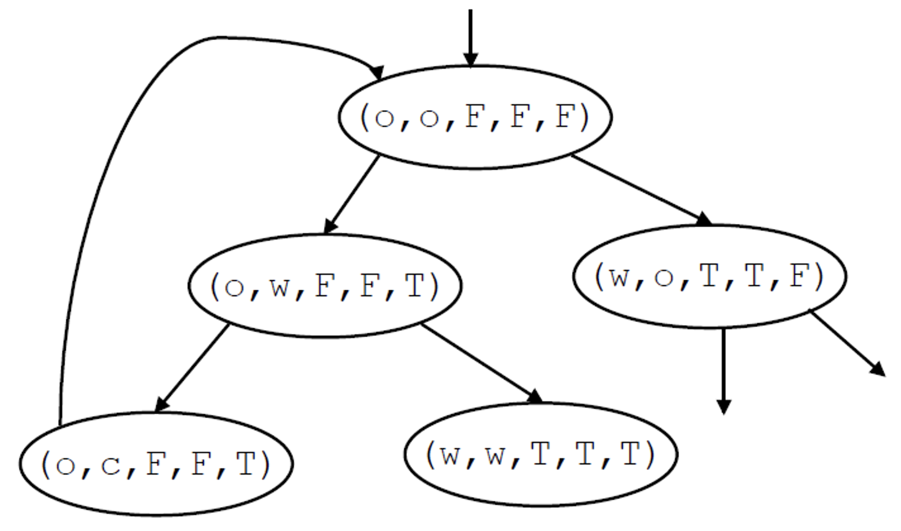</p>

再比如对于如下的程序片段：

<p style="text-align:center">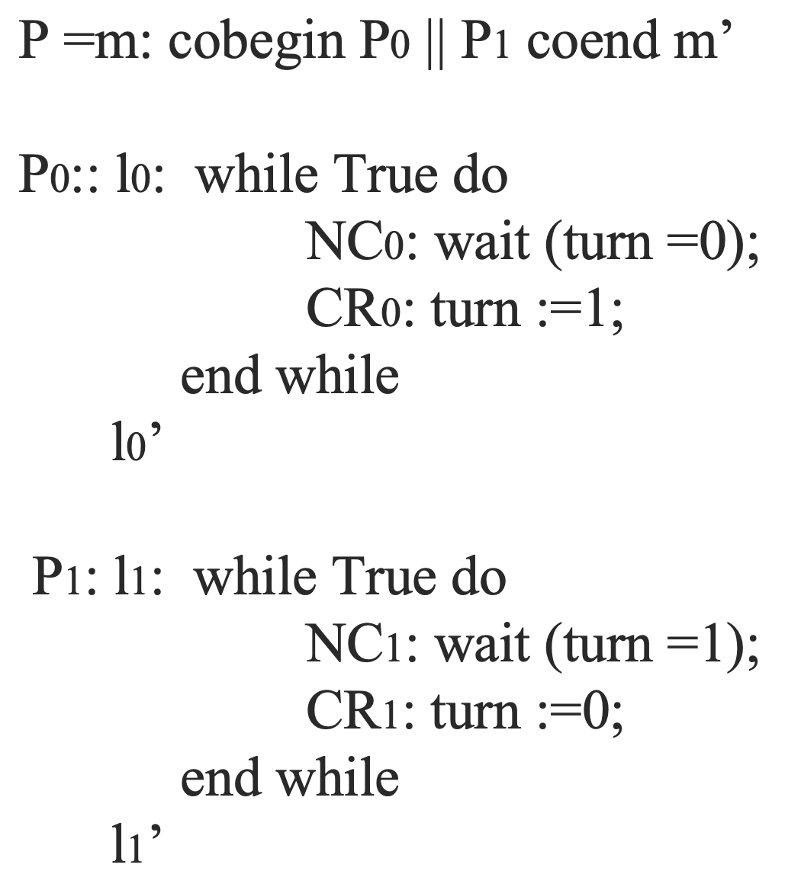</p>

其迁移系统为：

<p style="text-align:center">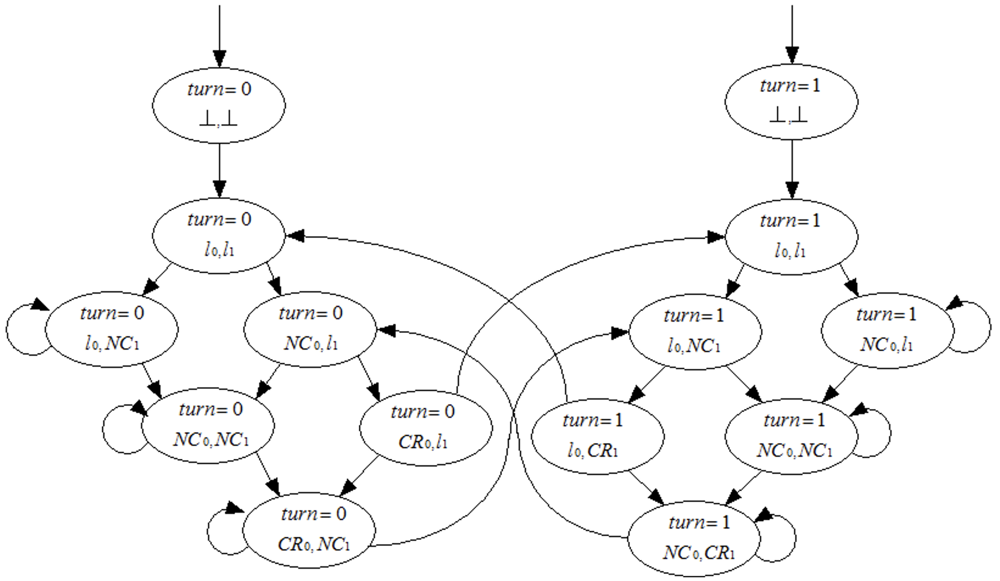</p>

### 9.4.3 时序性质

像如下一些性质我们称之为**时序性质**（temporal properties）：

- 一旦 $r$ 是 $1$，它就会永远是 $1$；
- 两个程序不可以同时在临界区；
- 如果你选择了雪碧，那么在你再次支付之前你不能得到啤酒；
- 没有死锁；
- ……

时序逻辑（temporal logic）是一种描述一个反应式系统中状态之间迁移序列的形式化方法。像“最终”、“从不”这样的性质可以使用特殊的时序操作符来规定，下面我们来学习一种描述时序逻辑的形式化方法——**计算树逻辑**（computation tree logic, CTL），具体地，我们会学习 $CTL^*$。

## 9.5 计算树逻辑

### 9.5.1 基本概念

计算树展示了从初始状态开始所有可能的执行路径，$CTL^*$ 公式描述了计算树的性质。

<p style="text-align:center">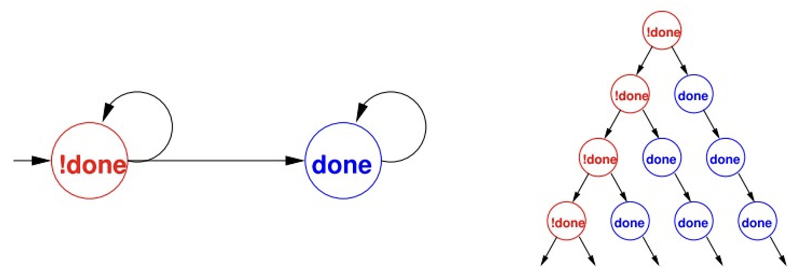</p>

$CTL^*$ 逻辑公式由路径量词和时序操作符组成。

路径量词有两个：

- $\mathbf{A}$ 表示被修饰的逻辑公式对于所有的（for all）计算树路径都成立；
- $\mathbf{E}$ 表示被修饰的逻辑公式存在（exist）某些计算树路径成立。

时序操作符有五个：

- $\mathbf{X}$：$\mathbf{X}p$ 表示性质 $p$ 在路径的第二个（next）状态下成立；
- $\mathbf{F}$：$\mathbf{F}p$ 表示性质 $p$ 会在路径将来的的某个状态下成立；
- $\mathbf{G}$：$\mathbf{G}p$ 表示性质 $p$ 会在路径的全部（globally）状态下都成立；
- $\mathbf{U}$：$p \mathbf{U} q$ 表示 $q$ 成立的状态的前驱状态下 $p$ 一定会成立，也就是说 $p$ 成立，直到（until）$q$ 成立为止。
- $\mathbf{R}$：$p \mathbf{R} q$ 表示 $q$ 沿着路径一直保持，直到第一个 $p$ 成立的状态（含这个状态）为止，即 $p$ 释放（release）了 $q$，$p$ 不需要一直保持。

在 $CTL^*$ 中有两种类型的逻辑公式：状态公式（在某个特定的状态下成立）、路径公式（沿着某个路径成立）。

状态公式（state formula）规则的语法如下：

- 如果 $p \in \mathbf{A}P$，那么 $p$ 是一个状态公式，其中 $\mathbf{A}P$ 表示原子命题（atomic propsitions）；
- 如果 $f$ 和 $g$ 是状态公式，那么 $\neg f, f\wedge g, f\vee g$ 也是状态公式。
- 如果 $f$ 是一个路径公式，那么 $\mathbf{E}f$ 和 $\mathbf{A}f$ 是状态公式。

路径公式（path formula）的语法如下：

- 如果 $f$ 是一个状态公式，那么 $f$ 也是一个路径公式；
- 如果 $f$ 和 $g$ 是路径公式，那么 $\neg f, f \wedge g, f \vee g, \mathbf{X}f, \mathbf{F}f, \mathbf{G}f, \mathbf{G}f, f\mathbf{U}g, f\mathbf{R}g$ 都是路径公式。

$CTL^*$ 是由上述规则产生的状态公式的集合。

$CTL^*$ 的语意：

- 如果 $f$ 是一个状态公式，$M$ 是一个迁移系统，$s\to f$ 意味着 $f$ 在迁移系统 $M$ 的状态 $s$ 下保持。
- 如果 $g$ 是一个路径公式，$M$ 是一个迁移系统，$\pi \to g$ 意味着 $g$ 沿着迁移系统 $M$ 的路径 $\pi$ 保持。

### 9.5.2 CTL 和 LTL

CTL 和 LTL 是 $CTL^*$ 的两个子逻辑：

- CTL 是 $CTL^*$ 的一个严格的子集，只允许分时逻辑（branching-time logic）——每个线性时间的操作符 $\mathbf{G}, \mathbf{F}, \mathbf{X}, \mathbf{U}, \mathbf{R}$ 都必须立即被一个路径量词修饰。
  - 例如 $\mathbf{A}\mathbf{G}(\mathbf{E}\mathbf{F} p), \mathbf{A}(\mathbf{F}\mathbf{G} p)$
- LTL 是线性时序逻辑逻辑（linear temporal logic），组成 LTL 的逻辑公式都形如 $\mathbf{A} f$，其中 $f$ 是一个路径公式，其中的子状态公式只能是原子命题。
  - 例如 $\mathbf{A}(\mathbf{F}\mathbf{G} p)$

CTL 有 10 个基本的操作符：

- $\mathbf{A}\mathbf{X}$ 和 $\mathbf{E}\mathbf{X}$
- $\mathbf{A}\mathbf{F}$ 和 $\mathbf{E}\mathbf{F}$
- $\mathbf{A}\mathbf{G}$ 和 $\mathbf{E}\mathbf{G}$
- $\mathbf{A}\mathbf{U}$ 和 $\mathbf{E}\mathbf{U}$
- $\mathbf{A}\mathbf{R}$ 和 $\mathbf{E}\mathbf{R}$

<p style="text-align:center">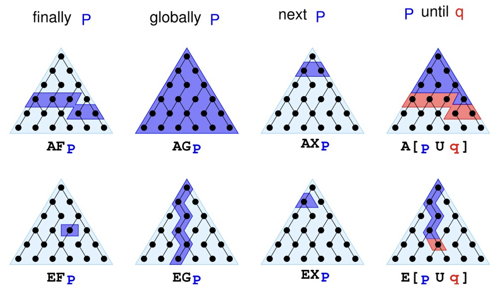</p>

并且这 10 个基本操作都可以用 $\mathbf{E}\mathbf{X}, \mathbf{E}\mathbf{G}, \mathbf{E}\mathbf{U}$ 来表达：

- $\mathbf{A}\mathbf{X}(f) = \neg \mathbf{E}\mathbf{X}(\neg f)$
- $\mathbf{E}\mathbf{F}(f) = \mathbf{E}(1 \mathbf{U} f)$
- $\mathbf{A}\mathbf{G}(f) = \neg \mathbf{E}\mathbf{F}(\neg f)$
- $\mathbf{A}\mathbf{F}(f) = \neg \mathbf{E}\mathbf{G}(\neg f)$
- $\mathbf{A}[f \mathbf{U} g] = \neg \mathbf{E}[(\neg g) \mathbf{U} (\neg f \wedge \neg g)] \wedge \neg \mathbf{E}\mathbf{G}(\neg g)$
- $\mathbf{A}[f \mathbf{R} g] = \neg \mathbf{E}[(\neg f) \mathbf{U} (\neg g)]$
- $\mathbf{E}[f \mathbf{R} g] = \neg \mathbf{A}[(\neg f) \mathbf{U} (\neg g)]$

下面我们来看一些例子，令 $P$ 表示”我喜欢巧克力”，$Q$ 表示“外面天气暖和”。

- $\mathbf{A}\mathbf{G}.P$：从现在开始我喜欢巧克力，无论发生什么。
- $\mathbf{E}\mathbf{F}.P$：我有可能在未来的某一天喜欢吃巧克力，喜欢至少一天。
- $\mathbf{A}\mathbf{F}.\mathbf{E}\mathbf{G}.P$：我总是会在未来的某一天，有可能开始喜欢巧克力，并且会一直喜欢下去。
- $\mathbf{E}\mathbf{G}.\mathbf{A}\mathbf{F}.P$：这是我生命中关键的一天，基于接下来会发生什么（$\mathbf{E}$），有可能在我的余生当中（$\mathbf{G}$），总是会存在某个未来的时刻（$\mathbf{A}\mathbf{F}$），我会喜欢巧克力，不过如果后续发生了什么，我不保证我会一直喜欢下去。
- $\mathbf{A}(P \mathbf{U} Q)$：从现在开始，直到外面软和为止，我每一天都会喜欢巧克力。一旦外面软和了，我就不保证我会喜欢巧克力了。并且，未来外面一定会暖和的，哪怕只有一天。
- $\mathbf{E}((\mathbf{E}\mathbf{X}.P)\mathbf{U}(\mathbf{A}\mathbf{G}.Q))$：有可能：最终会有一天，从那一天开始外面会永远暖和（$\mathbf{A}\mathbf{G}.Q$），并且在那之前，总是存在某种方式让我在第二天喜欢巧克力（$\mathbf{E}\mathbf{X}.P$）。

### 9.5.3 表达性质

- 安全性（safety）：坏事情不会发生
  - 典型例子：$\mathbf{A}\mathbf{G}(\mathrm{reactor\_temp} < 1000)$
  - 通常使用 $\mathbf{A}\mathbf{G}$。
- 活跃度（liveness）：好事情会发生
  - 典型例子：$\mathbf{A}\mathbf{F}(\mathrm{rich}), \mathbf{A}\mathbf{F}(x > 5), \mathbf{A}\mathbf{G}(\mathrm{start} \to \mathbf{A}\mathbf{F}\ \mathrm{terminate})$
  - 通常使用 $\mathbf{A}\mathbf{F}$。
- fairness：某件事情会无穷地经常（infinitely often）发生
  - 典型例子：$\mathbf{A}\mathbf{G}\mathbf{A}\mathbf{F}(\mathrm{enabled})$
  - 通常使用 $\mathbf{A}\mathbf{G}\mathbf{A}\mathbf{F}$

CTL 和 LTL 的表达能力是不可比的，实践中会根据应用场景和个人偏好来选择。

<p style="text-align:center"></p>
