# 10 Petri 网

## 10.1 引入

### 10.1.1 哲学家吃面问题

哲学家吃面问题说的是有若干哲学家和若干叉子交替摆放在一个圆桌上，每个哲学家必须拿起手边的两个叉子才能够吃面，吃完面后可以放下叉子。

在只有一个哲学家吃面的时候，我们可以用具有 4 个状态，5 个迁移的迁移系统来表示这个系统。

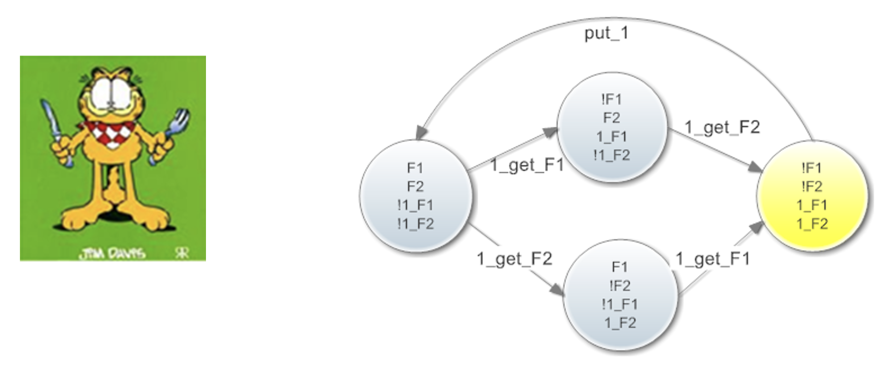

其中，`F1` 表示第 1 个叉子空闲，`F2` 表示第 2 个叉子空闲，`1_F1` 表示哲学家 1 持有第 1 个叉子，`1_F2` 表示第 1 个哲学家持有第 2 个叉子，这是组成整个系统状态的 4 个变量。`1_get_F1` 表示第 1 哲学家拿起第 1 个叉子，`1_get_F2` 表示第 1 个哲学家拿起第 2 个叉子，`put_1` 表示第 1 个哲学家放下手中的两个叉子。图中黄色的状态表示有哲学家成功吃到面的状态。

在有两个哲学家吃面的时候，我们可以用具有 9 个状态，14 个迁移的迁移系统来表示这个系统。

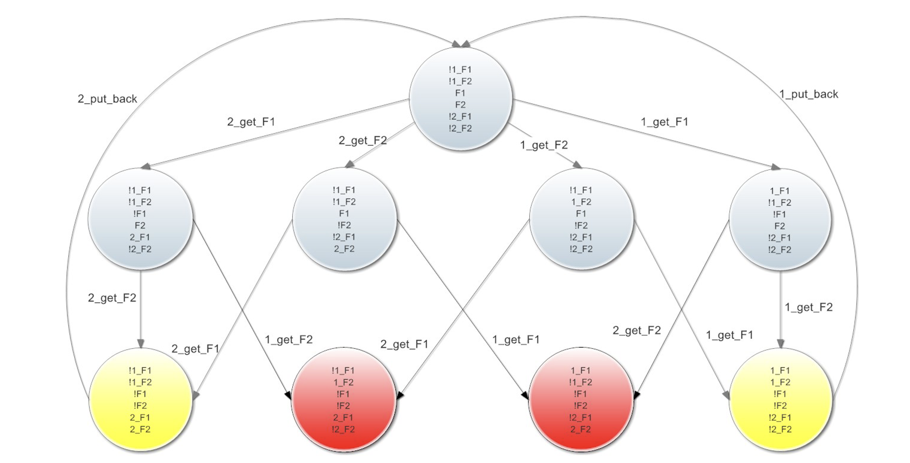

其中各个变量以及迁移的含义与之前类似，红色的状态为死锁状态——即没有任何后继状态的状态。

有三个哲学家吃面的时候，我们需要 27 个状态，56 条迁移。

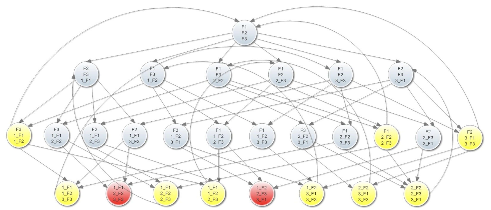

有四个哲学家吃面的时候就需要 81 个状态，252 条迁移了。

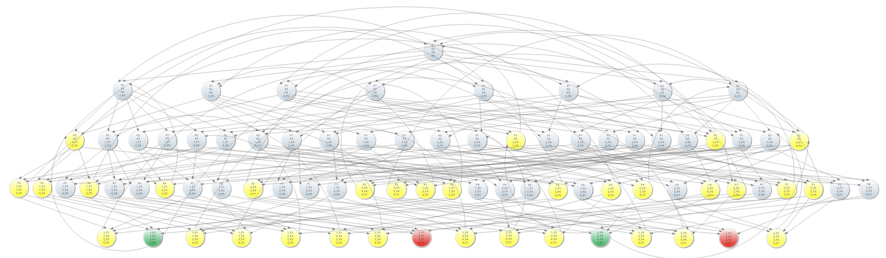

于是，我们看到，用迁移系统描述哲学家吃面之类的并发调度问题是极其复杂的。因为我们讲所有的状态变量组合成了一个状态向量用以描述全局状态，并基于全局状态构建全局迁移；而从状态变量到状态向量是一个笛卡尔积，其状态空间是呈指数化增长的。

### 10.1.2 从自动机到 Petri 网

自动机是一个理论化的理想化的模型，它反映了一个牛顿式的世界观：

- 空间和时间作为绝对参考系；
- 过程视为该参考系下由时钟驱动。

卡尔·亚当·佩特里 (Carl Adam Petri) 尝试将来自理论 CS 的自动机和来自工程师的实用专业知识结合在一起，形成了 Petri 网。在 Petri 网中

- 状态是分布式的，迁移是本地化的；
- 本地的因果关系取代了全局时间；
- 子系统之间通过显示的通信进行交互。

和状态机相比，Petri 网中的状态迁移是 **不同步的 (asynchronous)**。迁移的顺序是部分不协调的，由一个偏序关系规定。因此，Petri 网可以用来对并行的分布式系统进行建模。

各种类型的 Petri 网已经被广泛使用，比如说

- 活动图（Activity charts, UML）
- 数据流图（Data flow graphs）、标记图（marked graphs）

### 10.1.3 Petri 网的应用

- 性能评估（performance evaluation）
- 通信协议（communication protocols）
- 分布式软件系统（communication protocols）
- 分布式数据库系统（communication protocols）
- 并发和并行程序（communication protocols）
- 工业控制系统（communication protocols）
- 离散事件系统（communication protocols）
- 多处理器内存系统（communication protocols）
- 数据流计算系统（communication protocols）
- 容错系统（communication protocols）
- ……

## 10.2 Petri 网的基本概念

### 10.2.1 介绍

Petri 网是一个图形化、数学化的建模工具，可以用来模拟并发的、非同步的、分布式的、并行的、非确定性的、随机的系统。

Petri 网的图形化表示是一个二部图，它有两种结点：

- 地点（Places）：通常用来建模资源或者系统的部分状态；
  - 如下图中的圆形结点。
- 转移（Transitions）：通常用来建模状态转换和同步。
  - 如下图中的条形结点。

图中的弧是有向的（如下图中的边），且总是连接不同类型的结点（因此它是一个二部图），在地点中的资源称为令牌（tokens）。

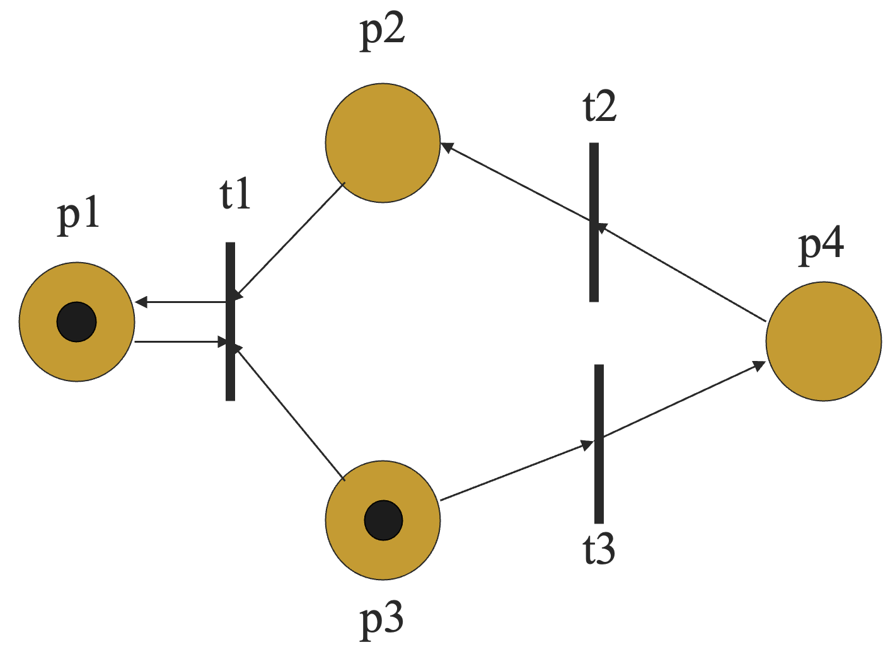

### 10.2.2 定义

::: definition 定义 10.1

定义 **Petri 网** 是一个四元组 $C = (P, T, I, O)$，其中

- $P$ 是地点的集合，$P = \{p_1, p_2, \cdots, p_n\}$；
- $T$ 是转移的集合，$T = \{t_1, t_2, \cdots, t_m\}$；
- $I: T \to 2^P$ 是从迁移到输入地点的映射，一个迁移可以有不止一个输入地点；
- $O: T\to 2^P$ 是从迁移到输出地点的映射，一个迁移可以有不止一个输出地点。

:::

::: definition 定义 10.2

定义一张 Petri 网的 **标记 (marking)** 为向量 $\mu$，$\mu = \langle \mu_1, \mu_2, \cdots, \mu_n \rangle$，其中 $\mu_i$ 表示第 $i$ 个地点上的 **令牌 (token)** 的数量，$n$ 是总地点数。

$\langle \mu_1, \mu_2, \cdots, \mu_n \rangle$ 可以简写为 $mu_1mu_2\cdots\mu_n$

:::

上图中的 Petri 网的形式化表述为：

$$
C = (\{p_1, p_2, p_3, p_4\}, \{t_1, t_2, t_3\}, \{(t_1, \{p_1, p_2, p_3\}), (t_2, \{p_4\}), (t_3, \{p_3\})\}, \{(t_1, \{p_1\}), (t_2, \{p_2\}), (t_3, \{p_4\})\})
$$

它的标记 $\mu = 1010$。

从上面的定义中我们可以看到，Petri 网由两种类型的结点组成：地点和转移。弧只存在于从一个地点到一个转移或者从一个转移到一个地点之间。一个地点可能有 0 个或者多个，但一定是有限个令牌。

在图示上面，地点用圆圈表示，转移用长条表示，弧用带单箭头的线段表示，令牌用圆点表示。下面是一个具有两个地点，一个转移的 Petri 网的例子：

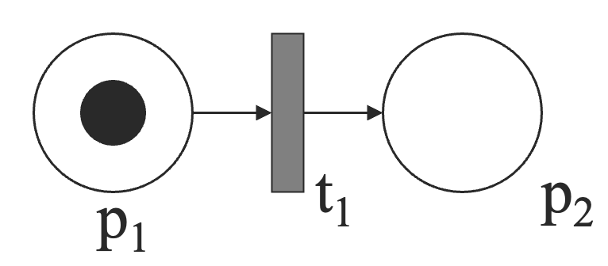

系统的状态用 Petri 网的标记来模拟，下面这张 Petri 网的状态是 $\mu = 3$。

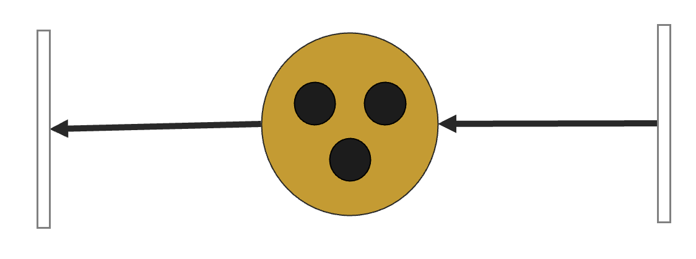

### 10.2.3 点火

::: definition 定义 10.2

我们称一个转移 $t$ 在特定的标记 $\mu$ 下是 **被赋能的 (enabled)**，如果对于从任意地点 $p$ 到 $t$ 的弧，在该标记 $\mu$ 下 $p$ 中都存在一个令牌。

一个在 $\mu$ 下被赋能的转移 $t$ 可以 **点火 (fire)**，导致一个新的标记 $\mu'$。

:::

::: definition 定义 10.3

**点火 (fire)** 一个被赋能的转移 $t$ 会导致两件事情发生：

1. 对于每一个从地点 $p$ 到转移 $t$ 的弧，从地点 $p$ 中减去一个令牌；
2. 对于每一个从转移 $t$ 到地点 $p$ 的弧，向地点 $p$ 中增加一个令牌。

记恰好赋能 $t$ 的标记为 $\cdot t$，$\cdot t$ 中有且仅有让 $t$ 点火一次所必要的令牌，$\cdot t$ 在 $t$ 点火一次后变成 $t\cdot$。于是在 $\mu$ 标记状态下点火 $t$ 变成 $\mu'$ 标记的过程可以形式化表述为：

$$
\mu' = (\mu - \cdot t) + t\cdot
$$

:::

下图从右往左是一次点火过程的示意图。

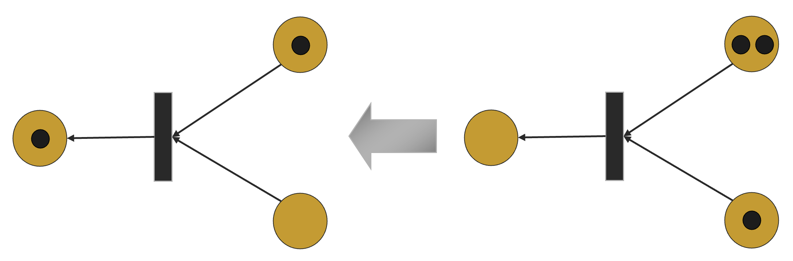

化学反应也可以看成是一次点火的过程，我们可以在弧上面标数字来表示一次点火所需要的令牌数。这样的弧也称为带权边。

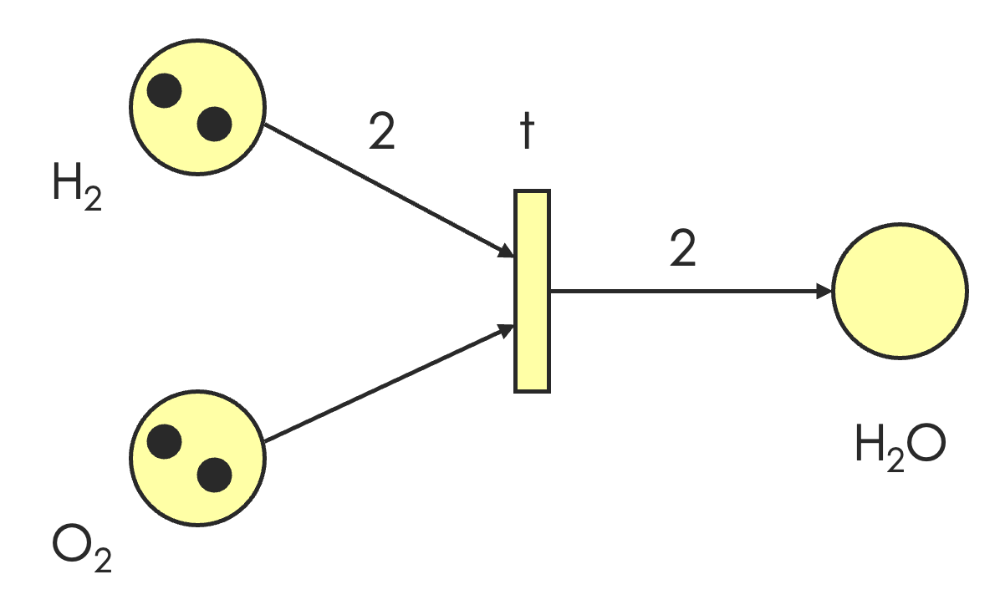

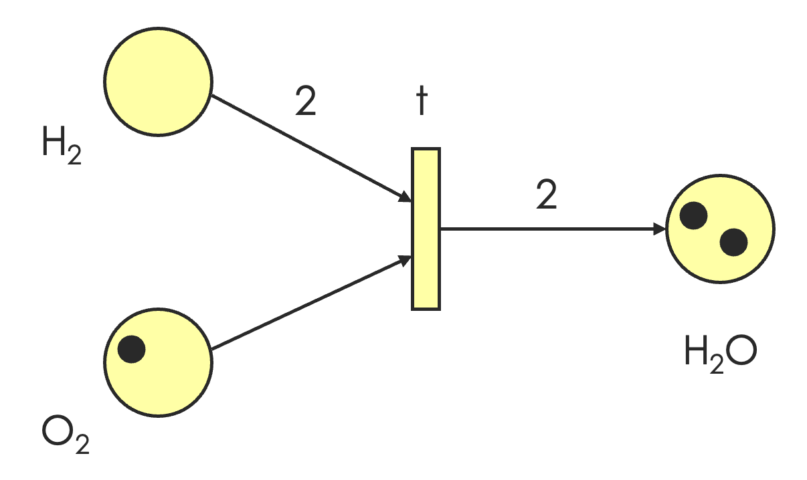

::: definition 定义 10.4

Petri 网的一次 **运行 (run)** 是一个有穷的或者无穷的标记和转移的序列，形如

$$
\mu_0 \stackrel{t_0}{\to} \mu_1 \stackrel{t_1}{\to} \cdots \stackrel{t_{n-1}}{\to} \mu_n \stackrel{t_n}{\to} \cdots
$$

其中，$\mu_0$ 是 Petri 网的初始状态，对于任意 $i \ge 0$，$t_i \in enabled(\mu_i)$，$enabled(\mu_i)$ 表示在 $\mu_i$ 状态下被赋能的转移的集合，且

$$
\mu_i = (\mu_{i-1} - \cdot t_{i-1})+t_{i-1}
$$

即每一次状态转换都是由于一个迁移的点火而产生的。

:::

## 10.3 Petri 网的性质

### 10.3.1 基本性质

#### 顺序执行（Sequential Execution）

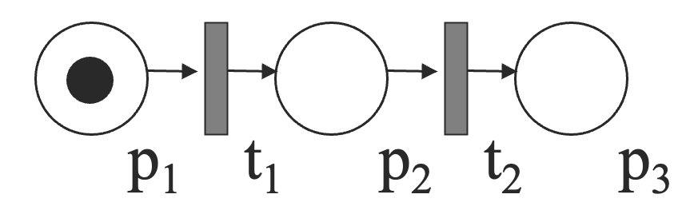

转移 $t_2$ 只会在转移 $t_1$ 点火后点火。这形成了一个优先级限制：$t_2$ 在 $t_1$ 之后。

#### 同步（Synchronization）

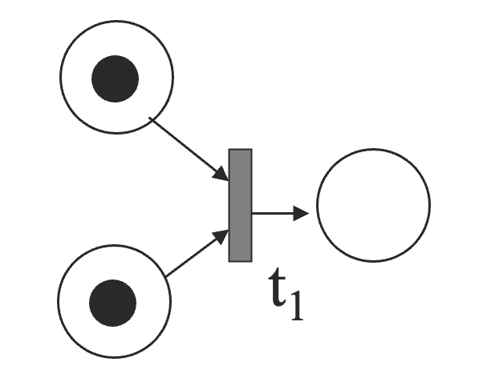

转移 $t_1$ 只有在它的每一个输入地点都至少有一个令牌的时候才会被激活。

#### 汇合（Merging）

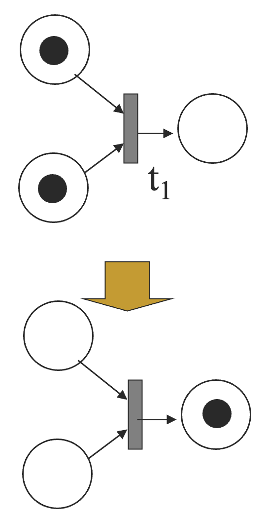

当来自多个地方的令牌通过同一个转移的点火到达一个地方的时候，汇合发生了。

#### 分叉（Fork）

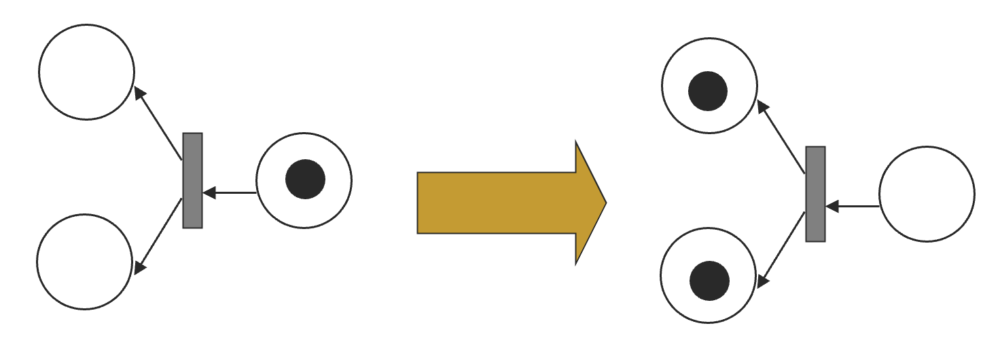

当来自一个个地方的令牌通过一个转移的点火到达多个地方的时候，分叉发生了。

#### 并发（Concurrency）

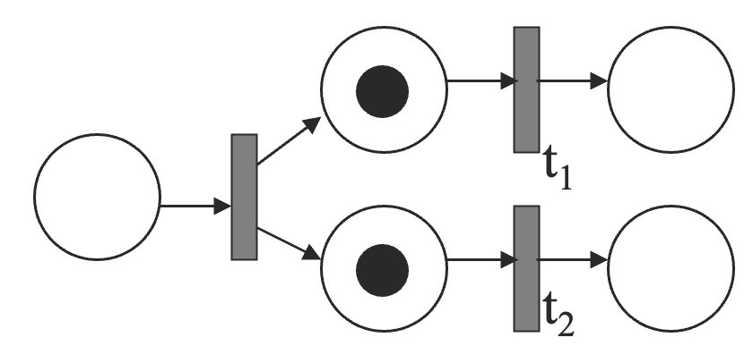

$t_1$ 和 $t_2$ 是并发的，由于这个性质，Petri 网可以建模分布式控制、多进程同时运行的系统。

#### 非确定性发展（Non-deterministic Evolution）

Petri 网的发展是非确定性的，被赋能的任意一个转移都可能点火。

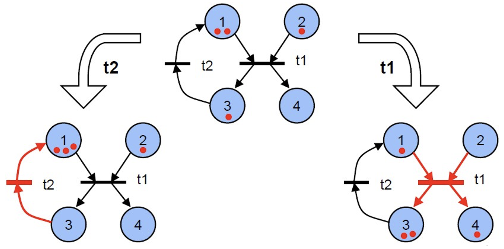

#### 冲突（conflict）

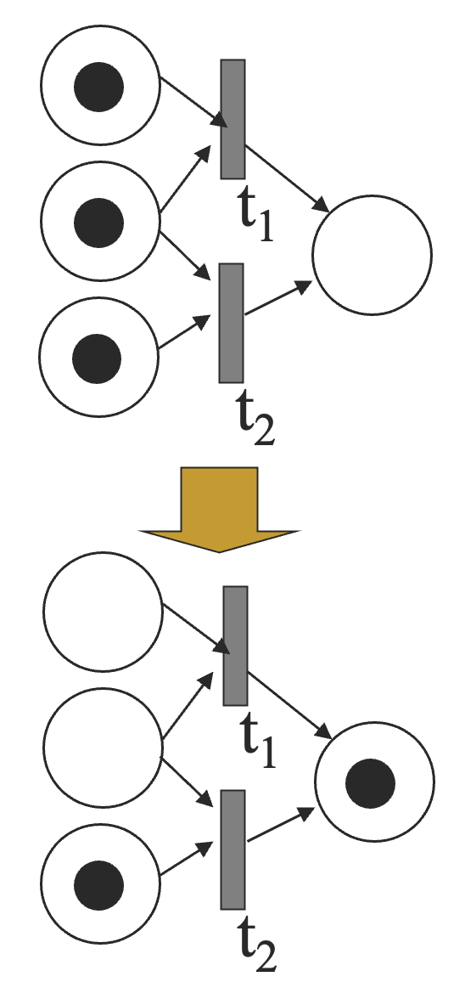

$t_1$ 和 $t_2$ 都被赋能了，但是任意一方点火都会导致另一方无法点火。

### 10.3.2 扩展与归约

#### 一些定义

- 源转移（source transition）：没有输入。
- 槽转移（sink transition）：没有输出。
- 自环（self-loop）：一个二元组 $(p, t)$，其中 $p$ 即时 $t$ 的一个输入，也是 $t$ 的一个输出。
- 纯 Petri 网（pure PN）：没有自环。
- 带权 Petri 网（weighted PN）：弧上有权重
- 普通 Petri 网（ordinary PN）：所有的弧的权重都是 1
- 无限容量网（infinite capacity net）：地点可以存放的令牌数没有限制
- 有限容量网（finite capacity net）：每个地点 $p$ 有一个最大容量 $K(p)$
- 严格转移规则（strict transition rule）：在点火后，每一个输出地点 $p$ 都不可以拥有多于 $K(p)$ 个令牌。

::: theorem 定理 10.1

每一个有限容量网都可以转化成一个等价的纯的无限容量网。

:::

定理 10.1 说的是我们有方法在保持建模语意等价的情况下，将 Petri 网中的容量限制和自环去掉。在证明这个定理之前，我们稍微将上述的某些概念多作一些阐释。

#### 带权边

为边赋予权重：

- 每一个边 $f_i$ 都有一个权重 $W(f_i)$，默认为 $1$；
- 一个转移 $t$ 被赋能，如果对于每一个通过一条边 $f_i$ 连向 $t$ 的地点 $p_i$，$p_i$ 都包含至少 $W(f_i)$ 个令牌。

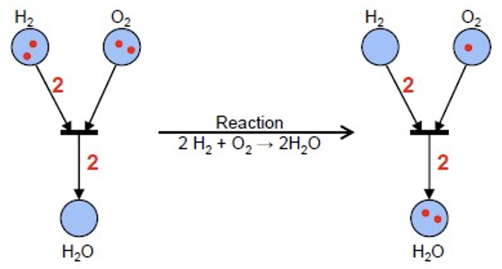

#### 有限容量 Petri 网

- 每一个地点 $p_i$ 最大能容纳 $K(p_i)$ 个令牌：
- 一个转移 $t$ 被赋能，如果所有的输出地点 $p_i$ 在 $t$ 点火后所包含的令牌都不超过 $K(p_i)$。

纯有限容量 Petri 网可以被转化成一个等价的无限容量 Petri 网（没有地点容量的限制）。Petri 网的等价性说的是两张网各自的所有可能的点火序列组成的集合是同一个集合。

#### 去除容量限制

- 对于每一个 $K(p) > 1$ 的地点 $p$，增加一个初始令牌量为 $M_0(p') = K(p) - M_0(p)$ 的 **补地点（complementary place）** $p'$；
- 对于每一个出边 $e = (p, t)$，增加一条从 $t$ 到 $p'$，具有权重 $W(e)$ 的边 $e'$；
- 对于每一个入边 $e = (t, p)$，增加一条从 $p'$ 到 $t$，具有权重 $W(e)$ 的边 $e'$；

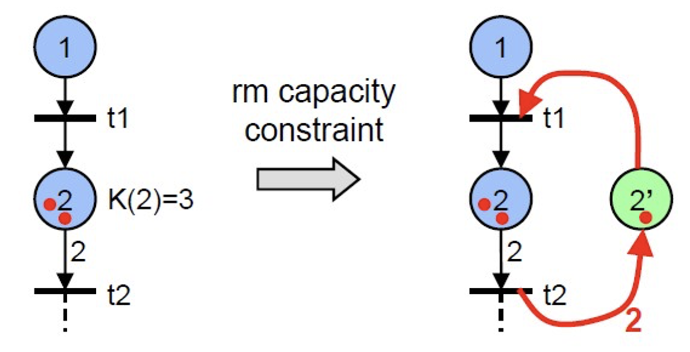

不难看出，上述算法可以去除容量限制，但这个方法只对纯 Petri 网适用，当有自环的时候，就不能这么处理了。

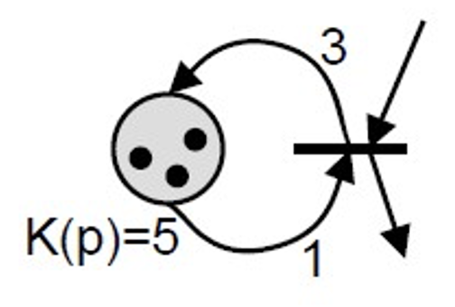

不过我们有方法将自环去掉，现将自环去掉，再应用上述方法，定理 10.1 就证完了。

#### 解自环

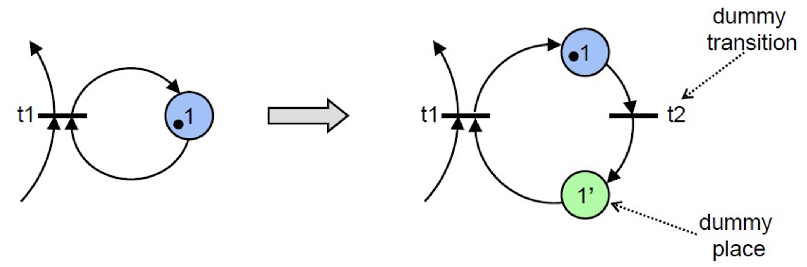

于是，我们发现，给 Petri 网赋予容量限制和自环看似拓展了 Petri 网的内容，但其实再表达能力上和原来还是一致的。

## 10.4 Petri 网的应用示例

### 10.4.1 单轨铁路段同步

在只有一辆从左往右的火车时：

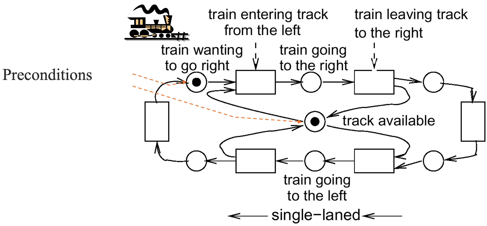

对于轨道资源的竞争关系的刻画：

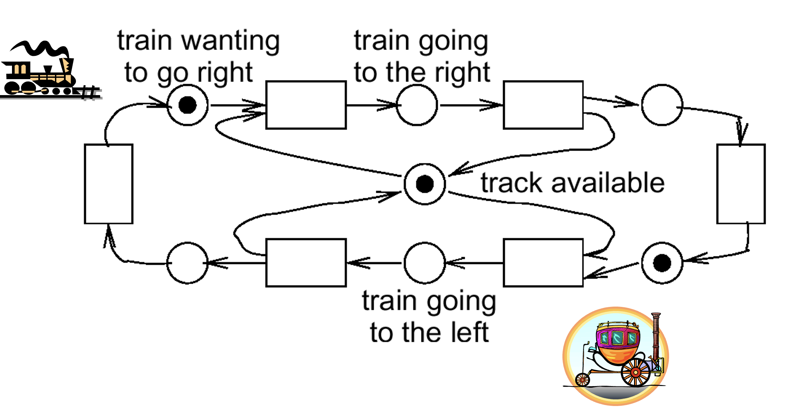

### 10.4.2 建模通信协议

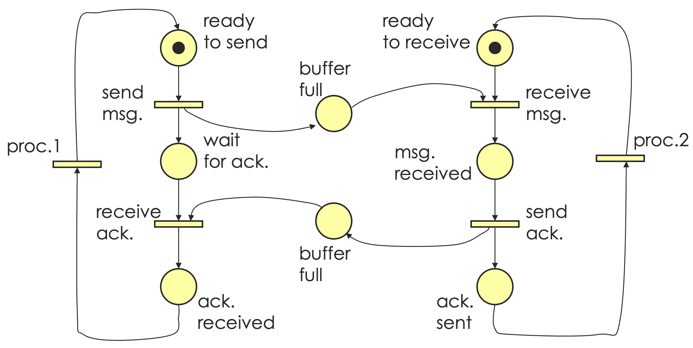

### 10.4.3 建模餐厅

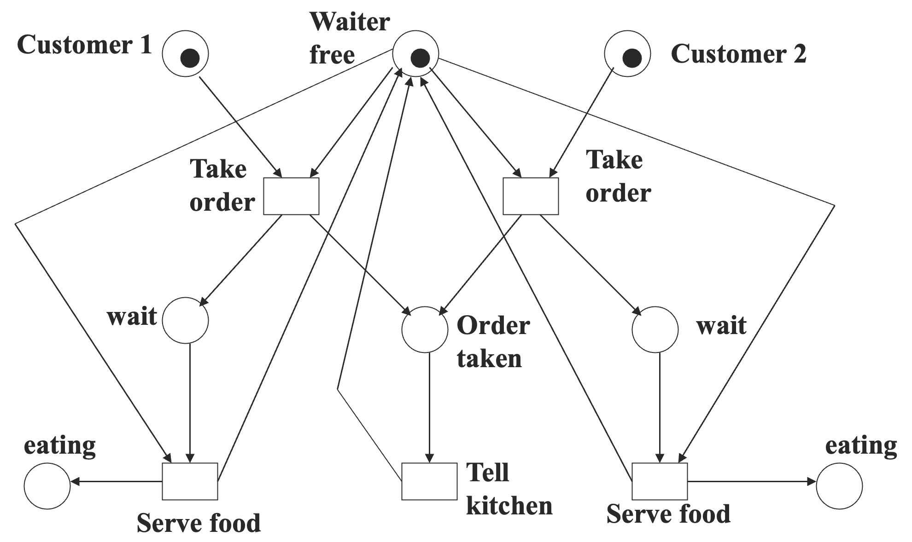

这个模型可能会产生多种场景，下面举两个例子：

1. 服务员从客户 1 那里接取订单；服务客户 1；从客户 2 那里接取订单；服务客户 2。
2. 服务员从客户 1 那里接取订单；从客户 2 那里接取订单；服务客户 2；服务客户 1。

即在共享资源发生竞争（赋能多个转移）的时候，到底哪一个转移竞争到了资源是非确定性的。

### 10.4.4 自动售货机

一些场景：

1. 投 5 个币，投 5 个币，投 5 个币，投 5 个币，拿走 20 块钱的巧克力。
2. 投 10 个币，投 5 个币，拿走 15 块钱的巧克力。
3. 投 5 个币，投 10 个币，投 5 个币，拿走 20 块钱的巧克力。

### 10.4.5 生产流水线

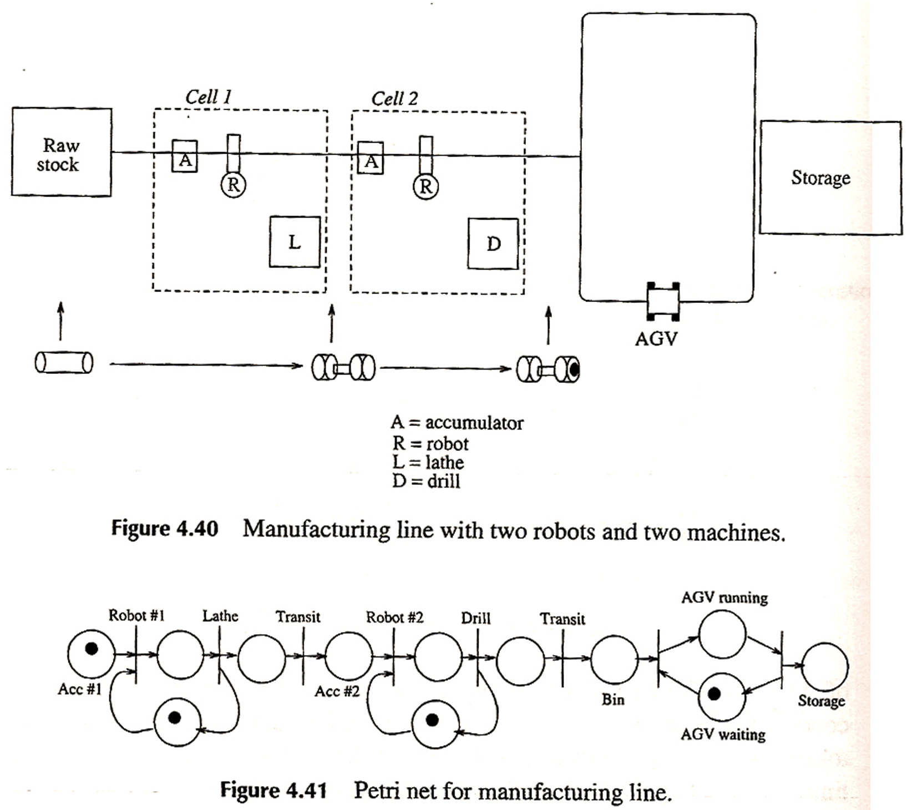

### 10.4.6 哲学家吃面问题

对 1 个哲学家建模：

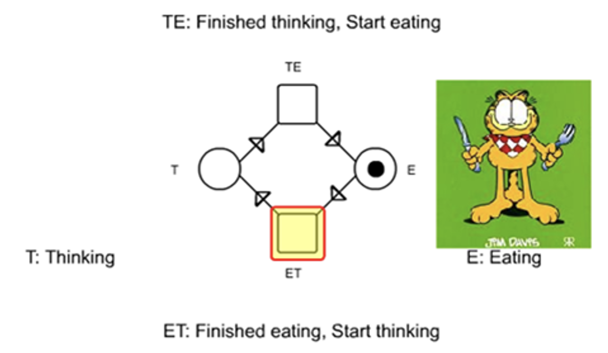

对 4 个哲学家建模：

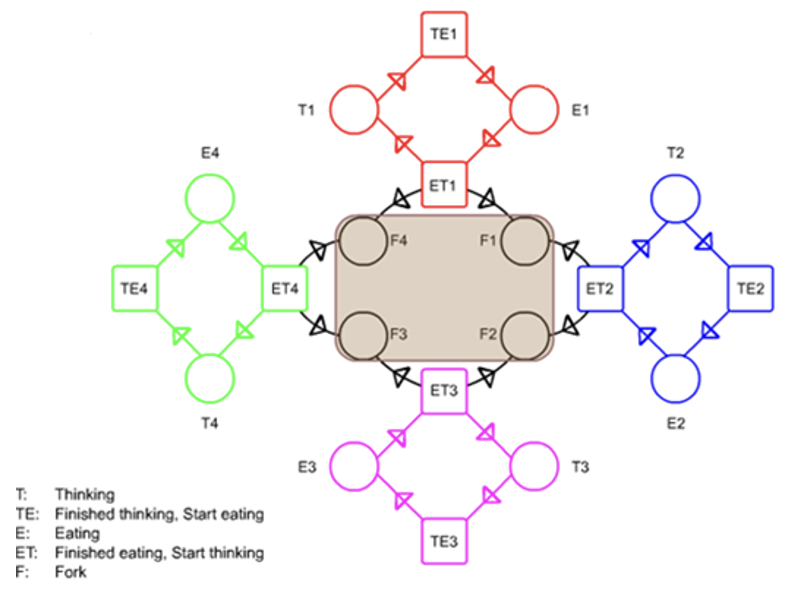

增加令牌和冲突逻辑：

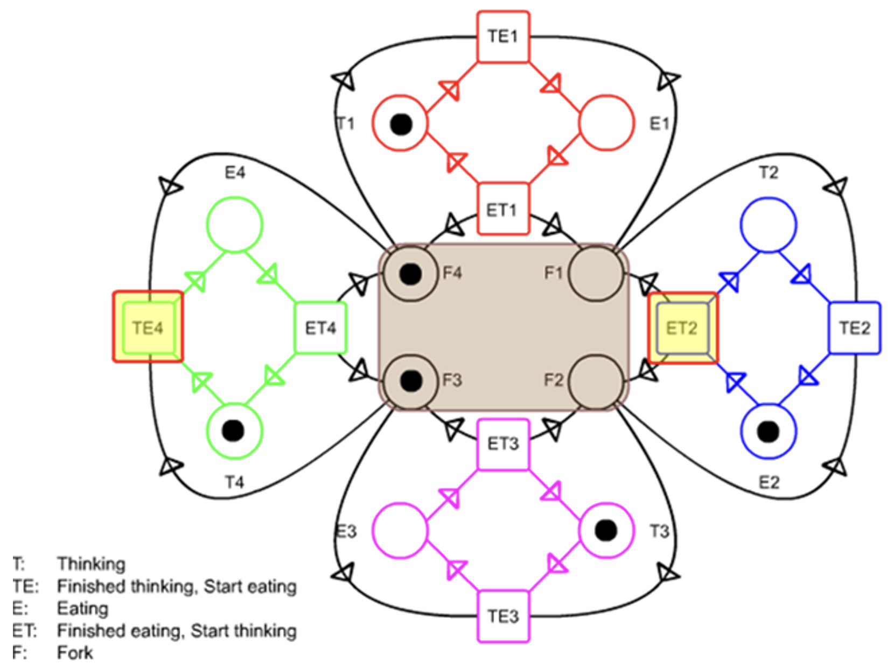

## 10.5 Petri 网进阶

### 10.5.1 行为性质

行为性质是基于初始标记的性质。

- 可达性（Reachability）
  - $M_n$ 从 $M_0$ 可达，如果存在一个点火序列能够将 $M_0$ 转化成 $M_n$。
  - 可达性是可判定的，但需要指数时间。
- 有界性（Boundedness）
  - 一个 Petri 网是 $k$ 有界的，如果从 $M_0$ 可达的所有标记中，每个地点中的令牌数量都不超过一个有限的数字 $k$。
  - 如果一个 Petri 网是 $1$ 有界的，称其是安全的。
- 活跃性（Liveness）
  - 一个 Petri 网是活跃的，如果无论它现在到达了怎样的标记，总是有可能通过一个合适的点火序列点火任意的转移。
  - 等价于不存在死锁。
- 可逆性（Reversibility）
  - 一个 Petri 网是可逆的，如果对于每一个从 $M_0$ 可达的标记 $M$，$M_0$ 也从 $M$ 可达。
  - 更松的条件：标记 $M'$ 成为家状态（home state），如果对于每个从 $M_0$ 可达的状态 $M$，$M'$ 都从 $M$ 可达。
- 持续性（Persistence）
  - 一个 Petri 网是持续的，如果任意两个被赋能的转移，其中一个的点火都不会让另一个失能（disable）；
  - 如此，一旦一个转移被赋能，直到被点火之前它会一直被赋能。
- 公平性（fairness）
  - 有界公平性（bounded-fairness）：一个转移可以点火但另一个转移不能点火的数量是有界的，即冲突的数量是有界的。
  - 无条件公平性（unconditional-fairness）：每一个转移在一个点火序列中都可以无穷经常（infinitely often）出现。

### 10.5.2 分析方法

覆盖树（coverability tree）是所有可能的标记的树形表示：

- 根结点为 $M_0$；
- 树上的结点是从 $M_0$ 可达的标记；
- 树的边是转移的点火。

如果一张 Petri 网是无界的，可以通过引入符号 $\omega$ （表示无界的地点）来使得覆盖树有界：

- 一个 Petri 网是有界的，当且仅当 $\omega$ 不出现在覆盖树的任何的结点中；
- 一个 Petri 网是安全的，当且仅当只有 $0$ 和 $1$ 出现在覆盖树的结点中；
- 一个转移是死的，当且仅当它不出现在覆盖树的任何的边中；
- 如果 $M$ 从 $M_0$ 可达，那么存在一个结点 $M'$ 可以覆盖 $M$。

对于如下一张 Petri 网：

其覆盖树为：

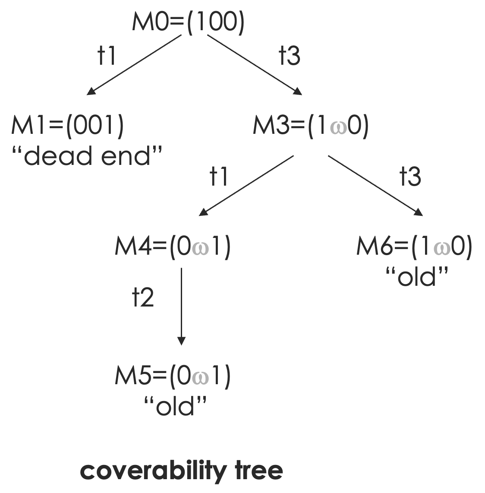

对应的覆盖图（状态转换图）为：

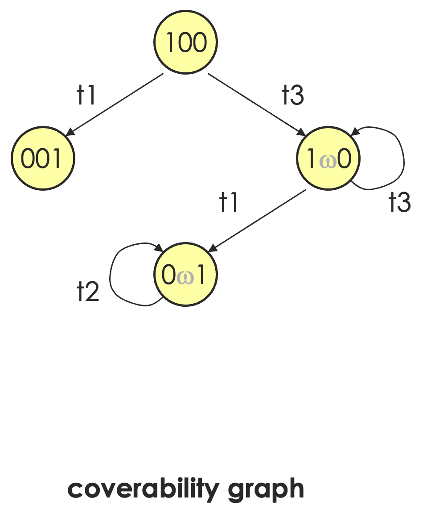

### 10.5.3 归约规则

Petri 网的分析通常是冗长的，特别是对于大的、复杂的网。分析的复杂度会随着 Petri 网大小的增加而呈指数级增长。

一种解决方案是：在保持要分析的性质不变的前提下，化简 Petri 网。主要是如下性质：

- 活跃性（liveness）
- 安全性（safeness）
- 有界性（boundedness）

下面是 6 个最简单的归约规则：

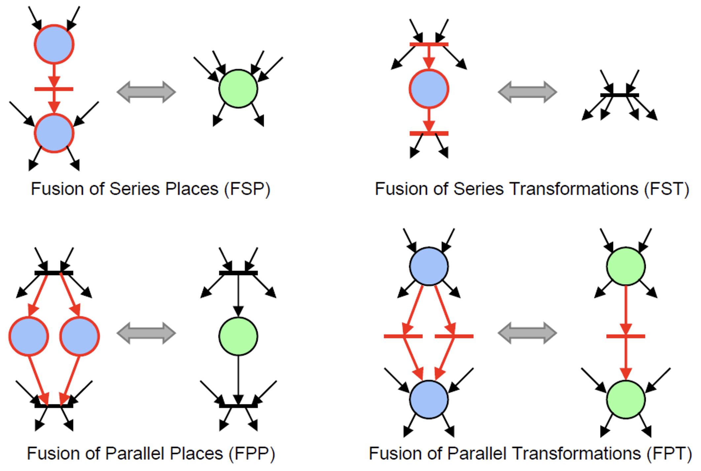

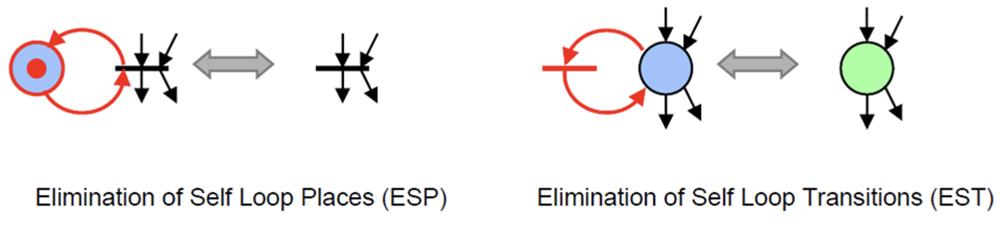

### 10.5.4 广义扩展

- 染色 Petri 网（colored petri nets）：令牌可以带有值（颜色），任何具有有限种颜色的 Petri 网都可以转化成一个普通的 Petri 网。
- 连续 Petri 网（continuous petri nets）：令牌的数量可以是实数，不可以被转化成一个普通的 Petri 网。
- 抑制弧（inhibitor arcs）：在一个地点没有令牌的时候为转移赋能，不可以被转化成一个普通的 petri 网。

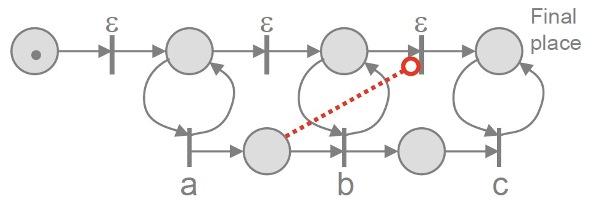

### 10.5.5 时间扩展

之前的例子中，我们都是对在系统中可能发生的事件序列建模，比如说，“资源只能在被占有之后释放”，或者“一个新的低优先级的请求只有当资源被释放后才能被处理”。但是，上面的场景中都没有涉及时间，例如：

- 在一个低优先级请求到达的时候，多久能够保证获得资源？一个进程能够占用一个资源多长时间？处理新请求的频率是什么？

为了能够对这些和时间相关的性质建模，我们需要向已有的形式化系统中引入一个时间的量化记号。

## 10.6 时间 Petri 网

### 10.6.1 基本概念

时间 Petri 网（time petri nets）在经典的 Petri 网的每一个转移中关联了一个时间区间 $[a,b]$。

时间 $a$ 和 $b$ 是相对于 $t$ 最后一次被赋能来说的。

假设 $t$ 在时间 $c$ 被赋能，那么 $t$ 只能在时间区间 $[c + a, c + b]$ 内点火，且最迟必须在时间 $c + b$ 点火，除非它因为其他转移的点火而失能了。

一个转移的点火本身不消耗时间。

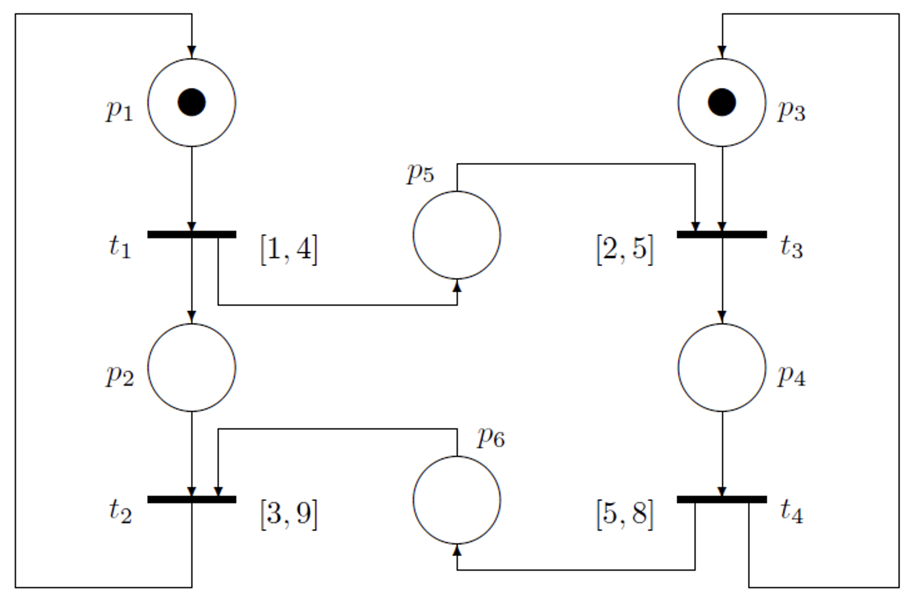

这种依赖于时间的 Petri 网的哲学是：当一个转换被赋能时，它可能不会立即点火（通常），但在一定的时间间隔内和间隔结束时会有一个强制触发。

如果时间间隔的上界是正无穷，那么强制点火的性质就丢失了，这也是我们为什么只考虑时间间隔的上界是一个有限的数字的情况。

### 10.6.2 形式化定义

::: definition 定义 10.5
一个时间 Petri 网是一个 6 元祖，$N = (P, T, F, Eft, Lft, \mu_0)$，其中

- $P = \{p_1, p_2, \cdots, p_n\}$ 是一个地点的有限集；
- $T = \{t_1, t_2, \cdots, t_n\}$ 是一个转移的有限集（ $P \cap T = \emptyset$ ）
- $F \subseteq (P \times T) \cup (T \times P)$ 是流关系（flow relation）；
- $Eft, Lft: T \to \mathbb{N}$ 是求转移的最早点火时间和最迟点火时间的函数，满足 $\forall t \in T, Eft(t) \le Lft(t) \le \infty$；
- $\mu_0$ 是这张网的初始标记。

:::

令时间的定义域为非负实数集，记为 $\mathbb{T}$，一个时间 petri 网 $N$ 的状态是一个二元组 $s = (\mu, c)$，其中 $\mu$ 是 $N$ 的一个标记，$c: enabled(\mu) \to \mathbb{T}$ 称为时钟函数（clock function）。

$N$ 的初始状态为 $s_0 = (\mu_0, c_0)$，其中 $\forall t \in enabled(\mu_0), c_0(t) = 0$。

一个转移 $t$ 可以从状态 $s = (\mu, c)$ 在延时 $\delta\in\mathbb{T}$ 后点火当且仅当下列条件满足：

- $t \in enabled(\mu)$，
- $(\mu - \cdot t) \cap t\cdot = \emptyset$，
- $Eft(t) \le c(t) + \delta$，
- $\forall t' \in enabled(\mu): c(t') + \delta \le Lft(t')$。

当转移 $t$ 在 $\delta$ 延迟后从状态 $s = (\mu, c)$ 点火，新状态 $s' = (\mu', c')$ 为：

- $\mu' = (\mu - \cdot t)\cup t\cdot$
- $\forall t' \in enabled(\mu')$，如果 $t' \ne t$ 且 $t' \in enabled(\mu)$，则 $c'(t') = c(t') + \delta$，否则 $c'(t') = 0$。

这个过程表示为 $s' = fire(s, (t,\delta))$。

时间 Petri 网的一次运行 $\rho = s_0 \stackrel{(t_0, \delta_0)}{\longrightarrow} s_1 \stackrel{(t_1, \delta_1)}{\longrightarrow} \cdots \stackrel{(t_{n-1}, \delta_{n-1})}{\longrightarrow} s_n \stackrel{(t_n, \delta_n)}{\longrightarrow}$ 是一个有穷的或者无穷的状态、转移和延迟的序列。其中，$s_0$ 是初始状态，$s_i = fire(s_{i-1}, (t_{i-1}, \delta_{i-1}))$。

例如：

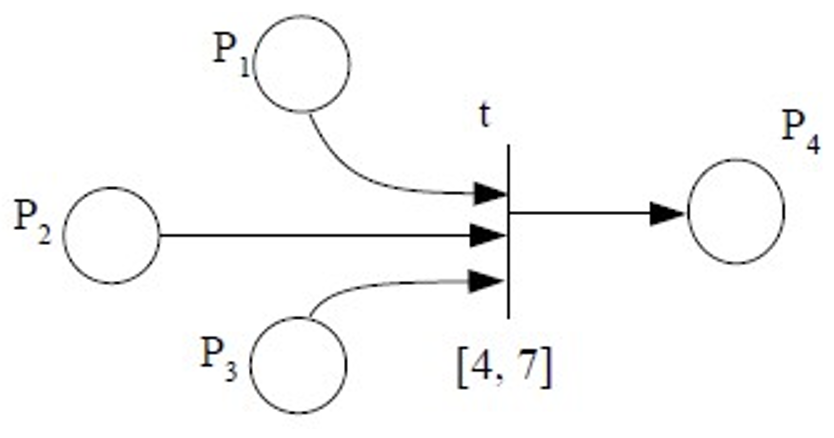

如果在时刻 $3$ 一个令牌到达 $P_1$，在时刻 $5$ 一个令牌到达 $P_2$，在时刻 $1$ 一个令牌到达 $P_3$，因此，转移 $t$ 在时间 $5$ 被激活，于是它点火的时间在 $9$ 到 $12$ 之间，是非确定性的。

虽然这里使用了整数来表示时间，但是其实用实数也并不会改变什么。

### 10.6.3 同时点火

在不带时间的 Petri 网中，同时点火（不冲突的转移之间）的表示是不相关的。比如说

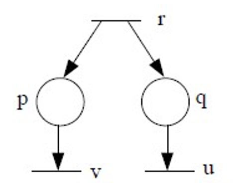

在 $r$ 点火后，产生的标记记为 $M$，到底是 $u$ 还是 $v$ 先从 $M$ 点火，在不带时间的模型下面是无所谓的，因为根本没有时间的表示。虽然不带时间的 Petri 网也可以提供点火的序列，但这个序列只是逻辑上的序列，并不是时间上的序列。

然而，在带时间的模型中，“同时”是可以发生的，比如说

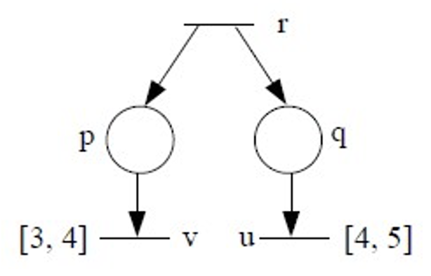

如果 $r$ 在时刻 $10$ 点火，那么 $u$ 和 $v$ 可以同时在时刻 $14$ 点火，也就是说，点火序列 $\langle r, 10\rangle,\langle u, 14\rangle,\langle v, 14\rangle$ 和 $\langle r, 10\rangle,\langle v, 14\rangle,\langle u, 14\rangle$ 都是可接受的，由于 $u$ 和 $v$ 与同一时刻关联，它们是同时发挥作用的。

在上面的例子中，$u, v$ 是同时点火的，且没有逻辑上的先后关系。但并不是所有的同时都没有逻辑先后关系的，比如说

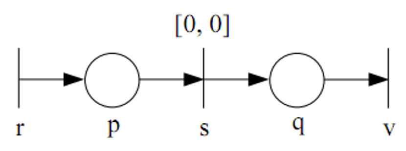

在这个例子中，$s$ 必须和 $r$ 同时发生，也就是点火序列形如 $\langle r, T\rangle, \langle s, T\rangle$，但 $r$ 和 $s$ 同时还拥有逻辑上的先后关系，$\langle s, T\rangle, \langle r, T\rangle$ 是不可接受的。

延时下界为 $0$ 的转移也称为之零时转移（zero-time transitions），因为他们可以在被赋能的同时点火，没有延迟。零时转移如果不小心处理，可能会导致 Zeno 行为 —— 时间停滞。

比如说：

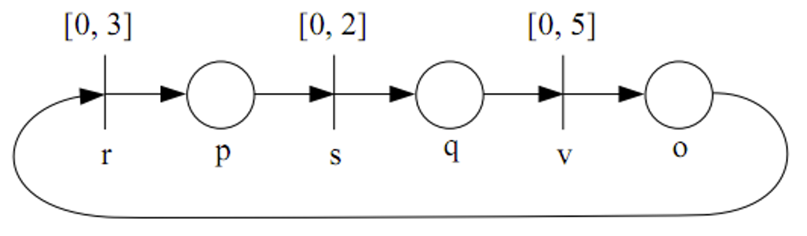

在这个例子中，在 $p$ 处放一个令牌，序列 $\langle s, T \rangle , \langle v, T \rangle , \langle r, T\rangle, \langle s, T \rangle , \langle v, T \rangle , \langle r, T\rangle, \cdots$ 是可以接受的。在这样一个序列中，即使序列增长，时间却一直停滞，这在物理上是不可能的。

不过虽然 zeno 行为在物理上不可能，但是在建模的层面有时候也是有用的，因为有的时候时间的流逝可以忽略。

### 10.6.4 例子：简化的铁路道口

简化：

- 只有一辆火车；
- $d_m$ 和 $d_M$ 分别是从 $R$ 段起点走到 $I$ 段起点所需的最小和最大时间；
- $h_m$ 和 $h_M$ 是通过 $I$ 所需的最短和最长时间；
- 门即可以是打开，也可以是关闭的，还可以正在向上或者向下移动；
- 门的移动需要 $\gamma$ 时间且不可以打断。

建模如下：

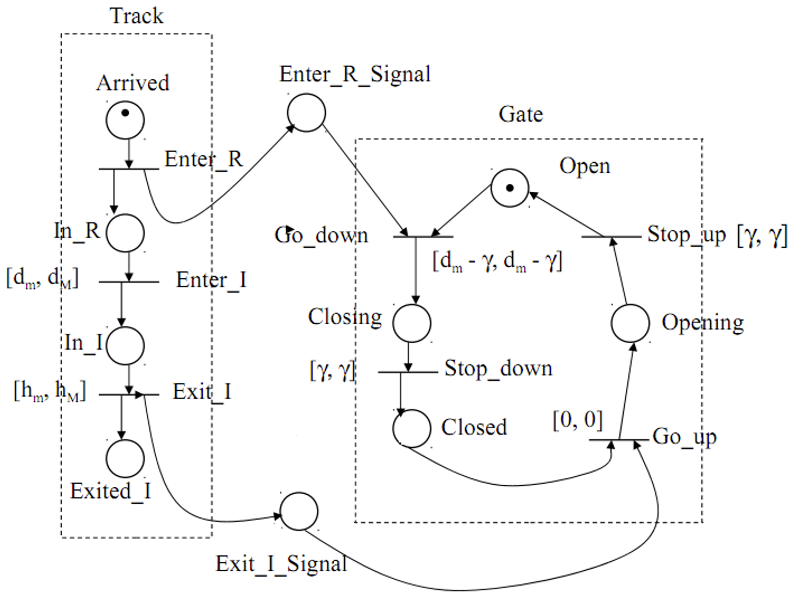

这个模型可以保证，当火车在 $I$ 段的时候门总是关闭的。
