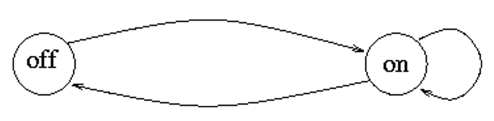
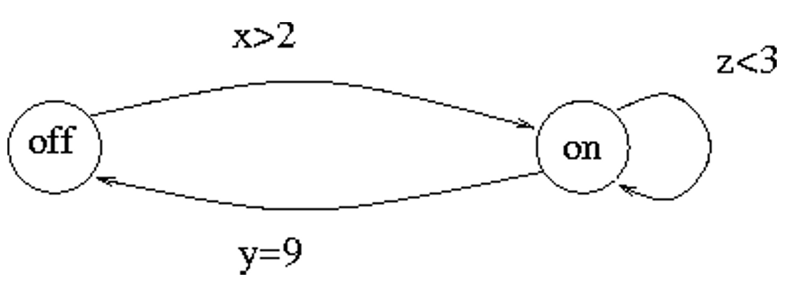
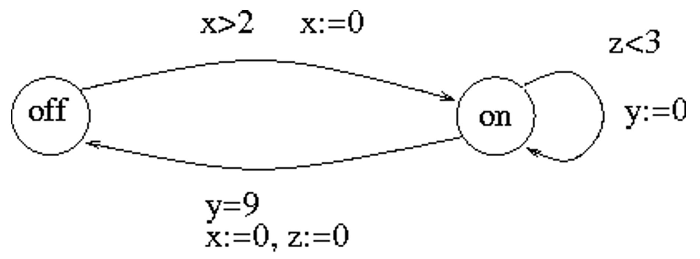
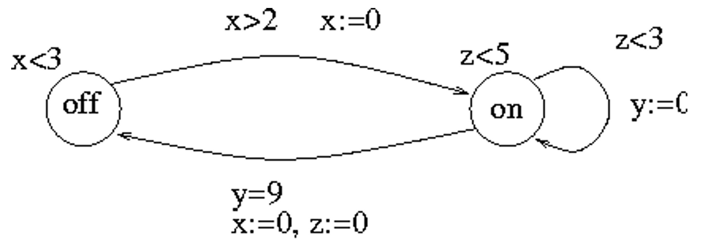

# 11 时间自动机

## 11.1 引入

我们已经学习了很多的建模工具，但它们其实都是触发式的，也就是说，我的状态变化一定是由于某个外部事件的产生而触发的。但是在现实生活中，还有一类系统，哪怕没有任何外部的额外事件，其状态也会随着时间的推移而发生变化。这一讲，我们会在之前自动机的基础上加上时间这个维度，介绍一种新的建模工具。

### 11.1.1 Peterson 算法

在之前学习操作系统的并发控制的时候，我们有了解过 Peterson 算法。

```c
Process 0:
while (true) {
    <noncritical section>;
    flag[0] = true;
    turn = 1;
    while flag[1] and turn = 1 do { };
    <critical section>;
    flag[0] = false;
}

Process 1:
while (true) {
    <noncritical section>;
    flag[1] = true;
    turn = 0;
    while flag[0] and turn = 0 do { };
    <critical section>;
    flag[1] = false;
}
```

其中变量 `flag[0]` 和 `flag[1]` 的含义是对应的进程想要访问临界区（critical section, CS），初始化为 `false`；`turn` 初始化为 `0`，用于解决冲突。

这个算法的思路是：如果进程 `i` 想要进入临界区，则先举起自己的小旗子，然后用 `turn` 变量讲机会谦让给另一个进程；当另一个进程想要进入临界区，且自己已经谦让机会的时候，就一直等待另一个进程使用临界区结束，否则自己就可以直接进入临界区。

Peterson 算法的关键在于 `turn` 变量，哪个进程更快地谦让，则 `turn` 变量会被另一个进程的谦让行为给覆盖，从而使得更快谦让的进程先获得进入临界区的资格。因此 Peterson 算法制造了一种看似双方争先恐后地谦让机会，但实际上都是自私行为的现象。

### 11.1.2 Fischer 协议

Peterson 算法实现并发控制的手段是通过共享变量来进行进程的同步，本质上还是离散的，因此依旧可以用一般的自动机进行建模。

另一个并发控制的手段是 Fischer 算法，它通过延时的方式来实现并发控制。

```c
Process i:
while (true) {
    <noncritical section>
    while id != 0 do {}
    delay K1;
    id = i;
    delay K2;
    if (id = i) {
        <critical section>
        id = 0
    }
}
```

其中 `id` 是一个共享变量，每个进程有自己的时钟用于延迟，上述算法的正确性需要 `K2 > K1`。

该算法的思路是，如果一开始有人想要用或者已经用了临界区，我就死等，否则等待 `K1` 的时间，再宣告自己想要用这个临界区。再等待 `K2` 的时间，如果没有人提出异议，即 `id = i`，则进入临界区。

由于 `K2 > K1`，所以如果进入了临界区就说嘛没有人提出异议，从而这个并发控制是安全的。

如果我们想要对 Fischer 协议作建模，之前的模型就无法处理了。

### 11.1.3 建模实时系统

对于时间，有两种模型：

- 离散时间域（discrete time domain）
- 连续时间域（continuous time domain）

#### 离散时间域

时钟以一个固定的间隔滴答（tick），系统只在时钟滴答的时候产生变化，在两次滴答之间，系统只单纯地等待。

于是，我们可以选定一个取样时段 $\varepsilon$，所有的事件都在 $\varepsilon$ 的倍数时间上发生。这样，我们只需要简单地拓展原本的模型即可，相当于在状态中增加了一个整数 $T$ 作为状态的一部分，最终依旧是一个离散系统。

离散时间域的主要问题是，我们该如何选取 $\varepsilon$ ？

- 如果 $\varepsilon$ 太大，那么模型就太粗糙，无法精细刻画系统的行为；
- 如果 $\varepsilon$ 太小，那么就会有太多的时间碎片，导致过大的状态空间。

因此，离散时间域主要用于建模本身就具有时钟同步的系统，比如说数字电路。

#### 连续时间域

时间被建模成一个实数，延时可以任意小，这是一个更忠实于时间本身的性质的建模方式，适合于建模异步系统。

但它的状态空间是不可数的，因为实数集是不可数的，所以不可能直接通过暴力的方式来处理。

## 11.2 时间自动机

### 11.2.1 基本概念

时间自动机是对于有穷自动机的扩展，加上了时钟，带有连续的实数的语意。它只允许有限的时钟操作，因为这样的话，自动化验证才是可行的。允许的操作有：

- 将一个时钟和一个常数比较
- 重置一个时钟
- 均匀化（uniform）时间流（所有的时钟以相同的速率流动）

<p style="text-align:center"></p>

一个时间自动机具有地点（状态）和边，这个自动机只在地点中花费时间，不在边上面花费时间。

<p style="text-align:center"></p>

$(x, y, z)$ 是三个时钟变量，它们的运行速度是一样的：

$$
\frac{dx}{dt} = \frac{dy}{dt} = \frac{dz}{dt}
$$

时钟约束可以作为边上的卫式（guards），只要卫士被满足，这条边就是可通过的，但并不强制。

<p style="text-align:center"></p>

当通过一条边的时候，时钟可以被重置，且只允许将时钟重置为 $0$。

<p style="text-align:center"></p>

地点上面可以加不变式（invariants），从而禁止系统在一个状态上停留太久。不变式会强制系统选择一条边走，否则时间自动机的语意结束。

### 11.2.2 形式化定义

::: definition 定义 10.1

令 $X$ 是一个时钟变量的集合，那么 **时钟约束（clock constraints）** 的集合 $C(X)$ 由如下的文法定义：

$$
\emptyset = x \le k \mid k \le x \mid x < k \mid k < x \mid \emptyset \wedge \emptyset
$$

其中，$x \in X, k \in \mathbb{N}$。

:::

::: definition 定义 10.2

一个 **时间自动机（timed automata）** 是一个 4 元组 $A = (L, X, I_0, E)$，其中

- $L$ 是一个有限的地点（location）的集合；
- $X$ 是一个有限的时钟的集合；
- $I_0 \in L$ 是一个初始地点；
- $E \subseteq L \times C(X) \times 2^X \times L$ 是一个边的集合。
  - 一条边的四元组的每个分量的含义是：（源地点，时钟约束，重置时钟集，目标地点）。

:::

时间自动机的状态由位置和时钟值组成的二元组，时间自动机的状态转移有两种：

- 等待（waiting）：只有时钟值变化
- 行动（action）：位置变化
